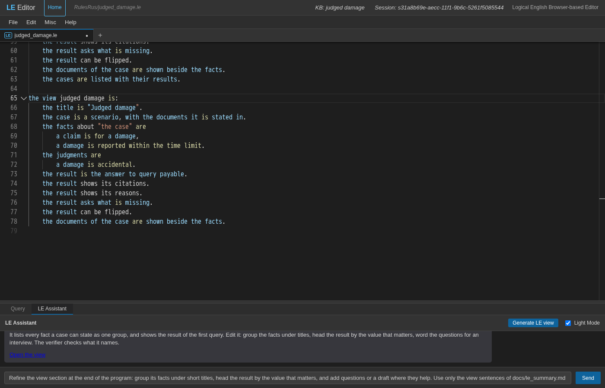
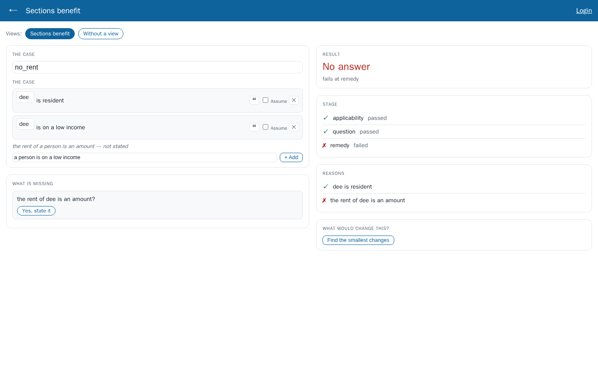
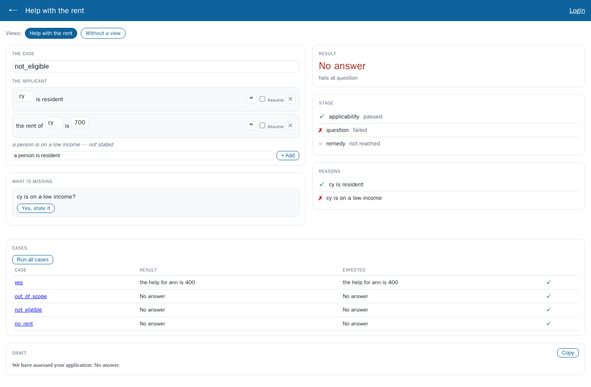
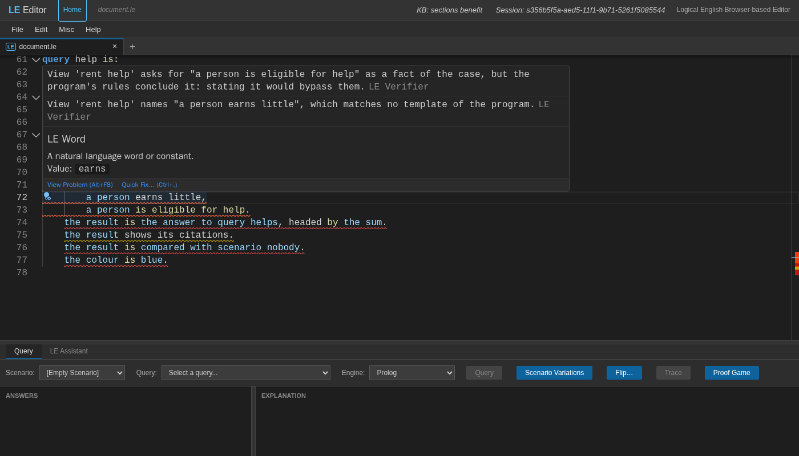
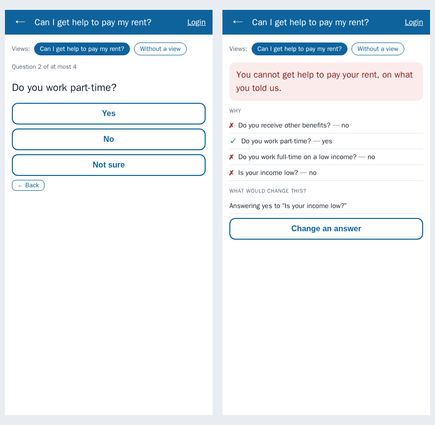
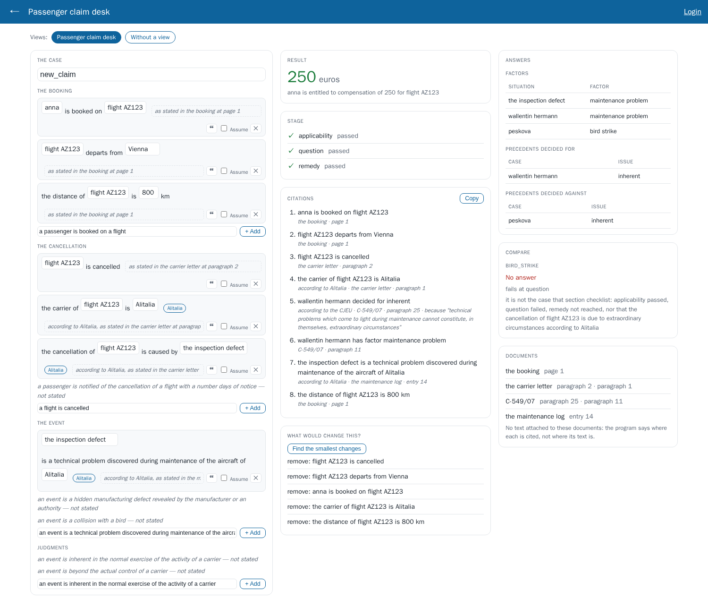
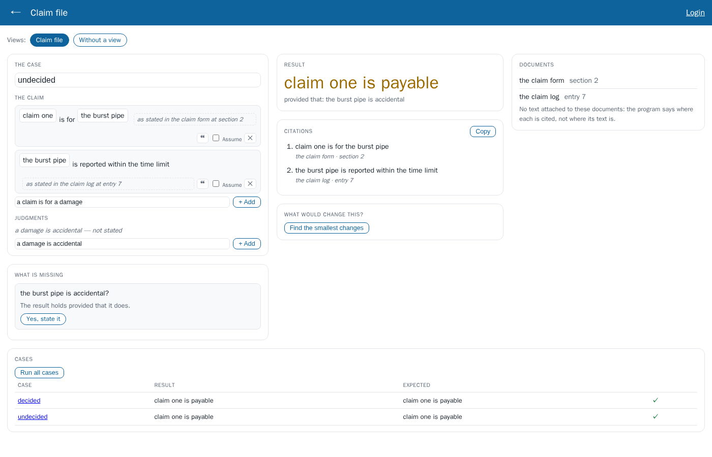
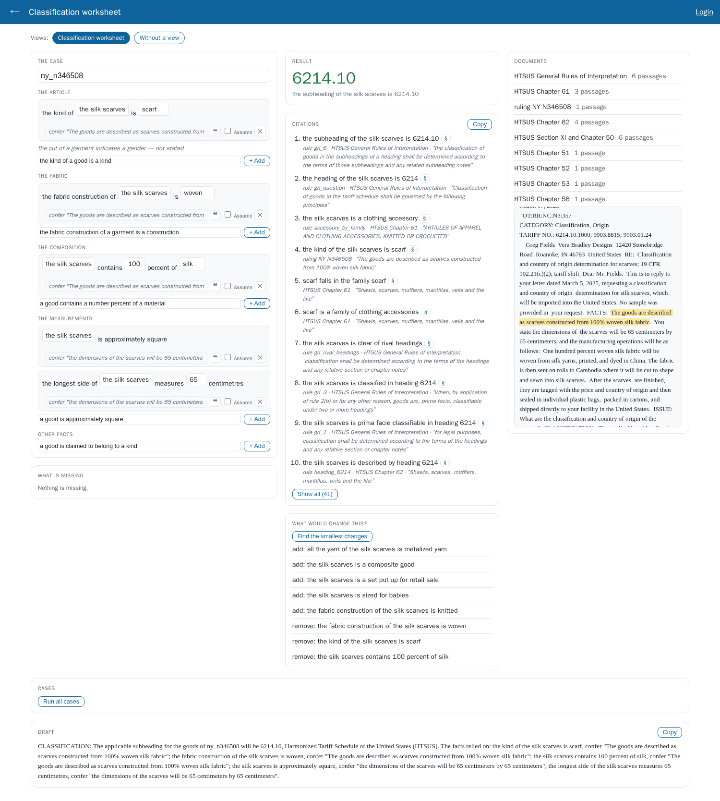

# Introducing LE Views

*A tutorial. You need the Logical English 2 editor and server (`start_api_server`,
then http://localhost:3050/editor/index.html); every program named here is in
`examples/RulesRus/` of this repository. Language reference:
[le_summary.md](le_summary.md) §17.10.*

A Logical English program answers questions. The editor shows it to the person
who writes it: the text, the queries, the explanations as proof trees. The
people it decides for — a caseworker, a claims handler, a customs specialist, a
citizen — need something else: a **screen for one kind of decision**. It asks for
the facts of a case in their order, shows the result in their terms, gives the
reasons and the sources, and says what is missing.

A **view** is how the program's author describes that screen, in Logical English:

```le
the view rent help is:
    the title is "Help with the rent".
    the case is a scenario.
    the facts about "the applicant" are
        a person is resident,
        a person is on a low income,
        the rent of a person is an amount.
    the result is the answer to query help, headed by the amount.
    the result shows the stage it reaches.
    the result asks what is missing.
```

These are a dozen fixed sentences at the end of the program. The **executive
view** renders them with generic widgets: fact forms, a result card, the stage
reached, the citations, the missing facts, an interview, a what-if, answer
tables, a comparison, the documents, a case list and a draft text.

Four properties come with that design:

- **Nothing in a view is about a domain.** The widgets know templates, queries,
  scenarios and documents. The words "applicant", "euros" and "Is your income
  low?" are the view's, which means the program's. No rent, flight or tariff
  enters LE.
- **The sentences are checked.** A view names the program's templates, queries
  and scenarios, and the verifier reports any it does not have, at the line.
- **A view changes nothing else.** Nothing reasons with it. The program
  answers, and its tests pass, exactly as without it.
- **A view is written in the program's language.** Its phrases are rows of the
  i18n dictionaries, like every other keyword.

The tutorial builds a view step by step for a small program, then shows the two
other kinds of screen (an interview and a professional's desk), what the
verifier says about a broken view, and how it all works.

---

## 1. The program

`examples/RulesRus/sections_benefit.le` decides whether a person gets help with
the rent, and how much. Its rules are in three sections with reserved names —
**applicability**, **question** and **remedy** (the decision skeleton of
[le_summary.md](le_summary.md) §17.4) — so a failed application can say how far it got:

```le
the templates are:
    *a person* is in scope.
    *a person* is eligible for help.
    *a person* is resident; undefined.
    *a person* is on a low income; undefined.
    the help for *a person* is *an amount*.
    the rent of *a person* is *an amount*; undefined.

the knowledge base sections benefit includes:

section applicability is:
a person is in scope if the person is resident.

section question is:
a person is eligible for help
    if the person is in scope
    and the person is on a low income.

section remedy is:
the help for a person is an amount
    if the person is eligible for help
    and the rent of the person is a rent
    and the amount is the rent / 2.
```

It has four scenarios: `yes` (ann, who gets 400), `out_of_scope`,
`not_eligible` and `no_rent`. It also has two queries: `help` ("the help for
which person is which amount") and `stage`.

Three templates are marked `; undefined`: these are the facts a case states.
The others are what the rules conclude. The view builds on exactly that
distinction.

## 2. A first view, drafted for you

Open the program in the editor (**File → Open copy from server…**,
`RulesRus/sections_benefit`) and delete its view section at the end, to start
from nothing. Then open the **LE Assistant** tab and press **Generate LE view**.



No language model is involved. The draft is built from the program itself:

```le
the view sections benefit is:
    the title is "Sections benefit".
    the case is a scenario.
    the facts about "the case" are
        a person is on a low income,
        a person is resident,
        the rent of a person is an amount.
    the result is the answer to query help.
    the result shows the stage it reaches.
    the result shows its reasons.
    the result asks what is missing.
    the result can be flipped.
```

- **The facts** are every template a case can state: those marked
  `; undefined` or `; judged`, or that no rule concludes. They form one group.
  Judged templates, if any, would get a `the judgments are …` sentence of their
  own.
- **The result** is the program's first query. A program without one gets
  `the result is whether <its top conclusion>`.
- **What the program can show** is added only where it can: the stage because
  the program has the reserved sections, the citations and documents only if the
  program cites something.
- **The name** is the knowledge base's (`sections benefit`). A program whose
  knowledge base has no name, such as a contract, takes its file's name.
- A template worded with a comma or a full stop is left out: a view separates
  its facts with commas and ends its sentences at a full stop.

The draft is appended as one edit, so **Ctrl+Z** takes it back. The assistant's
reply links to the view (**Open the view**), which opens it as it is in the
editor at the moment you follow the link: nothing needs saving. It also puts a request in the input box, *Refine the
view section…*, which you can send if a model is configured (Misc → API
Keys). The refinement in this tutorial is done by hand.

## 3. Opening the view

A view is shown by the executive view, the editor's companion for people who
run programs rather than write them. There are three ways to open it:

- **Misc → Open Executive View** in the editor opens the program in a new
  tab, on the scenario and query picked in the editor. It shows the program as
  it is in the editor, unsaved changes included: the editor hands its text to
  the new tab through the browser's storage. A link copied from that tab shows
  the saved program in another browser.
- On the program's executive page (`/executive?program=RulesRus/sections_benefit`),
  a row of links lists the program's views. **Without a view** goes back to the
  plain scenario-and-query screen.
- A direct link: `/executive?program=RulesRus/sections_benefit&view=sections%20benefit`.



This is the draft, unedited, on the scenario `no_rent` (dee: resident, on a low
income, no rent stated). Every card on the screen comes from one sentence:

| Card | Sentence | What it shows here |
|---|---|---|
| **The case** | `the case is a scenario` | a picker of the program's scenarios, and *New case* |
| the group *THE CASE* | `the facts about "the case" are …` | dee's facts as editable rows, one field per placeholder. The template the case does not state, *the rent of a person is an amount — not stated*, is a click away. |
| **Result** | `the result is the answer to query help` | *No answer*, and where it failed: *fails at remedy* |
| **Stage** | `the result shows the stage it reaches` | applicability passed, question passed, remedy failed |
| **Reasons** | `the result shows its reasons` | the facts the result rests on or failed on: ✓ dee is resident, ✗ the rent of dee is an amount |
| **What is missing** | `the result asks what is missing` | the case fact the failed proof looked for, as a question, with *Yes, state it* |
| **What would change this?** | `the result can be flipped` | *Find the smallest changes*: the minimal additions or removals that would change the result (a flip query, §17.7) |

Press **Yes, state it**. A row for dee's rent appears, its amount still to be
typed; until it is, the screen leaves the row out (a rent of "an amount" would
be true of every amount). Type 800 into it: the screen runs again, the result
becomes **400**, the stage shows remedy passed, and *What is missing* says
nothing is missing. Edits stay on the
screen, as a new case built from the scenario; the program's text does not
change.

The layout is fixed on purpose:

- The facts go on the left.
- The result and its explanations go in the middle.
- Tables, the comparison and the documents go on the right.
- The case list and the draft run full width below.
- Within a column, the cards follow the order of the sentences.
- Below 1000 pixels the columns stack into one, as on a phone.

## 4. Refining it

The draft is correct but generic. The final view of `sections_benefit.le` makes
seven changes:

```le
the view rent help is:
    the title is "Help with the rent".
    the case is a scenario.
    the facts about "the applicant" are
        a person is resident,
        a person is on a low income,
        the rent of a person is an amount.
    the result is the answer to query help, headed by the amount.
    the result shows the stage it reaches.
    the result shows its reasons.
    the result asks what is missing.
    the cases are listed with their results.
    the draft reads "We have assessed your application: {the answer}.".
```

1. **A name and a title.** The name (`rent help`) goes in links; the title goes
   on the screen.
2. **The group's title, and the facts' order.** Name each group as its readers
   would, and list its facts in the order they are asked. A view can have
   several groups: the EU 261 desk below has "the booking", "the cancellation"
   and "the event".
3. **`headed by the amount`.** The query asks "the help for which person is
   which amount". Heading by *the amount* shows the value of `which amount` in
   large type (400), with the whole answer beneath it. Add `, in euros` and the
   unit follows the number.
4. **The flip is dropped.** It is useful for people exploring the program, but
   a caseworker's screen does without it.
5. **`the cases are listed with their results`.** Every scenario of the program
   is listed with its result and its expectation (the scenario's
   `expects answers`), marked ✓ where they agree. A small program's cases run as
   the screen opens; a larger one waits for *Run all cases*. A case's name opens
   it.
6. **`the draft reads "…"`.** A text filled from the screen, with a *Copy*
   button: the start of a letter or a decision. The draft can use these
   placeholders:

   | Placeholder | Becomes |
   |---|---|
   | `{the result}` | the headline value (400), or the whole answer when the result is not headed |
   | `{the answer}` | the whole answer ("the help for ann is 400"), or *No answer* |
   | `{the facts}` | the case's facts as written, with their citations |
   | `{the citations}` | the steps a labelled rule or a table row cites, one per source |
   | `{the case}` | the case's name |

7. Nothing else: the other sentences stay as drafted.



On `not_eligible` (cy, resident, rent 700, income not stated) the application
fails at **question**. The reasons show why: ✓ cy is resident, ✗ cy is on a
low income. *What is missing* asks whether cy is on a low income. The cases
table shows all four scenarios agreeing with their expectations.

## 5. When a view is wrong

The verifier reads a view against the whole program, including its included
resources, as it reads everything else. Here is a view with typical mistakes:

```le
the view rent help is:
    the title is "Help with the rent".
    the case is a scenario.
    the facts about "the applicant" are
        a person is resident,
        a person earns little,
        a person is eligible for help.
    the result is the answer to query helps, headed by the sum.
    the result shows its citations.
    the result is compared with scenario nobody.
    the colour is blue.
```



Each message comes with a fix, offered by the editor's *Quick Fix* where it can
be applied:

| Line | Message | Fix |
|---|---|---|
| `a person earns little` | View 'rent help' names "a person earns little", which matches no template of the program. | Write it as an instance of one of the program's templates, as a condition of a rule is written. |
| `a person is eligible for help` | … asks for "a person is eligible for help" as a fact of the case, but the program's rules conclude it: stating it would bypass them. | List the facts the rules read. |
| `query helps` | … takes its result from query 'helps', which the program does not define. | Name one of the program's queries, or write the result as "the result is whether …". |
| `shows its citations` | … shows citations or documents, but the program cites nothing. | Give rules and facts their provenance (§15.5, §17.1), or drop the sentence. |
| `scenario nobody` | … compares with scenario 'nobody', which the program does not define. | Name one of the program's scenarios. |
| `the colour is blue` | This sentence of view 'rent help' is not one a view understands: "the colour is blue". | Write it as one of the view sentences, ending with a full stop. |

These are the checks, by severity:

- **Errors**:
  - a sentence no view form reads;
  - an instance of no template;
  - a query or scenario the program lacks;
  - a table question that is not a query;
  - two views with one name.
- **Warnings**:
  - a judgment whose template is not `; judged`;
  - a fact to state that the rules conclude;
  - a view without a result;
  - a sentence said twice;
  - a heading the query does not ask for (`headed by the sum` when the query has
    no `which sum`);
  - a stage in a program without the reserved sections;
  - citations or documents in a program that cites nothing.

The second warning matters most. A view that let a user state a conclusion
would let them bypass the rules. The verifier cannot stop a program from being
written that way, but it points it out.

## 6. An interview: a citizen's check on a phone

A caseworker edits a case; a citizen answers questions.
`examples/RulesRus/flip_housing.le` holds Kowalski's housing-benefit rules
(*Computational Logic and Human Thinking*, §5.7): help to pay rent comes with
housing benefit. That is for someone on other benefits, working part-time, or
working full-time on a low income — unless they are ineligible, which they are
without a low income. Its view:

```le
the view benefit check is:
    the title is "Can I get help to pay my rent?".
    the case is about the applicant.
    the facts are asked one at a time.
    the question for the applicant is on other benefits is "Do you receive other benefits?".
    the question for the applicant works part-time is "Do you work part-time?".
    the question for the applicant works full-time on a low income is "Do you work full-time on a low income?".
    the question for the applicant is on a low income is "Is your income low?".
    the result is whether the applicant gets help to pay rent.
    the result reads "You can get help to pay your rent." when it holds.
    the result reads "You cannot get help to pay your rent, on what you told us." when it does not.
    the result shows its reasons.
    the result can be flipped, as "What would change this?".
```

- **`the case is about the applicant`** names the subject. Each *yes* states a
  fact about *the applicant* ("the applicant works part-time"). There is no
  scenario picker and no fact form.
- **`the facts are asked one at a time`** turns the screen into an interview.
  The next question is the first of the view's questions that the proof still
  looks at, given the answers so far. Once the result holds, nothing more is
  asked. Answer *No* to "Do you receive other benefits?" and the part-time
  question comes next. Answer *Yes* to it, and the proof goes on to the income.
  The screen counts "Question 2 of at most 4". *Not sure* leaves a fact unstated,
  and *Back* undoes the last answer.
- **`the question for <fact> is "<text>"`** words each fact. The wording is
  reused in the reasons ("Do you work part-time? — yes") and in the flip
  ("Answering yes to “Is your income low?”").
- **`the result is whether <fact>`** is a yes/no result, written in the view
  rather than as a query of the program. **`the result reads "…" when it holds`
  / `when it does not`** puts it in the view's words.



The screen is a single column, meant for a phone. On the right of the picture:
the applicant works part-time but the income is not low, so the answer is no.
The reasons list each question with its answer, and the one change that would
turn the result is to answer yes to the income question.

## 7. A professional's desk

A view grows with the program. `examples/RulesRus/eu261_integration.le` decides
EU Regulation 261 compensation for a cancelled flight. Its facts are attributed
to their sources ("according to Alitalia, as stated in the carrier letter at
paragraph 2"). Its open-textured judgments — was the event *inherent in the
normal exercise of the activity of the carrier*? — are decided from CJEU
precedent. Its amounts come from a decision table. Its view:

```le
the view claim desk is:
    the title is "Passenger claim desk".
    the case is a scenario, with the documents it is stated in.
    the facts about "the booking" are
        a passenger is booked on a flight,
        a flight departs from an airport,
        the distance of a flight is a number km.
    the facts about "the cancellation" are
        a flight is cancelled,
        a passenger is notified of the cancellation of a flight with a number days of notice,
        the carrier of a flight is a carrier,
        the cancellation of a flight is caused by an event.
    the facts about "the event" are
        an event is a technical problem discovered during maintenance of the aircraft of a carrier,
        an event is a hidden manufacturing defect revealed by the manufacturer or an authority,
        an event is a collision with a bird.
    the judgments are
        an event is inherent in the normal exercise of the activity of a carrier,
        an event is beyond the actual control of a carrier.
    every fact shows who states it.
    the result is the answer to query claim, headed by the amount, in euros.
    the result shows the stage it reaches.
    the result shows its citations.
    the answers to "which situation has factor which factor" are listed as "Factors".
    the answers to "which case decided for which issue" are listed as "Precedents decided for".
    the answers to "which case decided against which issue" are listed as "Precedents decided against".
    the result is compared with scenario bird_strike.
    the result can be flipped.
    the documents of the case are shown beside the facts.
```



The sentences this view adds:

- **`the judgments are …`** puts the `; judged` facts in a group of their own.
  They are not stated by the passenger or the carrier; they are decided, here
  by precedent, which the citations show.
- **`every fact shows who states it`** puts the `according to` of each fact on
  its row, as a badge: the carrier's facts carry *Alitalia*.
- **`the result shows its citations`** lists the steps of the proof that cite a
  source. Each comes with its document and locator, and a precedent's comes with
  the Court's reasoning ("technical problems which come to light during
  maintenance cannot constitute, in themselves, extraordinary circumstances").
  *Copy* puts them on the clipboard. Where the program says where a document's
  text is (`the text of <document> is at "<url or file>"`), a § opens the
  passage in it.
- **`the answers to "<query body>" are listed as "<title>"`** adds a table of
  another question's answers, one column per `which`. The question must be one
  the program can answer as asked. A precedent library whose rules need a bound
  situation cannot list every "forced" answer, so this view asks for the factors
  and the decided cases instead.
- **`the result is compared with scenario bird_strike`** shows the same
  question on another scenario: here no compensation, failing at *question*,
  because a bird strike is an extraordinary circumstance.
- **`the documents of the case are shown beside the facts`** lists the
  documents the case's facts and the proof cite, with their passages. A
  document whose text the program locates opens with those passages marked.
- **`the case is a scenario, with the documents it is stated in`** makes the
  case's own document (its `as stated in`) the first one shown.

Two more views in the repository show the rest:

- **`judged_damage.le`, "claim file"** shows a result that holds only
  *provided that* a judgment goes one way: "claim one is payable, provided that:
  the burst pipe is accidental". *What is missing* offers that judgment to be
  made. The cases table shows each claim's outcome.

  

- **`customs/cbp_62.le`, "worksheet"** is the classification worksheet a US
  customs specialist asked for, in a review of the customs programs
  (CustomsOfficerReport.md, in the InsurLE repository):
  - the good's facts as the CBP ruling states them, grouped as article, fabric,
    composition and measurements, each with the ruling's passage;
  - the subheading, headed by the code, with 41 cited steps reaching the tariff's
    own lines;
  - the ruling beside it, with the stated facts highlighted;
  - a draft CLASSIFICATION paragraph filled from all of it.

  Nothing about tariffs is in LE: the view is about twenty lines at the end of
  the customs program.

  

## 8. Views in other languages

Every phrase of a view is a row of `i18n/keywords.csv` (category `view`) in
English, Portuguese, Spanish, French and Italian, so a program writes its view
in its own language. For the Portuguese citizenship program
(`examples/pt/cidadania.le`):

```le
a vista balcão é:
    o título é "Cidadania britânica".
    o caso é um cenário.
    os factos sobre "o nascimento" são
        uma pessoa nasceu em um lugar em uma data,
        uma pessoa é a mãe de uma pessoa,
        uma pessoa é o pai de uma pessoa.
    o resultado é a resposta à consulta um, encabeçado por a pessoa.
    o resultado mostra as suas razões.
    os casos são listados com os seus resultados.
```

The verifier answers in Portuguese as well. This view gets one warning, because
the program has a rule for who the father is (from what a qualified person
says): *A vista 'balcão' pede "uma pessoa é o pai de uma pessoa" como facto do
caso, mas as regras do programa concluem-no: afirmá-lo contornaria as regras.*
The screen shows each fact in the view's words. The widgets' own labels
(*Result*, *Stage*, *not stated*) follow the user's interface language, as the
rest of the interface does.

## 9. Where a view lives

- **At the end of the program**, as in every example here. A program may have
  several views, for different users of the same rules. Each needs its own name,
  and all of them are listed on the program's executive page.
- **In an included resource.** A view is a section like any other, so a
  `desk.le` beside a family of programs can serve all of them:

  ```le
  the target language is: prolog.

  the knowledge base desk includes:

  the view desk is:
      the title is "A desk from a resource".
      the case is a scenario.
      the facts about "the applicant" are
          a person is resident,
          a person is on a low income.
      the result is the answer to query help, headed by the amount.
  ```

  and each program includes it, as it includes any resource:

  ```le
  the knowledge base sections benefit includes these resources:
      desk.
  ```

  The view in `desk.le` is read against the program that includes it: its
  templates, queries and scenarios. That is how one worksheet could serve every
  rulings file of a tariff.

## 10. Reference: the sentences

| Sentence | The screen |
|---|---|
| `the view <name> is:` | opens the section; the name is used in links |
| `the title is "<text>"` | the screen's title |
| `the case is a scenario[, with the documents it is stated in]` | a picker of the program's scenarios, and *New case*; the case's own document first |
| `the case is about <constant>` | the subject of the facts an interview's answers state |
| `the facts about "<title>" are <instance>, <instance>, …` | a group of editable fact rows, each with its citation (❝); the group's facts the case does not state, a click away |
| `the judgments are <instance>, …` | the `; judged` facts, apart |
| `the other facts can be added` / `the other facts cannot be added` | whether the case may state facts of templates no group lists (it may by default) |
| `every fact shows who states it` | each fact's `according to`, as a badge |
| `the result is the answer to query <name>[, headed by <the word>][, in <unit>]` | the query's answers; headed, the value of its `which <word>` in large type |
| `the result is whether <instance>` | a yes/no result, the query written in the view |
| `the result reads "<text>" when it holds` / `… when it does not` | the result in the view's words |
| `the result shows its citations` | the cited steps of the proof, each with its passage, and *Copy* |
| `the result shows its reasons` | the facts the result rests on, or failed on |
| `the result shows the stage it reaches` | the applicability / question / remedy checklist (§17.4) |
| `the result asks what is missing` | the case facts the failed proof looked for, or the facts a conditional result waits for, each a click to state |
| `the facts are asked one at a time` | an interview: the view's questions, each asked only while the result can still depend on it |
| `the question for <instance> is "<text>"` | the question for a fact, and its wording in the reasons and the flip |
| `the result can be flipped[, as "<text>"]` | the minimal changes that would change the result (§17.7) |
| `the answers to "<query body>" are listed as "<title>"` | a table of another question's answers, one column per `which` |
| `the result is compared with scenario <name>` | the result of another scenario, and where it fails |
| `the documents of the case are shown beside the facts` | the cited documents, with their passages |
| `the cases are listed with their results` | every scenario, its result and its expectation |
| `the draft reads "<text>"` | a text filled from the screen: `{the result}`, `{the answer}`, `{the facts}`, `{the citations}`, `{the case}` |

The facts, questions and results a view names are **instances of the program's
templates**, written as the conditions of a rule are: "a person is resident",
"the applicant is on a low income". Each sentence ends with a full stop; the
lines of a list end with commas.

## 11. How it works

- **Parsing.** `the view <name> is:` opens a section, as `scenario` and `query`
  do. The parser keeps its lines; `le_views.pl` reads them after the whole
  program is loaded. It reads each sentence against the sentence forms (the
  `view` keywords of the program's language) and each instance against the
  templates of the program and of its includes. The result is a plain structure
  returned with the load (`views`): groups, result, widgets in order. Nothing
  reasons with it.
- **Checking.** The verifier's `view_*` issues come from the same reading, with
  a message and a fix in each language (`i18n/messages.csv`).
- **Three server operations**, all generic:
  - `answeringQuery` also returns the **checklist** of a program's sections;
  - **`openQuestions`** returns the case facts a failed proof looked for (the
    leaves of its failure whose templates a case may state), and the questions
    a proof touches, which the interview uses;
  - **`draftView`** returns the draft of *Generate LE view*.

  The flip, the citations and the documents use what the executive view already
  had.
- **The widgets** are one module of the editor, `editor/src/le-views.ts`. The
  executive view loads it for a `?view=`. It reuses the Scenario Editor's fact
  rows (their pick lists, the values the rules read, the citation field) and the
  source viewer (a passage in its document).
- **Words.** Every string of the widgets is a row of `i18n/ui.csv`; every
  phrase of the sentences is a row of `i18n/keywords.csv`. Adding a language
  adds columns, not code.

## 12. Compared with the proposal, and limits

LE Views began as a proposal in that review: a JSON file of
widgets beside each program, followed by a section on writing views in Logical
English instead. The Logical English form was built, and the JSON form was not:

- **One language.** A view is part of the program, checked against it, and
  translated with it. There is no second notation.
- **Questions.** The proposal's Questions widget became two sentences. `the
  result asks what is missing` offers the facts a failed proof looked for, or
  the facts a result that holds *provided that* waits for. `the facts are asked
  one at a time` turns them into an interview, which asks only while the answer
  can still depend on them.
- **The case board** became `the cases are listed with their results`,
  compared with the program's own expectations.
- **The draft** fills five named placeholders.

The limits:

- **Layout.** There are three columns, or one for an interview, with the order
  of the sentences. Anything beyond that (placement, colours, sizes) is outside
  what sentences should carry, and the page's theme decides it.
- **The widgets are fixed.** The original proposal described a registry to which new widget types could be added; today the
  widgets are one module.
- **The case list compares with the program's own expectations**
  (`expects answers`). It does not compare with an office's recorded outcomes;
  that needs the corpus mode of the LE extensions proposal.
- **The draft is text to copy.** There is no export to a document.
- **Examples.** The other four languages have their keywords, but only
  English views are among the examples.
