# Examples from *Computational Logic and Human Thinking* (Kowalski)

This document catalogs the illustrative examples in Robert Kowalski's book
*Computational Logic and Human Thinking: How to be Artificially Intelligent*
(`CLandHT-HtobAI.pdf`), the precursor to **Logical English (LE)**. The book
writes its rules in a "pre-LE" dialect — sometimes with connectives and
primitives (maintenance goals, integrity constraints, the event calculus,
decision-theoretic utilities, resolution machinery, …) that are **not yet** in
current LE.

**Purpose.** It collects, chapter by chapter and subsection by subsection, every
example in the book: a short note on the motivation, the actual sentences/rules
(transcribed close to verbatim), and two short judgments —

- **complete** (a self-contained set of rules/facts/goals) vs **fragment** (a
  snippet that only complements the surrounding prose); and
- whether it **fits current LE** already, **partially**, or **not yet** — naming
  the missing construct where relevant.

In a *later* step we intend to convert most of these examples to LE — but **not
yet**. For now this is a survey.

**How "fits LE" was judged.** Current LE supports: `Head if Body.` conditionals;
`and`, `or`, negation-as-failure (`it is not the case that`), `unless`; universal
quantification (`for all cases in which … it is the case that …`); aggregates
(sum/count/average/min/max); arithmetic and comparisons over numbers and dates;
taxonomy/ontology (`a … is a …`); templates, facts, scenarios, queries;
**abduction** via `unknown`/assumable templates (unprovable goals are assumed and
reported as *unknowns*); and meta-templates `says`/`that`. It does **not** yet
support: maintenance goals / the reactive observe–think–decide–act agent cycle;
event/situation-calculus temporal primitives (`initiates`/`terminates`/`holds`,
the frame problem); explicit integrity constraints / prohibitions (`… then
false`); forward-chaining production / condition-action rules; biconditionals
used as equivalences (`if and only if`); decision-theoretic utilities and
probabilities; full object/meta-language mixing and self-reference;
object-oriented message-passing; and connection-graph / resolution machinery.

> Images are reproduced from the Markdown conversion in
> `CLandHT-HtobAI_conversion/`. Only figures that *are* an example (connection
> graphs, search trees, semantic networks, decision diagrams) are embedded;
> decorative images are omitted.

---

## Front Matter

### Preface

No formal examples (prose/overview).

### Contents

No formal examples (table of contents only).

### Summary and Plan of the Book

The Summary briefly previews every chapter. It contains no standalone formal examples, but two small logic snippets appear inline.

#### Biconditionals snippet (Chapter 15 preview)

- **Motivation:** Illustrates the book's recurring thesis that a set of conditionals with the same conclusion can be read as a single biconditional (used later to justify negation as failure and abduction).

```
an object looks red if the object is red.
an object looks red if it illuminated by a red light.

an object looks red if and only if
the object is red or the object is illuminated by a red light.
```

- **Status:** Fragment (illustrates the prose; not a runnable program). Fits LE **partially** — the two `if` rules map directly to LE conditionals, but the explicit **biconditional** ("if and only if") used as an equivalence is **not yet** in LE.

### Introduction

The Introduction is mostly an overview of Computational Logic, the language of thought, and the agent/world cycle. It contains a few small illustrative snippets.

#### Williams' practical-reasoning example (Computational Logic and human communication)

- **Motivation:** Shows how coherent English advice can be read as goals and beliefs in (informal) Computational Logic syntax, chaining backward from a goal to an action.

```
You want to be more intelligent.
You will be more intelligent if you are more logical.
You will be more logical if you study this book.
So (given no other alternatives) you should study this book.
```

- **Status:** Complete (a small self-contained goal + two beliefs + derived conclusion). Fits LE **partially** — the two `if` beliefs are plain LE conditionals, but the goal/desire ("You want to...") and the practical-reasoning step ("So you should...") rely on the **agent cycle / achievement-goal** machinery, which is **not yet** in LE.

#### Forward/backward reasoning snippets (What is Computational Logic?)

- **Motivation:** Defines forward reasoning (modus ponens) and backward reasoning (goal reduction) by example, plus the use of forward reasoning to evaluate consequences of alternative actions.

```
a person will be more logical if the person studies this book.
Mary studies this book.
(forward) Mary will be more logical.

a person will be more intelligent if the person is more logical.
(backward, goal) John will be more intelligent.
(subgoal) John should be more logical.

John is more intelligent if John is more logical.
John is more intelligent if John takes intelligence-enhancing drugs.
John may suffer irreversible brain damage if John takes intelligence-enhancing drugs.
```

- **Status:** Fragments (each illustrates one inference direction rather than a whole program). Fit LE **partially** — the conditionals, the typed rule ("a person ... if the person ...") and the fact map directly to LE templates/conditionals; the choice-between-alternatives reasoning (preactive evaluation of action consequences) is **not yet** in LE.

#### The cycle of life (figure)

- **Motivation:** The central picture of the agent (mind = syntactic structure of goals/beliefs) interacting with the world (semantic structure), observing events and performing actions.

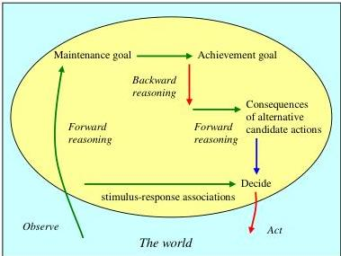

- **Status:** Diagram, not a logic example. Depicts the observe→think→decide→act **agent cycle** and event-based temporal reasoning (initiates/terminates), which is **not yet** in LE.

## Chapter 1. Logic on the Underground

### 1.1 (Chapter opening — the Emergency Notice)

#### The London Underground Emergency Notice

- **Motivation:** The book's flagship example: an emergency notice whose clear English maps onto thoughts in logical form, showing the mixed procedural (goal-reduction) and declarative (conditional) character of Computational Logic.

```
Emergencies

Press the alarm signal button to alert the driver.
The driver will stop if any part of the train is in a station.
If not, the train will continue to the next station, where help can more easily be given.
There is a 50 pound penalty for improper use.
```

- **Status:** Complete (a self-contained four-sentence "program"). Fits LE **partially** — the underlying conditionals (sentences 2–3) are expressible as LE rules, but sentence 1 is a **goal-reduction procedure / imperative**, sentence 4 is a **prohibition/constraint** (conclusion `false`), and the whole notice is meant to drive the **agent cycle**, none of which are yet in LE.

### 1.2 The logic of the second and third sentences

#### Disambiguated meaning of the second sentence

- **Motivation:** Shows that the surface English ("The driver will stop if any part of the train is in a station") under-specifies its intended logical form; the true meaning adds a missing object and an implicit context condition.

```
The driver will stop the train in a station
if the driver is alerted to an emergency
and any part of the train is in the station.
```

- **Status:** Fragment (a single reconstructed conditional, complementing the prose argument). Fits current LE — a plain `if ... and ...` conditional with a template.

#### Disambiguated meaning of the third sentence

- **Motivation:** Same disambiguation applied to the third sentence, recovering its implicit conditions (alert + train not in a station) and its purpose clause.

```
The driver will stop the train at the next station
and help can be given there better than between stations
if the driver is alerted to an emergency
and not any part of the train is in a station.
```

- **Status:** Fragment (single reconstructed conditional). Fits current LE — uses `and`, `if`, and `not` (negation as failure), all available; the "where help can more easily be given" purpose clause is just descriptive.

### 1.3 The web of belief

#### Coherence patterns linking sentences

- **Motivation:** Shows the abstract pattern by which consecutive conditionals are made coherent — chaining the conclusion of one sentence to the condition of the next.

```
If condition A then conclusion B. If condition B then conclusion C.

conclusion C if condition B. conclusion B if condition A.
```

- **Status:** Fragment (an abstract schema, not concrete rules). Fits current LE — these are ordinary chained conditionals.

#### Connection graph before reading the notice (figure)

- **Motivation:** Depicts a person's pre-existing goals and beliefs as a connection graph, with links between matching conditions and conclusions.

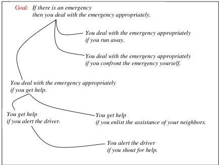

- **Status:** Diagram (a connection graph). The graph's individual conditionals fit LE, but **connection graphs / resolution machinery** themselves are **not yet** in LE.

#### Connection graph after reading the notice (figure)

- **Motivation:** The same connection graph augmented with the beliefs conveyed by the notice, showing how new sentences add links to the web of belief.

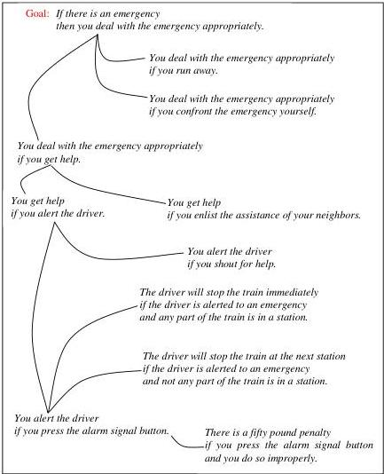

- **Status:** Diagram (a connection graph). Same judgment: underlying conditionals fit LE; the **connection-graph** representation is **not yet** in LE. Note the maintenance goal `if there is an emergency then you deal with the emergency appropriately`, which is a **maintenance goal** — **not yet** in LE.

### 1.4 The first sentence as part of a logic program

#### Hidden logical form of the first sentence + backward-reasoning chain

- **Motivation:** Shows that the procedural first sentence hides a conditional, and that backward reasoning over a chain of conditionals reduces the goal of dealing with an emergency down to pressing the button.

```
You alert the driver, if you press the alarm signal button.

Goal: You deal with the emergency appropriately.
You deal with the emergency appropriately if you get help.
```

- **Status:** Fragment (an extracted conditional plus a goal/rule pair). Fits LE **partially** — the conditionals are plain LE rules; treating them as **goal-reduction procedures driven by a goal** belongs to the agent cycle, which is **not yet** in LE.

#### Forward-reasoning example over the notice

- **Motivation:** Illustrates forward reasoning (modus ponens): given matching facts and a conditional, derive the conclusion.

```
You alert the driver.
A part of the train is in a station.

The driver will stop the train immediately if the driver is alerted to an emergency and any part of the train is in a station.

(derive) the driver will stop the train immediately.
```

- **Status:** Complete (facts + rule + derived conclusion — a minimal runnable inference). Fits current LE — facts plus an `if ... and ...` conditional and forward inference.

#### Forward reasoning as attention-direction (figure)

- **Motivation:** Pictures forward reasoning as following a connection-graph link from a belief's conclusion to another belief whose condition it matches.

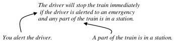

- **Status:** Diagram (connection-graph link). Connection graphs are **not yet** in LE.

#### Compiling a chain of links (figure + compiled belief)

- **Motivation:** Shows that a frequently-activated link between two beliefs can be short-circuited ("compiled") into a single derived belief.

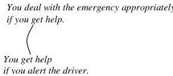

```
You deal with the emergency appropriately if you alert the driver.
```

- **Status:** Fragment (the compiled conditional plus its source diagram). The resulting conditional fits current LE; the **link-compilation** process via connection graphs is **not yet** in LE.

### 1.5 The fourth sentence as an inhibitor of action

#### The penalty sentence as a conditional and as a constraint

- **Motivation:** Shows that the declarative fourth sentence hides a conditional, which is naturally used forward (to predict an undesirable consequence) rather than as a goal-reduction procedure; and how a prohibition is modeled as a conditional goal with conclusion `false`.

```
There is a fifty pound penalty if you press the alarm signal button and you do so improperly.

To be liable to a 50 pound penalty,
press the alarm signal button and
do so improperly.

Do not be liable to a penalty.
If you are liable to a penalty then false.
```

- **Status:** Complete-ish (one belief plus its restatement as a goal-reduction procedure and as a prohibition). Fits LE **partially** — the plain conditional ("There is a penalty if ...") is expressible; the **prohibition / integrity constraint** (`... then false`) and its use as an action inhibitor are **not yet** in LE.

### 1.6 Programs with purpose

#### The pre-existing goals and beliefs behind the notice

- **Motivation:** Spells out the background goals/beliefs the reader already holds, with which the notice coheres — a maintenance goal plus a backward-usable chain reducing "deal with the emergency" to "alert the driver."

```
If there is an emergency then deal with the emergency appropriately.
You deal with the emergency appropriately if you get help.
You get help if you alert the driver.
```

- **Status:** Complete (a small self-contained rule set / mini-program). Fits LE **partially** — sentences 2–3 are plain LE conditionals, but the first is a **maintenance goal** (imperative conclusion, observe→act), which is **not yet** in LE.

#### Goal vs. belief expressed declaratively

- **Motivation:** Shows how the book renders an imperative (goal) conditional as a declarative one, distinguishing goals from beliefs by category rather than syntax.

```
If there is an emergency then deal with the emergency appropriately.

If there is an emergency then you deal with the emergency appropriately.
```

- **Status:** Fragment (a notational restatement). Fits LE **partially** — the declarative form is a plain conditional, but its role as a **goal/maintenance goal** distinct from a belief is **not yet** represented in LE.

### 1.7 Where do we go from here?

#### The problem facing Computational Logic (figure)

- **Motivation:** A summary picture of the agent-and-world problem the book aims to solve (open to a changing world, combining thinking, deciding, and acting).

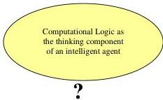

- **Status:** Diagram (overview, not a logic example). Depicts the **agent cycle / changing world**, **not yet** in LE.

## Chapter 2. The Psychology of Logic

### 2.1 (Chapter opening — the security-check selection task)

#### The London Underground security-check conditional

- **Motivation:** A motivating, "meaningful-content" version of the Wason selection task used to introduce the chapter's challenge to human logicality and the rules/converse/contrapositive distinctions.

```
if a passenger is carrying a rucksack on his or her back,
then the passenger is wearing a label with the letter A on his or her front.

Bob, who is carrying a rucksack on his back.
Mary, who has the label A stuck to her front.
John, who is carrying nothing on his back.
Susan, who has the label B stuck to her front.
```

- **Status:** Complete (a conditional plus four cases to evaluate — a self-contained reasoning task). Fits LE **partially** — the conditional and the case facts are expressible as a template + scenario, but the **selection task itself** (deciding which cases to check, and the intended **deontic "should"** reading) is **not yet** in LE.

### 2.2 The Wason selection task

#### The four-card task

- **Motivation:** The original, abstract Wason selection task; introduces forward reasoning (modus ponens), the converse, and the contrapositive, and the empirical finding that ~10% answer correctly.

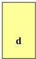
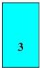
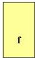


```
If there is a d on one side, then there is a 3 on the other side.

(converse)       If there is a 3 on one side, then there is a d on the other side.
(contrapositive) If the number on one side is not 3 (e.g. 7), then the letter on the other side is not d.

If it is raining, then there are clouds in the sky.        (true)
If there are clouds in the sky, then it is raining.        (false, converse)
If there are no clouds in the sky, then it is not raining. (contrapositive, equivalent to first)
```

- **Status:** Complete (a conditional with its converse and contrapositive, plus the four cards as the task data). Fits LE **partially** — each conditional is a plain LE rule, but reasoning with the **contrapositive** and treating the **converse as equivalent (biconditional)** are **not yet** in LE.

### 2.3 A variant of the selection task

#### The bar / drinking-age version + cheater-detection and hazard schemas

- **Motivation:** The meaningful-content version on which people perform well; used to present Cosmides' cheater-detection algorithm and Cheng & Holyoak's pragmatic (deontic) schemas.

```
If a person is drinking alcohol in a bar, then the person is at least eighteen years old.

Bob, drinking beer.
Mary, a senior citizen, obviously over eighteen years old.
John, drinking cola.
Susan, a primary school child, obviously under eighteen years old.

If you accept a benefit, then you must meet its requirement.
If you engage in a hazardous activity, then you should take the appropriate precaution.
```

- **Status:** Complete for the bar task (conditional + four cases); the two schemas are fragments. Fits LE **partially** — the bar conditional plus case facts and the age comparison (`at least eighteen`) are expressible in LE; the **deontic "must"/"should"** readings and the selection-checking decision are **not yet** in LE.

### 2.4 Thinking = knowledge representation + problem solving

#### Cheater detection as a constraint + the forward/backward/forward pattern

- **Motivation:** Recasts the cheater-detection "algorithm" as a logical constraint (conclusion `false`) used with general-purpose reasoning, and gives the general goal-violation reasoning pattern. Supports the book's equation `algorithm = knowledge + reasoning`.

```
if a person accepts a benefit
and the person does not meet its requirement
then false.

if conditions then conclusion.
- reason forward to match an observation with a condition of the goal,
- reason backward to verify the other conditions of the goal, and
- reason forward to derive the conclusion as an achievement goal.

if conditions then conclusion
it is not the case that conditions and not conclusion
if conditions and not conclusion then false.
```

- **Status:** Fragments (a constraint plus reasoning schemas, illustrating the prose). Fit LE **partially** — `not`/`it is not the case that` (negation as failure) is available, but the **integrity constraint** (`... then false`) and the **maintenance-goal forward→backward→forward agent-cycle pattern** are **not yet** in LE.

### 2.5 The suppression task

#### The library / essay suppression task and its reformulations

- **Motivation:** Byrne's suppression task: an added premise leads ~40% of people to retract a valid modus ponens conclusion; used to argue that the surface conditional omits a condition and that this is really default (defeasible) reasoning with rules and exceptions.

```
If she has an essay to write, then she will study late in the library.
She has an essay to write.
(conclude) She will study late in the library.

(added) If the library is open, then she will study late in the library.

(intended logical form)
If she has an essay to write and the library is open, then she will study late in the library.

(as rule + exception)
If she has an essay to write, she will study late in the library.
But, if the library is not open, she will not study late in the library.

(context-independent rule)
a conclusion holds if conditions hold and other conditions do not hold.
```

- **Status:** Complete (premises + conclusion + added premise + reformulations — a full worked default-reasoning example). Fits LE **partially** — the intended `and` form and the rule-with-exception (negation-as-failure / `unless`) are expressible in LE; the **retraction/suppression (defeasible) dynamics** and **contrapositive/converse** reasoning are **not yet** modeled in LE.

### 2.6 Natural language understanding versus logical reasoning

No formal examples (prose; revisits the driver-stop and suppression-task logical forms already given above).

### 2.7 Reasoning in context

#### Significance depends on the reader's beliefs

- **Motivation:** Shows that the same logical-form sentence has different significance for different agents, depending on their other beliefs.

```
Susan has a rucksack on her back.
(my belief)   Susan has a bomb in the rucksack.
(your belief) Susan has only her lunch in the rucksack.
```

- **Status:** Fragment (a fact plus two differing background beliefs, illustrating context-dependence). Fits current LE as plain facts/templates; the point being made (differing **significance**) is meta-level commentary rather than an LE construct.

### 2.8 The use of conditionals to explain observations

#### Pollock's red-apple / red-light example

- **Motivation:** John Pollock's example of withdrawing a conclusion when a new possible cause appears; the book reinterprets it as abduction — choosing the best explanation of an observation — and as a missing-condition (rule/exception) problem.

```
An object is red if it looks red.
This apple looks red.
(conclude) This apple is red.

(added) An object looks red if it is illuminated by a red light.

(missing-condition form)
An object is red if it looks red and it is not illuminated by a red light.

(pre-existing causal belief)
An object looks red if it is red.
```

- **Status:** Complete (a rule + observation + derived conclusion + a defeating rule + reformulations — a full abduction/default example). Fits LE **partially** — the conditionals, the observation fact, and the `it is not the case that` / `unless` exception form are expressible; the **abductive explanation** of the observation (choosing "is red" as the cause) maps to LE's `unknown`/assumable abduction only **partially**, and the **defeasible withdrawal** of the conclusion is **not yet** in LE.

### 2.9 Conclusions

No formal examples (prose summary; refers back to the selection task, suppression task, and red-light examples already covered).

## Chapter 3 The Fox and the Crow

This chapter retells Aesop's fable of the fox and the crow to contrast the fox's proactive (goal-directed, backward-reasoning) thinking with the crow's reactive thinking. It introduces logic programs as goal-reduction procedures, connection graphs, backward vs. forward reasoning, and the relationship between logical sentences and interpretations (semantics).

### 3.1 The fox and the crow

The central worked example of the chapter: the fox's goals and beliefs represented in logical (conditional) form. It illustrates how a goal can be reduced to action subgoals by backward reasoning.

**The fox's goal and beliefs**

- **Motivation:** Models the fox's proactive reasoning. Her top-level goal plus her beliefs (a general law about having objects, a "physics + behaviourist psychology" belief about being near the cheese, and a belief about making the crow sing) form a small logic program that reduces the goal to two actions.

```
Goal: I have the cheese.

Beliefs: the crow has the cheese.

An animal has an object
if the animal is near the object
and the animal picks up the object.

I am near the cheese
if the crow has the cheese
and the crow sings.

the crow sings if I praise the crow.
```

- **Status:** Complete (self-contained goal + facts + rules that reduce to action subgoals). Fits current LE: these are plain `Head if Body` conditionals with `and`; a fact; and a query/goal. Variable-as-general-term ("an animal", "an object") maps to LE templates with variables. The notion of "action subgoals to be executed in the world" is agent-cycle/reactive framing that is not itself in LE, but the declarative rules themselves fit.

**Informal derivation of the "near the cheese" belief**

- **Motivation:** Shows that the fox's compound belief about being near the cheese can be derived informally from more fundamental beliefs (gravity + her location), motivating why the example simplifies.

```
The fox knows that if the crow sings,
then the crow will open its beak
and the cheese will fall to the ground under the tree.

The fox also knows that, because the fox is under the tree,
the fox will then be near the cheese.

Therefore, the fox knows she will be near the cheese if the crow sings.
```

- **Status:** Fragment (prose-embedded informal derivation, forward-written `if...then` with temporal "will"). Not yet in current LE: relies on temporal/causal primitives ("will fall", "will then be near") of the event/situation calculus and forward-reasoning derivation, not available as such.

### 3.2 The fox's beliefs as a logic program

Reformulates the fox's beliefs (and even facts) as backward-reasoning, goal-reduction procedures (`conclusion if conditions`, with facts as `conclusion if true`), and discusses the risk of treating subgoals as imperatives vs. recommendations.

**Beliefs as procedures**

- **Motivation:** Illustrates that declarative conditionals double as procedures: "to show/make the conclusion hold, show/make the conditions hold." Facts become `conclusion if true` / "do nothing."

```
to have an object, be near the object and pick up the object.
to be near the cheese, check the crow has the cheese
and make the crow sing.
to make the crow sing, praise the crow.
to check that the crow has the cheese, do nothing.
```

- **Status:** Complete (a full procedural reading of the program above). Partially fits LE: the underlying declarative clauses fit LE, but the imperative/procedural rendering ("to make...", "do nothing") is an operational reading, not LE surface syntax.

**Procedures as recommendations (avoiding imperative conflict)**

- **Motivation:** Shows the difficulty of two alternative imperative procedures for the same goal, and the "recommendation" wording ("you can ...") used to avoid the need for conflict resolution.

```
An animal has an object if the animal makes the object.

to have an object, you can be near the object
and you can pick up the object.
to have an object, you can make the object.
```

- **Status:** Fragment (illustrates a representational issue; the first line is a declarative alternative rule, the rest are recommendation-style procedures). The declarative rule `An animal has an object if the animal makes the object` fits LE (alternative clause for the same conclusion). The "you can ..." recommendation/imperative-conflict framing is agent-cycle material not in LE.

### 3.3 Backward reasoning in connection graphs

Visualises the fox's goal reduction as a search through a connection graph linking the top-level goal to her web of beliefs. Contrasts backward (goal-directed) with forward reasoning, and explains why the fact "the crow has the cheese" does not link to the goal "I have the cheese" (the specific terms `I` and `the crow` cannot unify).

**The connection graph for the fox's goal**

- **Motivation:** Depicts the sub-graph connecting the top-level goal to facts and action subgoals — a proof that, if the actions succeed and the beliefs are true, the fox achieves her goal.

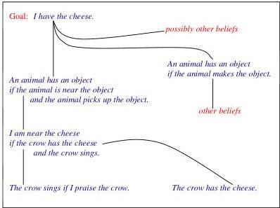

- **Status:** Complete-as-figure (the diagram is the artifact). Not in current LE: connection graphs / resolution machinery are explicitly outside LE.

**Backward reasoning step (goal/conclusion matching)**

- **Motivation:** Shows one concrete backward-reasoning step: matching the top-level goal against a rule's conclusion and deriving instantiated subgoals.

```
I have the cheese.

An animal has an object
if the animal is near the object and the animal picks up the object.

I am near the cheese and I pick up the cheese.
```

- **Status:** Fragment (a single illustrative inference step on the rules already given above). Fits current LE: this is ordinary backward reasoning over LE conditionals with variable instantiation; LE's engine does exactly this.

**Forward-direction proof presentation**

- **Motivation:** Presents the same proof in the more traditional forward direction, contrasting forward (natural to present) with backward (efficient to find).

```
Therefore
I praise the crow.
the crow sings.

Therefore
the crow has the cheese.
I am near the cheese.

Therefore
I pick up the cheese.
I have the cheese.
```

- **Status:** Fragment (a forward proof trace, not standalone rules). Partially: the inferences correspond to LE rules, but explicit forward-chaining proof presentation is not an LE construct (LE reasons backward from queries).

### 3.4 The end of the story of the fox and the crow?

Argues that, beyond thinking, an agent must also observe and act on the world, and pictures the relationship between the world and logic in the agent's mind. Closes with the crow's "preactive" reasoning had it known what the fox knows.

**World–logic relationship (figure)**

- **Motivation:** Illustrates how logic provides symbolic representations of the world that an agent processes to reason about it.

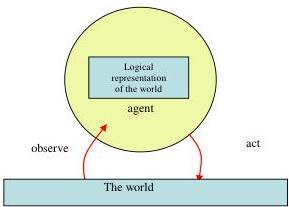

- **Status:** Fragment / conceptual figure. Not an example program; not applicable to LE.

**The crow's preactive reasoning**

- **Motivation:** Shows how a more intelligent crow could reason forward (preactively) about the consequences of singing, using the same beliefs as the fox but forwards, and decide not to sing.

```
I want to sing.
But if I sing, then the fox will be near the cheese.
If the fox is near the cheese and picks up the cheese,
then the fox will have the cheese.
Perhaps the fox wants to have the cheese and therefore will pick it up.
But then I will not have the cheese.
Since I want to have the cheese, I will not sing.
```

- **Status:** Fragment (informal forward-reasoning narrative, not a program). Not yet in current LE: combines forward reasoning, goals/desires ("I want to"), temporal "will", and action-decision — reactive-agent reasoning outside LE.

### 3.5 Representation and meaning

Develops the notion of logical meaning (semantics) as a relationship between sentences in logical form and interpretations (models / possible worlds). An interpretation is represented by the set of atomic sentences true in it; truth of non-atomic sentences reduces to truth of atomic ones via meta-sentences.

**The beginning-of-story interpretation as atomic sentences**

- **Motivation:** Represents the initial state of the world as the set of atomic sentences true in it — the simplest symbolic form of an interpretation.

```
the crow has the cheese.
the crow is in the tree.
the tree is above the air.
the air is above the ground.
the tree is above the ground.
the fox is on the ground.
```

- **Status:** Complete (a self-contained set of facts / a scenario). Fits current LE: these are exactly LE facts/scenario atoms.

**Deriving "above" from a transitivity rule**

- **Motivation:** Shows the power of non-atomic sentences (rules): the fact `the tree is above the ground` is derivable from more basic facts via a transitivity rule for `above`.

```
one object is above a second object
if the first object is above a third object
and the third object is above the second object.
```

- **Status:** Complete (a self-contained general rule operating over the facts above). Fits current LE: a standard transitive rule expressed with an LE template and variables ("a second object", "a third object").

**Meta-sentences for truth in an interpretation**

- **Motivation:** Illustrates how the truth value of compound sentences (conditionals, universally quantified sentences) reduces to truth values of atomic sentences via meta-level definitions.

```
A sentence of the form conclusion if conditions is true
if conditions is false or conclusion is true.

A sentence of the form everything has property P is true
if for every thing T in the interpretation, T has property P is true.
```

- **Status:** Fragment (semantic meta-definitions, not domain rules). Not yet in current LE: these are full meta-logic / semantic-truth definitions over sentence forms; LE has limited meta-templates (`says`, `that`) but not general truth-in-interpretation meta-reasoning. (The universal-quantification idea itself — "for every thing T ... " — does fit LE's `for all cases` construct.)

### 3.6 What is the moral of the story of the fox and the crow?

Draws the lesson of the fable — don't take another agent's words/actions at face value; think about consequences before acting — and notes the crow's spontaneous (unthinking) reaction versus monitoring intended actions. (No formal example beyond the preactive reasoning already shown above.)

## Chapter 4 Search

This chapter argues that logic and search are complementary: inference rules of logic determine a search space, and search strategies are proof procedures for finding solutions. It introduces and-or trees, or-trees, connection graphs, and search strategies (breadth-first, depth-first, best-first), plus the looping problem in Prolog and tabling, and finally the primacy of knowledge representation.

### 4.1 (chapter introduction — search spaces and trees)

Explains the relationship between backward reasoning and search via and-or trees (or-arcs = alternatives, and-arcs = conjoined subgoals), the correspondence to connection graphs, the interdependence of subgoals, or-trees, and the breadth-first / depth-first / Prolog-looping discussion.

**And-or tree for the fox's goal (figure)**

- **Motivation:** Pictures the search space generated by backward reasoning over the fox's goal as an and-or tree (top-level goal at the top, or-arcs to alternatives, and-arcs to conjoined subgoals).

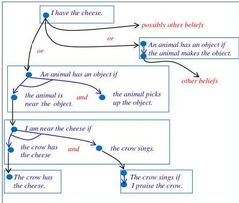

- **Status:** Complete-as-figure (the search-space diagram for the fox example). Not in current LE: and-or trees / search-space machinery are outside LE's surface language.

**Interdependent subgoals (shared object)**

- **Motivation:** Shows that, unlike conventional and-or trees, connection-graph subgoals are interdependent: the object you are near and the object you pick up must be the same.

```
an animal has an object
if the animal is near the object
and the animal picks up the object.
```

- **Status:** Fragment (re-uses the earlier rule to make a search-efficiency point about shared variables). Fits current LE: shared variables across conjoined conditions are exactly how LE rule bodies bind. (The point being made is about search order, which LE does not expose.)

**Or-tree for the fox's goal (figure)**

- **Motivation:** Pictures the alternative or-tree representation, whose nodes are conjunctions of subgoals; the underlined subgoal in each node is the one selected for reduction.

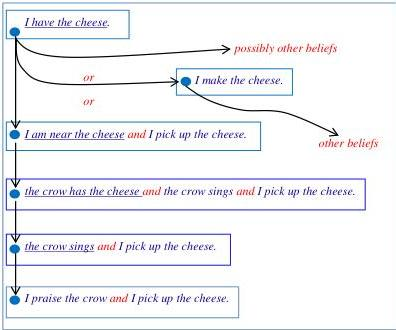

- **Status:** Complete-as-figure. Not in current LE.

**The party-looping example (connection graph + or-tree figures and clauses)**

- **Motivation:** A classic example of how depth-first search (as in Prolog) can loop forever on mutually recursive clauses, while breadth-first finds the solution `Who = bob` immediately; clause order matters.

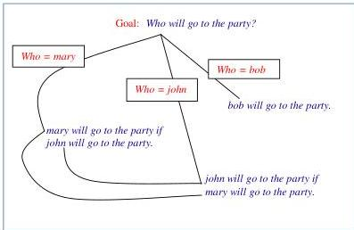

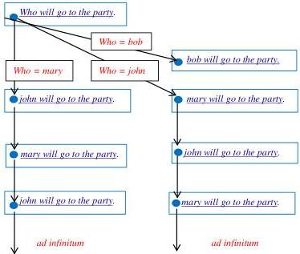

```
mary will go to the party if john will go to the party.
john will go to the party if mary will go to the party.
bob will go to the party.
```

- **Status:** Complete (self-contained clauses with a query `Who will go to the party?`). Fits current LE: these are plain conditionals and a fact; the query has a variable `Who`. LE/SWI-Prolog would face the same depth-first looping (LE notes tabling mitigates it), so the logical content fits even though the search-strategy lesson is about the engine.

### 4.2 Best-first search

Explains best-first search for problems where solutions have different values: evaluating/comparing complete and partial solutions, weighted sums of attributes, breadth-first and depth-first variants, integration with decision theory (utility × probability), and connection-graph link strengths / activation spreading (a connectionist-style model).

**Compiling a specialised belief from general beliefs**

- **Motivation:** Shows how strong connection-graph links can be compiled into new explicit beliefs: the fox's specialised belief `the crow sings if I praise the crow` can be generated from a general reaction belief plus a fact.

```
an agent does Y if I do X and the agent reacts to X by doing Y

agent = the crow    X = praise    Y = sing

the crow reacts to praise by singing
```

- **Status:** Fragment (illustrates compiling/specialisation; mixes a general rule, a substitution, and a fact). Partially fits LE: the general rule `an agent does Y if I do X and the agent reacts to X by doing Y` and the fact `the crow reacts to praise by singing` are expressible as LE templates/facts, but action predicates ("does", "do") and the compilation/link-strength mechanism (best-first, decision-theoretic) are not LE constructs.

### 4.3 Knowledge representation matters

Argues that efficient search is only half the story; knowledge representation is the bottleneck. Notes the original fox example ignores time, and gives a temporally explicit version of the "has an object" rule. Discusses the web-of-belief / relevance problem and the Cyc project.

**Temporally explicit "has an object" rule**

- **Motivation:** Corrects the earlier timeless rule to make temporal dependence explicit: possession is initiated by picking up and persists until terminated (a preview of the event/situation calculus of Chapter 13).

```
an animal has an object at a time
if the animal is near the object at an earlier time
and the animal picks up the object at the earlier time
and nothing terminates the animal having the object between the two times.
```

- **Status:** Complete (a self-contained, more precise rule). Not yet in current LE: it relies on event/situation-calculus temporal primitives (times, `initiates`/`terminates`, persistence) that are explicitly not in LE. (The "nothing terminates ..." clause is negation-as-failure flavoured, which LE does have, but the temporal framing is not.)

## Chapter 5. Negation as Failure

This chapter argues for the primacy of positive information: we observe positive facts and derive negatives from their absence. It introduces negation as failure (naf), the closed-world assumption, defeasibility / non-monotonicity, open vs. closed predicates, the selective closed-world assumption, default reasoning, rules-and-exceptions, strong negation, and hierarchies of rules and exceptions.

### 5.1 (chapter introduction — passive vs. active observation, constraints)

Distinguishes passive (positive, forced) from active (may return negative) observations, and previews that negative observations can be represented by, or derived via, constraints (conditional goals with conclusion `false`).

**Negative observations as constraints**

- **Motivation:** Shows how a negative observation is represented as a constraint (a conditional goal whose conclusion is `false`), equivalently "it is not the case that ...".

```
if raining then false.
i.e. it is not the case that it is raining.

if I am hungry then false
i.e. it is not the case that I am hungry.
```

- **Status:** Complete (small self-contained constraints with their NAF paraphrase). Partially fits LE: the "it is not the case that ..." paraphrase is exactly LE negation-as-failure, but explicit integrity constraints of the form `if ... then false` are not in current LE.

**Deriving a negative observation from a positive one via a constraint**

- **Motivation:** Illustrates deriving a negative conclusion (`the grass is not dry`) from a positive observation (`the grass is wet`) using a constraint plus forward reasoning.

```
Observation: the grass is wet.

Constraint: if an object is wet and the object is dry then false.
i.e. it is not the case that
an object is wet and the object is dry.

Forward reasoning: it is not the case that the grass is dry.
```

- **Status:** Complete (observation + constraint + derived conclusion). Partially fits LE: the constraint `if wet and dry then false` and forward-derivation of a negative are integrity-constraint / forward-reasoning machinery not in LE; however the underlying idea that `wet` and `dry` are contraries can be re-expressed with LE rules and negation-as-failure.

### 5.2 Mental representations have a positive bias

Argues that databases, history records, and programs all store positive facts, and that conditionals compactly represent positive facts via general rules (deductive databases / Datalog). Gives the last-train example as a positive conditional.

**The last-train conditional**

- **Motivation:** Shows a positive fact (a train time) represented compactly by a conditional whose conditions restrict the day to weekdays within a calendar period.

```
the last train from victoria to pulborough leaves at 22:52 on a day
if the day is a weekday
and the day is in the period between 17 may 2010 and 12 december 2010.
```

- **Status:** Complete (a self-contained conditional; would need auxiliary weekday/period rules to be fully grounded, as the text notes). Fits current LE: this is a `Head if Body` rule with date comparisons; LE supports dates, date ranges/between, and such period conditions directly.

### 5.3 Negation as failure and the closed world assumption

Defines negation as failure (derive a negative from failure to prove the positive) and the closed-world (closed-mind) assumption that justifies it, expressed as a meta-belief. Shows the party example traced under naf, the defeating effect of new information (defeasibility / non-monotonicity), and the looping `mary/john` case.

**The closed-world assumption as a meta-belief**

- **Motivation:** States the assumption that justifies naf as a meta-belief / auto-epistemic sentence.

```
the negation of a sentence holds if the sentence does not hold.

the negation of a sentence holds
if I do not know (or believe) that the sentence itself holds.
```

- **Status:** Fragment (a meta-level justification, not a domain rule). Partially: negation-as-failure itself is in LE (`it is not the case that`), but expressing it as an explicit meta-belief over "a sentence" / "I know" is meta-logic / epistemic, which LE does not provide as such.

**Naf inference template (rule with negative conditions)**

- **Motivation:** Shows the general goal-reduction reading of a conditional with both positive and negative conditions.

```
positive conclusion if positive conditions and negative conditions

to show or make the positive conclusion hold,
show or make the positive conditions hold and
show or make the negative conditions fail to hold.
```

- **Status:** Fragment (a schematic procedural reading). Fits current LE: rules with negative conditions solved by negation-as-failure are exactly LE's `... and it is not the case that ...`.

**Party example with naf (and its defeat)**

- **Motivation:** The canonical naf example: `mary will go` is derivable because `bob will go` cannot be shown; adding `bob will go` defeats the conclusion, demonstrating defeasibility / non-monotonicity.

```
mary will go if john will go.
john will go if bob will not go.

Initial goal: mary will go.
Subgoal: john will go.
Subgoal: bob will not go.
Naf: bob will go.
Failure: no!
Success: yes!
```

- **Status:** Complete (self-contained clauses + goal trace; "bob will not go" is negation-as-failure). Fits current LE: rewrite `bob will not go` as `it is not the case that bob will go`; the rules, query `Is it the case that mary will go?`, and the non-monotonic behaviour on adding `bob will go` all fit LE.

**Mutually recursive looping example under naf**

- **Motivation:** Shows that default reasoning can require infinite resources (non-constructive semantics): mutually recursive clauses mean `mary will go` cannot be shown, so by the closed-world assumption `mary will not go`; the loop can be detected by noticing a subgoal recurring as its own subgoal.

```
mary will go if john will go.
john will go if mary will go.

Initial goal: mary will go.
Subgoal: john will go.
Subgoal: mary will go.
Ad infinitum
```

- **Status:** Complete (self-contained clauses + trace). Fits current LE: these are ordinary conditionals; LE (with tabling) detects the loop and the negative conclusion follows by closed-world / negation-as-failure, exactly as described.

### 5.4 An intelligent agent needs to have an open mind

Distinguishes closed predicates (complete knowledge — e.g. classificatory concepts like "British citizen", "eligible for Housing Benefit") from open predicates (incomplete knowledge about external states of the world). No standalone formal example; the listed questions ("Did it rain last night in Port Moresby?", etc.) illustrate open predicates in prose.

### 5.5 Relaxing the closed world assumption

Shows that many benefits of naf can be had without full closed-world assumption by selectively using `cannot be shown` conditions. Gives Robert Moore's older-brother example as a selective closed-world assumption.

**Moore's older-brother (selective closed-world assumption)**

- **Motivation:** Illustrates applying the closed-world assumption to a single sentence: Moore concludes he has no older brother because he cannot show that he has one.

```
I do not have an older brother
if I cannot show that I have an older brother.
```

- **Status:** Complete (a single self-contained selective-CWA rule). Fits current LE: rephrase `cannot show that ...` as `it is not the case that ...`; this is a standard negation-as-failure rule in LE.

### 5.6 Default reasoning

Generalises `cannot be shown` to the conditions of any conditional (full default reasoning without global closed-world assumption). Gives the "innocent unless proven guilty" example with a trace, including how new evidence (a witness) defeats innocence.

**Innocent-unless-proven-guilty**

- **Motivation:** A default-reasoning example: a person accused of a crime is innocent unless it can be shown they committed it; adding a witness defeats the innocence conclusion.

```
a person is innocent of a crime
if the person is accused of the crime
and it cannot be shown that
the person committed the crime.

a person committed an act
if another person witnessed the person commit the act.

bob is accused of robbing the bank.

Initial goal: bob is innocent of robbing the bank.
Subgoals: bob is accused of robbing the bank and
it cannot be shown that bob committed robbing the bank
Naf: bob committed robbing the bank
Subgoals: another person witnessed bob commit robbing the bank
Failure: no!
Success: yes!
```

- **Status:** Complete (rules + fact + goal trace; defeated later by `john witnessed bob commit robbing the bank`). Fits current LE: `cannot be shown that ...` maps to `it is not the case that ...`; with taxonomic knowledge (robbing a bank is a crime / a crime is an act, which LE's ontology supports) the rules, fact, and query all fit LE, including the non-monotonic defeat on adding the witness fact.

### 5.7 Missing conditions

Discusses the common practice of stating only the main conditions of a rule and correcting it with seemingly contradictory exception statements. Contrasts the higher-level "rule and exceptions" formulation with the compiled low-level rule, and introduces strong negation (the contrary positive predicate).

**Birds-fly default and its exceptions**

- **Motivation:** The textbook default-reasoning example: `all birds fly` is an over-generalisation, corrected by separate exception statements for penguins, unfledged, injured birds.

```
all birds fly.
i.e. an animal can fly if the animal is a bird.

an animal can fly if the animal is a bird
and the animal is not a penguin
and the animal is not unfledged
and the animal is not injured.

an animal cannot fly if the animal is a penguin
an animal cannot fly if the animal is unfledged
an animal cannot fly if the animal is injured.
```

- **Status:** Complete (rule, compiled form, and contrary-conclusion exceptions). Partially fits LE: the compiled rule with `is not a penguin / is not unfledged / is not injured` maps directly to LE negation-as-failure conditions. The separate `cannot fly` exception sentences use strong negation (a contrary predicate); LE would model these by an explicit `cannot fly` predicate or by folding them into the rule — there is no built-in strong-negation operator.

**Suppression-task missing condition**

- **Motivation:** Shows a non-standard correction (the second sentence adds a missing condition rather than contradicting the first), motivating the precise restated form below.

```
she will study late in the library if she has an essay to write.
she will study late in the library if the library is open.
```

- **Status:** Fragment (illustrates the confusing pattern, not a finished program). Fits current LE as written (two `Head if Body` clauses), though the point is precisely that this naive form does not capture the intended meaning.

**General over-simplification / correction schema**

- **Motivation:** States the standard "rule + contrary-conclusion correction" pattern and its intended meaning (rule plus negated exception).

```
Over-simplification: a conclusion holds if conditions hold.
Correction: the conclusion does not hold if other conditions hold.

Intended meaning: a conclusion holds if conditions hold
and other conditions do not hold.

Restated rule: a conclusion holds if conditions hold
and it is not the case that the conclusion does not hold.
```

- **Status:** Fragment (a schema, not a domain example). Partially: the "Intended meaning" form (rule + `and ... do not hold`) is exactly LE negation-as-failure. The "Restated rule" with double negation distinguishes negation-as-failure (`it is not the case that`) from strong negation (`does not hold` as a positive contrary predicate); strong negation has no dedicated LE operator.

**Precise suppression-task rule with exceptions**

- **Motivation:** Restates the library example precisely using negation-as-failure plus a separate `prevented` predicate, so new exceptions can be added without apparent contradiction.

```
she will study late in the library
if she has an essay to write
and it is not the case that
she is prevented from studying late in the library.

she is prevented from studying late in the library
if the library is not open.
she is prevented from studying late in the library
if she is unwell.
she is prevented from studying late in the library
if she has a more important meeting.
she is prevented from studying late in the library
if she has been distracted.
```

- **Status:** Complete (a full rule-and-exceptions program). Fits current LE: `it is not the case that ...` is LE negation-as-failure; the `prevented` predicate and its multiple defining clauses are ordinary LE rules. The compiled version (`... and the library is open and she is not unwell and ...`) also fits LE directly.

**Housing Benefit rule and exception**

- **Motivation:** A real-world (UK Citizen's Advice) example of a simplified public rule subject to an unstated `ineligible` exception, expressed with `or` conditions and negation-as-failure.

```
a person gets help to pay rent if the person receives housing benefit.

a person receives housing benefit
if the person is on other benefits
or the person works part-time
or the person works full-time on a low income
and it is not the case that
the person is ineligible to receive housing benefit.

a person is ineligible to receive housing benefit
if the person is not on a low income.
```

- **Status:** Complete (rules with `or`, negation-as-failure, and an exception predicate). Fits current LE: `or`, `and`, and `it is not the case that` are all in LE. (Operator-precedence of mixed `or`/`and` would need LE's grouping conventions, but the constructs themselves are supported.)

### 5.8 Hierarchies of rules and exceptions

Shows how nested rules and exceptions (a rule, an exception to it, an exception to the exception) can be compiled into low-level rules and decompiled into a layered "exception to the punishment rule" / "exception to the exception" representation, with naf traces for Bob and Mary.

**Thieves-punishment hierarchy (informal + compiled)**

- **Motivation:** Illustrates a three-level rule/exception hierarchy (punish thieves; except minors; except violent minors) and its compiled low-level form.

```
Rule 1: All thieves should be punished.
Rule 2: Thieves who are minors should not punished.
Rule 3: Any thief who is violent should be punished.

a person should be punished
if the person is a thief and the person is not a minor.

a person should be punished
if the person is a thief and the person is a minor
and the person is violent.
```

- **Status:** Complete (compiled rules capturing the hierarchy). Fits current LE: the compiled clauses use `and` and `is not a minor` (negation-as-failure); treating `should be punished` as a closed predicate (so the unwritten `should not be punished` case is implied) is exactly LE's closed-world behaviour.

**Decompiled layered rules-and-exceptions**

- **Motivation:** Shows the higher-level decompiled form using explicit "exception to the punishment rule" / "exception to the exception" predicates (deliberately not named `should not be punished`, to avoid the top rule becoming its own exception).

```
a person should be punished
if the person is a thief
and it is not the case that
the person is an exception to the punishment rule.

a person is an exception to the punishment rule
if the person is a minor
and it is not the case that
the person is an exception to the exception to the punishment rule.

a person is an exception to the exception to the punishment rule
if the person is violent.
```

- **Status:** Complete (a full layered rules-and-exceptions program). Fits current LE: each layer is a `Head if Body` rule using `it is not the case that` (negation-as-failure); this is a standard LE pattern for nested exceptions.

**Naf trace for Bob and Mary**

- **Motivation:** Traces the layered program: Bob (thief, not a minor) should be punished; Mary (thief and minor, not violent) should not — demonstrating how the negation layers alternate success/failure.

```
Initial goal: bob should be punished
Subgoals: bob is a thief and
it is not the case that bob is an exception to the punishment rule
Naf: bob is an exception to the punishment rule
Subgoals: bob is a minor and it is not the case that
bob is an exception to the exception to the punishment rule
Failure: no!
Success: yes!

Initial goal: mary should be punished
Subgoals: mary is a thief and it is not the case that
mary is an exception to the punishment rule
Naf: mary is an exception to the punishment rule
Subgoals: mary is a minor and it is not the case that
mary is an exception to the exception to the punishment rule
Naf: mary is an exception to the exception to the punishment rule
Subgoals: mary is violent
Failure: no!
Success: yes!
Failure, no!
```

- **Status:** Complete (goal traces over the layered program above, given facts that Bob is a thief and Mary is a thief and a minor). Fits current LE: this is exactly the backward-reasoning-with-negation-as-failure evaluation LE performs over the decompiled rules.

### 5.9 Conclusions

Summarises the chapter: the primacy of positive predicates; passive observations as positive atoms; active observations possibly returning negatives; negation-as-failure justified by the closed-world assumption (which may be relaxed via `cannot be shown` conditions); defeasibility; and rules-and-exceptions / default reasoning that can be compiled into low-level rules or decompiled into higher-level rules and exceptions. Previews later treatment of negation via constraints, contrapositives, and biconditionals. (No new formal examples.)

## Chapter 6. How to Become a British Citizen

This chapter studies the British Nationality Act 1981 (BNA) and the University of Michigan lease termination clause as real-world legal texts whose English style closely resembles the conditional form of Computational Logic. It is the richest source of legal-rule examples in the book, mapping closely to current LE (the repo already contains `examples/moreExamples/citizenship.le`).

### 6.1 The British Nationality Act 1981

Introductory section noting that the BNA examples illustrate representation of time, default reasoning, and meta-level reasoning about belief. No standalone examples here.

### 6.2 Acquisition by birth

**Example 1 — BNA subsection 1.1, original legal text.**
**Motivation:** The opening clause of the BNA, granting citizenship by birth in the UK after commencement; the book uses it to show that legal English already resembles backward-reasoning conditional (logic-program) syntax, even to placing the conclusion before its conditions.

```
1.-(1) A person born in the United Kingdom after commencement shall be a
British citizen if at the time of the birth his father or mother is -
(a) a British citizen; or
(b) settled in the United Kingdom.
```

**Status:** (a) complete. (b) fits current LE — this is essentially the verbatim form a legal text takes; the conditions are inlined into the conclusion via a restrictive relative clause, which LE handles by re-expressing them as explicit `if`-conditions (see the CL rewrite in Example 4).

**Example 2 — Restrictive vs. non-restrictive relative clauses in CL form.**
**Motivation:** Illustrates that restrictive relative clauses add conditions while non-restrictive clauses add conclusions, and how each maps to a distinct conditional.

```
A British citizen who obtains citizenship by providing false information
may be deprived of British citizenship.

A British citizen, who is an EU citizen, is entitled to vote in EU elections.
```

In CL form:

```
a person may be deprived of British citizenship
if the person obtains citizenship by providing false information.

a person is entitled to vote in EU elections
if the person is a British citizen.

a person is an EU citizen if the person is a British citizen.
```

**Status:** (a) complete. (b) fits current LE — all three are plain `Head if Body.` conditionals.

**Example 3 — Rewriting an ambiguous relative clause as explicit conjunction or conditional.**
**Motivation:** Shows two unambiguous rewrites of an English sentence whose restrictive/non-restrictive reading is unclear.

```
All British citizens have the right of abode in the UK
and owe loyalty to the Crown.

a British citizen owes loyalty to the Crown
if the citizen has the right of abode in the UK.
```

**Status:** (a) complete. (b) fits current LE — universal quantification ("All British citizens ...") and conjunctive conclusions/conditionals are both supported.

**Example 4 — Informal CL representation of subsection 1.1.**
**Motivation:** The book's careful, near-formal CL transcription of 1.1, introducing typed variables, an explicit time argument `T`, the `parent` abstraction, and the disjunctive parent condition. This is the closest analogue to the repo's `citizenship.le`.

```
X acquires british citizenship by subsection 1.1 at time T
if X is a person
and X is born in the uk at time T
and T is after commencement
and Y is a parent of X
and Y is a british citizen at time T or
Y is settled in the uk at time T
```

The accompanying mathematical-logic form:

```
∀X (∀T (∃Y (b(X, uk, T) ∧ c(T) ∧ d(Y, X) ∧ (e(Y, T) ∨ f(Y, T)))
      → a(X, 1.1, T))).
```

**Status:** (a) complete. (b) fits current LE — `if`/`and`/`or`, typed variables, dates and date comparison (`T is after commencement`), and a `parent` taxonomy/template are all expressible. This rule corresponds directly to `examples/moreExamples/citizenship.le` in this repo. The explicit quantifier/predicate-letter form is illustrative only and not entered into LE.

### 6.3 Representation of time and causality

**Example 5 — Persistence of citizenship over time.**
**Motivation:** Supplies the missing temporal link between *acquiring* and *being* a citizen, using negation-as-failure over an intervening termination event.

```
a person is a british citizen at a time
if the person acquires british citizenship at an earlier time
and it is not the case that
the person ceases to be a british citizen between the two times.
```

**Status:** (a) complete. (b) partially — the conditional with negation-as-failure ("it is not the case that") fits LE, but the underlying frame/persistence semantics belongs to the event calculus (see Example 6), which is **not yet** in LE.

**Example 6 — The general event calculus persistence axiom.**
**Motivation:** Abstracts the citizenship and has-object cases into a single law of inertia: a fact holds if initiated and not subsequently terminated.

```
a fact holds at a time,
if an event happened at an earlier time
and the event initiated the fact
and it is not the case that
an other event happened between the two times and
the other event terminated the fact.
```

**Status:** (a) complete. (b) not yet — this is the **event calculus**, requiring reified events/facts and initiate/terminate relations over time, which LE does not provide.

**Example 7 — Initiates/terminates facts (event-calculus instances).**
**Motivation:** Specializes the persistence axiom to specific event types initiating and terminating citizenship and possession.

```
the event of a person acquiring british citizenship initiates
the fact that the person is a british citizen.

the event of a person being deprived of british citizenship terminates
the fact that the person is a british citizen.

the event of an animal picking up an object initiates
the fact that the animal has the object.

the event of an animal dropping an object terminates
the fact that the animal has the object.
```

**Status:** (a) complete. (b) not yet — depends on event-calculus reification (events and facts as individuals; `initiates`/`terminates`). The `the fact that ...` reification superficially resembles LE's meta-template `that`, but the initiate/terminate temporal machinery is not in LE.

**Example 8 — has-object rule with precondition, and its precondition constraint.**
**Motivation:** Recalls the Chapter 4 has-object rule and shows how its `near` precondition becomes a separate event-calculus integrity constraint.

```
an animal has an object at a time
if the animal is near the object at an earlier time
and the animal picks up the object at the earlier time
and nothing terminates the animal having the object between the two times.
```

Precondition as a constraint:

```
if an animal picks up an object
and it is not the case that the animal is near the object at a time
then false.
```

**Status:** (a) complete. (b) not yet — the rule needs event-calculus persistence; the `... then false` form is an **integrity constraint / prohibition**, which is not in current LE.

**Example 9 — Reified initiation/termination of legal provisions.**
**Motivation:** Stretches "fact" to cover whole provisions, initiated by commencement and terminated by repeal of an Act — an example of reification/nominalization.

```
the commencement of an act of parliament initiates a provision
if the provision is contained in the act.

the repeal of an act of parliament terminates a provision
if the provision is contained in the act.
```

**Status:** (a) complete. (b) not yet — reified events plus initiate/terminate over reified provisions (event calculus); outside current LE.

### 6.4 Acquisition by abandonment

**Example 10 — BNA subsection 1.2, original legal text (the abandoned new-born).**
**Motivation:** Reifies "the purposes of subsection (1)" and uses the default phrase "unless the contrary is shown"; the book's main vehicle for meta-level reasoning and default reasoning.

```
1.-(2) A new-born infant who, after commencement, is found
abandoned in the United Kingdom shall, unless the contrary is shown,
be deemed for the purposes of subsection (1)-
(a) to have been born in the United Kingdom after commencement; and
(b) to have been born to a parent who at the time of the birth
was a British citizen or settled in the United Kingdom.
```

**Status:** (a) complete. (b) partially — the surface rule is conditional, but the intended meaning relies on meta-language ("the purposes/conclusion/conditions of subsection 1") and defeasible "unless the contrary is shown". LE has `unless` and the meta-template `says`/`that`, but does not provide reference to *the conclusion/conditions of another rule* as first-class objects.

**Example 11 — Meta-language paraphrase of 1.2.**
**Motivation:** Restates 1.2 by referring directly to the conclusion and conditions of rule 1.1, mixing meta-language with object-language.

```
The conclusion of 1.1 holds for a person
if the person is found newborn abandoned in the uk after commencement
and the contrary of the conditions of 1.1 are not shown to hold for the person.
```

**Status:** (a) complete. (b) not yet — quantifying over and asserting "the conclusion/conditions of rule 1.1" requires **meta-logic / reification of rules**, beyond LE's current `says ... that` meta-templates.

**Example 12 — Object-language expansion of 1.2 with "is not shown".**
**Motivation:** Spells 1.2 out at the object level using a practical default operator ("is not shown"), exploiting the contraries of each condition of 1.1.

```
A person found newborn abandoned in the uk after commencement
shall be a british citizen by section 1.2
if it is not shown
that the person was born outside the uk
and it is not shown that
the person was born on or before commencement
and it is not shown that
both parents were not british citizens at the time of birth
and it is not shown that
both parents were not settled in the uk at the time of birth
```

**Status:** (a) complete. (b) partially — structurally a conditional with repeated negation. "is not shown" is a weaker, resource-bounded variant of negation-as-failure; LE's negation/`unless` approximates it but does not model the "shown with finite effort" semantics the book stresses.

### 6.5 Rules and exceptions

**Example 13 — Deprivation of citizenship (40.2) and its exception (40.4), then compiled.**
**Motivation:** Classic rule-plus-exception; shows compiling an exception into the rule's conditions via negation-as-failure.

```
40.-(2) The Secretary of State may by order deprive a person of a citizenship
status if the Secretary of State is satisfied that deprivation is conducive
to the public good.

40.-(4) The Secretary of State may not make an order under subsection (2)
if he is satisfied that the order would make a person stateless.
```

Compiled into a single rule:

```
40.-(2) The Secretary of State may by order deprive a person of a citizenship
status if the Secretary of State is satisfied that deprivation is conducive
to the public good,
and he is not satisfied that the order would make the person stateless.
```

**Status:** (a) complete. (b) partially — the compiled rule fits LE (conditional + negation-as-failure). However the standalone "may not ... if ..." prohibition (40.4) is a **prohibition/permission** statement that LE does not represent natively; the book's point is precisely that it must be *compiled away* into negated conditions to fit a logic program.

**Example 14 — Renunciation of citizenship: 12.1, 12.3, 12.4, then compiled.**
**Motivation:** A rule (12.1) flagged "subject to subsections (3) and (4)" with two different kinds of exception (a hard bar, and a discretionary withholding), compiled into one rule.

```
12-(1) If any British citizen of full age and capacity makes in the prescribed
manner a declaration of renunciation of British citizenship, then, subject to
subsections (3) and (4), the Secretary of State shall cause the declaration to
be registered.

(3) A declaration made by a person in pursuance of this section shall not be
registered unless the Secretary of State is satisfied that the person who made
it will after the registration have or acquire some citizenship or nationality
other than British citizenship;

(4) The Secretary of State may withhold registration of any declaration made in
pursuance of this section if it is made during any war in which Her Majesty may
be engaged in right of Her Majesty's government in the United Kingdom.
```

Compiled into a single rule:

```
The Secretary of State shall cause a declaration of renunciation of British
citizenship to be registered
if the declaration is made by a British citizen of full age and capacity
and the declaration is made in the prescribed manner
and the Secretary of State is satisfied that after the registration the person
will have or acquire some citizenship or nationality other than British citizenship;
and it is not the case that
the declaration is made during a war in which Her Majesty is engaged in right of
Her Majesty's government in the United Kingdom
and the Secretary of State decides to withhold the registration.
```

**Status:** (a) complete. (b) partially — the compiled conditional (with `and`, negation-as-failure) fits LE well. The epistemic condition "the Secretary of State is satisfied that ..." reads naturally as an LE `says/that`-style meta-template but is treated here as an opaque object-level predicate. The discretionary "decides to withhold" is an input fact LE can take as a scenario fact.

**Example 15 — Cessation of citizenship on registration: 12.2 and 12.3 proviso, compiled.**
**Motivation:** Termination of citizenship caused partly by a future state of affairs (acquiring another nationality within six months), expressed as an event-calculus termination rule.

```
12-(2) On the registration of a declaration made in pursuance of this section
the person who made it shall cease to be a British citizen.

(3) ...; and if that person does not have any such citizenship or nationality on
the date of registration and does not acquire some such citizenship or
nationality within six months from that date, he shall be, and be deemed to have
remained, a British citizen notwithstanding the registration.
```

Compiled as an event-calculus termination rule:

```
the event of registering a declaration of renunciation by a person terminates
the fact that the person is a british citizen
if the registration was made on date T1
and the person has some citizenship or nationality other than british
citizenship on date T2
and T1 ≤ T2 ≤ T1 + six months.
```

**Status:** (a) complete. (b) not yet — uses event-calculus `terminates`/`the fact that` reification; the date arithmetic and comparison (`T1 ≤ T2 ≤ T1 + six months`) themselves fit LE, but the termination/persistence framing does not.

### 6.6 How to satisfy the Secretary of State

**Example 16 — Naturalisation 6.1, original text and top-level CL form.**
**Motivation:** Introduces epistemic/meta-level conditions ("is satisfied that ...", "thinks fit") alongside ordinary object-level conditions.

```
6.-(1) If, on an application for naturalisation as a British citizen made by a
person of full age and capacity, the Secretary of State is satisfied that the
applicant fulfils the requirements of Schedule 1 for naturalisation as such a
citizen under this sub-section, he may, if he thinks fit, grant to him a
certificate of naturalisation as such a citizen.
```

Top-level logical form:

```
the secretary of state may grant a certificate of naturalisation to a person
by section 6.1
if the person applies for naturalisation
and the person is of full age and capacity
and the secretary of state is satisfied that
the person fulfils the requirements of schedule 1 for naturalisation by 6.1
and the secretary of state thinks fit
to grant the person a certificate of naturalisation.
```

**Status:** (a) complete. (b) partially — object-level conditions and the conditional shape fit LE. The "is satisfied that" / "thinks fit" conditions are epistemic meta-conditions; "satisfied that <sentence>" resembles LE's `says/that` meta-template, but "thinks fit" is treated as an opaque, case-supplied input.

**Example 17 — Schedule 1 naturalisation requirements (object level).**
**Motivation:** The summarised requirements an applicant must fulfil — a sizeable disjunction/conjunction that is straightforwardly a logic-programming rule.

```
a person fulfils the requirements of schedule 1 for naturalisation by 6.1
if either the person fulfils the residency requirements of subparagraph 1.1.2
or the person fulfils the crown service requirements of subparagraph 1.1.3
and the person is of good character
and the person has sufficient knowledge of english, welsh, or scottish gaelic
and the person has sufficient knowledge about life in the uk
and either the person intends to make his principal home in the uk
in the event of being granted naturalisation
or the person intends to enter or continue in crown service or
other service in the interests of the crown in the event of being
granted naturalisation.
```

**Status:** (a) complete. (b) fits current LE — `if`/`and`/`or` (with `either ... or ...`) conditional; the only subtlety is operator precedence between `and`/`or`, which LE makes explicit. Maps closely to citizenship-style rules.

**Example 18 — Distributing "the Secretary of State is satisfied that" over Schedule 1.**
**Motivation:** Shows, under the assumption that the Secretary is rational, that satisfaction distributes over the `if`/`or`/`and` structure of Schedule 1 — a meta-level derivation.

```
the secretary of state is satisfied that
a person fulfils the requirements of schedule 1 for naturalisation by 6.1
if either the secretary of state is satisfied that
the person fulfils the residency requirements of subparagraph 1.1.2
or the secretary of state is satisfied that
the person fulfils the crown service requirements of subparagraph 1.1.3
and the secretary of state is satisfied that
the person is of good character
and the secretary of state is satisfied that
the person has sufficient knowledge of english, welsh, or scottish gaelic
and the secretary of state is satisfied that
the person has sufficient knowledge about life in the uk
and either the secretary of state is satisfied that
the person intends to make his principal home in the uk
in the event of being granted naturalisation
or the secretary of state is satisfied that
the person intends to enter or continue in crown service or
other service in the interests of the crown in the event of being
granted naturalisation.
```

**Status:** (a) complete. (b) not yet — deriving this distributed form requires **meta-level reasoning** about an agent's beliefs over the structure of object-level rules (the book defers the derivation to Chapter 17). The "is satisfied that <sentence>" pattern echoes LE's `says/that` meta-templates, but the rule-transforming inference is beyond current LE.

### 6.7 The University of Michigan lease termination clause

**Example 19 — Original (deliberately ambiguous) lease termination clause.**
**Motivation:** Allen and Saxon's notorious single-sentence clause, used to show how unstructured English with stacked conditions/exceptions becomes virtually unparseable.

```
"The University may terminate this lease when the Lessee, having made
application and executed this lease in advance of enrollment, is not eligible to
enroll or fails to enroll in the University or leaves the University at any time
prior to the expiration of this lease, or for violation of any provisions of
this lease, or for violation of any University regulation relative to Resident
Halls, or for health reasons, by providing the student with written notice of
this termination 30 days prior to the effective time of termination; unless
life, limb, or property would be jeopardized, the Lessee engages in the sales or
purchase of controlled substances in violation of federal, state or local law,
or the Lessee is no longer enrolled as a student, or the Lessee engages in the
use or possession of firearms, explosives, inflammable liquids, fireworks, or
other dangerous weapons within the building, or turns in a false alarm, in which
cases a maximum of 24 hours notice would be sufficient".
```

**Status:** (a) complete. (b) not yet (as written) — the sentence is ambiguous precisely because it lacks the explicit structure LE requires; the book's point is that it must be disambiguated before any logical form (LE included) can represent it.

**Example 20 — Abstract ambiguous form and Allen–Saxon intended interpretation.**
**Motivation:** Shows the propositional skeleton of the clause and the unique reading Allen and Saxon identified (from ~80 disambiguating questions).

Ambiguous form:

```
A if B and B', C or D or E or F or G or H
unless I or J or K or L or M in which case A'
```

Intended interpretation (parenthesised):

```
(A if (not (I or J or K or L or M) and ((B and B' and (C or D)) or E or F or G or H))
 and A' if (I or J or K or L or M))
```

Simplified into conditionals (replacing `not (I or J or K or L or M)` by `not A'`):

```
A if not A' and B and B' and C.
A if not A' and B and B' and D.
A if not A' and E.
A if not A' and F.
A if not A' and G.
```

**Status:** (a) complete. (b) fits current LE — once disambiguated, these are plain `Head if Body.` conditionals with `and` and negation-as-failure (`not A'`). The clausal expansion of one rule into several is exactly how LE handles disjunctive conditions.

**Example 21 — Readable English rewriting using "one of the following conditions holds".**
**Motivation:** Shows how to recover the disambiguated meaning in plain English without tedious repetition, using a bulleted disjunction — a style very close to LE's enumerated conditions.

```
The University may terminate this lease by providing the student with written
notice of this termination 30 days prior to the effective time of termination
if the University may not terminate this lease with a maximum of 24 hours notice
and one of the following conditions holds:
1) The Lessee, having made application and executed this lease in advance of
   enrollment, is not eligible to enroll or fails to enroll in the University.
2) The Lessee leaves the University at any time prior to the expiration of this lease.
3) The Lessee violates any provisions of this lease.
4) The Lessee violates any University regulation relative to Resident Halls.
5) There are health reasons for the termination.

The University may terminate this lease with a maximum of 24 hours notice
if one of the following conditions holds:
1) Life, limb, or property would be jeopardized.
2) The Lessee engages in the sales or purchase of controlled substances in
   violation of federal, state or local law.
3) The Lessee is no longer enrolled as a student.
4) The Lessee engages in the use or possession of firearms, explosives,
   inflammable liquids, fireworks, or other dangerous weapons within the building.
5) The Lessee turns in a false alarm.
```

**Status:** (a) complete. (b) fits current LE — "one of the following conditions holds:" is exactly LE's enumerated-`or` idiom; the first rule's "if the University may not terminate ... with 24 hours notice" is a negation-as-failure reference to the second rule's conclusion, which LE supports.

### 6.8 Summary

Concluding discussion of how both texts illustrate the usefulness of conditional form, and how meta-level reasoning and varieties of negation remain hard. No new examples.

## Chapter 7. The Louse and the Mars Explorer

This chapter presents production systems / condition-action rules embedded in an observation–thought–decision–action cycle as the dominant cognitive-science model of mind, contrasting behaviourism, reactive rules, forward chaining, and goal-reduction. Almost all examples are **condition-action (production) rules** and **agent-cycle traces**, which do **not** fit current LE: their `If conditions then actions` direction, imperative actions, database updates, conflict resolution, and cyclic execution are exactly the reactive/forward-chaining machinery LE excludes. (The book's thesis is that these can later be *reconciled* with logic, not that they are already logic.)

### 7.1 Behaviourism

**Example 1 — Thermostat as condition-action rules.**
**Motivation:** A behaviourist input-output description of a thermostat, used to introduce condition-action rule form without attributing a mind.

```
If the current temperature is C degrees
and the target temperature is T degrees
and C < T - 2°
then the thermostat turns on the heat.

If the current temperature is C degrees
and the target temperature is T degrees
and C > T + 2°
then the thermostat turns off the heat.
```

**Status:** (a) complete. (b) not yet — these are **condition-action / production rules** (conditions first, action concluded), the reactive form LE does not support. The arithmetic/comparison conditions themselves are LE-expressible, but the rule direction and "turns on the heat" action are not.

**Example 2 — Behaviourist descriptions of the fox.**
**Motivation:** Describes the fox-and-crow fable purely in external-behaviour terms.

```
If the fox sees that the crow has cheese, then the fox praises the crow.
If the fox is near the cheese, then the fox picks up the cheese.
```

**Status:** (a) complete. (b) not yet — reactive condition-action rules generating/describing behaviour.

**Example 3 — Behaviourist description of an underground passenger.**
**Motivation:** Applies the same condition-action description to a human reacting to an emergency.

```
If a passenger observes an emergency on the underground,
then the passenger presses the alarm signal button.
```

**Status:** (a) complete. (b) not yet — reactive condition-action rule.

**Example 4 — Thermostat as a production system (imperative actions).**
**Motivation:** Same thermostat, now as a generative production program with imperative action conclusions.

```
If the current temperature is C degrees and the target temperature is T degrees
and C < T - 2° then turn on the heat.

If the current temperature is C degrees and the target temperature is T degrees
and C > T + 2° then turn off the heat.
```

**Status:** (a) complete. (b) not yet — production rules with imperative actions.

### 7.2 Production systems

**Example 5 — General form of a condition-action rule.**
**Motivation:** Defines the production rule and its imperative variant.

```
If conditions then actions.

If conditions then do actions.
```

**Status:** fragment (schematic). not yet — the defining form of **production rules**, outside LE.

### 7.3 The production system cycle

**Example 6 — The observation-thought-decision-action cycle.**
**Motivation:** The core production-system control loop in which condition-action rules are embedded.

```
Repeatedly,
observe the world,
think,
decide what actions to perform,
act.
```

**Status:** complete (schematic). not yet — the **agent/production-system cycle** is exactly the reactive control structure LE lacks (the book notes logic is "missing" this cycle).

### 7.4 Production systems with no representation of the world

No standalone example; prose ("the world is its own best model"; "don't think, just look!").

### 7.5 What it's like to be a louse

**Example 7 — The louse's three rules.**
**Motivation:** A minimal production system (no internal state) summarising a wood louse's entire behaviour.

```
If it's clear ahead, then move forward.
If there's an obstacle ahead, then turn right.
If I am tired, then stop.
```

**Status:** (a) complete. (b) not yet — reactive condition-action rules.

**Example 8 — Stream of observations and resulting action trace (conflict resolution).**
**Motivation:** A worked execution trace showing rule matching, an action conflict (move forward vs. stop), and conflict resolution by rule priority.

Observation stream:

```
clear ahead.
clear ahead.
obstacle ahead.
clear ahead and tired.
```

Interleaved trace:

```
Observe: clear ahead.        Do: move forward.
Observe: clear ahead.        Do: move forward.
Observe: obstacle ahead.     Do: turn right.
Observe: clear ahead and tired.
   (two rules triggered; conflict resolved by priority)
Do: stop.
```

The book also notes the conflict can be avoided by adding "and you are not tired" to the first two rules, or resolved via Decision Theory.

**Status:** (a) complete. (b) not yet — a **production-system cycle trace** with **conflict resolution** (priorities / decision-theoretic utilities); none of this is in LE.

### 7.6 Production systems with internal state

No standalone example; prose introducing the working-memory database of atomic sentences and how triggering/updates work.

### 7.7 What it's like to be a Mars explorer

**Example 9 — Mars explorer production system (with memory).**
**Motivation:** A production system with an internal database, refining the louse with map memory and a life-recognition/reporting capability.

```
If the place ahead is clear
and I haven't gone to the place before,
then go to the place.

If the place ahead is clear
and I have gone to the place before,
then turn right.

If there's an obstacle ahead
and it doesn't show signs of life,
then turn right.

If there's an obstacle ahead
and it shows signs of life,
then report it to mission control
and turn right.
```

**Status:** (a) complete. (b) not yet — production rules with internal database (memory) queries and conflicting imperative actions.

**Example 10 — Mars explorer world description and execution trace.**
**Motivation:** A concrete run over a co-ordinate map, showing observations, actions, and explicit database updates (add/delete `at`/`visited`).

External world (atomic sentences):

```
life at (2, 1)
clear at (1, 0)
clear at (2, 0)
obstacle at (3, 0)
obstacle at (2, -1)
obstacle at (2, 1).
```

Execution trace:

```
Initial database: at (0,0)
Observe: clear at (1, 0)     Do: move forward
   Update: delete at(0,0), add at(1,0), add visited(0,0)
Observe: clear at (2, 0)     Do: move forward
   Update: delete at(1,0), add at(2,0), add visited(1,0)
Observe: obstacle at (3, 0)  Do: turn right
Observe: obstacle at (2, -1) Do: turn right
Observe: clear at (1, 0)     Do: turn right
Observe: obstacle ahead at (2, 1) and life at (2, 1)
   Do: report life at (2, 1) and turn right
```

**Status:** (a) complete. (b) not yet — a **production-system cycle trace** with destructive database updates (add/delete) — imperative state change, outside LE's declarative model. (The co-ordinate facts and arithmetic over `(E, N)` squares would be LE-expressible, but the update-driven cycle is not.)

### 7.8 Condition-action rules with implicit goals

**Example 11 — Emergency reactive rules with emergent goal.**
**Motivation:** Two reactive rules whose shared, unstated goal is self-preservation — emergent rather than explicit.

```
If there is an emergency then get help.
If there is an emergency then run away.
```

**Status:** (a) complete. (b) not yet — reactive condition-action rules with emergent (implicit) goals.

**Example 12 — Simon's production system for solving a linear equation, plus its trace.**
**Motivation:** Herbert Simon's four condition-action rules for solving `7X + 6 = 4X + 12`, illustrating reactive rules with a more modest emergent goal.

Rules:

```
1. If the expression has the form X = N, where N is a number, then halt and check
   by substituting N in the original equation.
2. If there is a term in X on the right hand side, then subtract it from both
   sides and collect terms.
3. If there is a numerical term on the left hand side, then subtract it from both
   sides, and collect terms.
4. If the equation has the form NX = M, N ≠ 0, then divide both sides by N.
```

Trace:

```
Initial equation: 7X + 6 = 4X + 12
Use 2 to obtain:  3X + 6 = 12
Use 3 to obtain:  3X = 6
Use 4 to obtain:  X = 2
Use 1 to halt and check: 7·2 + 6 = 4·2 + 12
```

**Status:** (a) complete. (b) not yet — production rules manipulating a working-memory copy of the equation (rewriting actions); not LE.

**Example 13 — Explicit-goal conditional for equation solving.**
**Motivation:** Shows the same task's top-level goal made explicit as a logical conditional (Bundy et al), contrasting with the emergent-goal production rules above.

```
An equation with a single variable X is solved
if all occurrences of X are combined into a single occurrence
and the single occurrence of X is isolated.
```

**Status:** (a) complete. (b) fits current LE — this is a plain `Head if Body.` conditional with universal quantification ("all occurrences of X"). It is the one example in the chapter that maps to LE, illustrating the book's point that explicit goals belong in logic, not production rules.

### 7.9 The use of production systems for forward reasoning

**Example 14 — Genesis family-tree facts.**
**Motivation:** A fact base over which forward-chaining ancestor rules operate.

```
Eve mother of Cain
Eve mother of Abel
Adam father of Cain
Adam father of Abel
Cain father of Enoch
Enoch father of Irad
```

**Status:** (a) complete. (b) fits current LE — these are plain facts (template `X mother of Y`, `X father of Y`).

**Example 15 — Ancestor production rules and the forward-chaining iterations.**
**Motivation:** Production rules computing `ancestor` by forward chaining (with `add` actions and refraction), shown iterating to fixpoint.

Rules:

```
If X mother of Y then add X ancestor of Y.
If X father of Y then add X ancestor of Y.
If X ancestor of Y and Y ancestor of Z then add X ancestor of Z.
```

Iterations:

```
First iteration add:
  Eve ancestor of Cain / Eve ancestor of Abel
  Adam ancestor of Cain / Adam ancestor of Abel
  Cain ancestor of Enoch / Enoch ancestor of Irad
Second iteration add:
  Eve ancestor of Enoch / Adam ancestor of Enoch / Cain ancestor of Irad
Third iteration add:
  Eve ancestor of Irad / Adam ancestor of Irad
```

**Status:** (a) complete. (b) partially — as written they are forward-chaining production rules (`add` actions, refraction). The book explicitly notes that **omitting `add`** turns them into logical conditionals indistinguishable from forward reasoning — and in that form they fit current LE directly (`X ancestor of Y if X mother of Y.`, transitive closure, etc.). The range-restriction caveat below applies.

**Example 16 — Range-restriction non-example.**
**Motivation:** Illustrates the range-restriction (every conclusion variable must occur in the conditions) by a rule that violates it.

```
If pigs can fly then X is amazing.
i.e. If pigs can fly then everything is amazing.
```

**Status:** fragment (illustrative non-rule). Relevant to LE only as a caution: an unrange-restricted conclusion variable is universally quantified over everything; LE would treat such an unbound head variable as a (likely flagged) universal.

### 7.10 The use of production systems for goal reduction

**Example 17 — General goal-reduction production rule form.**
**Motivation:** The schematic form by which production systems do goal-reduction via forward chaining, adding subgoal facts.

```
If goal G and conditions C then add H as a subgoal.
```

**Status:** fragment (schematic). not yet — goal facts manipulated by add/delete actions in working memory; not LE.

**Example 18 — Thagard's "catch a bus" rule vs. its logical conditional.**
**Motivation:** Thagard's example used to claim rules represent strategy; the book answers with a backward-reasoning conditional.

Production rule:

```
If you want to go home and you have the bus fare, then you can catch a bus.
```

As a logical conditional:

```
You go home if you have the bus fare and you catch a bus.
```

**Status:** (a) complete. (b) partially — the production form (with a `want`/goal condition) is **not yet** in LE; the logical-conditional rewrite *does* fit current LE as a plain `Head if Body.` rule.

**Example 19 — Fox's "have an object" strategy: simple vs. general.**
**Motivation:** Shows that a production rule assuming you are already near an object cannot easily express the general get-near-then-pick-up strategy (subgoal followed by action across cycles).

Simple (assumes nearness):

```
If you want an object and you are near the object,
then you can pick the object up.
```

Attempted general strategy:

```
If you want an object
then you can get near the object,
and you can pick the object up.
```

**Status:** (a) complete (as a contrast pair). (b) not yet — goal-conditioned production rules; the general one needs a subgoal-then-action sequence spanning cycles, which plain production systems cannot express.

**Example 20 — Goal-stack rules for "have an object".**
**Motivation:** Soar/ACT-R style rules using an explicit goal stack (push/pop) to reduce "have an object" to "be near" then "pick up" then pop.

```
If your goal (at the top of the goal stack) is to have an object
and you are not near the object,
then make your goal (pushing it on top of the stack) to be near the object

If your goal (at the top of the goal stack) is to have an object
and you are near the object,
then pick up the object.

If your goal (at the top of the goal stack) is to have an object
and you have the object
then delete the goal (by popping it from the top of the stack).
```

**Status:** (a) complete. (b) not yet — production rules operating on a **goal stack** (push/pop), an imperative control structure LE does not model.

**Example 21 — Reactive-plan rule form (agent programming languages).**
**Motivation:** The generalised production/reactive-plan rule used in AI agent languages, mixing subgoals and actions over several cycles.

```
If triggering condition and other conditions hold,
then solve goals and perform actions.
```

**Status:** fragment (schematic). not yet — reactive plans spanning multiple agent cycles; not LE.

### 7.11 Logic versus production rules

Discussion (no new transcribable examples): distinguishes reactive, forward-reasoning, and goal-reduction production rules, arguing only reactive rules lack an obvious logical counterpart, and that logic is missing the production-system/agent cycle.

### 7.12 Conclusions

**Example 22 — The production-system agent-in-the-world picture.**
**Motivation:** A diagram summarising how a production system generates an intelligent agent's behaviour in interaction with the world (the chapter's closing figure).

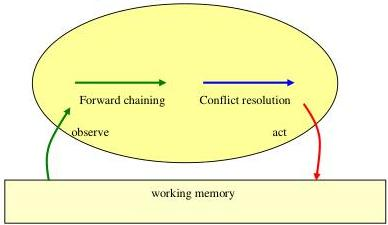

**Status:** diagram. not yet — depicts the reactive agent/production-system cycle interacting with the world, which is outside current LE (the book defers reconciliation with logic to the next chapter).

## Chapter 8 Maintenance Goals as the Driving Force of Life

The whole chapter is built around the observation-thought-decision-action **agent cycle**, **maintenance goals**, **achievement goals**, **prohibitions**, and **integrity constraints**. None of these reactive-agent constructs are part of current LE; the chapter's examples are catalogued below mainly for completeness, with the LE-relevant beliefs (taxonomy, definite clauses) noted where they recur.

### 8.1 The semantics of beliefs

No standalone rule examples; prose distinguishes observation facts, causal beliefs, and taxonomic/hierarchical beliefs (foxes/humans → animals → agents → animates → artefacts → things). These taxonomy and causal-belief notions are exactly what LE supports (`is a`, `Head if Body`), even though the surrounding agent-semantics framing is not.

### 8.2 The semantics of goals

**Example — The fox's hunger maintenance goal.**

**Motivation:** Introduces the maintenance goal as the more fundamental kind of goal, from which the achievement goal "I have the cheese" is derived in response to an observation.

```
if I become hungry, then I have some food and I eat the food.
```

Paraphrased imperatively:

```
if I become hungry, then get some food and eat the food.
```

Triggered by an observation that derives an achievement goal:

```
Observation: I become hungry.
Achievement goal: I have some food and I eat the food.
```

Supporting taxonomy:

```
cheese is a kind of food.
food is a kind of object.
```

**Status:** Complete. The maintenance goal does **not** fit current LE (no maintenance-goal / reactive-cycle construct, and "get some food" is an imperative non-action conclusion). The derived achievement goal with an existential "unknown" ("there exists some instance of food, such that I have the food and I eat the food") maps to LE's existential queries; the taxonomy fits LE directly.

### 8.3 The time factor

**Example — Causal belief and maintenance goal with explicit time.**

**Motivation:** Shows how to add time points to causal beliefs and to the maintenance goal so that temporal order between cause and effect is explicit.

Causal belief with time:

```
an animal has an object at a time
if the animal is near the object at an earlier time
and the animal picks up the object at the earlier time
and nothing terminates the animal having the object between the two times.
```

Maintenance goal with explicit temporal relationships:

```
if I become hungry at a time
then I have some food at a later time
and I eat the food at the later time.
```

Made precise with quantifiers:

```
for every time T1
if I become hungry at time T1
then there exists a time T2 and an object O such that O is food
and I have O at time T2
and I eat O at time T2
and T1 <= T2.
```

**Status:** Complete. **Not yet** in LE: this is event/temporal reasoning ("at a time", "nothing terminates … between the two times") — a form of event/situation calculus that LE does not support, plus a maintenance goal. The universal/existential quantification and the `T1 <= T2` comparison are individually LE-expressible, but the temporal-persistence belief and the maintenance-goal form are not.

### 8.4 Maintenance goals as the driving force of life

Discusses homeostasis and Vickers/Checkland's "appreciative system" as real-world analogues of maintenance goals. Quotes Checkland's appreciative-system description (selectively perceive, make judgements of fact and value, envisage acceptable relationships to maintain, act to balance them). No formal rule examples.

### 8.5 Embedding goals and beliefs in the agent cycle

**Example — The fox and crow, full goal/belief base.**

**Motivation:** Gives the complete maintenance goal and belief set used to trace the fox's reasoning through the agent cycle.

```
Goal: if I become hungry, then I have food and I eat the food.

Beliefs: an animal has an object
         if the animal is near the object
         and the animal picks up the object.

         I am near the cheese
         if the crow has the cheese
         and the crow sings.

         the crow sings if I praise the crow.

         cheese is a kind of food.
         food is a kind of object.
```

**Status:** Complete. The **beliefs** are ordinary definite clauses plus taxonomy and **fit current LE** directly. The **goal** is a maintenance goal and does **not** fit LE.

**Example — Nine iterations of the agent cycle (fox and crow).**

**Motivation:** Traces, cycle by cycle, how observations trigger forward reasoning, backward reasoning reduces goals to actions, and failed actions are retried.

```
1. Observation: I become hungry.
   Forward reasoning, achievement goal: I have food and I eat the food.
2. Backward reasoning, new subgoals: I am near food and I pick up the food and I eat the food.
3. Observation: The crow has cheese.
   Forward reasoning, new belief: I am near the cheese if the crow sings.
4. New subgoals: the crow sings and I pick up the cheese and I eat the cheese.
5. Backward reasoning, new subgoals: I praise the crow and I pick up the cheese and I eat the cheese.
   Action: I praise the crow.
6. Observation: I praise the crow.
   Forward reasoning, remaining subgoals: I pick up the cheese and I eat the cheese.
   Action: I pick up the cheese.
7. Negative observation: I do not pick up the cheese.
   Action: I pick up the cheese.
8. Observation: I pick up the cheese.
   Forward reasoning, remaining subgoal: I eat the cheese.
   Action: I eat the cheese.
9. Observation: I eat the cheese.
```

**Status:** Complete (as a worked trace). Does **not** fit current LE — it is an execution of the reactive agent cycle (interleaved observations, forward/backward reasoning, action selection, action failure and retry), none of which LE models. The underlying clause resolution is what LE's query engine does, but the cyclic agent control is out of scope.

### 8.6 The London underground revisited

**Example — Emergency maintenance goal and belief hierarchy.**

**Motivation:** A second worked instance of the same pattern: recognising an emergency from observations and reducing the goal of getting help to an action.

```
Maintenance goal: if there is an emergency then I get help.

Beliefs: a person gets help if the person alerts the driver.
         a person alerts the driver if the person presses the alarm signal button.
         there is an emergency if there is a fire.
         there is an emergency if one person attacks another.
         there is an emergency if someone becomes suddenly ill.
         there is an emergency if there is an accident.

Additional beliefs: there is a fire if there are flames.
                    there is a fire if there is smoke.
```

Worked trace (the `cause if effect` formulation):

```
Observation: there is smoke.
Forward reasoning, new belief: there is a fire.
Forward reasoning, new belief: there is an emergency.
Forward reasoning, achievement goal: I get help!
Backward reasoning, subgoal: I alert the driver!
Backward reasoning, action: I press the alarm signal button!
```

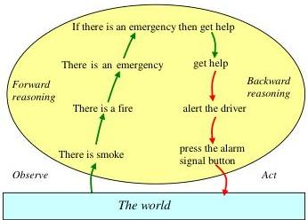

**Status:** Complete. The **beliefs** (definition hierarchy of emergencies, and the `cause if effect` recognition rules) are plain definite clauses and **fit current LE**. The maintenance goal and the cycle-based forward/backward trace do **not**. Note the book itself flags that `there is a fire if there is smoke` is the abduction-avoiding inverse of the natural causal direction, treated properly in Chapter 10.

### 8.7 The semantics of maintenance goals reconsidered

Prose on the truth conditions of conditionals (a conditional is true unless conditions true and conclusion false) and on prevention — making a maintenance goal true by making its conditions false (e.g. preventing the emergency rather than getting help). No new formal examples.

### 8.8 Prohibitions

**Example — Prohibitions as maintenance goals with conclusion `false`.**

**Motivation:** Shows that "don't do X" can be expressed as a maintenance goal whose conclusion is literally `false`, so that the same semantics and inference apply.

```
if you steal then false.
i.e. Do not steal.

if you are drinking alcohol in a bar and are under eighteen then false.
i.e. Do not drink alcohol in a bar if you are under eighteen.

if you are liable to a penalty for performing an action
   and you cannot afford the penalty
   and you perform the action
then false.
i.e. Do not perform an action if you are liable to a penalty for performing
     the action and you cannot afford the penalty.
```

The action-banishing variants triggered by a candidate action:

```
if you are considering stealing, then banish it from your thoughts.
if you are tempted to drink alcohol in a bar and are under eighteen, then don't.
if you are thinking of performing an action and you are liable to a penalty
   for performing the action and you cannot afford the penalty,
   then do not perform the action.
```

**Status:** Complete. Does **not** fit current LE: these are prohibition / integrity constraints (`… then false`) that eliminate candidate actions in the agent cycle. LE has negation-as-failure (`it is not the case that`) but no `then false` integrity-constraint / prohibition mechanism.

### 8.9 Constraints

**Example — Integrity constraints on a family database.**

**Motivation:** Constraints can govern what an agent is willing to *believe* (integrity constraints), rejecting database updates that derive `false`.

```
if X is the mother of Y and X is the father of Z then false.
i.e. No one is both a mother and a father.

if X is an ancestor of X then false.
i.e. No one is their own ancestor.
```

The database, ancestor rules, and rejected update:

```
Update: Enoch father of Adam

Database: Eve mother of Cain
          Eve mother of Abel
          Adam father of Cain
          Adam father of Abel
          Cain father of Enoch
          Enoch father of Irad
          X ancestor of Y if X mother of Y.
          X ancestor of Y if X father of Y.
          X ancestor of Z if X ancestor of Y and Y ancestor of Z.
```

Reasoning that derives `false` from the update:

```
Update: Enoch father of Adam
Forward reasoning: Enoch ancestor of Adam
Forward reasoning: X ancestor of Adam if X ancestor of Enoch
Backward reasoning: X ancestor of Adam if X ancestor of Y and Y ancestor of Enoch
Backward reasoning: X ancestor of Adam if X ancestor of Y and Y father of Enoch
Backward reasoning: X ancestor of Adam if X ancestor of Cain
Backward reasoning: X ancestor of Adam if X father of Cain
Backward reasoning: Adam ancestor of Adam
Forward reasoning: false
```

**Status:** Complete. The **database facts and the recursive `ancestor` rules fit current LE** directly. The **integrity constraints** (`… then false`) and the update-rejection / belief-revision machinery do **not** fit LE.

### 8.10 Summary

Summarises the chapter: forward reasoning with maintenance goals generalises condition-action rules, achievement goals generalise actions, backward reasoning generates plans. References the perception/cognition/action diagram. No new examples.

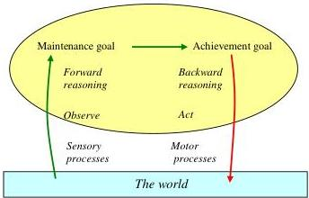

## Chapter 9. The Meaning of Life

### 9.1 (introduction — the wood louse)

**Example — The original "meaningless" louse rules.**

**Motivation:** The starting point: a louse driven by aimless reactive rules that don't keep it alive or reproducing.

```
Goals:
if it's clear ahead, then I move forward.
if there's an obstacle ahead, then I turn right.
if I am tired, then I stop.
```

**Status:** Complete (fragment of a larger design). Does **not** fit current LE — reactive condition-action goals.

**Example — Top-level goals and the designer's beliefs.**

**Motivation:** A "Grand Designer" redesigns the louse top-down, starting from top-level goals and reducing them through beliefs.

```
Top-level goals:
the louse stays alive for as long as possible and
the louse has as many children as possible.

Beliefs:
the louse stays alive for as long as possible,
if whenever it is hungry then it looks for food
and when there is food ahead it eats it,
and whenever it is tired then it rests,
and whenever it is threatened with attack then it defends itself.

the louse has as many children as possible,
if whenever it desires a mate then it looks for a mate and
when there is a mate ahead it tries to make babies.

the louse looks for an object,
if whenever it is clear ahead then it moves forward,
and whenever there is an obstacle ahead and it isn't the object
then it turns right
and when the object is ahead then it stops.

the louse defends itself if it runs away.

Food is an object.
a mate is an object.
```

**Status:** Complete. Does **not** fit current LE: goals contain nested `whenever … then …` (maintenance-goal/temporal) conclusions and superlative goals ("as long as possible", "as many as possible") which are reactive/optimisation constructs. The plain clauses (`the louse defends itself if it runs away`) and taxonomy (`a mate is an object`) would fit LE in isolation.

**Example — Subgoals after backward reasoning.**

**Motivation:** The designer reasons backward from the top-level goals to a lower level of subgoals, then reformulates "whenever/when" as "if" and disambiguates scope.

```
Subgoals (reformulated):
if the louse is hungry then it looks for food, and
if the louse is hungry and there is food ahead then it eats it, and
if the louse is tired then it rests, and
if the louse is threatened with attack then it defends itself, and
if the louse desires a mate then it looks for a mate, and
if the louse desires a mate and there is a mate ahead then it tries to make babies.
```

**Status:** Complete. Does **not** fit current LE — these are reactive maintenance subgoals (`if <condition> then <action>`), not deductive `Head if Body` rules.

**Example — The behaviourist "New Goals" (input-output specification).**

**Motivation:** Further backward reasoning compiles the subgoals into a flat input-output (production-system) specification of the louse's behaviour.

```
New Goals:
if the louse is hungry and it is clear ahead then the louse moves forward.
if the louse is hungry and there is an obstacle ahead and it isn't food then the louse turns right.
if the louse is hungry and there is food ahead then the louse stops and it eats the food.
if the louse is tired then the louse rests.
if the louse is threatened with attack then the louse runs away.
if the louse desires a mate and it is clear ahead then the louse moves forward.
if the louse desires a mate and there is an obstacle ahead and it isn't a mate then the louse turns right.
if the louse desires a mate and there is an obstacle ahead and it is a mate then the louse stops and it tries to make babies.
```

**Status:** Complete. Does **not** fit current LE — forward-chaining production/condition-action rules.

**Example — Conflict-resolved specification.**

**Motivation:** Because the previous rules can fire inconsistently (e.g. eat and turn-right at once), the designer hard-codes priorities (attack highest, resting lowest, mating and eating equal) by adding negative conditions.

```
if the louse is hungry and is not threatened with attack and it is clear ahead
   then the louse moves forward.
if the louse is hungry and is not threatened with attack and there is an obstacle ahead
   and it isn't food and it doesn't desire a mate then the louse turns right.
if the louse is hungry and is not threatened with attack and there is food ahead
   then the louse stops and eats the food.
if the louse is tired and is not threatened with attack and is not hungry
   and does not desire a mate then the louse rests.
if the louse is threatened with attack then the louse runs away.
if the louse desires a mate and is not threatened with attack and it is clear ahead
   then the louse moves forward.
if the louse desires a mate and is not threatened with attack and is not hungry
   and there is an obstacle ahead and it isn't a mate then the louse turns right.
if the louse desires a mate and is not threatened with attack and there is a mate ahead
   then the louse stops and tries to make babies.
if the louse desires a mate and is hungry and is not threatened with attack
   and there is an obstacle ahead and it isn't a mate and it isn't food
   then the louse turns right.
```

**Status:** Complete. Does **not** fit current LE — production rules with conflict-resolution priorities. The negative conditions ("is not threatened with attack") correspond to LE's negation-as-failure, but the rules' role as reactive input-output associations is outside LE.

### 9.2 The mind body problem

Prose on encapsulation: a designer's job ends at a declarative input-output description, and the louse can implement that behaviour with a mindless production system (cf. Rodney Brooks' robots). No formal examples.

### 9.3 Dual process theories of intuitive and deliberative thinking

Prose linking the louse/designer split to Kahneman and Frederick's dual-process theory (intuitive proposes, deliberative monitors/endorses/corrects/overrides) and its computational/logical interpretation. No formal examples.

### 9.4 Two kinds of thinking on the underground

**Example — High-level goal and beliefs (deliberative level).**

**Motivation:** Restates the underground emergency knowledge as the high-level, explicit representation a passenger reasons with.

```
Goal: if there is an emergency then I get help.

Beliefs: a person gets help if the person alerts the driver.
         a person alerts the driver if the person presses the alarm signal button.
         there is an emergency if there is a fire.
         there is an emergency if one person attacks another.
         there is an emergency if someone becomes seriously ill.
         there is an emergency if there is an accident.
         there is a fire if there are flames.
         there is a fire if there is smoke.
```

**Status:** Complete. The **beliefs fit current LE** (definite-clause definition hierarchy). The goal is a maintenance goal and does **not**.

**Example — Low-level compiled input-output associations (intuitive level).**

**Motivation:** The same behaviour, "compiled" into one-step maintenance goals mapping observations straight to the action, illustrating migration from deliberative to intuitive thinking.

```
Goals: if there are flames then I press the alarm signal button.
       if there is smoke then I press the alarm signal button.
       if one person attacks another then I press the alarm signal button.
       if someone becomes seriously ill then I press the alarm signal button.
       if there is an accident then I press the alarm signal button.
```

**Status:** Complete. Does **not** fit current LE — reactive condition-action rules (one-step maintenance goals).

### 9.5 A computational interpretation of intuitive and deliberative thinking

Prose: low-level representations are efficient, high-level ones flexible; compilers transform high to low, decompilers the reverse; rational reconstruction of legacy systems. No formal examples.

### 9.6 The relationship between intuitive and deliberative thinking

Prose analogy between compiling/decompiling programs and the human shift between deliberative and intuitive skill (keyboard, instrument, driving; a linguist formalising a grammar). No formal examples.

### 9.7 Conclusions

Prose: Computational Logic is a wide-spectrum language of thought spanning high-level goals/beliefs and low-level stimulus-response associations; reference to resolution-based reasoning-in-advance (Chapter A5). No formal examples.

## Chapter 10. Abduction

### 10.1 (introduction)

Prose motivation for abduction (non-routine observations demanding explanation), the Sherlock Holmes "reason backward" passage from *A Study in Scarlet*, the distinction between induction (rules) and abduction (facts), and the note that open predicates (no closed-world assumption / negation as failure) are what make an "open mind" possible. This open-predicate framing maps directly onto LE's abduction: unprovable goals over assumable/open templates are assumed and reported as **unknowns**.

**Example — Peirce's beans (deduction / induction / abduction).**

**Motivation:** Peirce's classic illustration contrasting the three inference modes.

```
Deduction: All the beans from this bag are white.
           These beans are from this bag.
           Therefore These beans are white.

Induction: These beans are from this bag.
           These beans are white.
           Therefore All the beans from this bag are white.

Abduction: All the beans from this bag are white.
           These beans are white.
           Therefore These beans are from this bag.
```

Also quotes Holmes (*The Adventure of the Beryl Coronet*): "when you have excluded the impossible, whatever remains, however improbably, must be the truth."

**Status:** Complete (illustrative schema, not runnable rules). Conceptual: the **abduction** case maps to LE's `unknown`/assumable mechanism (assume "these beans are from this bag" to explain "these beans are white"). **Induction** (generating the general rule) is **not** in LE.

### 10.2 The grass is wet

**Example — The classic wet-grass abduction.**

**Motivation:** The canonical AI abduction example: explain "the grass is wet" by reasoning backward over `effect if cause` rules to alternative hypotheses.

```
Beliefs: the grass is wet if it rained.
         the grass is wet if the sprinkler was on.
```

```
Observation: the grass is wet.
Backward reasoning ...
Hypotheses: it rained   /   the sprinkler was on.
```

(`the grass is wet` is a closed predicate; `it rained` and `the sprinkler was on` are open predicates.)

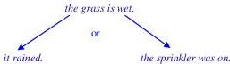

**Status:** Complete. **Fits current LE** abduction: declare `it rained` and `the sprinkler was on` as assumable/open templates; querying `the grass is wet` yields them as **unknowns** (alternative explanations) instead of failing. The book's `effect if cause` clauses are ordinary LE rules.

**Example — Forward reasoning to confirm an explanation (skylight).**

**Motivation:** Extends the example: pursuing consequences of each hypothesis, and preferring the one that explains more independent observations.

```
If it rained last night, then there will be drops of water on the living room skylight.
There are drops of water on the skylight.
So it is likely that it rained last night, because the assumption that it rained
explains two independent observations, compared with the assumption that the
sprinkler was on, which explains only one.
```

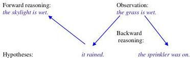

**Status:** Complete (informal). **Partially** fits LE: the underlying clauses and assumptions fit, and LE can report the assumed unknowns; but **selecting the best explanation** by counting how many observations each hypothesis explains goes **beyond** LE's abduction.

### 10.3 The London underground revisited again

**Example — `effect if cause` causal rules requiring abduction.**

**Motivation:** Re-expresses fire/smoke/flames in the natural causal direction `effect if cause`, showing that the observation of smoke now needs abduction (not pure deduction) to reach "there is an emergency".

```
there are flames if there is a fire.
there is smoke if there is a fire.
```

Alternative causes of smoke:

```
there is smoke if there is a fire.
there is smoke if there is teargas.
```

The (Chapter 15) `cause if effect` inverses derived under negation-as-failure:

```
there is a fire if there is smoke and it is not the case that there is teargas.
there is teargas if there is smoke and it is not the case that there is a fire.
```

Classical-logic disjunctive form:

```
there is a fire or there is teargas if there is smoke.
```

**Status:** Complete. The `effect if cause` rules and the negation-as-failure inverses **fit current LE** (`it is not the case that` is LE's NAF). Using them *for abduction* (assume `there is a fire` to explain `there is smoke`) fits LE's `unknown` mechanism; the **disjunctive-conclusion** form (`A or B if C`) is **not** an LE rule head construct.

### 10.4 What counts as a reasonable explanation?

**Example — Relevance vs minimality (wet floor).**

**Motivation:** Distinguishes relevant, minimal, and irrelevant explanations; backward reasoning guarantees relevance for free, while minimality can be infeasible.

```
Beliefs:
the floor is wet if it rained and the window was open.
the floor is wet if it rained and there is a hole in the roof.
there is a hole in the roof.

Observation: the floor is wet.
Relevant explanation: it rained and the window was open.
Minimal explanation: it rained.
Irrelevant explanation: it rained and the dog was barking.
```

**Status:** Complete. The **beliefs and facts fit current LE**, and querying `the floor is wet` with `it rained` / `the window was open` assumable yields the relevant explanation as **unknowns**. The **minimality vs relevance distinction** (subset-checking explanations) goes **beyond** LE.

**Example — Consistency via a constraint (dry vs wet).**

**Motivation:** Shows how consistency is enforced by representing negatives positively (`dry` for `not wet`) and using a constraint that derives `false`, then forward-reasoning from a hypothesis to discard it.

```
if a thing is dry and the thing is wet then false.
i.e. nothing is both dry and wet.
```

```
Beliefs:
the clothes outside are dry.
the clothes outside are wet if it rained.

Hypothesis: it rained
Forward reasoning: the clothes outside are wet
Forward reasoning with the constraint: if the clothes outside are dry then false
Forward reasoning: false
```

**Status:** Complete. **Partially** fits LE: the beliefs/facts are ordinary clauses, but the **integrity constraint** (`… then false`) used to eliminate a candidate explanation is **not** in LE. The idea of representing `not wet` as positive `dry` is just modelling style and is LE-compatible.

### 10.5 Contraries and strong negation

**Example — Constraint schema for contrary predicates.**

**Motivation:** Argues that "strong negation" / contrary pairs (wet/dry, tall/short, good/bad), including truth-value gaps, need no new inference rules — only a constraint per pair.

```
if predicate and contrary-predicate then false.
```

**Status:** Fragment (a schema, not a concrete rule). Does **not** fit current LE: relies on integrity constraints (`… then false`) and contrary/strong-negation with truth-value gaps, none of which LE provides (LE has only negation-as-failure).

### 10.6 What counts as a best explanation?

Prose on selecting among relevant, consistent explanations by weighing probability and the importance of consequences (wet-floor → hole-in-roof vs leaking plumbing; global warming → carbon emissions vs natural processes, citing the IPCC AR4 ">90% likely" figure; car-won't-start → electrical vs fuel vs mechanical, checking the lights to test the battery hypothesis). The informal arguments ("the more observations a hypothesis explains, the more likely it is") are reasoning *about* explanations.

**Status:** No transcribable rules. Conceptually **beyond LE**: decision-theoretic selection of a *best* explanation by probability and utility/consequences is exactly the kind of probabilistic/utility reasoning LE does not support.

### 10.7 Conclusions

Prose: abduction (assumptions over open predicates) and default reasoning (assuming the contrary cannot be shown) both augment beliefs with defeasible assumptions (Poole, Goebel and Aleliunas, 1987); choosing the best explanation parallels choosing among courses of action. No formal examples. The "assumptions over open predicates" characterisation is precisely what LE's `unknown`/assumable templates implement, so this conclusion aligns with LE; the probability/utility selection criteria do not.

## Chapter 11. The Prisoner's Dilemma

**Motivation:** Introduces the classical Prisoner's Dilemma as a decision-theoretic problem represented by a decision table (rows = actions, columns = states of the world, cells = outcomes). Frames the chapter's exploration of choosing actions under uncertainty.

The decision table for the prisoner's dilemma:

```
| Action          | John turns witness     | John refuses           |
| I turn witness  | I get 3 years in jail  | I get 0 years in jail  |
| I refuse        | I get 6 years in jail  | I get 1 year in jail   |
```

**Status:** (a) complete; (b) **not yet** — the table itself can be transcribed as facts/beliefs (see below), but the decision-theoretic framing (choosing the action that minimises expected jail time / maximises expected utility) is not expressible in LE.

### 11.1 The logic of the prisoner's dilemma

**Example 1 — Goals and beliefs for the prisoner's dilemma**

**Motivation:** Kowalski's "natural representation" of the dilemma in terms of an agent's maintenance goal (respond to a request) plus beliefs describing the outcomes of each combination of choices.

```
Goal: if an agent requests me to perform an action,
      then I respond to the request to perform the action.

Beliefs:
I respond to a request to perform an action if I perform the action.
I respond to a request to perform an action if I refuse to perform the action.

I get 3 years in jail if I turn witness and john turns witness.
I get 0 years in jail if I turn witness and john refuses to turn witness.
I get 6 years in jail if I refuse to turn witness and john turns witness.
I get 1 year in jail if I refuse to turn witness and john refuses to turn witness.
```

**Status:** (a) complete; (b) **partially**. The four "I get N years..." beliefs are ordinary conditional rules that **fit current LE** (head-if-body with `and`). The "Goal" (a maintenance/reactive agent-cycle goal triggered by an observation) and the forward-/backward-reasoning agent cycle around it are **not yet** in LE.

**Example 2 — Forward/backward reasoning trace (agent cycle)**

**Motivation:** Shows how the maintenance goal is triggered by an observation and how candidate actions and their consequences are derived by forward and backward reasoning.

```
Observation: the police request me to turn witness
Forward reasoning, achievement goal: I respond to the request to turn witness

Backward reasoning, one candidate action: I turn witness
Forward reasoning, consequences:
   I get 3 years in jail if john turns witness
   I get 0 years in jail if john refuses to turn witness

Backward reasoning, another candidate action: I refuse to turn witness
Forward reasoning, consequences:
   I get 6 years in jail if john turns witness
   I get 1 years in jail if john refuses to turn witness
```

**Status:** (a) complete; (b) **not yet** — this is an agent-cycle / forward-and-backward-reasoning trace (observations, achievement goals, candidate actions), none of which is part of current LE.

**Example 3 — Disjunctive constraints and probabilistic conditions**

**Motivation:** Contrasts a classical-logic treatment using disjunctive constraints/consequences against a decision-theoretic treatment that attaches probabilities to conditions of beliefs.

```
Candidate action: I turn witness
Disjunctive constraint: john turns witness or john refuses to turn witness
Disjunctive consequence: I get 3 years in jail or I get 0 years in jail.

Candidate action: I refuse to turn witness
Disjunctive constraint: john turns witness or john refuses to turn witness
Disjunctive consequence: I get 6 years in jail or I get 1 years in jail.
```

Probabilities attached to conditions:

```
john turns witness with probability 10%
john refuses to turn witness with probability 90%

if I turn witness
and john turns witness with probability 10%
then I get 3 years in jail with probability 10%.
```

**Status:** (a) complete; (b) **not yet** — `or` in heads/consequences (disjunctive conclusions) and probability annotations on conditions are decision-theoretic constructs not in LE. (LE supports `or` in rule bodies but not disjunctive consequences nor probabilities.)

### 11.2 Should you carry an umbrella?

**Example 4 — The umbrella decision table and goals/beliefs**

**Motivation:** A "mundane" warm-up decision problem to show that the goals-and-beliefs representation is more informative than a decision table because it makes explicit the conditions an outcome depends on.

Decision table:

```
| Action                       | It rains    | It doesn't rain |
| I take an umbrella           | I stay dry  | I stay dry      |
|                              | I carry an umbrella | I carry an umbrella |
| I leave without an umbrella  | I get wet   | I stay dry      |
```

Goals and beliefs:

```
Goal: if I go outside, then I take an umbrella or I leave without an umbrella.

Beliefs:
I go outside.
I carry an umbrella if I take the umbrella.
I stay dry if I take the umbrella.
I stay dry if it doesn't rain.
I get wet if I leave without an umbrella and it rains.
```

**Status:** (a) complete; (b) **partially**. The five Beliefs are plain conditional rules/facts that **fit current LE** (including negation in `if it doesn't rain`). The Goal with a disjunctive conclusion (`I take an umbrella or I leave without an umbrella`) is a reactive maintenance goal with disjunctive consequence — **not yet** in LE.

### 11.3 Applying decision theory to taking an umbrella

**Example 5 — Expected-utility computation for the umbrella**

**Motivation:** Demonstrates the decision-theoretic formula for expected utility, instantiated with concrete candy-bar utilities and a rain probability P, deriving the break-even threshold P = .1.

```
the expected utility of an action is p1·u1 + p2·u2 + ... + pn·un
if the action has n alternative outcomes with associated
utilities u1, u2, ..., un and respective probabilities p1, p2, ..., pn.

Utilities and probabilities:
the benefit of staying dry is worth 2 candy bars,
the cost of carrying an umbrella is worth -1 candy bar,
the cost of getting wet is worth -9 candy bars,
the probability that it will rain is P, and therefore
the probability that it will not rain is (1 - P).

Break-even:  -10P + 2 = 1   i.e.  P = .1
```

**Status:** (a) complete; (b) **not yet** — decision-theoretic utilities, probabilities and expected-utility arithmetic are outside current LE.

**Example 6 — Compiled umbrella heuristics (goals and beliefs)**

**Motivation:** Shows how the normative decision-theoretic ideal is approximated in Real Life by compiling decisions into reactive goals plus supporting beliefs, including a fully generalised "take the thing" rule.

```
Goals:
if I go outside and it looks likely to rain, then I take an umbrella.
if I go outside and it looks unlikely to rain, then I leave without an umbrella.

Beliefs:
It looks likely to rain if there are dark clouds in the sky.
It looks likely to rain if it is forecast to rain.
It looks unlikely to rain if there are no clouds in the sky.
It looks unlikely to rain if it is forecast not to rain.
```

Generalised version:

```
if I am leaving a place and I have a thing at the place
   and the thing would be useful while I am away from the place
   and the value of the thing outweighs the trouble of taking the thing,
then I take the thing with me.
if I am leaving a place and I have a thing at the place
   and the thing would be useful while I am away from the place
   and the trouble of taking the thing outweighs the value of the thing,
then I leave the thing at the place.
the value of an umbrella outweighs the trouble of taking the umbrella
   if it looks likely to rain.
the trouble of taking an umbrella outweighs the value of the umbrella
   if it looks unlikely to rain.
```

**Status:** (a) complete; (b) **partially**. The Beliefs (`It looks likely to rain if ...`) and the two `... outweighs ...` rules are conditional rules that **fit current LE** (with universal quantification over `thing`/`place`). The Goals (`if I go outside ... then I take an umbrella`) are reactive condition-action/maintenance goals — **not yet** in LE.

### 11.4 Solving the prisoner's dilemma

**Example 7 — General cause-and-effect pattern**

**Motivation:** Identifies the shared pattern underlying both the prisoner's dilemma and the umbrella problem, illustrated with further instances.

```
a particular outcome happens if I do a certain action and the world is in a particular state.

I will be rich if I buy a lottery ticket and my number is chosen.
I will be famous if I write a book and it receives critical acclaim.
It will rain tomorrow if I do a rain dance and the gods are pleased.
```

**Status:** (a) complete; (b) **fits current LE** — these are ordinary conditional rules (head-if-body with `and`).

**Example 8 — Expected-utility analysis of the prisoner's dilemma (three utility regimes)**

**Motivation:** Works the dilemma through three judgements of utility — purely selfish, fully altruistic (equal weight to John), and half-weight to John — deriving the conclusions "always turn witness", "never turn witness", and the tit-for-tat threshold P = .50.

Selfish utilities:

```
the utility of your getting N years in jail be -N.
the probability that John turns witness be P.
therefore the probability that John refuses to turn witness is (1 - P).

I turn witness:  expected utility = -3P
I refuse:        expected utility = -6P - (1-P) = -5P - 1
=> -3P > -5P - 1 for all P, so always turn witness.
```

Equal-weight utilities:

```
I turn witness:  -6P - 6(1-P) = -6
I refuse:        -6P - 2(1-P) = -4P - 2
=> -6 >= -4P - 2 for all P, so never turn witness.
```

Half-weight utilities:

```
I turn witness:  -4.5P - 3(1-P) = -1.5P - 3
I refuse:        -6P - 1.5(1-P) = -4.5P - 1.5
break-even: -1.5P - 3 = -4.5P - 1.5  i.e.  3P = 1.5  i.e.  P = .50
=> turn witness iff probability John turns witness > 50%. Tit for tat.
```

**Status:** (a) complete; (b) **not yet** — expected-utility/probability arithmetic over a decision table is outside current LE.

**Example 9 — Compiled prisoner's-dilemma goals (harm heuristic)**

**Motivation:** Shows the decision-theoretic analysis compiled into simple reactive rules that refuse harmful actions.

```
Goals:
if an agent requests me to perform an action,
and the action does not harm another person
then I perform the action.

if an agent requests me to perform an action,
and the action harms another person
then I refuse to perform the action.
```

**Status:** (a) complete; (b) **not yet** — reactive maintenance/condition-action goals triggered by a request; not in current LE (though the body conditions, including negation `does not harm`, are LE-expressible).

### 11.5 Smart choices

**Motivation:** A prose checklist (after Hammond, Keeney & Raiffa's *Smart Choices*) of guidelines for stepping back to higher-level goals when making decisions. No formal sentences/rules to transcribe.

No transcribable examples.

### 11.6 Conclusions

**Motivation:** Compares decision theory, heuristics and Smart Choices as three ways of making decisions, restating the general cause-and-effect pattern. No new formal examples (the pattern `a particular outcome happens if I do a certain action and the world is in a particular state` is repeated from Example 7).

No new transcribable examples.

## Chapter 12. Motivations matter

**Motivation:** Opening contrasts how actions are evaluated across paradigms (production systems, decision theory, classical planning, Computational Logic), summarised in a table; sets up the chapter's concern with motivations as well as consequences.

Evaluation-of-actions table:

```
| Evaluation of actions | production systems | decision theory | classical planning | Computational Logic |
| Motivations           | No                 | No              | Yes                | Yes                 |
| Consequences          | No                 | Yes             | No                 | Yes                 |
```

**Status:** (a) complete (as a summary table); (b) **not yet** — it is a meta-comparison of reasoning paradigms, not domain knowledge expressible as LE rules.

### 12.1 Moral considerations

**Motivation:** Prose discussion of the principle of double effect (an action with bad consequences may be acceptable if motivated by a good end and the bad consequences are not a means), contrasted with consequentialism/utilitarianism and its role in law (murder vs. manslaughter). Conceptual, no formal sentences.

No transcribable examples.

#### The runaway trolley

**Motivation:** States the two famous trolley-problem variants (Passenger / Footbridge) and the experimental result (85% vs. 12% judging the action permissible), explained by the principle of double effect. Presented as prose scenarios, not formal rules.

No transcribable rules (the variants are narrative problem statements; their logical encoding follows in the next section).

### 12.2 The logic of the runaway trolley

**Example 1 — Beliefs for the trolley problem**

**Motivation:** A specialised logical representation of the runaway-trolley domain: definitions of being killed, being saved, killing, danger, stopping/diverting a train, etc.

```
Beliefs:

a person is killed if the person is in danger of being killed by a train
   and no one saves the person from being killed by the train.

an agent kills a person
   if the agent throws the person in front of a train.

a person is in danger of being killed by a train
   if the person is on a railtrack
   and a train is speeding along the railtrack
   and the person is unable to escape from the railtrack.

an agent saves a person from being killed by a train
   if the agent stops the train or the agent diverts the train.

an agent stops a train
   if the agent places a heavy object in front of the train.

an agent places a heavy object in front of the train
   if the heavy object is next to the agent
   and the train is on a railtrack
   and the agent is within throwing distance of the object to the railtrack
   and the agent throws the object in front of the train.

an agent diverts a train
   if there is a sidetrack ahead of the train
   and an agent is on the train
   and the agent pushes the sidetrack button.

a train is speeding along a sidetrack
   if the train is speeding along a track
   and there is a sidetrack ahead of the train
   and an agent pushes the sidetrack button.
```

**Status:** (a) complete; (b) **fits current LE** — these are ordinary conditional rules using `and`, `or` (in `stops ... or ... diverts`), negation-as-failure (`no one saves`), universal quantification and templates. (Kowalski notes a "more precise formulation" would use the event calculus to say pushing the button *terminates*/*initiates* the train's track-state — that temporal version would be **not yet** in LE.)

**Example 2 — The current situation (facts/scenario)**

**Motivation:** The concrete scenario instantiating the trolley problem with five people on the maintrack, one on the sidetrack, Mary on the train, John as a heavy object next to Bob, etc.

```
The current situation:
five people are on the maintrack.
one person is on the sidetrack.
a train is speeding along the maintrack.
the sidetrack is ahead of the train.
the five people are unable to escape from the maintrack.
the one person is unable to escape from the sidetrack.

mary is on the train.
john is next to bob.
john is a heavy object.
bob is within throwing distance of john to the maintrack.
```

**Status:** (a) complete; (b) **fits current LE** — these are facts/a scenario.

**Example 3 — The trolley maintenance goal and response beliefs**

**Motivation:** The motivating maintenance goal (respond to a person being in danger) plus beliefs defining "respond" as either ignoring the danger or saving the person, and the resulting forward/backward reasoning trace.

```
Goal: if a person is in danger of being killed by a train
      then you respond to the danger of the person being killed by the train.

Beliefs:
you respond to the danger of a person being killed by the train
   if you ignore the danger.
you respond to the danger of a person being killed by the train
   if you save the person from being killed by the train.
```

Reasoning trace:

```
Forward reasoning: five people are in danger of being killed by the train
Achievement goal: you respond to the danger of the five people being killed by the train
Alternative subgoal: you ignore the danger
Alternative subgoal: you save the five people from being killed by the train.
```

**Status:** (a) complete; (b) **partially**. The two "you respond ... if ..." beliefs are conditional rules that **fit current LE**. The Goal is a reactive maintenance goal triggered by an observation, and the forward/backward reasoning trace is part of the agent cycle — **not yet** in LE.

**Example 4 — Moral constraint against killing (integrity constraint)**

**Motivation:** A simple moral constraint ("thou shalt not kill" qualified) that lets Bob rule out throwing John, expressed as a conditional with conclusion `false`.

```
if an agent kills a person
and the person is not threatening another person's life
then false.
```

**Status:** (a) complete; (b) **not yet** — this is an integrity constraint/prohibition (conclusion `false`), which is outside current LE.

### 12.3 The computational case for moral constraints

**Example 5 — Refined definitions of "kills" and the compiled constraint**

**Motivation:** Argues that "kills" defined via general causality is computationally intractable and proposes the simpler one-step `initiates` definition, then compiles it into the constraint.

```
an agent kills a person
if the agent performs an action and the action causes the person's death.

an agent kills a person
if the agent performs an action and the action initiates the person's death.

Compiled constraint:
if an agent performs an action
and the action initiates a person's death
and the person is not threatening another person's life
then false.
```

**Status:** (a) complete; (b) **not yet** — relies on event-calculus `initiates`/causality temporal primitives and on a `then false` integrity constraint, neither in current LE.

### 12.4 What to do about violations?

**Example 6 — Chisholm's paradox in ALP / integrity-constraint terms**

**Motivation:** Reformulates Chisholm's paradox of "contrary-to-duty" obligations using achievement goals and integrity constraints, illustrating that deontic obligations/prohibitions become maintenance goals and constraints in ALP.

Informal statement:

```
It ought to be that Jones goes to assist his neighbors.
It ought to be that if Jones goes, then he tells them he is coming.
If Jones doesn't go, then he ought not tell them he is coming.
Jones doesn't go.

Paradoxical conclusions:
Jones ought to tell them he is coming.
Jones ought not tell them he is coming.
```

ALP representation:

```
Goals:
jones goes.
if jones goes then jones tells.
if jones stays and jones tells then false.
if jones stays and jones goes then false.

Belief:
jones stays.
```

A possible repair adds an exception condition:

```
if a person needs help and jones can help
and jones is not irresponsible then jones goes.
if jones stays and jones is irresponsible then false.
```

**Status:** (a) complete; (b) **not yet** — deontic `ought` operators, achievement goals, and integrity constraints (`then false`) are all outside current LE. (The repair's exception-via-extra-condition technique — `jones is not irresponsible`, negation-as-failure — is itself LE-expressible, but only within the surrounding constraint machinery that is not.)

### 12.5 Conclusions

**Motivation:** Summarises that valuing other agents' interests underlies moral intuition, that double-effect distinctions go beyond consequentialism, and that constraints help when time/knowledge are limited. Prose only.

No transcribable examples.

## Chapter 13. The Changing World

**Motivation:** Introduces change as actions/events transforming one static world-state into the next, formalised in modal logic's possible-world semantics; includes an opening diagram of state transitions.

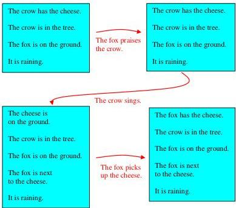

**Example 1 — Modal-logic truth condition for "in the future"**

**Motivation:** Shows how a modal temporal operator is given truth conditions relative to a possible world reachable by state-transforming events.

```
A sentence of the form in the future P is true
in a possible world W in a collection of worlds C
if there is possible world W' in C
   that can be reached from W by a sequence of state-transforming events
   and the sentence P is true in W'.

In the future the crow has the cheese.
```

**Status:** (a) complete; (b) **not yet** — modal operators (`in the future`) and possible-world quantification are temporal/modal primitives outside current LE.

### 13.1 The situation calculus

**Example 2 — Situation-calculus sentences and axioms (fox and crow)**

**Motivation:** Reifies actions and states as individuals so facts can be asserted relative to states; gives the two core situation-calculus axioms (effect axiom and frame axiom) and the `initiates`/`terminates`/`is possible` definitions for the fox-and-crow story.

State-relative sentences:

```
the crow has the cheese in the state at the beginning of the story.    (true)
the crow has the cheese in the state
   after the fox picks up the cheese,
   after the crow sings,
   after the fox praises the crow,
   after the state at the beginning of the story.                       (false)
```

Situation-calculus axioms:

```
a fact holds in the state after an action,
   if the action initiates the fact
   and the action is possible in the state just before the action.

a fact holds in a state after an action,
   if the fact held in the state just before the action
   and the action is possible in the state just before the action
   and the action does not terminate the fact.
```

initiates / terminates / is possible definitions:

```
an action in which an animal picks up an object
   initiates a fact that the animal has the object.
an action in which an animal picks up an object
   is possible in a state in which the animal is near the object.

an action in which I praise the crow
   initiates a fact that the crow sings.
an action in which I praise the crow
   is possible in any state.

an action in which the crow sings
   initiates a fact that I am near the cheese.
an action in which the crow sings
   terminates a fact that the crow has the cheese.
an action in which the crow sings
   is possible in any state.
```

**Status:** (a) complete; (b) **not yet** — situation-calculus temporal primitives (`holds in the state after`, `initiates`, `terminates`, `is possible in a state`) and the frame axiom (the frame problem) are not in current LE.

### 13.2 An event-oriented approach to change

**Motivation:** Motivates abandoning the global situation-calculus view for a local event-oriented view in which events occur instantaneously and independently in different parts of the world. Includes diagrams of an atomic state initiated/terminated by events, and of the fox-and-crow timeline.

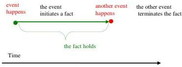

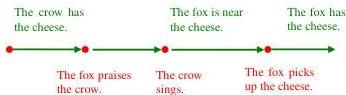

**Example 3 — Crow-singing as a timed cause-and-effect rule**

**Motivation:** Recasts the crow's singing as a timed event caused by praise, instancing the general action/state pattern with an open ("assumable") condition.

```
the crow sings at time T
   if I praise the crow at time T
   and the crow reacts to the praise between times T and T'.
```

**Status:** (a) complete; (b) **partially** — a timed conditional rule; arithmetic/temporal comparison (`between times T and T'`) is LE-expressible and `the crow reacts to the praise` is an open/assumable predicate (LE `unknown`/assumable), but the surrounding event-calculus framing of events-at-times is **not yet** in LE.

### 13.3 A simplified calculus of events

**Example 4 — Event calculus axiom and constraint**

**Motivation:** States the core event-calculus axiom (a fact holds at a time if an initiating event happened earlier with no intervening terminating event) and the executability constraint (events must be possible when they happen).

```
Axiom: a fact holds at a time,
   if an event happens at an earlier time
   and the event initiates the fact
   and there is no other event that happens between the two times
       and that terminates the fact.

Constraint: if an event happens at a time
   and the event is not possible at the time
   then false.

Equivalently: if an event happens at a time
   then the event is possible at the time.
```

**Status:** (a) complete; (b) **not yet** — event-calculus primitives (`holds at a time`, `initiates`, `terminates`, `happens at a time`, `possible at the time`) plus the `then false` constraint are outside current LE.

### 13.4 The event calculus for predicting consequences of events

**Example 5 — Event narrative and backward-reasoning trace (crow has cheese?)**

**Motivation:** Gives a timed event narrative for the fox-and-crow story and traces backward reasoning with the event-calculus axiom to conclude (via negation-as-failure) that the crow does not have the cheese at time 9.

Event narrative:

```
the fox praises the crow at time 3.
the crow sings at time 5.
the fox picks up the cheese at time 8.
the crow picks up the cheese at time 0.
```

Reasoning trace:

```
Initial goal: the crow has the cheese at time 9

Subgoals: an event happens at time T and T < 9 and
   the event initiates the fact that the crow has the cheese and
   there is no other event that happens between T and 9 and
   the other event terminates the fact that the crow has the cheese.

Subgoals: the crow picks up the cheese at time T and T < 9 and
   there is no other event that happens between T and 9 and
   the other event terminates the fact that the crow has the cheese.

Subgoals: there is no other event that happens between 0 and 9 and
   the other event terminates the fact that the crow has the cheese.

Naf: an event happens at time T' and T' is between 0 and 9 and
   the event terminates the fact that the crow has the cheese.

Subgoals: the crow sings at time T' and T' is between 0 and 9
Subgoals: 5 is between 0 and 9
Success: yes!
Failure: no!
```

**Status:** (a) complete; (b) **partially** — the four timed event facts are LE-expressible facts; but the reasoning trace depends on event-calculus axioms and the closed-world / negation-as-failure machinery over `initiates`/`terminates`, which is **not yet** in LE.

### 13.5 The event calculus and the frame problem

**Example 6 — Specialised rain axiom and trace**

**Motivation:** Shows the event calculus localising change: a specialised "it is raining" axiom whose solution length is independent of the number of intervening events, contrasting with the situation-calculus frame problem.

initiation/termination plus specialised axiom:

```
an event in which it starts raining initiates a fact that it is raining.
an event in which it stops raining terminates a fact that it is raining.

it is raining at a time,
   if it starts raining at an earlier time
   and it does not stop raining between the two times.
```

Reasoning trace (with event `it starts raining at time -1`):

```
Initial goal: it is raining at time 9.
Subgoals: it starts raining at time T and T < 9 and
          it does not stop raining between T and 9.
Subgoals: it does not stop raining between -1 and 9.
Naf: it stops raining at time T' and T' is between -1 and 9.  Failure: no!
Success: yes!
```

**Status:** (a) complete; (b) **partially** — the specialised `it is raining ...` rule with negation (`it does not stop raining between ...`) and temporal comparison is close to LE-expressible, but it relies on event-calculus event/time primitives that are **not yet** in LE.

### 13.6 The event calculus for plan generation

**Example 7 — Plan-generation trace and compiled axioms (fox wants cheese)**

**Motivation:** Uses the event-calculus axiom plus the executability constraint to generate a plan for the fox to have the cheese, then shows compiled/specialised forms of the axiom.

Plan-generation trace and possibility definition:

```
Initial goal: the fox has the cheese at time T

Subgoals: an event happens at time T' and T' < T and
   the event initiates the fact that the fox has the cheese and
   there is no other event that happens between T' and T and
   the other event terminates the fact that the fox has the cheese.

Subgoals: the fox picks up the cheese at time T' and T' < T and
   there is no other event that happens between T' and T and
   the other event terminates the fact that the fox has the cheese.

Further goal: the fox picks up the cheese is possible at time T.

an animal picks up an object is possible at a time
   if the animal is near the object at the time

Subgoal: the fox is near the cheese at time T.
```

Compiled / specialised axioms:

```
Compiled axiom: a fact holds at a time,
   if an event happens at an earlier time
   and the event initiates the fact
   and the event is possible at the earlier time
   and there is no other event that happens between the two times
       and that terminates the fact.

an animal has an object at a time,
   if the animal picks up the object at an earlier time
   and the animal is near the object at the earlier time
   and there is no other event
       that happens between the two times and
       the event terminates the fact that the animal has the object.
```

**Status:** (a) complete; (b) **not yet** — plan generation by abduction over event-calculus axioms plus executability constraints (`is possible at a time`, `initiates`/`terminates`, `happens`) is outside current LE.

### 13.7 Partially ordered time

**Example 8 — Naming and ordering partially ordered time points**

**Motivation:** Shows that event-calculus time need not be linear: events can be named symbolically and ordered by an explicit (transitive) before-relation. Includes a diagram of partially ordered events (with a wolf).

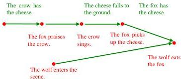

```
the crow picks up the cheese at time_crow-pickup
the fox praises the crow at time_praise
the crow sings at time_sing
the fox picks up the cheese at time_fox-pickup
the wolf enters the scene at time_enter
the wolf eats the fox at time_eat

time_crow-pickup < time_praise < time_sing < time_fox-pickup < time_eat
time_enter < time_eat
T1 < T3 if T1 < T2 and T2 < T3
```

**Status:** (a) complete; (b) **partially** — the transitivity rule `T1 < T3 if T1 < T2 and T2 < T3` and the ordering facts are essentially LE-expressible (comparisons, universal quantification), but the symbolic event-at-time vocabulary belongs to the event calculus, which is **not yet** in LE.

### 13.8 Keeping track of time

**Example 9 — Timestamped agent cycle and deadline reasoning (fox)**

**Motivation:** Argues an internal clock is needed both to order and to measure durations so the agent cycle can meet deadlines; gives normative timed rules for eating before collapse and running before being caught, then their heuristic "rules of thumb" approximations.

Augmented agent cycle:

```
repeatedly (or concurrently):
   observe the world, record any observations together with the time of their observation,
   think, decide what actions to perform, choosing only actions that have not exceeded their deadline,
   and act.
```

Normative timed goals:

```
if I am hungry at time T_hungry
and I will collapse at a later time T_collapse if I don't eat
then I have food at a time T_food
and I eat the food at the time T_food
and T_food is between T_hungry and T_collapse.

if the hunters attack me at time T_attack
and they will catch me at a later time T_catch if I don't run away
then I run away from the hunters at a time T_run
and T_run is between T_attack and T_catch.
```

Heuristic rules of thumb:

```
if I am hungry at time T_hungry
then I have food at a time T_food
and I eat the food at the time T_food
and T_food is as soon as possible after T_hungry.

if someone attacks me at time T_attack
then I run away from the attackers at a time T_run
and T_run is immediately after T_attack.
```

Combined goals (hungry and attacked at time 0):

```
I have food at a time T_food
I eat the food at the time T_food
I run away from the hunters at a time T_run
and T_run is immediately after time 0.
and T_food is as soon as possible after 0.
```

**Status:** (a) complete; (b) **not yet** — these are reactive, timed maintenance/agent-cycle goals with deadline scheduling (`is between`, `as soon as possible after`, `immediately after`) and an explicit agent cycle; deadline-driven reactive goals and the agent cycle are not in current LE.

### 13.9 Historical background and additional reading

**Motivation:** Bibliographic notes crediting the event calculus (Kowalski & Sergot 1986), the situation calculus (McCarthy & Hayes 1969), temporal event storage, and works on the frame problem and commonsense reasoning. No formal examples.

No transcribable examples.

## Chapter 14. Logic and Objects

This chapter contrasts Computational Logic with Object-Orientation (OO), behaviourism, message-passing, and semantic networks. The "examples" are mostly OO/behaviourist reformulations of the fox-and-crow story, used to illustrate paradigms that are **largely outside current LE**.

### 14.1 (Chapter intro) Extreme Behaviourism: the fox and the crow as input-output objects

**Motivation:** Kowalski opens by imagining the fox, crow, and cheese as indistinguishable "objects" characterised solely by input-output behaviour, parodying Extreme Behaviourism (the precursor to OO).

```
if the fox sees the crow and the crow has food in its mouth,
then the fox praises the crow.

if the fox praises the crow,
then the crow sings.

if the crow has food in its mouth and the crow sings,
then the food falls to the ground.

if food is next to the fox,
then the fox picks up the food.
```

**Status:** (a) complete. (b) fits current LE — these are plain `Head if Body.` conditionals with `and`. (The behaviourist *interpretation* is extra-logical, but the rules themselves are ordinary LE.)

### 14.2 Objects as individuals

**Motivation:** Illustrates how OO "turns the relationship between an agent and the world outside in," so observations become messages received and actions become messages sent.

The two diagrams contrast the conventional logic view of agent-and-world with the OO inside-out view.

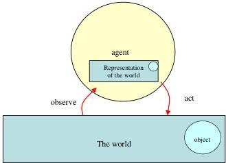

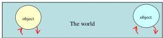

**Status:** Diagrams only, no rules. The OO agent/message reframing is **not in current LE** (no message-passing / reactive agent-cycle primitives).

### 14.3 Encapsulation

**Motivation:** Explains that an object hides its local state (attribute values) and its methods from other objects. Prose only; no transcribable rules.

**Status:** No example. Encapsulation as a construct is **not in LE**.

### 14.4 Methods

**Motivation:** Even when OO methods are coded procedurally, their specifications take the declarative form of condition-action rules; the fox-and-crow story is recast as message send/receive rules.

```
if an object receives a message of the form S from object O
then the object sends a message of the form R to object P.

if the fox receives a message that the crow has food in its mouth,
then the fox sends a message of praise to the crow.

if the crow receives a message of praise from the fox,
then the crow sends a message of song.

if the crow has food in its mouth
and the food receives a message of song from the crow
then the food sends a message of falling to the ground.

if the food sends a message that it is next to the fox,
then the fox sends a message that she picks up the cheese.
```

**Status:** (a) complete. (b) **not yet** — although the surface syntax is `Head if Body.`, the content (objects *receiving* and *sending* *messages*) is OO message-passing, which LE has no primitives for. Could be transcribed as opaque relations but loses its intended reactive semantics.

### 14.5 Classes

**Motivation:** OO creates new objects by instantiating general classes, with methods/attributes inherited through a taxonomic hierarchy (foxes ⊂ animals ⊂ animate beings ⊂ material objects ⊂ things). Prose only.

**Status:** No transcribable rules. The is-a class hierarchy maps **partially** to LE's taxonomy/ontology (is-a), but method/attribute inheritance and encapsulation do **not**.

### 14.6 Reconciling logic and objects

**Motivation:** Proposes implementing OO methods in Computational Logic by pairing maintenance goals (reacting to incoming messages) with beliefs (reducing goals to subgoals including outgoing messages).

```
Goal:    if I receive message of form S from object O then G.

Beliefs: G if conditions and I send message of form R to object P.
```

**Status:** (a) fragment (schematic). (b) **not yet** — relies on maintenance goals / reactive agent-cycle rules and message actions, none of which are in LE.

### 14.7 Message-passing or shared environment?

**Motivation:** Compares communicating-agents vs. shared-environment approaches to multi-agent systems and how CL combines them via connection-graph subgraphs. Prose only.

**Status:** No example. Connection graphs / multi-agent message channels are **not in LE**.

### 14.8 Semantic networks as a variant of object-orientation

**Motivation:** Presents semantic networks — webs of nodes (individuals) and arcs (binary relations) — as an object-oriented way of storing all facts about an individual around its node. Several networks depict the fox-and-crow initial state, reified events, and class hierarchies.

Initial-state semantic network for the fox-and-crow story:

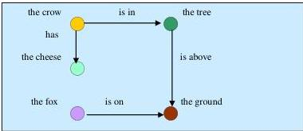

Semantic network representing dynamic information by reifying events:

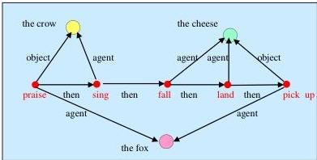

Semantic network representing a hierarchy of classes:

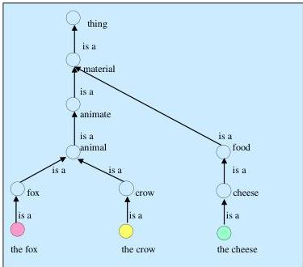

A semantic-network connection is just a graphical atomic sentence "one thing is related to another thing":

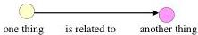

**Status:** (a) complete (as diagrams). (b) **partially** — the underlying content is sets of atomic sentences (facts), which LE fully supports, and the class-hierarchy network maps to LE taxonomy/ontology. The graphical/object-oriented *structuring* itself is not an LE construct.

### 14.9 Object-oriented structuring of natural language

**Motivation:** Shows that the same atomic sentences can be grouped by different objects to aid comprehension; OO structuring applies to natural language as well as to networks.

Grouping the start of the fox-and-crow story by object (first grouping):

```
The crow:  The crow has the cheese.
           The crow is in the tree.
The tree:  The tree is above the ground.
The fox:   The fox is on the ground.
```

Re-grouping the same sentences by different objects (second grouping):

```
The cheese: The crow has the cheese.
The tree:   The crow is in the tree.
The ground: The tree is above the ground.
            The fox is on the ground.
```

The prime-minister pair (Brown and Yule, 1983) illustrating topic vs. active/passive voice:

```
The prime minister stepped off the plane.
Journalists immediately surrounded her.
```

```
The prime minister stepped off the plane.
She was immediately surrounded by journalists.
```

Sentences ordered by temporal sequence and structured by agent (active voice):

```
The fox praised the crow.
The crow sang a song.
The cheese fell to the ground.
The fox picked up the cheese.
```

**Status:** (a) complete. (b) **fits current LE** as facts — the individual atomic sentences are exactly LE facts. The point being illustrated (presentation order / topic structuring) is a stylistic concern; LE permits any ordering of facts, so the grouping is a documentation device rather than a language construct.

### 14.10 Conclusions

**Motivation:** Argues for moderate OO (encapsulated, modular, inherited knowledge) and against extreme OO; concludes that logic represents knowledge while OO structures its representation. Prose only, no transcribable rules.

**Status:** No example.

## Chapter 15. Biconditionals

This chapter develops the *completion semantics*: conditionals read as biconditionals "in disguise," used as equivalences for default reasoning, abduction-as-deduction, and the cause/effect relationship. Most examples go **beyond LE's negation-as-failure** because they require object-language biconditionals (`if and only if`), integrity constraints (`if … then false`), and explicit reasoning with `true`/`false`.

### 15.1 (Chapter intro) Conditional as biconditional in disguise

**Motivation:** Introduces the contrast between meta-logical and completion semantics of `only if`, using the party example, and gives the general propositional and non-propositional biconditional forms.

The party example and its `only if` reading:

```
mary will go if john will go.
mary will go only if john will go.
```

General forms (propositional):

```
conclusion if and only if conditions.
conclusion if and only if conditions or ... or conditions.
conclusion if and only if true.            (a fact)
atomic predicate if and only if false.     (no defining conditional)
   equivalently: it is not the case that atomic predicate.
Constraint: if atomic predicate then false.
```

Non-propositional case (complete information about who will go):

```
mary will go if john will go.
john will go if bob will not go.

a person will go
if and only if the person is identical to mary and john will go
or the person is identical to john and bob will not go.
```

**Status:** (a) complete. (b) **not yet** — biconditionals-as-equivalences (`if and only if`), the constraint form `if … then false`, and `is identical to` equality are not LE constructs. The plain conditionals (`mary will go if john will go.`) do fit LE.

### 15.2 Reasoning with biconditionals used as equivalences

**Motivation:** Demonstrates an object-level proof procedure that replaces atoms by their defining conditions (Fung and Kowalski, 1997), behaving like backward reasoning / negation-as-failure, including a non-terminating loop case.

Bob away (succeeds):

```
mary will go if and only if john will go.
john will go if and only if it is not the case that bob will go.
bob will go if and only if false.

Initial goal:       mary will go.
Equivalent subgoal: john will go.
Equivalent subgoal: it is not the case that bob will go.
Equivalent subgoal: it is not the case that false.
Equivalent subgoal: true.
```

Bob changes his mind (fails):

```
mary will go if and only if john will go.
john will go if and only if it is not the case that bob will go.
bob will go if and only if true.

Initial goal:       mary will go.
Equivalent subgoal: john will go.
Equivalent subgoal: it is not the case that bob will go.
Equivalent subgoal: it is not the case that true.
Equivalent subgoal: false.
```

Mutually-referential loop (neither provable nor refutable):

```
mary will go if and only john will go.
john will go if and only if mary will go.

Initial goal:       it is not the case that mary will go.
Equivalent subgoal: it is not the case that john will go.
Equivalent subgoal: it is not the case that mary will go.
Equivalent subgoal: it is not the case that john will go.
Ad infinitum.
```

**Status:** (a) complete. (b) **not yet** — uses biconditionals as equivalences and explicit `true`/`false` simplification. LE's negation-as-failure (`it is not the case that`) covers the intent of the first two cases but not the biconditional machinery or the deliberate infinite-loop analysis.

### 15.3 Using biconditionals to simulate auto-epistemic failure

**Motivation:** Recasts "innocent unless proven guilty" with biconditionals and a closed-world constraint, showing the derivation is defeasible (withdrawn when a witness appears) and simulates the auto-epistemic character of negation-as-failure.

Beliefs:

```
a person is innocent of a crime
if and only if the person is accused of the crime
and it is not the case that the person committed the crime.

a person committed an act
if and only if another person witnessed the person commit the act.

bob is accused of robbing the bank if and only if true.

a person witnessed bob commit robbing the bank if and only if false.
   or
if a person witnessed bob commit robbing the bank then false.
```

Derivation (bob innocent) and its defeat when adding `john witnessed bob commit robbing the bank if and only if true.`:

```
Initial goal:       bob is innocent of robbing the bank.
Equivalent subgoal: bob is accused of robbing the bank and it is not the case
                    that bob committed robbing the bank.
Equivalent subgoal: it is not the case that bob committed robbing the bank.
Equivalent subgoal: it is not the case that another person witnessed bob commit
                    robbing the bank.
Equivalent subgoal: it is not the case that false.   (becomes ... true. -> solved;
                                                      with witness -> false.)
```

**Status:** (a) complete. (b) **partially** — the underlying rule "a person is innocent ... if accused and it is not the case that committed" fits LE (negation-as-failure, `unless`-style default). The biconditional/closed-world-constraint formalisation and `if … then false` constraints are **not yet** in LE.

### 15.4 Abduction or deduction?

**Motivation:** Shows biconditionals let observations be explained by deduction rather than abduction: the wet-grass example, then forward reasoning with a contrariety constraint (wet vs. dry clothes) to eliminate the rain hypothesis.

Wet grass:

```
Belief: the grass is wet if and only if it rained or the sprinkler was on.
Observation and initial goal: the grass is wet.
Equivalent subgoal: it rained or the sprinkler was on.
```

Eliminating the rain hypothesis via a contrariety constraint:

```
Beliefs: the grass is wet if and only if it rained or the sprinkler was on.
         the clothes outside are wet if and only if it rained.
         the clothes outside are dry if and only if true.
Constraint: if the clothes outside are dry and the clothes outside are wet then false.

Observation and initial goal: the grass is wet.
By backward reasoning:  it rained or the sprinkler was on.
By forward reasoning:   (it rained and the clothes outside are wet) or the sprinkler was on.
By forward reasoning:   (it rained and the clothes outside are wet
                         and (if the clothes outside are dry then false)) or the sprinkler was on.
By backward reasoning:  (it rained and the clothes outside are wet and false)
                         or the sprinkler was on.
Equivalently:           false or the sprinkler was on.
Equivalently:           the sprinkler was on.
```

**Status:** (a) complete. (b) **partially** — LE supports abduction via `unknown`/assumable, which covers the wet-grass case at the abductive level. The biconditional-deduction reformulation, disjunction in the object language as a subgoal, integrity constraints (`then false`), and mixed forward/backward rewriting are **not yet** in LE.

### 15.5 Deriving cause if effect from effect if cause

**Motivation:** Explains why a conditional is easily confused with its converse, and relates the natural `effect if cause` representation to the efficient `cause if effect` one, using the smoke/fire/teargas example.

```
there is smoke if there is a fire.
there is smoke if there is teargas.

there is smoke if and only if there is a fire or there is teargas.
there is a fire or there is teargas if there is smoke.

there is a fire with 99.9% probability if there is smoke.
there is teargas with .1% probability if there is smoke.

there is a fire if there is smoke
and it is not the case that there is teargas.
```

**Status:** (a) complete. (b) **partially** — the plain `effect if cause` rules and the default `cause if effect` rule with negation-as-failure fit LE. The biconditional, the disjunctive-conclusion conditional, and the probabilistic-weight conditionals are **not yet** in LE.

### 15.6 Truth versus proof in arithmetic

**Motivation:** Relates the two interpretations of negation-as-failure to truth-vs-proof in arithmetic, defining addition/multiplication by conditionals over successor representation and noting Gödel incompleteness.

Definitions of addition and multiplication (successor representation, `X + 1` after `X`):

```
0 + Y = Y.
(X + 1) + Y = (Z + 1) if X + Y = Z.
0 × X = 0.
(X + 1) × Y = V if X × Y = U and U + Y = V.
```

Backward-reasoning computation of 1 × 3:

```
Initial goal: (0 + 1) × (((0 + 1) + 1) + 1) = V
Subgoals:     0 × (((0 + 1) + 1) + 1) = U  and  U + (((0 + 1) + 1) + 1) = V
Subgoal:      0 + (((0 + 1) + 1) + 1) = V
Succeeds with: V = (((0 + 1) + 1) + 1),  i.e. V = 3.

Commutativity:  X × Y = Y × X
```

**Status:** (a) complete. (b) **not yet** — these are Prolog-style recursive definitions over a successor term representation with unification-based `=`. LE has arithmetic/comparisons over actual numbers but not function-symbol term construction, successor encoding, or definitions of `+`/`×` by clauses.

### 15.7 Conclusions

**Motivation:** Summarises the two ways to understand conditionals — as minimal-model semantic structures (fundamental, defines truth) vs. as biconditionals in disguise (the standard, sound-but-incomplete proof method). Prose only.

**Status:** No example.

## Chapter 16 Computational Logic and the Selection Task

This chapter analyses the Wason selection task using the agent cycle, distinguishing the conditional read as a *belief* vs. as a *goal*, and explaining modus ponens, affirmation of the consequent, modus tollens, and denial of the antecedent. The examples rely heavily on **integrity constraints (`if … then false`)**, the **goal/belief distinction**, and **forward/backward compilation**, which are **not in current LE**.

### 16.1 (Chapter intro) The two equations

**Motivation:** Restates the book's framing equations relating algorithms, knowledge, reasoning, and natural-language understanding.

```
specialised algorithm = specialised knowledge + general-purpose reasoning.
natural language understanding = translation into logical form + logical reasoning.
```

**Status:** (a) complete (as slogans). (b) n/a — these are conceptual equations, not LE rules.

### 16.2 An abstract form of the selection task

**Motivation:** Frames the task abstractly as an agent told `if P then Q` ought to be true but might be false, and lists the four classical inference patterns and which ones people actually perform.

```
if P then Q.

From an observation of P    deduce Q.       (modus ponens)
From an observation of not Q deduce not P.  (modus tollens)
From an observation of Q     deduce P.       (affirmation of the consequent)
From an observation of not P deduce not Q.   (denial of the antecedent)
```

**Status:** (a) complete (schematic). (b) **partially** — `if P then Q` is plain LE; modus ponens is ordinary forward reasoning. The goal/belief interpretation distinction and the analysis of the other three patterns rely on constructs not in LE.

### 16.3 A more accurate representation of the selection task

**Motivation:** Refines the abstract conditional into a value/property form and introduces the single-value integrity constraints (and `is identical to` equality) needed to derive negative conclusions from positive observations.

```
if X has value u for property p then X has value v for property q.

if a card X has letter d on the letter side then the card X has number 3 on the number side.
if a person X is drinking alcohol in a bar then the person X has age at least eighteen years old.

if X has value V for property q and X has value W for property q then W is identical to V.
X is identical to X.

if a card X has number N on the number side and the card X has number M on the number side
then N is identical to M.

if a person X has age at least eighteen years old and the person X has age under eighteen years old
then false.
```

**Status:** (a) complete. (b) **partially** — the conditional rules themselves fit LE. The single-value/uniqueness integrity constraints, the contrariety constraint `… then false`, and the `is identical to` definition are **not yet** in LE.

### 16.4 The conditional interpreted as a belief.

**Motivation:** Analyses each inference pattern when `if P then Q` is a belief whose validity is in doubt, working the card version in detail (modus ponens, affirmation of the consequent, the hard modus tollens via an integrity constraint, denial of the antecedent).

Modus tollens derivation (card version):

```
Belief:       if a card X has letter d on the letter side then the card X has number 3 on the number side.
Observation:  the fourth card has number 7 on the number side.

Needed:       it is not the case that the fourth card has number 3 on the number side.

Constraint:   if a card X has number N on the number side and the card X has number M on the number side
              then N is identical to M.

Forward (constraint):  if the fourth card has number M on the number side then 7 is identical to M.
Backward (belief):     if the fourth card has letter d on the letter side then 7 is identical to 3.

Alternative constraint form:
  if a card X has number N on the number side and the card X has number M on the number side
  and N is not identical to M then false.
  => if the fourth card has letter d on the letter side then false.
  i.e. it is not the case that the fourth card has letter d on the letter side.
```

The general reasoning pattern:

```
- Reason forwards to match an observation with a condition of a goal.
- Reason backwards to verify the other conditions.
- Reason forwards to derive the conclusion.
- Reason backwards to solve the conclusion.
```

The derivation viewed as activating links in a connection graph of constraint and beliefs:

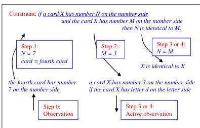

**Status:** (a) complete. (b) **not yet** — depends on integrity constraints (`then false`), mixed forward/backward reasoning, connection-graph link activation, and the belief/doubt agent-cycle framing, none of which are LE constructs.

### 16.5 The conditional interpreted as a goal.

**Motivation:** Argues modus tollens is easier when the conditional is a social constraint/maintenance goal: integrity-checking optimisation "compiles" the goal in advance, illustrated with the bar and emergency examples.

Bar and underground social constraints:

```
if a person is drinking alcohol in a bar, then the person is at least eighteen years old.
if a passenger is carrying a rucksack on his or her back,
then the passenger is wearing a label with the letter A on his or her front.
```

Compiling emergency maintenance goal into event-condition form:

```
if there is an emergency then get help

if there are flames then get help.
if there is smoke then get help.
if one person attacks another then get help.
if someone becomes seriously ill then get help.
if there is an accident then get help.
```

Compiling goal + constraint into a denial (schematic and bar version):

```
Conditional goal: if P then Q.
Constraint:       if Q and Q' then false.
Compiled goal:    if P and Q' then false.
   equivalently:  it is not the case that P and Q'.

Conditional goal: if a person X is drinking alcohol in a bar then the person X has age at least eighteen years old.
Constraint:       if a person X has age at least eighteen years old and the person X has age under eighteen years old then false.
Compiled goal:    if a person X is drinking alcohol in a bar and the person X has age under eighteen years old then false.
   equivalently:  it is not the case that a person X is drinking alcohol in a bar and the person X has age under eighteen years old.
```

**Status:** (a) complete. (b) **partially** — the surface conditionals (bar age rule, emergency rules) fit LE. The goal/maintenance-goal interpretation, integrity constraints (`then false`), and advance "compilation" (forward-chaining optimisation) are **not yet** in LE.

### 16.6 Security measures reconsidered

**Motivation:** Returns to the London-underground rucksack/label example to show that no clean contrary `Q'` exists, so modus tollens must instead compile the conditional into an `if P and not Q then false` denial.

```
if a passenger is carrying a rucksack on his or her back,
then the passenger is wearing a label with the letter A on his or her front.

if a person X has a letter L on the front
and the person X has a letter M on the front
then L is identical to M.

if a person is a passenger on the underground
and the person is carrying a rucksack on his or her back,
and the person is not wearing a label with the letter A on his or her front
then false.

Given an integrity constraint of the form  if P then Q or R
derive the integrity constraint        if P and not Q then R   (here R is false)
```

**Status:** (a) complete. (b) **not yet** — depends on integrity constraints (`then false`), the disjunctive-conclusion rewrite rule, and the negation-rewriting inference rule, which LE does not have.

### 16.7 Conclusions

**Motivation:** Concludes that CL in the agent cycle meets the selection-task challenge, explaining both correct and seemingly incorrect human responses, but that the inference rules need further elaboration. Prose only.

**Status:** No example.

## Chapter 17. Meta-logic

This chapter uses Computational Logic *as its own meta-logic* to reason about belief, simulate other agents, and solve the wise-men puzzle. Some of it maps to LE's `says`/`that` meta-templates, but the **full object/meta mixing, ambivalent syntax, and self-reference do not**.

### 17.1 (Chapter intro) Meta-beliefs about belief

**Motivation:** Introduces meta-logic with foundational meta-beliefs naming object-language sentences `P`, `(P if Q)`, `Q`, `(P and Q)`, plus rules for disjunction and negative observation, to be reused later (notably for the wise-man puzzle).

```
meta1: an agent believes P if the agent believes (P if Q) and the agent believes Q.

meta2: an agent believes (P and Q) if the agent believes P and the agent believes Q.

meta3: an agent believes P if the agent believes (P or Q) and the agent believes (not Q).

meta4: an agent believes (not Q) if the agent observes whether Q and not (Q holds).
```

**Status:** (a) complete. (b) **partially** — LE's `says`/`that` meta-templates express "an agent believes that ⟨sentence⟩," so the surface form is reachable. But naming compound object sentences `(P if Q)`, `(P or Q)`, `(not Q)` as *terms* and reasoning over them (ambivalent syntax, meta-interpreter behaviour) is **not yet** in LE.

### 17.2 The semantics of belief

**Motivation:** Contrasts the modal-logic (possible-worlds) semantics of `believes` with the meta-logical (language-of-thought) semantics, arguing meta1/meta2 are literally false for real agents ("can-be-shown-in-theory"). Prose only.

**Status:** No transcribable rules.

### 17.3 How to make a good impression

**Motivation:** Shows mixed object/meta reasoning: Mary is impressed if she *believes* you are well-bred, and she believes a general rule about well-bredness, so meta1–meta2 plus meta5 (instantiating a universally-quantified belief) derive what makes her impressed.

```
mary is impressed with a person
if mary believes the person is well-bred.

mary believes everyone who speaks the queen's english and has a noble character is well-bred.

(more precisely:)
mary believes ((a person is well-bred if the person speaks the queen's english
and the person has a noble character) holds for all persons).

meta5: an agent believes (S holds for a person) if the agent believes (S holds for all persons).

(derived conclusion:)
mary is impressed with a person
if mary believes the person speaks the queen's english
and mary believes the person has a noble character.
```

The connection graph of the relevant beliefs, and its simplification by activating links:

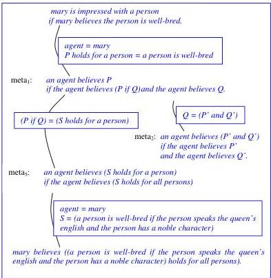

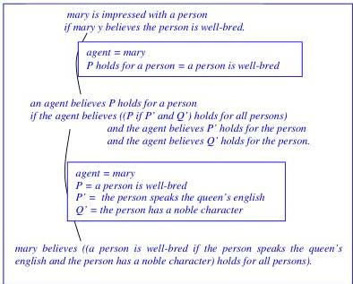

**Status:** (a) complete. (b) **partially** — "mary believes that ⟨the person is well-bred⟩" maps to LE `says/that` meta-templates. But the rule mixes an object-level conclusion with a meta-level condition, names a whole conditional `(... holds for all persons)` as a term, and uses connection-graph resolution — full object/meta mixing that is **not yet** in LE.

### 17.4 How to satisfy the Secretary of State

**Motivation:** Reuses meta1, meta2, meta5 to bridge the gap (left over from the citizenship chapter) between "the secretary of state is satisfied that ..." in `sec1` and the conclusion of `sec2`, by reading "is satisfied that" as "believes."

```
sec1: the secretary of state may grant a certificate of naturalisation to a person by section 6.1
if the person applies for naturalisation
and the person is of full age and capacity
and the secretary of state is satisfied that
   the person fulfils the requirements of schedule 1 for naturalisation by 6.1
and the secretary of state thinks fit
   to grant the person a certificate of naturalisation.

sec2: a person fulfils the requirements of schedule 1 for naturalisation by 6.1
if the person fulfils the residency requirements of subparagraph 1.1.2
and the person is of good character
and the person has sufficient knowledge of english, welsh, or scottish gaelic
and the person has sufficient knowledge about life in the uk
and the person intends to make his principal home in the uk
   in the event of being granted naturalisation.
```

Connection graph (similar structure to the "impressing Mary" graph), and the simplified result with the previously-missing link:

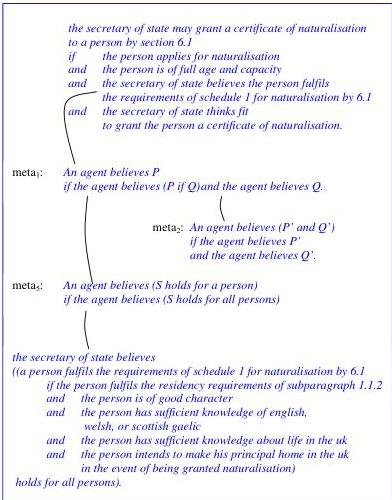

```
the secretary of state may grant a certificate of naturalisation
to a person by section 6.1
if the person applies for naturalisation
and the person is of full age and capacity
and the secretary of state believes the person fulfils
   the requirements of schedule 1 for naturalisation by 6.1
and the secretary of state thinks fit
   to grant the person a certificate of naturalisation.

the secretary of state believes a person fulfils
   the requirements of schedule 1 for naturalisation by 6.1
if the secretary of state believes that
   the person fulfils the residency requirements of subparagraph 1.1.2
and the secretary of state believes that the person is of good character
and the secretary of state believes that
   the person has sufficient knowledge of english, welsh, or scottish gaelic
and the secretary of state believes that
   the person has sufficient knowledge about life in the uk
and the secretary of state believes that
   the person intends to make his principal home in the uk
   in the event of being granted naturalisation.
```

**Status:** (a) complete. (b) **partially** — `sec1`/`sec2` as plain conditionals fit LE well (this is the citizenship domain). The "secretary of state is satisfied that / believes that ⟨...⟩" condition maps to LE `says`/`that` meta-templates, but distributing `believes` over each conjunct of a named compound belief (via meta2) and the connection-graph compilation are **not yet** in LE.

### 17.5 A more flexible way to satisfy the Secretary of State

**Motivation:** Generalises meta1/meta2 to carry *strengths of belief*, so strong belief in one condition can compensate for weak belief in another — drawing an analogy to neural-network thresholds and weighted sums.

```
meta1': an agent believes P if the agent believes (P if Q)
        and the agent believes Q with strength S and S > t.

meta2': an agent believes (P and Q) with strength S
        if the agent believes P with strength S_P
        and the agent believes Q with strength S_Q and S_P + S_Q = S.
```

**Status:** (a) complete. (b) **not yet** — combines meta-belief over named compound sentences with explicit numeric strength/threshold arithmetic (a decision-theoretic / weighted flavour). The arithmetic comparisons alone fit LE, but the meta-belief framing does not.

### 17.6 The two wise men

**Motivation:** The chapter's showcase: wise man two uses meta-level reasoning (meta3, meta4, plus puzzle-specific clauses) to deduce that he has mud on his face from wise man one's "I don't know," reframing knowing/seeing as believing.

Puzzle statement:

```
There are two wise men. Both of them have mud on their face. Each can see the mud on the other
wise man's face, but not the mud on his own. The Queen tells them both that at least one of them
has mud on his face. After a short while, the first wise man announces that he does not know
whether he has mud on his face. The second wise man, who knows how to do meta-level reasoning,
after a short pause, declares that he knows that he has mud on his face.
```

Step-1 connection graph (in terms of belief):

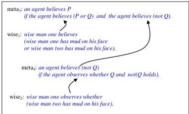

Step-1 forward-reasoning specialisations and result:

```
meta3': wise man one believes wise man one has mud on his face
        if wise man one believes (not wise man two has mud on his face).

meta4': wise man one believes (not wise man two has mud on his face)
        if not wise man two has mud on his face.

result of step 1: wise man one believes wise man one has mud on his face
                  if not wise man two has mud on his face.
```

Step 2:

```
wise0: if wise man one believes wise man one has mud on his face then false.

result of step 1: wise man one believes wise man one has mud on his face
                  if not wise man two has mud on his face.

result of step 2: if not wise man two has mud on his face then false.

conclusion: wise man two has mud on his face.
```

Presented as an instance of the general agent-cycle pattern:

```
wise.1 (wise.-1): wise man one asserts I do not know whether (wise man one has mud on his face).

wise.2: if wise man one asserts I do not know whether P and wise man one believes P then false.

Observation, wise.1: wise man one asserts I do not know whether (wise man one has mud on his face).
Forward reasoning with wise.2:
   wise0: if wise man one believes wise man one has mud on his face then false.
Backward reasoning with meta3:
   if ((wise man one believes wise man one has mud on his face) or Q)
   and wise man one believes (not Q) then false.
Backward reasoning with wise1:
   if wise man one believes (not wise man two has mud on his face) then false.
Backward reasoning with meta4:
   if wise man one observes whether wise man two has mud on his face
   and not wise man two has mud on his face then false.
Backward reasoning with wise2:
   if not wise man two has mud on his face then false.
Or equivalently:
   wise man two has mud on his face.
```

**Status:** (a) complete. (b) **not yet** — requires belief over named object sentences (`(not Q)`, `(P or Q)`), integrity constraints (`then false`), the totality/negation-rewriting rules, mixed forward/backward reasoning, and object/meta mixing. Well beyond current LE.

### 17.7 Combining object-language and meta-language

**Motivation:** Admits the chapter's examples mix object- and meta-language (ambivalent syntax) for expressiveness, then discusses self-reference, the liar paradox, harmless self-reference, and Gödel's self-referential sentence.

```
mary is impressed with a person
if mary believes the person is well-bred.

This sentence: This sentence is false.
This sentence: This sentence contains 37 characters.
this sentence cannot be proved.
```

**Status:** (a) complete (illustrative snippets). (b) **not yet** — object/meta mixing with ambivalent syntax and especially self-referential / named sentences are not in LE. (The first sentence partly maps to `says`/`that`, as in the impression example.)

### 17.8 Conclusions and further reading

**Motivation:** Summarises that combining object- and meta-logic is a powerful tool (meta-interpreters in Computing; reflection and simulation in human thinking) and underlies Gödel's theorem. Prose and citations only.

**Status:** No example.

## Conclusions

The book's closing section reviews the unified logic-based theory of human intelligence and its relationship to other paradigms. It is reflective prose with no new transcribable rules; the agents, goals, and stories referenced (crow/cheese, prisoner's dilemma, rucksack/train, runaway trolley) are recapped, not re-specified.

### (intro)

**Motivation:** States the overall case for a comprehensive logic-based theory reconciling production systems, logic programming, classical logic, and decision theory. Prose only.

**Status:** No example.

### Unification of competing paradigms

**Motivation:** Describes how the observe-think-decide-act agent cycle, abductive logic programming, open predicates, and decision theory combine into the agent model. Prose only.

**Status:** No example. (References maintenance goals, the agent cycle, abduction, decision-theoretic utilities — mostly **not in LE**, except abduction via `unknown`/assumable.)

### Relationships with other paradigms

**Motivation:** Notes support for the agent model from moderate object-orientation, legal rule-based reasoning, case-based reasoning, and inductive logic programming. Prose only.

**Status:** No example.

### Conflict resolution

**Motivation:** Discusses conflict resolution within and between agents (crow eating vs. singing; prisoner's dilemma; rucksack vs. passengers; runaway trolley), utilitarianism and its limits, and resolving conflict by reconciling beliefs higher in the goal hierarchy. Prose only; the scenarios are recapped narratively, not as rules.

**Status:** No example. Decision-theoretic utilities, conflict resolution, and constraints/prohibitions referenced here are **not in current LE**.

## Chapter A1. The Syntax of Logical Form

**Motivation:** The chapter formalizes the "pre-LE" language used in the book: atoms, predicates, terms, conditionals, clauses, goals and negation. Most of its small examples are exactly the clause forms that later became LE.

### A1.1 Atoms

**Motivation:** Illustrates the same informal English sentence rendered at increasing levels of symbolic precision, showing how LE's "the driver stops the train" hides an underlying relational/event representation.

```
the driver stops the train

stop(driver, train)

happens(stop, driver, train)

happens-stop-driver-train

happens(event-0014)
type(event-0014, stop)
agent(event-0014, 007)
object(event-0014, the-flying-scotsman)
isa(007, train-driver)
isa(the-flying-scotsman, train)
```

**Status:** fragment (illustrative prose snippets). The simple atom `stop(driver, train)` and the event/isa fact set fit current LE as templates + facts (e.g. `the driver stops the train`, taxonomy via `is a`); the reification `happens(stop, driver, train)` (predicate-as-term) is not yet directly in LE surface language.

### A1.2 Predicate symbols

**Motivation:** Distinguishes propositions / properties / relations, and notes that compound predicates need not have their own predicate symbol.

```
tall(X) and handsome(X)
```

**Status:** fragment. Fits LE: a compound condition `the person is tall and the person is handsome` is expressible directly.

### A1.3 Terms

**Motivation:** Introduces constants, variables (Prolog convention: upper-case = variable), function symbols, and the policy of representing functions as relations and naming numbers with the successor function.

```
X + Y = Y + X

mother(X)        +(2, 3)

mother(cain) = eve
+(2, 3) = 5

mother(cain, eve)
+(2, 3, 5)

0, s(0), s(s(0)), ...        % natural numbers via successor s

+(s(s(0)), s(s(s(0))), s(s(s(s(s(0))))))   % 2 + 3 = 5
```

**Status:** fragment. Partially fits LE: LE has arithmetic/comparisons natively (`X is Y + Z`), but Skolem/successor function terms and function-symbol nesting (`s(s(0))`, `mother(X)` as a term) are not yet LE surface language.

### A1.4 Conditionals

**Motivation:** Defines the core clause form (definite clauses, the general conditional with negative conditions) and shows how variable sharing — or its absence — changes meaning, motivating universal quantification.

```
C_1 ∧ ... ∧ C_n ∧ ¬D_1 ∧ ... ∧ ¬D_m → E
i.e. if C_1 and ... and C_n and not D_1 and ... and not D_m then E

E ← C_1 ∧ ... ∧ C_n ∧ ¬D_1 ∧ ... ∧ ¬D_m
i.e. E if C_1 and ... and C_n and not D_1 and ... and not D_m

amazing(X) ← can-fly(X)            % anything that can fly is amazing

amazing(X) ← can-fly(Y)            % if something can fly then everything is amazing!

∀X (amazing(X) ← can-fly(X))
∀X ∀Y (amazing(X) ← can-fly(Y))

likes(bob, X).                    % fact with universal variable

amazing(X) ← can-fly(X) ∧ animal(X)
animal(X) ← person(X)

if an animal can fly then the animal is amazing.
any animal that can fly is amazing.

amazing(X) ← can-fly(X) ∧ isa(X, animal).
isa(X, animal) ← isa(X, person).
```

**Status:** complete (self-contained clauses). Fits current LE: these are exactly `Head if Body.` definite clauses with universal quantification, `and`, `not`, and sorted/typed conditions expressible through common-noun templates or `is a` taxonomy. The bare quantifier notation (`∀X`, `∃X`) is not surface LE, but LE omits quantifiers the same way the book does.

### A1.5 Recursive definitions

**Motivation:** Shows that conditionals give full programming power via recursion, using the natural numbers and addition.

```
natural-number(0).
natural-number(s(X)) ← natural-number(X).

+(0, Y, Y).
+(s(X), Y, s(Z)) ← +(X, Y, Z).

0 + Y = Y.                        % functional form
s(X) + Y = s(X + Y).
```

**Status:** complete. Partially fits LE: recursive rules fit LE directly (`Head if Body.`), but the data representation via the successor function symbol `s(...)` is not LE surface syntax — LE would use its native numbers/arithmetic.

### A1.6 Goal clauses

**Motivation:** Distinguishes beliefs (universally quantified conditionals) from goals (existentially quantified conjunctions); introduces Horn clauses and goal clauses as the "computation to be performed."

```
∃X_1 ... ∃X_m (C_1 ∧ ... ∧ C_n ∧ ¬D_1 ∧ ... ∧ ¬D_m)
i.e. there exists X_1 ... and there exists X_m such that
     C_1 and ... and C_n and not D_1 and ... and not D_m.

likes(bob, X)          stands for     ∃X likes(bob, X)

+(s(s(0)), s(s(0)), X) ∧ +(X, Y, s(s(s(s(0)))))
```

**Status:** fragment / complete (the last line is a complete goal). Fits LE: existentially-quantified goal clauses are LE queries. The successor-term arithmetic goal is partially expressible (LE has native arithmetic but not `s(...)` terms).

### A1.7 Other kinds of sentences

**Motivation:** Shows that conditionals are equivalent to richer classical-logic sentences, and that disjunctions / existentials in conclusions are useful for maintenance goals.

```
∀X ∀Y (amazing(X) ← can-fly(Y))
is equivalent to:
∀X (amazing(X) ← ∃Y can-fly(Y))

amazing(X) ← can-fly(X).
amazing(X) ← movie-star(X).
are equivalent to:
amazing(X) ← (can-fly(X) ∨ movie-star(X)).

generous-to(X, Z) ← likes(X, Y) ∧ gives(X, Y, Z)
is equivalent to:
(generous-to(X, Z) ← likes(X, Y)) ← gives(X, Y, Z)

C_1 ∨ ... ∨ C_n
i.e. C_1 or ... or C_n

Maintenance goals:
hungry(me) → ∃X eat(me, X).
attacks(X, me) → runaway(me) ∨ attacks(me, X).

hungry(me) → eat(me, X).     % existential X left implicit in conclusion
```

**Status:** fragment. Partially fits LE: bodies with `or` and rules with disjunctive/`or` conditions fit LE (`amazing(X) ← can-fly(X) ∨ movie-star(X)`); but disjunctions and existential variables in the *conclusion* of a conditional (maintenance goals like `attacks(X,me) → runaway(me) ∨ attacks(me,X)`) are not yet LE surface language.

### A1.8 Negation

**Motivation:** Argues positive sentences are more basic; introduces negation-as-failure and constraints (conclusion `false`).

```
liable-to-penalty(X) ← press-alarm(X) ∧ not emergency.
can-fly(X) ← bird(X) ∧ not penguin(X).

% given bird(john) and no reason to believe penguin(john):
can-fly(john)                       % by negation as failure

even(0).
even(s(s(X))) ← even(X).
odd(X) ← not even(X).
% since even(s(0)) cannot be shown:  odd(s(0))

liable-to-penalty(X) → false        % "Do not be liable to a penalty."

even(X) ∧ odd(X) → false            % "Nothing is both odd and even."
```

**Status:** complete (clause sets) / fragment (constraints). Fits LE partially: the negation-as-failure rules (`can-fly(X) ← bird(X) ∧ not penguin(X)`) fit LE directly (`not`/`unless`). The even/odd program fits LE except for the `s(...)` successor data. Integrity constraints with conclusion `false` (`liable-to-penalty(X) → false`) are not yet LE surface language.

### A1.9 Functions, relations and equality

**Motivation:** Explains the relational treatment of functions, equality-as-identity with unique names, and the heavier axioms needed for conventional equality.

```
f(X, Y_1) ∧ f(X, Y_2) → Y_1 = Y_2     % "f is a function" constraint

X = X.                                 % equality as identity

stops(007, the train)
first-name(007, bob)
first-name(007, robert)
first-name(008, bob)

the morning star = the evening star
doctor jekyll = mister hyde

X = X
f(X_1, ..., X_n) = f(Y_1, ..., Y_n) ← X_1 = Y_1 ∧ ... ∧ X_n = Y_n
p(X_1, ..., X_n) ← p(Y_1, ..., Y_n) ∧ X_1 = Y_1 ∧ ... ∧ X_n = Y_n

good(doctor jekyll) ∧ bad(mister hyde).
```

**Status:** fragment. Partially fits LE: facts (`first-name(007, bob)`) and equality comparisons fit; the functionality constraint (`→ Y_1 = Y_2`) and general equality axiom schemas are inference-engine / integrity-constraint machinery, not yet LE surface language.

### A1.10 Classical Logic

**Motivation:** Shows that the same beliefs have many logically-equivalent classical forms, motivating the simpler conditional form, and lists the rewrite rules used to translate classical logic into conditionals.

```
can-fly(X) ← bird(X).
bird(john).

¬(∃X ((¬can-fly(X) ∧ bird(X)) ∨ ¬bird(john)))
¬(∃X ((¬can-fly(X) ∨ ¬bird(john)) ∧ (bird(X) ∨ ¬bird(john))))

replace ¬∃X¬A by ∀X A
replace ¬A ∨ ¬B by ¬(A ∧ B)
replace A ∨ ¬B by A ← B
```

**Status:** fragment. The clausal pair (`can-fly(X) ← bird(X).` / `bird(john).`) fits LE; the full classical quantifier forms and the rewrite (translation) rules are inference-engine internals / classical-logic machinery, not LE surface language.

### A1.11 The relationship among classical logic, clausal logic and Computational Logic

**Motivation:** Shows the general clausal form, Skolemisation, and how achievement and maintenance goals are solved by reductio ad absurdum (deriving `false`).

```
C_1 ∧ ... ∧ C_n → D_1 ∨ ... ∨ D_m

¬C_1 ∨ ... ∨ ¬C_n ∨ D_1 ∨ ... ∨ D_m         % clausal form

∀X ∃Y (mother(X, Y) ← person(X))
  translates to:  mother(X, mom(X)) ← person(X)     % Skolem function mom

∃X_1 ... ∃X_m (C_1 ∧ ... ∧ C_n)               % achievement goal
its denial:  (C_1 ∧ ... ∧ C_n) → false
clausal form: ¬C_1 ∨ ... ∨ ¬C_n

attacks(X, me) → runaway(me) ∨ attacks(me, X)  % maintenance goal
Skolemised negation:
  attacks(⊗, me)
  ¬runaway(me)
  ¬attacks(me, ⊗)

C_1 ∧ ... ∧ C_n ∧ ¬D_1 ∧ ... ∧ ¬D_m → E
or  E ← C_1 ∧ ... ∧ C_n ∧ ¬D_1 ∧ ... ∧ ¬D_m   % beliefs
```

**Status:** fragment. Not yet LE surface language: Skolem functions, clausal-disjunction form, denials, and reductio-style goal-solving are inference-engine / classical-logic machinery. The plain belief clause form at the end fits LE.

### A1.12 Conclusions and further references

**Motivation:** Historical summary (Davis–Putnam, Robinson resolution, Green, SL-resolution, Colmerauer/Prolog, abductive logic programming). No formal examples.

*No transcribable examples.*

## Chapter A2. Truth

**Motivation:** Develops the model-theoretic semantics — interpretations, models, logical consequence, Herbrand interpretations, and minimal models. The surrounding theory is conceptual (not LE), though the example *programs* fit LE.

### A2.1 Truth and consequences

**Motivation:** Defines logical consequence, soundness, completeness, and the recursive definition of truth-in-an-interpretation; illustrates with a deliberately misinterpreted conditional.

```
amazing(john) ← can-fly(john)
% reinterpreted: john = my cat, amazing = lazy, can-fly = sleeps all day
% "My cat is lazy if my cat sleeps all day."
```

Truth-definition clauses (conceptual):

```
A negative sentence ¬C is true iff C is false.
p(c_1,...,c_n) is true iff the denoted individuals are in the relation denoted by p.
Conjunction C_1 ∧ ... ∧ C_n true iff all C_i true (n=0 ⇒ true).
Disjunction C_1 ∨ ... ∨ C_n true iff some C_i true (n=0 ⇒ not true).
Conditional C → D true iff C is false or D is true.
∀X C true iff every ground instance of C is true.
∃X C true iff some ground instance of C is true.
```

**Status:** fragment / conceptual. The reinterpretation example is a fragment that fits LE as a single rule; the truth-definition clauses are semantics (not directly LE rules).

### A2.2 The semantics of conditionals

**Motivation:** Explains material implication and its "paradoxes," and how subsumption/pragmatics avoid them.

```
john can fly → 2 + 2 = 4
the moon is made from green cheese → john can fly

john can fly → I am a monkey's uncle

I am going to the party ∨ I will stay at home
```

**Status:** fragment / conceptual. These illustrate semantic paradoxes of material implication, not LE programs; not LE surface language.

### A2.3 Universal quantifiers and Herbrand interpretations

**Motivation:** Argues for the substitution interpretation of quantifiers and Herbrand interpretations (interpretations identified with sets of true atomic sentences).

*No standalone transcribable example program* (prose only; refers back to `likes(bob, X)` subsumption discussion). Conceptual, not LE.

### A2.4 Minimal models of definite clause programs

**Motivation:** Defines the minimal model and the central theorem that, for definite clauses, truth in the minimal model equals truth in all models for goal clauses; shows where this fails for negation/universal sentences.

```
% definite clauses E:
even(0).
even(s(s(X))) ← even(X).

% forward reasoning generates the minimal model M:
even(0), even(s(s(0))), even(s(s(s(s(0))))), ... ad infinitum.

% true in M but NOT logical consequences of E:
not even(s(s(s(0))))
∀X (even(s(s(X))) → even(X))

% a non-Herbrand "weird" model adds: even(s(s(w(R))))  with even(w(R)) not true
```

**Status:** complete (program E) embedded in conceptual discussion. The program E fits LE (apart from `s(...)` data); the minimal-model/all-models theorem and the weird-individual counter-model are semantics, not LE.

### A2.5 Truth in arithmetic

**Motivation:** Shows the standard model of arithmetic is the minimal model of a definite-clause program for `+` and `×`, and proves `∀X +(X,0,X)` by induction; connects to Gödel incompleteness.

```
+(0, Y, Y).                              i.e. 0 + Y = Y.
+(s(X), Y, s(Z)) ← +(X, Y, Z).           i.e. s(X) + Y = s(X + Y).
×(0, Y, 0).                              i.e. 0 × Y = 0.
×(s(X), Y, V) ← ×(X, Y, U) ∧ +(U, Y, V). i.e. s(X) × Y = (X × Y) + Y.

∀X (+(X, 0, X))         % true in minimal model A; proof by induction:
  Base: X=0: +(0,0,0) is an instance of +(0,Y,Y).
  Step: X=s(n): assume +(n,0,n); forward reasoning with
        +(s(X),Y,s(Z)) ← +(X,Y,Z) gives +(s(n),0,s(n)).

P(0) ∧ ∀N (P(N) → P(s(N))) → ∀X P(X)     % induction axiom schema
```

**Status:** complete (the four-clause arithmetic program). Partially fits LE: the recursive `+`/`×` definitions fit `Head if Body.` form (LE also has native arithmetic), but the `s(...)`/Skolem data, the induction proof, and the induction axiom schema are theory, not LE surface language.

### A2.6 Conclusions

**Motivation:** Summarizes Herbrand interpretations and minimal models as intended models; no new examples.

*No transcribable examples.*

## Chapter A3. Forward and Backward Reasoning

**Motivation:** Defines forward and backward reasoning precisely (with unification) and their soundness/completeness — this is LE's proof machinery rather than surface language, though every example program is an LE-style clause set.

### A3.1 Forward reasoning

**Motivation:** Shows forward reasoning as truth-preserving instantiation + modus ponens, first on the lottery example, then with shared variables.

```
buys-ticket(john, 150541)
buys-ticket(X, Y) ∧ chosen(Y) → rich(X)

Step 1: buys-ticket(john, 150541) ∧ chosen(150541) → rich(john)
        equivalently: buys-ticket(john,150541) → (chosen(150541) → rich(john))
Step 2: chosen(150541) → rich(john)

likes(bob, X)
likes(X, Y) ∧ gives(X, Y, Z) → generous-to(X, Z)

Step 1: likes(bob, X)
        likes(bob, X) ∧ gives(bob, X, Z) → generous-to(bob, Z)
        equivalently: likes(bob,X) → (gives(bob,X,Z) → generous-to(bob,Z))
Step 2: gives(bob, X, Z) → generous-to(bob, Z)

% general schema:
atomic sentence
conditions → conclusion
Step 1: atomic sentence'
        atomic sentence' ∧ other-conditions' → conclusion'
Step 2: other-conditions' → conclusion'
```

**Status:** complete (clause sets) used to illustrate inference. The clauses fit LE; the forward-reasoning derivation steps themselves are LE's proof machinery (inference-engine internals), not surface language. Unification/most-general-unifier is engine-internal.

### A3.2 Backward reasoning

**Motivation:** Shows backward reasoning as goal reduction via unification, with the generous-to example and an addition computation.

```
Initial goal clause: generous-to(X, mary)
Conditional: likes(X, Y) ∧ gives(X, Y, Z) → generous-to(X, Z)

Step 1: generous-to(X, mary)
        likes(X, Y) ∧ gives(X, Y, mary) → generous-to(X, mary)
Step 2 (subgoals): likes(X, Y) ∧ gives(X, Y, mary)

% general schema:
selected-goal ∧ other-goals
conditions → conclusion
Step 1: selected-goal' ∧ other-goals' ;  conditions' → selected-goal'
Step 2: conditions' ∧ other-goals'

% computing 2 + 2:
Initial goal clause: +(s(s(0)), s(s(0)), X)
New goal clause:     +(s(0), s(s(0)), X')   where X = s(X')
New goal clause:     +(0, s(s(0)), X'')      where X' = s(X'')
New goal clause:     true                    where X'' = s(s(0))
% computed sum:  X = s(s(s(s(0))))
```

**Status:** complete (goal + program) illustrating inference. The clauses fit LE; backward reasoning / unification is LE's proof machinery, not surface language.

### A3.3 Soundness and completeness

**Motivation:** States soundness, backward-soundness, refutation completeness for Horn clauses, and the denial transformation `G → false`.

```
G is a logical consequence of S
iff G is true in the minimal model of S
iff there is a derivation of false from S and G → false,
   both by forward and by backward reasoning.

denial of goal clause:  ¬(∃X_1...∃X_m (C_1 ∧ ... ∧ C_n))
   ≡  ∀X_1...∀X_m (C_1 ∧ ... ∧ C_n → false)
```

**Status:** conceptual. Refutation completeness and the denial form are inference-engine theory, not LE surface language.

### A3.4 Conclusions

**Motivation:** Summary; points forward to negation-as-failure (A4) and resolution (A5). No new examples.

*No transcribable examples.*

## Chapter A4. Minimal Models and Negation

**Motivation:** Gives the semantics of negation-as-failure via minimal/stable models — semantics (conceptual), though the small programs (even/odd, the "bob/john will go" pair) are LE-shaped.

### A4.1 (Introduction — Negation as failure and quantification)

**Motivation:** Shows the quantifier subtleties of a negative condition and the infinite loop problem, using "bob will go if no one goes."

```
bob will go if no one goes.

bob will go ← not(X will go).

∀X (bob will go ← not(X will go))
i.e. bob will go ← ∃X not(X will go)
i.e. bob will go ← not ∀X (X will go)
i.e. bob will go if not everyone will go.

% what we really want:
bob will go ← not ∃X (X will go)

% naive naf derivation loops:
Initial goal: bob will go
Subgoal: not X will go
Naf: X will go
Subgoal: not X' will go (where X = bob)
... ad infinitum
```

**Status:** fragment. Partially fits LE: a negative condition with a non-shared variable existentially quantified inside `not` is LE's negation-as-failure behaviour; the explicit quantifier rewrites and the infinite-loop derivation are conceptual/engine analysis, not surface LE.

### A4.2 Negation in minimal models

**Motivation:** Defines negation-as-failure semantically as truth in the minimal model, illustrated on the even program.

```
not p holds by negation as (potentially infinite) failure
  iff not p is true in M
  iff p is not true in M.

even(0).
even(s(s(X))) ← even(X).
M = { even(0), even(s(s(0))), even(s(s(s(s(0))))), ... }

% is not even(s(s(s(0)))) true in M?
even(s(s(s(0)))) can be shown
  iff even(s(0)) can be shown
  but only if s(0) unifies with 0 or s(s(0)) — it cannot.
So not even(s(s(s(0)))) can be shown.
```

**Status:** complete (program) within conceptual discussion. The even program fits LE (except `s(...)` data); the minimal-model account of naf is semantics, not surface LE.

### A4.3 Intended models of general logic programs

**Motivation:** Extends minimal models to programs with negation via an added set Δ of negated atoms, illustrated with even/odd; introduces locally stratified programs.

```
even(0).
even(s(s(X))) ← even(X).
odd(X) ← not even(X).

Δ = { not even(s(0)), not even(s(s(s(0)))),
      not even(s(s(s(s(s(0)))))), ... }

% minimal model of even/odd ∪ Δ adds:
odd(s(0)), odd(s(s(s(0)))), odd(s(s(s(s(s(0)))))), ...
% constraint even(X) ∧ odd(X) → false holds in M

bob will go ← not john will go.        % unstratified program (next section)
john will go ← not bob will go.

% restrictions on Δ:
Δ is consistent with P:
  if not a ∈ Δ then a not true in min model M of P ∪ Δ
  i.e. a ∧ not a → false is true in M
Δ is total:
  if a not true in M then not a ∈ Δ
  i.e. a ∨ not a is true in M

% stable model semantics (Gelfond & Lifschitz, 1988):
not a ∈ M  iff  a ∉ M
```

**Status:** complete (even/odd program) plus conceptual semantics. The even/odd program fits LE (negation-as-failure; `s(...)` data aside). Stable-model semantics, consistency/totality conditions, and explicit Δ-construction are semantics theory, not LE surface language.

### A4.4 Examples of stable models

**Motivation:** Shows a program with no stable model (inconsistent), and one with two stable models (credulous vs sceptical agents).

```
% program B:
bob will go ← not ∃X (X will go)
% the only ground atom is "bob will go"; B has no stable model — inconsistent.

% program BJ:
bob will go ← not john will go.
john will go ← not bob will go.
% two stable models:
%   {not john will go, bob will go}
%   {not bob will go, john will go}

% classical reading of BJ as a disjunction:
bob will go ∨ john will go.
```

**Status:** complete (programs B and BJ). Fits LE partially: BJ is a valid pair of LE negation-as-failure rules; whether LE's evaluation yields the credulous multiple-model behaviour is engine semantics. The "no stable model / inconsistent" analysis is conceptual.

### A4.5 Conclusions

**Motivation:** Relates minimal/stable-model view to default-reasoning logics (circumscription, default logic, etc.). No new examples.

*No transcribable examples.*

## Chapter A5. The Resolution Rule

**Motivation:** Presents resolution, unification, factoring, connection graphs, subsumption and paraconsistency — all inference-engine internals, NOT LE surface language. Several figures *are* the examples.

### A5.1 (Introduction — the resolution rule)

**Motivation:** Defines resolution as the rule subsuming forward and backward reasoning, and "compiling" two clauses into one.

```
you deal with the emergency appropriately ← you get help.
you get help ← you alert the driver.
% compiled into:
you deal with the emergency appropriately ← you alert the driver.

% propositional resolvent of two parents:
D ∧ B → E ∨ C
% (A is the atom resolved upon; clause as set of literals {¬D, ¬B, E, C})

% implicit set-of-literals equivalences:
A ∨ A ≡ A
A ∨ B ≡ B ∨ A
A ∨ (B ∨ C) ≡ (A ∨ B) ∨ C

% propositional set form: resolvent of F and G is F ∪ G

% forward reasoning as resolution: derive B → C from A and A ∧ B → C
% backward reasoning as resolution: derive D ∧ B → false from D → A and A ∧ B → false
```

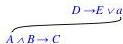

**Status:** fragment. Not LE surface language: the clause-compilation example is two ordinary LE rules, but the resolution rule, set-of-literals representation, and resolvent derivation are inference-engine internals.

### A5.2 Unification and factoring

**Motivation:** Extends resolution with unification for variables, then shows factoring is needed via the barber paradox.

```
% resolvent with unification (mgu of A_1, A_2 applied to B,C,D,E):
D' ∧ B' → E' ∨ C'

% barber paradox:
shaves(john, X) ∨ shaves(X, X)
shaves(john, X) ∧ shaves(X, X) → false

% four resolvents (no false derivable without factoring):
shaves(X, X) → shaves(X, X)
shaves(john, john) → shaves(john, john)
shaves(john, john) → shaves(john, john)
shaves(john, X) → shaves(john, X)

% factoring rule:
from D → E ∨ A_1 ∨ A_2     derive  D' → E' ∨ A
from A_1 ∧ A_2 ∧ B → C     derive  A ∧ B' → C'

% factored barber clauses:
shaves(john, john) → false
shaves(john, john)
% resolution then derives false — no such barber exists.
```

**Status:** complete (barber paradox clause set) — but used to illustrate inference. Not LE surface language: unification, factoring and the disjunctive/`→ false` clausal forms are engine internals. The barber clauses themselves use disjunctive heads and a `→ false` constraint, both not yet in LE surface.

### A5.3 Connection graphs

**Motivation:** Shows connection graphs as an efficient resolution implementation: links, link-activation, clause deletion/inheritance, the playing/working (non-Horn) example, and self-resolving recursive clauses computing 2+2. The figures *are* the worked examples.

```
playing(bob) ∨ working(bob)      % non-Horn clause — no strict forward/backward
employs(john, bob)               % fact

% recursive self-resolution:
+(s(X), Y, s(Z)) ← +(X, Y, Z)
% resolves with a copy of itself to give:
+(s(s(X)), Y, s(s(Z))) ← +(X, Y, Z)

% computing 2+2: cumulative instantiations
U = s(Z), Z = s(Z'), Z' = s(s(0))  ⇒  U = s(s(s(s(0))))
```

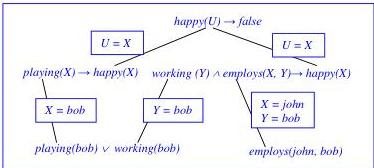
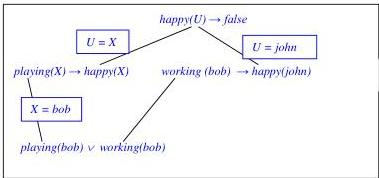
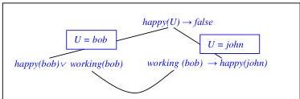
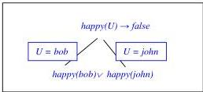
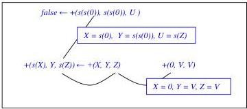
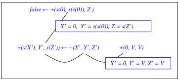
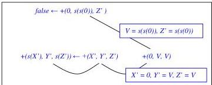
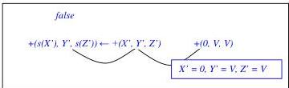

**Status:** fragment + figures. Not LE surface language: connection graphs are inference-engine internals. The underlying clauses fit LE except the non-Horn disjunctive clause `playing(bob) ∨ working(bob)` (disjunctive head, not yet LE) and the `s(...)` arithmetic data.

### A5.4 Connection graphs as an agent's language of thought

**Motivation:** Argues connection-graph structure shows the LOT differs from linear syntax: order-independence of conditions, and irrelevance of predicate/argument names.

```
I get wet if I do not take an umbrella and it will rain.
I get wet if it will rain and I do not take an umbrella.
% same logical form / same belief
```

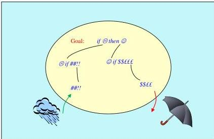

**Status:** fragment. Partially fits LE: the two English rules are directly expressible LE rules (`I get wet if I do not take an umbrella and it will rain`), and order-independence of conditions matches LE. The connection-graph view is engine-internal.

### A5.5 Subsumption

**Motivation:** Shows deletion of subsumed clauses for efficiency, with a "going to the party" example, tying back to the paradoxes of material implication.

```
mary is going to the party
mary is going to the party → X is going to the party
I am going to the party ∨ I will stay at home

% from the first two clauses, derive:
X is going to the party
% this subsumes "I am going to the party ∨ I will stay at home", which can be deleted.
```

**Status:** fragment. Not LE surface language: subsumption/clause deletion is engine-internal, and the disjunctive clause is not yet LE. The first two lines are LE-expressible (a fact + a rule).

### A5.6 Paraconsistency

**Motivation:** Shows that resolution derives only *informative* consequences of an inconsistent set, contrasting with classical "anything follows from a contradiction."

```
% from p and not p, resolution derives false in one step
% (not "the moon is made of green cheese").

% perverse derivation of arbitrary q from {p, not p}:
represent not q as clauses not-Q,
refute {p, not p} ∪ not-Q,
ignore that not-Q never participates.

% with backward reasoning (SL-resolution), irrelevant p, not p cannot show atomic q.
```

**Status:** conceptual. Not LE surface language: paraconsistency / refutation behaviour is inference-engine theory.

### A5.7 Conclusions

**Motivation:** Reflects on resolution as both machine- and human-oriented, connection graphs as a "mind-as-machine" model, and notes nonconforming connection graphs used elsewhere. No new formal examples.

*No transcribable examples.*

## Chapter A6. The Logic of Abductive Logic Programming

**Motivation:** Provides the technical basis for abductive logic programming (ALP) — open predicates, integrity constraints, the abductive proof procedure, negation via abduction, and an argumentation semantics. This is the engine/semantics underlying LE's abduction (`unknown`/assumable) and integrity constraints; most concrete examples illustrate proof-procedure derivations rather than LE surface programs.

### A6.1 (Introduction — ALP framework)

**Motivation:** Defines an abductive logic program ⟨P, O, IC⟩ and what it means to solve a goal G by finding abducible set Δ.

```
abductive logic program ⟨P, O, IC⟩
  P  = logic program (closed predicates, defined by clauses)
  O  = open predicates (do not occur in conclusions of P's clauses)
  IC = integrity constraints (generalised conditionals)

% Δ is a solution of G iff:
G holds with respect to P ∪ Δ   and   Δ satisfies IC.

% the minimal-model view adopted in the book:
Δ is a solution of G  iff  {G} ∪ IC is true in some minimal model of P ∪ Δ.

% simplest contentious example:
program {C ← C}, integrity constraint C → false.
% satisfied under consistency/epistemic views, not under theoremhood view.
```

**Status:** conceptual. Partially fits LE: ALP is the basis of LE's abduction (`unknown`/assumable) and integrity constraints, but the formal ⟨P,O,IC⟩ apparatus and the differing satisfaction views are engine/semantics, not surface language.

### A6.2 A system of inference rules for ground Horn ALP

**Motivation:** Defines the abductive proof-procedure inference rules (F1, F2, B1, B2, Fact, S) and the notion of a successfully terminating derivation, plus the soundness theorem.

```
% integrity constraints of form  A ∧ B → C  (A an open atom)
% goal G_0: a conjunction of ground atoms

F1: from open atom A in G_i and IC "A ∧ B → C":
    G_i = A ∧ G   ⇒   G_{i+1} = (B → C) ∧ A ∧ G
F2: G_i = (A ∧ B → C) ∧ A ∧ G   ⇒   G_{i+1} = (B → C) ∧ A ∧ G
B1: clause C ← D in P, G_i = C ∧ G   ⇒   G_{i+1} = D ∧ G
B2: G_i = (C ∧ B → H) ∧ G, clauses C ← D_1 ... C ← D_m ⇒
    G_{i+1} = (D_1 ∧ B → H) ∧ ... ∧ (D_m ∧ B → H) ∧ G
Fact: G_i = A ∧ A ∧ G   ⇒   G_{i+1} = A ∧ G
S: replace true → C by C; true ∧ C by C; false ∧ C by false.
```

**Status:** conceptual / engine-internal. Not LE surface language: these are abductive-proof-procedure inference rules.

### A6.3 Infinite success and incompleteness

**Motivation:** Shows a non-terminating but "successful" derivation, motivating the broadened definition of successful derivation (requiring residual conditions false in the minimal model).

```
% abductive program  ⟨ {C ← C}, {A}, {A ∧ C → false} ⟩, goal A
G0  A                       given
G1  (C → false) ∧ A         by F1
G2  (C → false) ∧ A         by B2
    ... ad infinitum        by B2
% yet Δ = {A} is a solution: A ∧ C → false holds because C is false.
```

**Status:** conceptual / engine-internal. Not LE surface language.

### A6.4 Proof procedures for ground Horn ALP

**Motivation:** Describes the search tree (or-tree) over derivations and which rules generate alternatives (only B1).

```
R       root = initial goal G_0
S/Fact  if S or Fact applies, single successor
Select  otherwise select atom C in position C ∧ G or (C ∧ B → H) ∧ G
F       open C in C ∧ G ⇒ apply F1 (with an IC) or F2 (with a conditional)
B1      closed C in C ∧ G ⇒ one successor per clause C ← D in P
B2      C in (C ∧ B → H) ∧ G ⇒ apply B2
```

**Status:** conceptual / engine-internal. Not LE surface language.

### A6.5 Integrity constraints with disjunctive conclusions

**Motivation:** Adds the Splitting rule for disjunctive-conclusion integrity constraints, turning the procedure into a clausal-logic model generator (≈ SATCHMO).

```
C → D_1 ∨ ... ∨ D_m

Splitting: G_i = (D_1 ∨ ... ∨ D_m) ∧ G ⇒
  one successor G_{i+1} = D_i ∧ G per disjunct.
```

**Status:** conceptual / engine-internal. Disjunctive-conclusion integrity constraints are not yet LE surface language.

### A6.6 Negation through abduction with contraries and constraints

**Motivation:** Shows how stable-model negation is captured in ALP by treating `not a` as a positive open atom `non-a` with consistency and totality constraints.

```
% consistency constraint:
non-a ∧ a → false
% totality constraint:
true → non-a ∨ a

% transform: P' replaces "not a" by open contrary "non-a";
% O = positive contraries; IC = consistency + totality constraints.
% stable models of P  ≡  minimal models of P' ∪ Δ (Δ solving goal true).
```

**Status:** conceptual / engine-internal. Captures LE's negation-as-failure semantics via abduction, but the contrary/constraint encoding is not LE surface language.

### A6.7 The case for ignoring the totality constraints

**Motivation:** Shows the bob/john "will go" program reformulated in ALP terms, where the proof procedure gives the stable-model results without totality constraints.

```
P': bob will go ← john stays away.
    john will go ← bob stays away.
O:  {john stays away, bob stays away}
IC: bob will go ∧ bob stays away → false.
    john will go ∧ john stays away → false.

% goal G_0 = bob will go, solution Δ = {john stays away}:
G0  bob will go
G1  john stays away
G2  (john will go → false) ∧ john stays away
G3  (bob stays away → false) ∧ john stays away
```

**Status:** complete (ALP derivation) but engine-internal. The plain belief rules (`bob will go if john stays away`) fit LE; the open predicates, `→ false` constraints, and the abductive derivation are engine/abduction machinery, partially matching LE's abduction support.

### A6.8 The case for the totality constraints

**Motivation:** A bird/fly example showing that without totality constraints the proof procedure yields an undesirable solution (`john is flightless`), which the totality constraint eliminates.

```
P: john can fly ← john is a bird ∧ not(john is abnormal)
   john is a bird

% ALP form:
P': john can fly ← john is a bird ∧ john is normal
    john is a bird
O:  {john is flightless, john is normal}
IC: john is flightless ∧ john can fly → false.
    john is normal ∧ john is abnormal → false.

% undesired derivation (no totality):
G0 john is flightless
G1 (john can fly → false) ∧ john is flightless
G2 (john is a bird ∧ john is normal → false) ∧ john is flightless
G3 (john is normal → false) ∧ john is flightless

% totality constraint:
true → john is normal ∨ john is abnormal
% with it, the derivation splits and the undesired solution fails (G6 = false).
```

**Status:** complete (ALP derivation) but engine-internal. The belief `john can fly if john is a bird and not john is abnormal` fits LE (negation-as-failure); the totality/consistency constraints and abductive derivation are engine machinery.

### A6.9 An alternative to the totality constraints

**Motivation:** Introduces the Neg (negation-rewriting) inference rule as a locally-relevant alternative to expensive totality constraints, re-running the flightless and bob/john examples.

```
Neg: if G_i = (non-C ∧ B → H) ∧ G then G_{i+1} = (B → H ∨ C) ∧ G.
Replace non-C ∧ C by false.
Replace false ∨ C by C.

% flightless example terminates unsuccessfully at:
G4 john is abnormal ∧ john is flightless

% bob/john example terminates successfully at:
G4 bob will go ∧ john stays away
G5 john stays away ∧ john stays away
G6 john stays away
```

**Status:** conceptual / engine-internal. Not LE surface language.

### A6.10 Preventative maintenance

**Motivation:** Shows Neg + Splitting letting an agent satisfy a maintenance goal by preventing the need to achieve its conclusion — the "study or retake the exam" example.

```
P:  you will fail the exam ← you do not study.
O:  {you have an exam, you study, you do not study, you retake the exam}
IC: you have an exam ∧ you do not study → you retake the exam.
    you study ∧ you do not study → false.

G0 you have an exam
G1 you have an exam ∧ (you do not study → you retake the exam)
G2 you have an exam ∧ (you study ∨ you retake the exam)
G3 you have an exam ∧ you study
G3 you have an exam ∧ you retake the exam
% choice: either you study or you retake the exam.
```

**Status:** complete (ALP derivation) but engine-internal. The belief rule fits LE; the integrity constraints with disjunctive/maintenance conclusions and the abductive derivation are engine/abduction machinery, not yet LE surface language.

### A6.11 An argumentation-theoretic interpretation

**Motivation:** Re-reads abductive derivations as constructing arguments with attacks and counter-attacks (B1 supports, F1 attacks via consistency, B2/Neg counter-attack).

*No standalone transcribable program* (prose describing how the inference rules build arguments). Conceptual / engine-internal.

### A6.12 An argumentation-theoretic semantics

**Motivation:** Gives stable-model and admissibility semantics in argumentation terms (attacks on Δ, counter-attacks), and states the soundness theorem for the rules including Neg.

```
% stable: Δ solves G_0 iff
P' ∪ Δ supports an argument for G_0,
no argument supported by P' ∪ Δ attacks Δ,
for every non-b not in Δ, P' ∪ Δ supports an argument attacking non-b.

% admissible: Δ is an admissible solution of G_0 iff
P' ∪ Δ supports an argument for G_0,
no argument supported by P' ∪ Δ attacks Δ,
for every argument (supported by P' ∪ Δ') attacking Δ,
   P' ∪ Δ supports an argument attacking Δ'.
```

**Status:** conceptual / engine-internal. Not LE surface language.

### A6.13 Extensions of the abductive proof procedure

**Motivation:** Lists needed extensions (non-ground case via unification/range-restriction; closed-atom forward reasoning; conditionals in conditions; forward reasoning with beliefs; integrating connection graphs). No formal example programs.

*No transcribable examples.*

### A6.14 Conclusions

**Motivation:** Summarizes the technical support and the argumentation-based unification of default-reasoning formalisms. No new examples.

*No transcribable examples.*

## References

Bibliography of the book. No illustrative examples.
