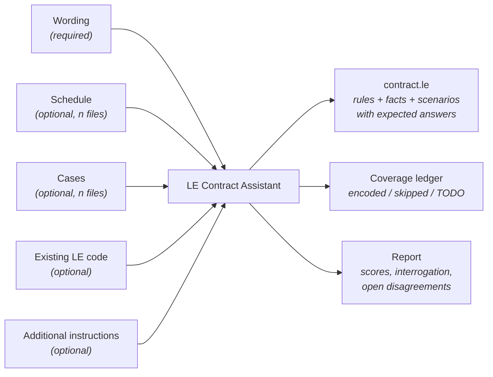
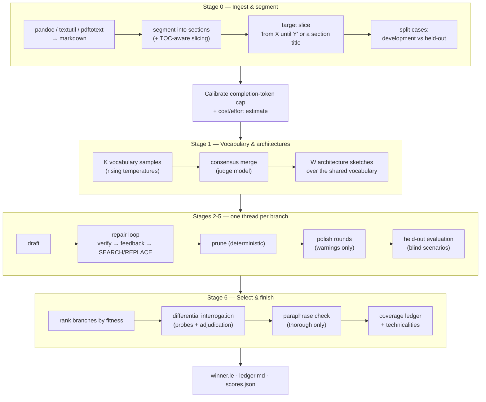
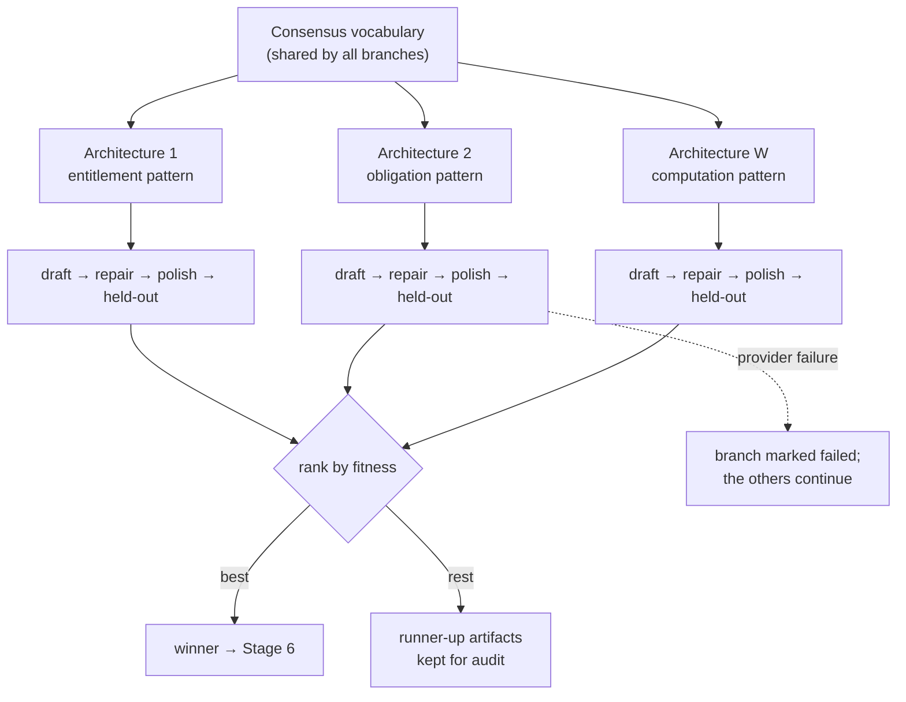
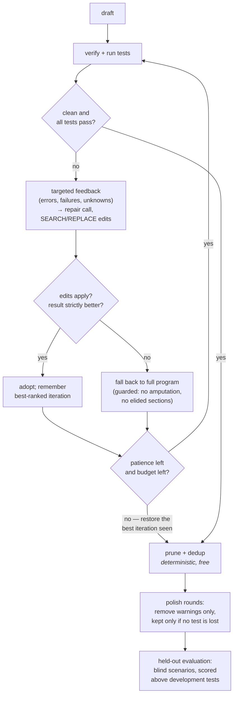

# The LE Contract Assistant

*Kind: design, as built · Audience: developers · Status: current (2026-09-16)*

The Contract Assistant turns documents into tested Logical English without a
human in the loop. It is part of LE2 core: the module
`le_contract_assistant.pl`, the prompts in `llm/contract_prompts/`, the web
app in `web_extras/contract_assistant/` and the offline tests in
`testing/test_contract_assistant.pl`. It was moved here from the InsurLE2
design document of August 2026. The "as designed" versus "as implemented"
notes below record where the code differs from that design.

## 1. What it does

A job runs in one of four modes (the request's `mode`; the web app's "What to
generate"):

| Mode | In | Out |
|---|---|---|
| `contract` (default) | a contract: wording, optional schedule and cases, optional existing LE code and instructions | a whole tested program (`contract.le`), a coverage ledger, a report |
| `scenario` | an English description of a situation, and an LE program treated as correct and never modified | one `scenario … is:` block |
| `query` | an English question, and such a program | one `query … is:` block |
| `residue` | a program written by a migration translator, with `% RESIDUE <id> BEGIN … END` blocks holding untranslated source | the same program with those blocks translated; every other line kept |

Most of this document is about `contract` mode. The other three reuse its
drafting, verification, ranking and repair (§7).

"Contract" is meant broadly: anything made of

1. **normative wording**: an insurance policy, an ISDA Master Agreement, a
   loan facility, …;
2. a **schedule** of parameters: limits and covers, Schedule/CSA elections,
   margins and dates;
3. **cases** the program must decide: claims, default or termination
   scenarios, drawdown disputes.



Insurance was the worked example during development: hand conversions of one
section of an insurance policy set the standard for good output,
and assistant-generated conversions of the same section by different models
were compared against them.

## 2. The pipeline at a glance

A job is a sequence of stages over artifacts on disk. Stages 2–5 run once per
*branch* (§4.2) and are reported as one stage.

| # | Stage | Produces |
|---|---|---|
| **0** | Ingest & segment | uploads as text, section map, target slice, development / held-out case split |
| **1** | Vocabulary & architectures | the agreed template inventory (consensus of K samples) and W architecture sketches |
| **2** | Draft (per branch) | a whole program per branch |
| **3** | Schedule facts | folded into the draft: the schedule is drafted as facts |
| **4** | Scenarios | folded into the draft: one scenario per development case, with expected answers |
| **5** | Repair & polish (per branch) | a program that verifies clean and passes its tests; then blind held-out scoring |
| **6** | Select, interrogate, ledger | the winner, probe scenarios, the coverage ledger and the report |



Every stage has an automatic acceptance gate (§6). There are no review pauses.

## 3. Why the LE Assistant's loop is not enough

The [LE Assistant](assistant.md) treats every task as "edit one program until
`verify` is clean". Contract conversion differs in three ways:

1. **Scale.** Wordings run to thousands of lines, with forward references and
   incorporated general terms; a one-shot conversion exceeds output budgets
   and drifts.
2. **Three inputs, three targets.** Wording becomes rules, the schedule facts,
   the cases scenarios with expected outcomes.
3. **`verify` checks form, not meaning.** A program can be warning-free and
   wrong. The behavioural check is that cases, and variants that flip them, are
   decided as an expert would decide them.

## 4. The idea: selection, not extraction

The working assumption is that a model reading a contract already holds most
of the relevant readings, among many alternatives. The pipeline's work is to
select: to impose constraints that eliminate wrong and ugly alternatives.
Two consequences:

- **Keep alternatives alive.** Stage 1 samples several candidates and keeps
  more than one architecture (a beam) as long as the budget allows.
- **The model is also an oracle.** The compiled program can be tested against
  a direct reading of the raw contract (§4.3). Disagreement means the program
  lost something, or the contract is ambiguous.

The objective fitness function of §5 makes selection automatic.

### 4.1 Consensus for the vocabulary

The Stage-1 template inventory is sampled K times at rising temperatures. A
judge model merges the samples: templates present in a majority form the core
vocabulary; each template's epistemic class (schedule datum, case datum, expert
judgment, derived notion) is decided by majority; a template in only some
samples must be justified by a quoted contract sentence or is dropped.

Voting works for vocabulary, where samples differ in surface form but agree on
substance. It does not work for architecture, where votes over different but
coherent decompositions produce chimeras. Hence §4.2.

### 4.2 A tournament for the architecture

The architecture is where real alternatives exist: the decision surface
(which questions the program answers), the decomposition pattern
(entitlement ∧ ¬exception ∧ conditions; obligation and breach; computation
cascade) and the limit machinery.

W architectures are sketched over the shared vocabulary. Each runs through
drafting, repair, polish and held-out scoring in its own thread
(`concurrent_maplist/3`; LLM calls are blocking HTTP). The branches are ranked
by fitness and the best is delivered; the others stay on disk.



A branch that fails (provider outage, unusable reply) is caught in its own
thread and reported; the job fails only if every branch fails.

### 4.3 Differential interrogation

A probe generator reads **only the raw contract** and invents edge cases the
supplied cases do not cover (boundary dates, role variations, limit erosion,
stacked exclusions), each with an expected outcome and a supporting quotation.
Each probe becomes a scenario with expectations, run against the program:

- **Agreement**: the probe stays in the program as a regression scenario.
- **Disagreement**: with feature `interrogation_repair`, adjudication repair
  rounds, in which the model decides, citing the contract, whether the rules
  or the probe's expectation is wrong, and fixes that one.
- **Disagreements that survive**: the program is reverted to its state before
  the probes, and the disagreements are reported as open.

**Paraphrase invariance** (feature `paraphrase`, on in the thorough preset)
rewrites the wording in other words, extracts a vocabulary from the paraphrase
and reports a stability percentage. It is informational and does not affect
selection.

## 5. The fitness function

**As designed**, in rough lexicographic order: held-out pass rate, coverage,
verifier (errors disqualify, warnings penalise), faithfulness (explanation
round-trip), differential agreement, parsimony.

**As implemented** (`branch_rank/2`), lexicographically, smaller first:

| Key | Meaning |
|---|---|
| 1. no tests at all | a clean program with no scenarios demonstrates nothing and must not beat one with errors that passes 16 of 18 |
| 2. verifier errors | |
| 3. net held-out evidence (failed − passed) | blind evaluation ranks above development tests |
| 4. net development evidence (failed − passed) | 3 of 6 passing beats 0 of 2 |
| 5. test failures | |
| 6. verifier warnings | |
| 7. program length, larger first | the tie-breaker: more of the contract encoded |

Both evidence terms are net because raw failure counts reward writing fewer
scenarios. The last key inverts the design's parsimony criterion: an amputated
branch once outranked a complete one. Parsimony is enforced instead by the
deterministic prune and dedup passes before ranking (§6, Stage 5). Coverage
and faithfulness are not scored (§9).

### Budget presets

K (vocabulary samples) × W (branches) × repair patience × probes, from
`preset_params/5` and `preset_features/2`:

| Preset | K | W | Repair patience | Probes | Paraphrase | Polish rounds | Minutes |
|---|---|---|---|---|---|---|---|
| **draft** (default) | 1 | 1 | 3 | 0 | off | 2 | 15 |
| **standard** | 3 | 2 | 4 | 4 | off | 2 | 45 |
| **thorough** | 5 | 3 | 5 | 8 | on | 3 | 120 |

Every number and feature can be overridden in the request (`budget`,
`features`) and in the web app's Advanced panel. Repair patience is the number
of consecutive non-improving rounds tolerated; while rounds improve, repair
continues up to `max(4 × patience, 16)` rounds, within the minute budget.

The deadline is checked between steps: repair and polish loops stop, and
interrogation, the paraphrase check and, last, the ledger are skipped once the
budget is exhausted; LLM retries stop too. Each LLM call
gets a socket timeout of the smaller of a sixth of the whole budget and half
of what remains, between 2 and 15 minutes (`call_timeout/2`).

### Temperatures

| Call | Temperature |
|---|---|
| Vocabulary samples | 0.05, 0.25, 0.45, … (+0.2 per sample) |
| Architecture sketches | 0.05, 0.15, 0.25, … (+0.1 per sketch) |
| Drafts (also clause-wise and finalize) | 0.05 |
| Interrogation probes | 0.2 |
| Paraphrase rewrite | 0.6 (the vocabulary sample from it: 0.2) |
| Consensus merge, repairs, held-out scenarios, ledger, comparison | 0 |

On the draft preset (K = 1, W = 1) runs are close to deterministic, which makes
model comparisons meaningful. When a provider rejects `temperature` for a
model, the job drops the parameter for the rest of the run.

## 6. The stages in detail

### Stage 0: ingest and segment

Uploads are stored under `<jobdir>/sources/` and converted to text: `.docx`
through `pandoc` (else macOS `textutil`), `.pdf` through `pdftotext`; `.md`
and `.txt` as they are. A missing converter fails with a message naming it.
The wording is segmented into sections (`segment_markdown/2`).

- **Target slice.** A long wording is narrowed by a target: a section title
  (that section, its subsections and the general terms, matched against
  markdown headings and table-of-contents titles, tolerant of apostrophes), or
  a range `from A until B`, optionally `(inclusive)`. Contract wordings are
  often ill-formed markdown (headings in bold text only, sections named only in
  a guide at the start), hence the table-of-contents matching.
- **JSON record arrays.** A `.json` case file holding an array gives one case
  per element. Records of the same case in several files are merged on linking
  fields detected automatically, so a recorded outcome becomes the scenario's
  expectation. Schedules work the same way, and a case naming its schedule
  entry carries that entry's parameters into its scenario.
- **Held-out split** (feature `holdout`, `auto`): with two or more cases, the
  last quarter (at least one) is kept blind; the rest are development cases.

*Gate*: a non-empty slice; a text for every case.

Before the first expensive call the job **calibrates** the completion-token
cap when none is given (a two-token request at the cap; on an HTTP 400 that
names the token limit or the context, halve and retry) and **estimates** the
cost and duration, warning when the minute budget looks too small.

### Stage 1: vocabulary and architectures

The consensus (§4.1) and the W sketches (§4.2). Epistemic classes:

| Class | LE marker | Example |
|---|---|---|
| schedule datum | plain fact | `the schedule states a limit of *an amount*, *a basis*, for *a cover*.` |
| case datum | `; undefined` | `*a loss* occurs on *a date*; undefined.` |
| expert judgment | `; assumable` | `*a loss* arises out of their work...; assumable.` |
| derived notion | defined by rules | `*a person* is an employee.` |

The house style, `llm/contract_prompts/house_style.md`, is the start of the
system prompt of every generating call, followed by the language reference:
decision predicates centred on the claim or case; no reified payments;
exclusions and exceptions as positive rules, never assumable; the schedule as
data, with limit facts carrying their basis and applied by generic rules;
dates computed, not asserted; each rule commented with its clause.

*Gate*: a non-empty merged vocabulary; W sketches.

### Stages 2–4: drafting (per branch)

By default one call per branch writes the whole program: rules, schedule
facts and one scenario per development case with its expectation. Scenarios
are never invented: exactly the supplied cases, plus those of the existing
code, unless the instructions ask for more.

Feature `clausewise` (off by default) drafts block by block instead, building
the ledger as it goes, with a final call for facts and scenarios. It makes more
calls and its assembly is more fragile.

*Gate*: a program is extracted from the reply (`extract_le_code/2`: the
```` ```le ```` fence, else the largest fence, else the whole reply). A reply
cut off mid-program is reported, since no earlier version exists to fall back
on.

### Stage 5: repair, prune, polish, held-out (per branch)



- **Diff edits** (feature `diff_repairs`, on): repairs come as exact
  SEARCH/REPLACE blocks. A full-program reply is accepted as a fallback, but
  an unapplied edit block never counts as a program, and a reply that elides
  sections (`% ...`) or amputates the program is refused. While the program
  has at most `max_rewrite_errors` (5) errors, a full-program reply is kept
  only if it verifies strictly better.
- **Best iteration.** The loop keeps the best-ranked version and works from
  it; the next prompt says why the worse attempt was dropped.
- **Feedback.** Verifier issues are ranked and capped for each round
  (`le_issue_feedback.pl`, at most twelve issues); parse errors, test failures
  and unexpected unknowns get different feedback.
- **Prune and dedup** (`prune_pass`, `dedup_pass`): deterministic removal of
  rules no query reaches, dead statements and duplicate declarations; a pruned
  program is kept only if it verifies no worse.
- **Polish** (feature `polish`, 2 or 3 rounds): once the program is right,
  rounds that remove warnings only, each kept only if it loses no test.
- **Held-out evaluation**: a separate call writes scenarios for each held-out
  case from its text and the finished program. It is a measurement; a
  provider failure during it costs the measurement, not the program.

*Gate*: clean and passing, or the best iteration within patience and budget.

### Stage 6: selection, interrogation, ledger

The branches are ranked (§5) and the winner announced; interrogation (§4.3)
and, when enabled, the paraphrase check run; then the wording is walked against
the delivered program to write the **coverage ledger**: clause rows marked
`Encoded`, `Procedural — skipped(reason)` or `TODO`, followed by a
*technicalities* block (configuration, scores, interrogation, auto-tuning, cost,
how much existing code survived). Interrogation and the paraphrase check are
wrapped so that a failure becomes a note in the report and never loses the
winner.

*Gate*: the delivered program is verified again and its score reported; the
ledger and `scores.json` are written.

## 7. The fragment and residue modes

`fragment_stages/1` (`scenario`, `query`) and `residue_stages/1` (`residue`)
keep: W independent attempts (the first at temperature 0, the others 0.3),
verification with ranked and capped feedback, best-iteration repair, and
selection by the same ranking. They differ from `contract` mode:

- The given program is an input only. A fragment is verified appended to a
  copy of it; issues the program already had are subtracted and line numbers
  are re-based onto the block. A test of the program that passed before and
  fails after is an error (`regression`).
- A new scenario is run against every query of the program, a new query
  against every scenario, and the answers are reported ("exercise").
- Instead of a ledger, a coverage note, as `%` lines at the top of the block,
  says what of the text the block does not represent.
- In residue mode the reply is one LE block per residue, spliced between the
  markers by the job, so the rest of the program cannot change. Templates a
  residue needs may go in an optional `% RESIDUE TEMPLATES BEGIN … END` region.
  The program's scenarios, in a migration the source system's tests
  (`le_migration.pl`), decide when the translation is right.

There is no vocabulary consensus, architecture sketch, held-out split,
interrogation or paraphrase check in these modes. The editor's one-shot "Write
it in English…" (`nl_to_le.pl`) is a separate, synchronous feature.

## 8. Implementation

The design choice was a Prolog pipeline inside the server: per-stage model
choice, a structured UI and budget enforcement.

### `le_contract_assistant.pl`

- **Jobs.** A detached thread per job (`start_contract_job/3`; option
  `sync(true)` runs it inline for tests). State in dynamic facts: `ca_status/2`,
  `ca_config/2`, `ca_stage/3`, `ca_log/3`, `ca_branch/3`, `ca_result/2`,
  `ca_tune/2`. Job ids are `caj_<uuid>`. An interrupt is honoured at the next
  step boundary; an LLM call in flight finishes first.
- **Artifacts.** One directory per job, `contract_jobs/<id>/` (or under
  `LE_CONTRACT_JOBS_DIR`): `sources/`, `sectionmap.json`, `vocabulary.md`,
  `branch_<n>_draft.le`, `branch_<n>_final.le`, `probes.le`,
  `paraphrase_report.md`, `existing.le`, `winner.le`, `ledger.md`,
  `scores.json`, `job.log` (fragment and residue jobs write `program.le`,
  `source.txt` or `skeleton.le`). After a server restart, a status or result
  request for an unknown job is answered from this directory: `finished` if it
  left `winner.le`, otherwise an error saying the run was lost.
- **Scoring.** `verify_le_text/2` loads the program with `le_kbs` and runs its
  tests in-process.
- **LLM access.** `llm/llm_client.pl` with per-request keys, wrapped in a
  retry ladder (`llm_outcome/9`): backoff on 503, 429 and dropped sockets (up
  to 3 attempts); an empty reply is a failure, not an empty program; a
  truncated reply is retried with minimal reasoning and then with the
  provider's cap; `temperature` or a `reasoning_effort` level the provider
  rejects is dropped or changed for the rest of the job.
- **Prompts.** `prompt_text/2` reads `llm/contract_prompts/<name>.md` beside
  the module, so prompts can be tuned without code changes. The system prompt
  of a stage is the style file (`house_style`, `fragment_style` or
  `residue_style`), then the language reference, then the stage prompt with
  `{{slot}}` substitutions; other inputs go in the user message. The 22
  prompts: `house_style`, `stage1_vocabulary`, `stage1_merge`,
  `stage1_architecture`, `stage2_draft`, `stage2_clause`, `stage2_finalize`,
  `stage5_repair`, `stage5_polish`, `holdout_scenarios`, `probe_scenarios`,
  `paraphrase`, `paraphrase_compare`, `stage6_ledger`, and the
  `fragment_*` and `residue_*` prompts of §7.
- **Languages.** The language reference comes through
  `le_i18n:localized_asset/3` (`docs/user/reference/language.<lang>.md` when
  present), followed, when `le_extensions` is loaded and the reference is the
  English one, by `docs/user/reference/extensions.md`. For a non-English
  language a directive to write the program in that language is prepended.
- **Prices.** `llm/llm_prices.pl` (LiteLLM's public table, fetched at server
  start) gives a deliberately high cost estimate before the run.

Nothing of the LE Assistant's light loop is reused: its free-form JSON
actions, whole-program rewrites and verify-then-finish termination do not fit
a staged pipeline with structured outputs and diff repairs.

### API

`/leapi` operations in `classic_web_api.pl` (not separate REST paths, as first
sketched):

| Operation | Request | Response |
|---|---|---|
| `contract_start` | `mode`, uploads, `target`, `existing_code`, `instructions`, `model`, `judge_model` (default: the model), `api_keys`, `budget` (`preset`, `k`, `w`, `repairs`, `minutes`), `features`, `max_tokens`, `reasoning` (`default` or `minimal`); for fragment modes `program`, `text`, `name` | `{job}` |
| `contract_status` | `job`, `since` (log sequence) | `status`, `stage`, `stage_label`, `branches` (per-branch errors, warnings, tests), `log` lines since `since`, `next_seq`, `config`, `elapsed`, `error` |
| `contract_result` | `job` | `le`, `filename`, `mode`, `winner`, `scores`, `final_score`, `ledger`, `interrogation`, `paraphrase`, `existing_code` (`exercise` for fragments) |
| `contract_interrupt` | `job` | `{ok}` |
| `contract_cost_estimate` | as `contract_start`, plus `input_chars` | the estimate, or `priced: false` |

### The web app: `web_extras/contract_assistant/`

Plain HTML and JavaScript, no build step, served at
`/web_extras/contract_assistant/index.html`. No other page links to it.

1. **Setup.** "Your recent runs" (kept in this browser's `localStorage`); the
   mode; for `contract`, upload zones for wording (required), schedule and
   cases (several files each) and the target; for the other modes, the
   program, the text and a block name (plus, for scenarios, whether to write
   expected answers); existing LE code; model and judge model, with key fields
   sharing the editor's `localStorage` slots; additional instructions; the
   draft / standard / thorough presets and an Advanced panel (K, W, repair
   patience, minutes, completion-token cap, reasoning effort, probes, polish
   rounds, held-out scoring, interrogation repair, paraphrase, clause-wise,
   diff repairs); a live cost estimate.
2. **Run.** Stage progress, one card per branch with live errors, warnings
   and test results, the log, elapsed time, Cancel. The job id is in the URL
   fragment, so a reload, or a colleague opening the link, reattaches to the
   job.
3. **Result.** The program, the scores, the interrogation and paraphrase
   reports, the ledger. Actions: Copy, Download `.le`, Open in editor (passes
   the text to `/editor/index.html?text=`), New conversion.

### Two user controls

- **Existing LE code**: templates, scenarios with expectations, rules, in any
  combination. It goes into every drafting and repair prompt: templates are
  reused verbatim, scenarios and expectations kept, and conflicts with the
  contract flagged in a comment. The result reports how many of its lines
  survived.
- **Additional instructions**: free text sent with every drafting and repair
  call, to lift a house default (for example, to allow invented scenarios) or
  steer the modelling. It cannot override the LE syntax.

### Testing

`testing/test_contract_assistant.pl` has 145 offline tests in five suites:
`contract_assistant_units` (segmentation, targets, code extraction,
SEARCH/REPLACE, JSON record merging, scoring), `contract_assistant_pipeline`
(whole runs with the LLM stubbed by `ca_llm_hook/1` and `sync(true)`),
`contract_assistant_features` and `contract_assistant_feature_pipeline` (each
feature on and off; the retry ladder through the lower hook `ca_raw_hook/1`),
and `contract_assistant_fragments`. `testing/test_residue_mode.pl` covers
residue mode and `editor/tests/contract-assistant.spec.ts` the web app. No test
needs a network or an API key.

### What real runs taught

Each of these is a fix a live run forced, now covered by a test:

- Section slicing uses the table of contents and tolerates apostrophes,
  because wordings start sections with bare title lines listed only in a guide.
- Program extraction takes the `le` or the largest fence, not the first:
  models emit a small preamble fence.
- A program of comments only is an `empty_program` error, not a clean score.
- Ranking uses net test evidence, and length breaks ties, after an amputated
  branch beat a complete one.
- Branch errors are caught inside the branch thread; one stray exception used
  to discard every other branch's finished program.
- Held-out evaluation and the Stage-6 enhancements cannot destroy a finished
  winner; a run once lost twenty-one minutes of work to a 503 during held-out
  scoring.
- A pipeline that fails without an exception still ends the job; the UI used
  to poll a dead job forever.
- Empty replies (reasoning tokens exhausted) are reported as such, with advice.
- Error messages are truncated (600 characters): a stack frame can quote a
  90 kB reply.

The same work fixed a parser bug in LE: a rule whose head matched no template
aborted the whole parse when its body spanned lines. It now yields a
`missing_template` error per sentence, which is also what makes repair
feedback useful.

## 9. Differences from the original design

| Designed | Built |
|---|---|
| Stages 3 and 4 as separate LLM stages (schedule extraction; scenarios with adversarial variants) | folded into the draft; variants were not built, interrogation probes fill that role |
| Coverage (ledger) as a fitness term | reported, not scored; the ledger is written for the winner only |
| Faithfulness: every proof step supported by a quotation | not implemented |
| Parsimony as a tie-breaker | inverted: larger programs win ties; prune and dedup enforce parsimony |
| Optional human review pauses | not implemented; the only control during a run is Cancel |
| Separate `/contract_assistant/*` REST endpoints | `/leapi` operations |
| A token-accounting budget monitor | a wall-clock deadline and a cost estimate before the run |
