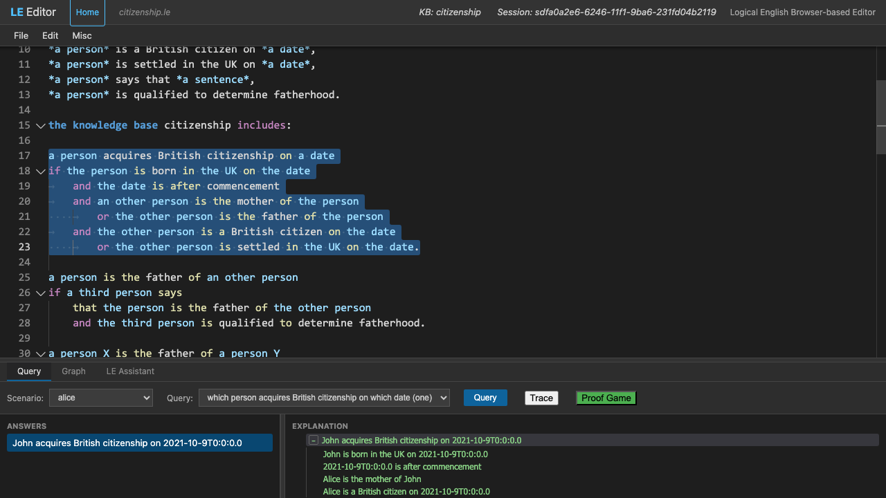

# How to use the Logical English 2 web application

The Logical English (LE) web application is a simple IDE designed for developing, testing, and debugging Logical English programs.

## Getting Started

1.  **Open the Editor:** Navigate to the editor URL (e.g., `http://localhost:3050/editor/`).
2.  **The Interface:**
    *   **Top:** Header with filename and module information.
    *   **Middle:** Monaco-based code editor with syntax highlighting and error reporting.
    *   **Bottom:** Multi-tab panel for Queries, Graphs, and the LE Assistant.

## File Operations

### Opening and Saving
*   **New File:** `File > New` clears the editor.
*   **Open Local File:** `File > Open...` allows you to load a `.le` file from your computer.
*   **Open from Server:** `File > Open copy from server...` provides a list of built-in examples (like `citizenship`).
*   **Save:** `File > Save` or `Save As...` allows you to save your work back to your local filesystem.

> **⚠️ Browser Compatibility:** Direct file saving (writing back to the same file) requires a modern browser that supports the *File System Access API* (e.g., Chrome, Edge). In other browsers (e.g., Safari, Firefox), the "Save" action will instead trigger a **Download** of the file.

### Saving via URL (Quick Save)
The editor automatically synchronizes the current code into the browser's URL using a `text` parameter. 
*   **To "Save" a state:** Simply copy the current URL from your browser's address bar.
*   **To "Load" a state:** Paste that URL into a new tab. This is useful for sharing snippets or bookmarking a specific version of your logic.

## Writing Logic and Issue Reporting

As you type, the editor performs real-time verification:
*   **Syntax Highlighting:** Keywords, variables, and templates are colored for readability.
*   **Error Reporting:** Red squiggly lines indicate syntax errors or missing templates.
*   **Quick Fixes:** Hover over an error to see suggested fixes (e.g., automatically adding a missing template).
*   **Status:** The "Query" button in the bottom panel is disabled if the document contains errors.

## Running Queries

1.  **Load the Module:** The editor proactively loads your code onto the server. You can see the session ID in the top header.
2.  **Select Scenario:** In the **Query** tab, select a scenario defined in your code (e.g., `scenario(alice, ...)`). You can also select "Another..." to type custom facts.
3.  **Select Query:** Select a query defined in your code (e.g., `query(one, ...)`).
4.  **Execute:** Click the **Query** button.

## The Scenario Editor

A scenario is a named set of facts your queries run against. The **Scenario Editor** lets you build and edit these scenarios as **fill-in-the-blank forms** instead of typing the facts by hand, so you never have to remember a template's exact wording. Open it from **Edit → Edit Scenarios…**; it opens in a separate window.

### Layout

*   **Top:** a **Scenario** picker — choose **New…** to start a fresh scenario, or pick an existing one to load it for editing — and a **Name** field (the scenario's name in your program).
*   **Middle:** a vertical list of the scenario's facts, one per row.
*   **Bottom:** an **Add fact** picker, and the **Copy** / **Insert into Editor** buttons.

### Editing facts

Each fact is shown as one row built from a template: the template's fixed words are plain **labels**, and each placeholder is an editable **field**. For the template `*a person* is born in *a place* on *a date*` a fact reads:

> `[a person]` is born in `[a place]` on `[a date]`

Only the placeholders are editable — you can't accidentally break the surrounding wording. Each field's **hint text** is the template variable it stands for (e.g. *a person*), and fields grow to fit their contents. Loading an existing scenario fills the fields in automatically by recognising each fact's template.

*   **Add a fact:** pick a template from the **Add fact** menu and click **+ Add**, then fill in the fields. The menu lists only templates that make sense as scenario facts: those declared **`; undefined`** (a.k.a. *scenario element*) and those already used by some scenario. Plain "*X* is a *type*" assertions are also supported.
*   **Delete a fact:** click the **✕** on its row.
*   **Test lines** (`… expects answers …`) are too complex for this form, so they are not shown. They are kept aside and written back **commented out** (so your saved scenario is valid); review and re-enable them in the main editor.
*   **Other lines that match no template** are shown greyed-out and read-only so they are preserved; edit those in the main editor. Comments (`%`) are ignored.

### Saving your work

*   **Copy:** copies the whole scenario block (`scenario <name> is:` followed by its facts) to the clipboard, ready to paste anywhere.
*   **Insert into Editor:** writes the scenario back into the main editor — **replacing** the scenario you loaded, or **appending** a new one — and closes the Scenario Editor window.

The Scenario Editor does not itself check your Logical English: as with any edit, the **final syntax check happens on the server** the next time the editor loads the module, and any problems are reported as usual. If you try to close the window with unsaved changes (not yet copied or inserted), it asks you to confirm first.

## Explanations and Navigation

Once a query is executed:
*   **Answers:** A list of results appears in the left side of the bottom panel.
*   **Explanation Tree:** Clicking an answer displays a natural language justification tree on the right. When a query has *no* answer, the tree explains *why* it failed.
*   **Navigation to Source:**
    *   Clicking any node in the explanation tree will automatically scroll the editor to the corresponding rule or fact in your source code.
    *   The selected range will be highlighted in the editor, allowing you to quickly verify the logic.

### Reading the Explanation Tree

*   **Node colours** show each node's status: **green** for a condition that *succeeded*, **red** for one that *failed*, and **amber** for an *unknown* condition (one that could not be proven true or false, but was assumed true because it matches an "unknown" template).
*   **Type tooltips:** Hover over any node to see a description of its status (e.g. "Succeeded: this condition was proven", "Failed: this condition could not be proven"). A negated condition that holds reads "Succeeded: this negative condition holds (the inner statement could not be proven)".
*   **Expand / collapse:** Nodes with sub-steps show a `-`/`+` toggle; the top two levels are expanded by default. Expansion state is remembered per answer while you switch between answers.
*   **Hierarchical numbering:** Turn on **Misc → Hierarchical Numbering** to prefix each node with its position in the tree (e.g. `1.2.3`).

### Repeated Sub-explanations

Large success — and especially failure — trees often contain the same sub-explanation many times. By default these are collapsed:

*   A sub-explanation that occurs several times is shown **once, in italics**, keeping its normal green/red/amber colour. Its tooltip reports how many times it occurred ("N repeated sub-explanations", or "N repeated occurrences" for a leaf condition that has no sub-steps).
*   **Go to full sub-explanation:** Some repeats stand in for a copy that *is* shown in full elsewhere in the tree. These carry a small `↩` marker; **right-click → "Go to full sub-explanation"** scrolls to that full copy, expanding any collapsed ancestors and briefly highlighting it. Repeats with no fuller copy anywhere (e.g. a plain repeated leaf) have no marker and no such menu item.
*   This collapsing is controlled by the **Hide repeated explanations** preference (on by default); turn it off to see every occurrence in full.

### The Explanation Context Menu

Right-click in the explanation tree for:

*   **Copy Explanation:** Copies the whole tree (all sibling subtrees) to the clipboard as both plain text and HTML, ready to paste into a document.
*   **Go to full sub-explanation:** Shown only on a repeated node that has a full copy elsewhere (see above).

### Explanation Preferences

Open **Misc → EXPLANATIONS → Preferences...** to configure:

*   **Prefix for failed nodes:** Text prepended to failed nodes when copying an explanation (handy when pasting into a context that loses colour).
*   **Detailed failure explanations (per-rule nodes):** When on, a failed predicate proven by several rules shows an intermediate node per rule (each navigable to that rule), with each rule's failed sub-goals beneath it. Slower; off by default.
*   **Hide repeated explanations:** As described above; on by default.

## Advanced Features

*   **Graph View:** The **Graph** tab visualizes the dependencies between your rules and templates.
*   **LE Assistant:** Use the **LE Assistant** tab to ask questions about your code or request help with drafting new rules.
*   **Debugger:** Right-click in the editor and select **See PROLOG** to view the translated logic, or use the **Trace** button in the Query tab for step-by-step execution.
