# A Gentle Introduction to Logical English 2

Logical English (LE) lets you write rules, facts and queries in a controlled subset
of English — and then *run* them. No brackets, no `:-`, no semicolons hiding in the
dark. You write something that reads like a contract or a regulation, and the system
turns it into logic it can reason about, complete with human‑readable explanations of
*why* each answer is (or isn't) true.

This tutorial walks through three small programs, from a whimsical tea party to a
(slightly) serious slice of British nationality law, and introduces the web editor's
tools as we go. By the end you will be able to write LE, query it, poke at
"what‑if" scenarios, and interrogate the reasoner until it confesses.

> **Follow along.** Everything here runs in your browser at
> **<https://le2.logicalcontracts.com>** — a public copy of the system. Open the
> editor, then **File → Open copy from server…** and pick the example named in each
> section (`tea_party`, `happy_dragon`, `citizenship`). No install required.

**Reference material** (you won't need it to follow along, but it's there):

- Language reference: [`docs/le_summary.md`](https://github.com/LogicalContracts/LogicalEnglish2/blob/main/docs/le_summary.md)
- Editor manual: [`docs/howToUse.md`](https://github.com/LogicalContracts/LogicalEnglish2/blob/main/docs/howToUse.md)
- All examples: [`examples/moreExamples/`](https://github.com/LogicalContracts/LogicalEnglish2/tree/main/examples/moreExamples)

---

## Contents

- [A Gentle Introduction to Logical English 2](#a-gentle-introduction-to-logical-english-2)
  - [Contents](#contents)
  - [1. The editor at a glance](#1-the-editor-at-a-glance)
  - [2. Example 1 — `tea_party`: language basics](#2-example-1--tea_party-language-basics)
    - [Templates — teaching LE your vocabulary](#templates--teaching-le-your-vocabulary)
    - [Facts](#facts)
    - [Rules](#rules)
    - [Negation](#negation)
    - [Scenarios and queries](#scenarios-and-queries)
  - [3. Running a query](#3-running-a-query)
  - [4. Reading explanations](#4-reading-explanations)
  - [5. Example 2 — `happy_dragon`: negation and "for all cases"](#5-example-2--happy_dragon-negation-and-for-all-cases)
  - [6. Example 3 — `citizenship`: a real little rulebook](#6-example-3--citizenship-a-real-little-rulebook)
  - [7. Scenario Variations: playing "what if"](#7-scenario-variations-playing-what-if)
  - [8. Unknowns: assuming your way to an answer](#8-unknowns-assuming-your-way-to-an-answer)
  - [9. Why *not*? Failure explanations](#9-why-not-failure-explanations)
  - [10. Explanation preferences and the Explanation Drill](#10-explanation-preferences-and-the-explanation-drill)
    - [Preferences](#preferences)
    - [The Explanation Drill](#the-explanation-drill)
  - [11. Where to go next](#11-where-to-go-next)

---

## 1. The editor at a glance

Open the editor and load `tea_party` (**File → Open copy from server… → tea_party**).

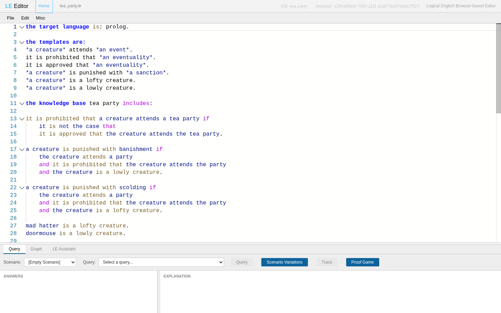

Four regions matter:

- **Header (top):** the filename, the knowledge‑base name (`KB: tea party`) and a
  **Session** id. The session is the live copy of your program on the server; the
  editor loads it for you automatically as you type.
- **Menu bar:** `File`, `Edit`, `Misc`.
- **Code editor (middle):** a Monaco editor with LE syntax highlighting. Keywords
  are bold, `*variables*` and template words are coloured, and errors get red
  squiggles with hover‑to‑fix suggestions.
- **Bottom panel:** tabbed **Query**, **Graph** and **LE Assistant**. This is where
  you run things.

This tutorial's screenshots use the **Light** theme. You'll find it — along with the
other "environmental" knobs we'll meet later — under **Misc**:

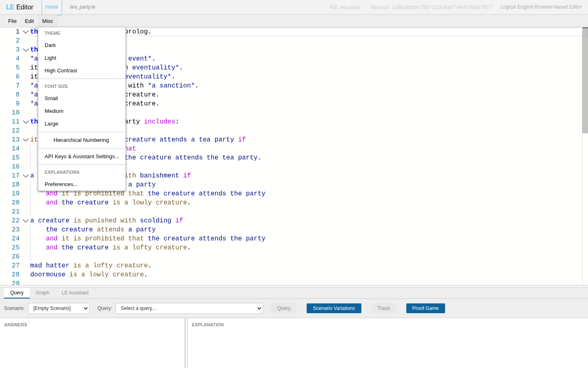

Besides the theme and font size, note **Hierarchical Numbering** and the
**EXPLANATIONS → Preferences…** entry; we'll return to both in §10.

---

## 2. Example 1 — `tea_party`: language basics

Every LE program is built from a few kinds of section. Here is `tea_party` in full:

```le
the target language is: prolog.

the templates are:
*a creature* attends *an event*.
it is prohibited that *an eventuality*.
it is approved that *an eventuality*.
*a creature* is punished with *a sanction*.
*a creature* is a lofty creature.
*a creature* is a lowly creature.

the knowledge base tea party includes:

it is prohibited that a creature attends a tea party if
	it is not the case that
	it is approved that the creature attends the tea party.

a creature is punished with banishment if
	the creature attends a party
	and it is prohibited that the creature attends the party
	and the creature is a lowly creature.

a creature is punished with scolding if
	the creature attends a party
	and it is prohibited that the creature attends the party
	and the creature is a lofty creature.

mad hatter is a lofty creature.
doormouse is a lowly creature.

scenario attendees is:
alice attends the tea party.
mad hatter attends the tea party.
doormouse attends the tea party.
it is approved that alice attends the tea party.

query punishment is:
    which creature is punished with which sanction.
```

Let's take it piece by piece.

### Templates — teaching LE your vocabulary

Before you can *say* anything, you declare the sentence patterns you'll use, under
`the templates are:`. Each template is a sentence with its variable slots wrapped in
asterisks:

```le
*a creature* attends *an event*.
*a creature* is punished with *a sanction*.
```

The **head noun** of a starred phrase is its **type** — `creature`, `event`,
`sanction`. The fixed words in between (`attends`, `is punished with`) are what LE
matches against. Think of a template as the schema for a whole family of sentences:
once `*a creature* attends *an event*` exists, `alice attends the tea party` is a
legal fact and `which creature attends which event` is a legal question.

> Filler words like *a*, *an*, *the*, *is*, *are* are ignored during matching, so you
> can write naturally: `the creature attends a party` and `creature attends party`
> match the same template.

### Facts

A **fact** is a template instance ending in a period:

```le
mad hatter is a lofty creature.
doormouse is a lowly creature.
```

`mad hatter` and `doormouse` are constants (lowercase names are fine as constants too).

### Rules

A **rule** is `Head if Body.` The body is a list of conditions joined by `and`
(a new line at the same indentation also means "and") and other connectives. Indentation carries meaning
in LE, so line things up:

```le
a creature is punished with banishment if
	the creature attends a party
	and it is prohibited that the creature attends the party
	and the creature is a lowly creature.
```

Note that `the creature` reuses the variable
introduced by `a creature`: same words ⇒ same individual, throughout a rule.

### Negation

LE does negation‑as‑failure with **`it is not the case that`**. The negated goal
goes on its own indented line beneath it:

```le
it is prohibited that a creature attends a tea party if
	it is not the case that
	it is approved that the creature attends the tea party.
```

In English: attending the tea party is prohibited *unless* it was approved. (There's
also an `unless` keyword that does the same job inline — see the language reference.)

### Scenarios and queries

A **scenario** is a named bundle of facts to reason over — your test case or your
"situation." A **query** is the question:

```le
scenario attendees is:
alice attends the tea party.
mad hatter attends the tea party.
doormouse attends the tea party.
it is approved that alice attends the tea party.

query punishment is:
    which creature is punished with which sanction.
```

`which creature` / `which sanction` are the things we want filled in. Alice is safe
(her attendance was approved). The Mad Hatter is lofty, the Doormouse lowly — so we
expect a scolding and a banishment respectively. Let's confirm it.

---

## 3. Running a query

In the **Query** tab at the bottom:

1. Pick a **Scenario** — `attendees`.
2. Pick a **Query** — `which creature is punished with which sanction (punishment)`.
3. Click **Query**.

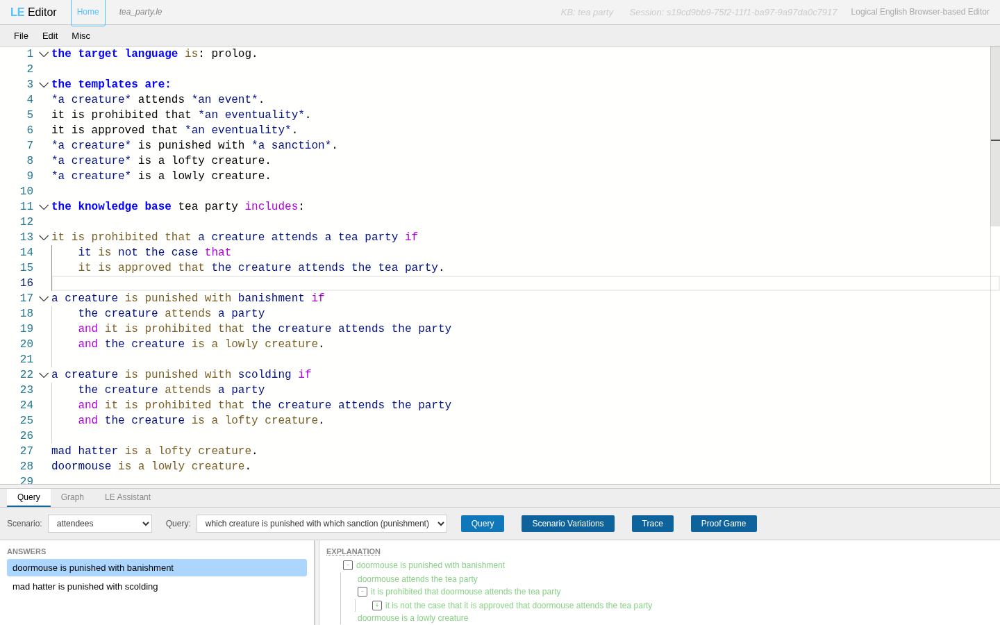

Two answers appear on the left:

- *doormouse is punished with banishment*
- *mad hatter is punished with scolding*

Alice is absent from the list — exactly right, since her attendance was approved and
so nothing about her is prohibited. (Justice at the tea party is swift but fair.)

> The **Query** button is disabled while your program has errors. If it's greyed out,
> check the editor for red squiggles first.

---

## 4. Reading explanations

Click an answer — say *doormouse is punished with banishment* — and the **EXPLANATION**
panel on the right draws the reasoning as a tree:

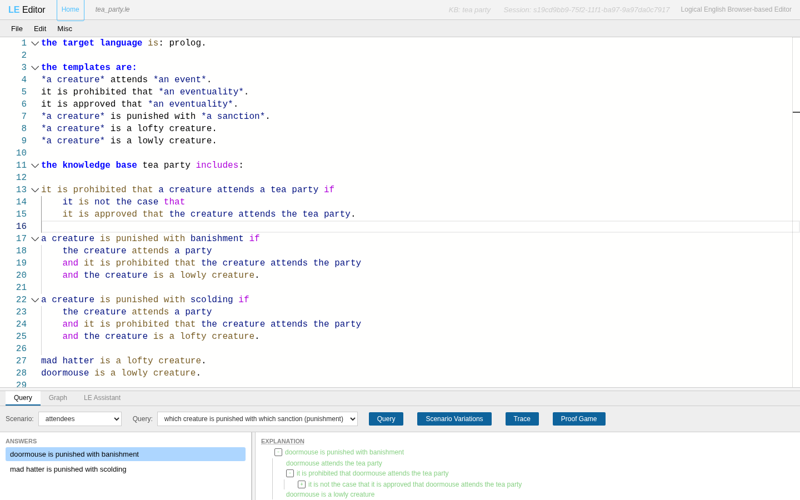

Each tree node is one condition, colour‑coded by status:

- **green** — proven true;
- **red** — could not be proven;
- **amber** — *unknown*: neither proved nor refuted, but assumed true (more on this
  in §8).

Here every node is green: the doormouse attends the tea party, it is prohibited (the
inner "it is not the case that it is approved…" holds), and the doormouse is a lowly
creature. Notice that the negation node reads as a positive success — the prohibition
holds precisely *because* approval could not be found.

Two handy moves:

- **Click any node** and the editor scrolls to — and highlights — the exact rule or
  fact that produced it. Great for "where did *that* come from?"
- **Expand/collapse** with the `−`/`+` toggles. The top two levels open by default.

---

## 5. Example 2 — `happy_dragon`: negation and "for all cases"

Load `happy_dragon`. It's short but introduces two ideas: negation feeding into a
conclusion, and **universal quantification**.

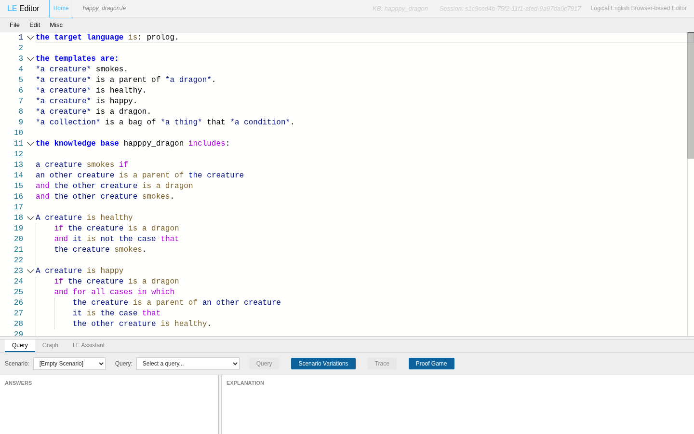

```le
A creature is healthy
    if the creature is a dragon
    and it is not the case that
	the creature smokes.

A creature is happy
    if the creature is a dragon
    and for all cases in which
	    the creature is a parent of an other creature
		it is the case that
		the other creature is healthy.
```

- **Healthy** uses negation: a dragon is healthy if it does *not* smoke.
- **Happy** uses **`for all cases in which … it is the case that …`**: a dragon is
  happy when *every* one of its children is healthy. A dragon with no children is
  happy vacuously — the universal is satisfied when there's nothing to check.

Also note `an other creature`: the qualifier **other** makes it a *distinct*
`creature` variable from `the creature`, so a dragon isn't accidentally required to
be its own parent. (Small word, big consequence.)

Run scenario `smoky` with query `which dragon is happy (happy)`, then click
*alice is happy*:

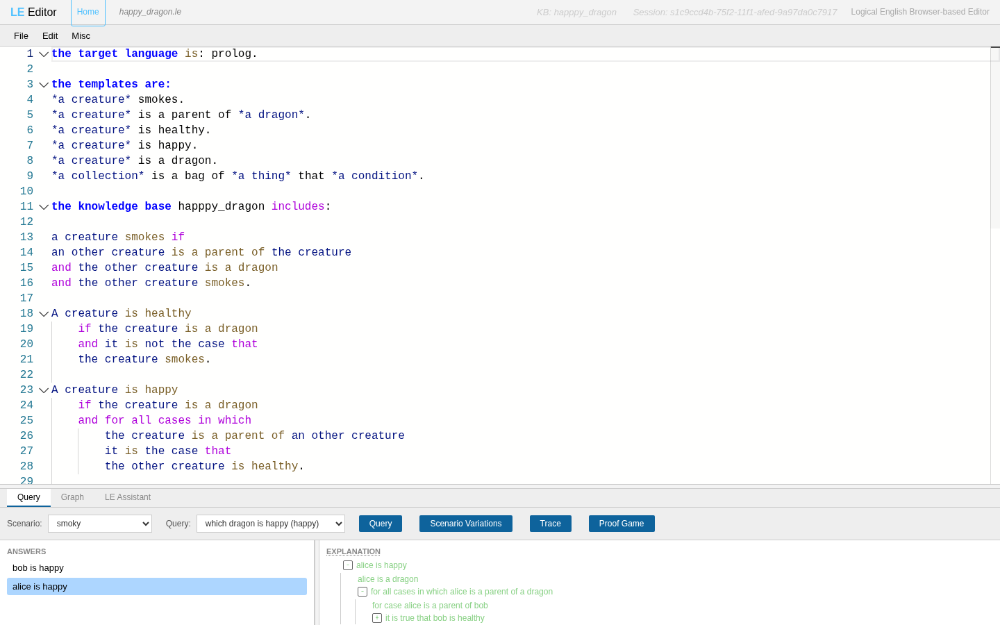

Both `bob` and `alice` are happy. Alice's explanation contains a **for all cases in
which alice is a parent of a dragon** tree node, expanding to the one case that matters
(alice is a parent of bob) and confirming bob is healthy. The universal became a
concrete, checkable list — which is exactly what makes LE explanations pleasant to
read.

---

## 6. Example 3 — `citizenship`: a real little rulebook

Time for something with the flavour of actual law. `citizenship` is a miniature
homage to the classic British Nationality Act formalisation. Load it:

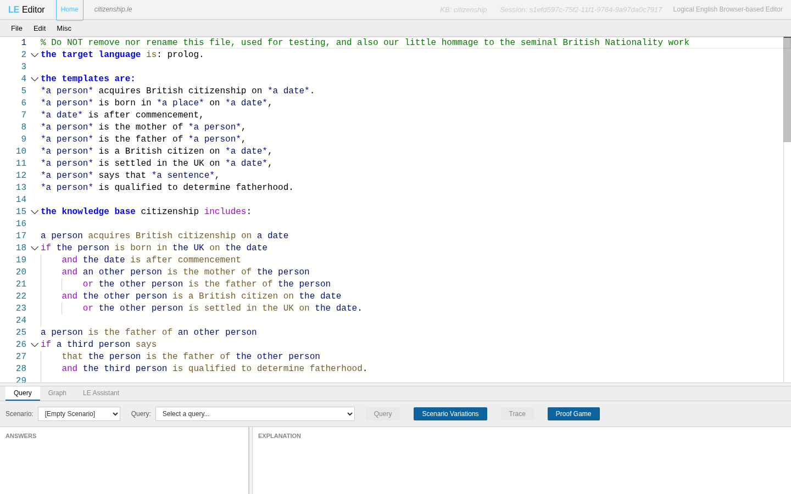

The central rule:

```le
a person acquires British citizenship on a date
if the person is born in the UK on the date
	and the date is after commencement
	and an other person is the mother of the person
    	or the other person is the father of the person
	and the other person is a British citizen on the date
    	or the other person is settled in the UK on the date.
```

In words: you acquire citizenship if you were born in the UK after commencement and a
parent (mother *or* father) was, at the time, a British citizen *or* settled in the
UK. This one rule mixes `and`/`or` and shares the variable `an other person` across
the parent conditions — the same parent must satisfy both the "is a parent" and the
"citizen/settled" parts.

The program also shows off **meta‑templates** — sentences that take other sentences
as arguments:

```le
a person is the father of an other person
if a third person says
    that the person is the father of the other person
    and the third person is qualified to determine fatherhood.
```

`says that …` lets one fact be *about* another sentence. And dates
(`2021-10-09`) are first‑class values you can compare with `after`/`before`.

Run scenario `alice` with query `one` and click the answer:

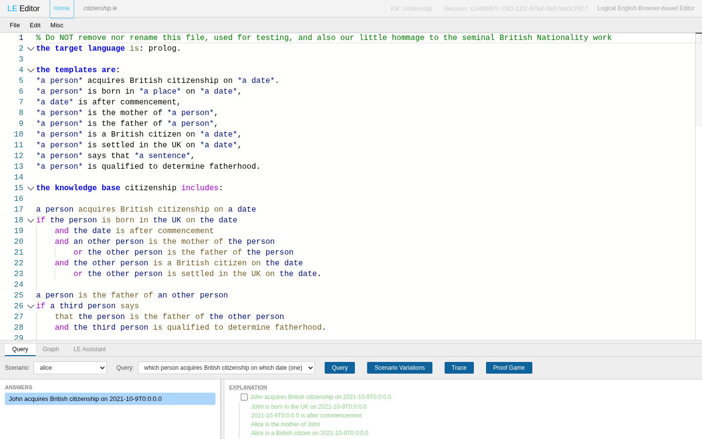

*John acquires British citizenship on 2021‑10‑9…* — proven green all the way down:
John was born in the UK after commencement, Alice is his mother, and Alice is a
British citizen. So far, so lawful. Now let's start meddling.

---

## 7. Scenario Variations: playing "what if"

Scenarios in the file are fixed. But real questions are usually *"…and what if they
weren't?"* The **Scenario Variations** window lets you take a scenario, change the
facts, and re‑run queries against the altered version — **without touching your
program**.

With scenario `alice` and query `one` selected in the Query tab, click **Scenario
Variations** (the button between **Query** and **Trace**). A new window opens,
pre‑seeded with that scenario:

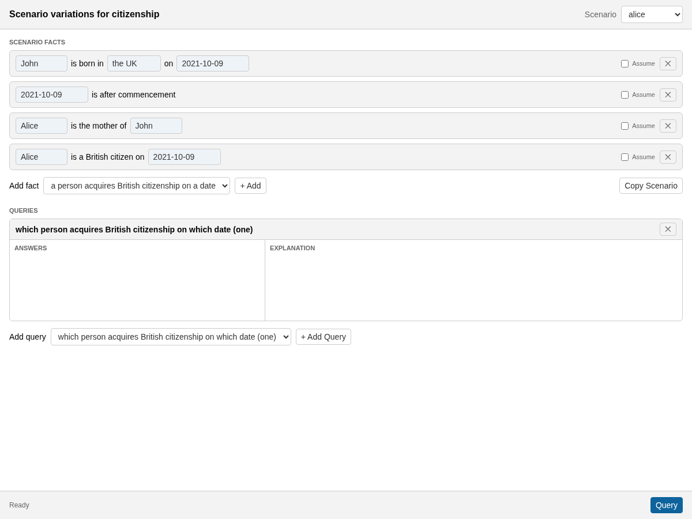

The facts are shown as **fill‑in‑the‑blank forms**, not raw text — so you never have
to remember a template's exact wording. The fixed words are labels; only the
placeholder fields are editable:

> `[John]` is born in `[the UK]` on `[2021-10-09]`

You can edit fields, **✕**‑delete a fact, **Add fact** from a template menu, or tick
**Assume** (next section). The selected query appears as a card below. Hit **Query**
at the bottom to run every listed query against the current facts:


Same green success as before — but now on facts *you* control. The **Query** button
disables itself after a run and re‑enables the moment you change anything, so you
always know whether the results below are current. And because the whole variation is
encoded in the window's URL, you can copy that URL to **share exactly what you're
exploring** with a colleague. (`Copy Scenario` also drops the edited `scenario … is:`
block on your clipboard, ready to paste back into the program.)

---

## 8. Unknowns: assuming your way to an answer

Here's the interesting bit. What if we're *not sure* Alice is a British citizen — we
just want to explore the consequence of assuming she is?

Tick the **Assume** checkbox on the *"Alice is a British citizen on 2021‑10‑09"* row
and re‑run:

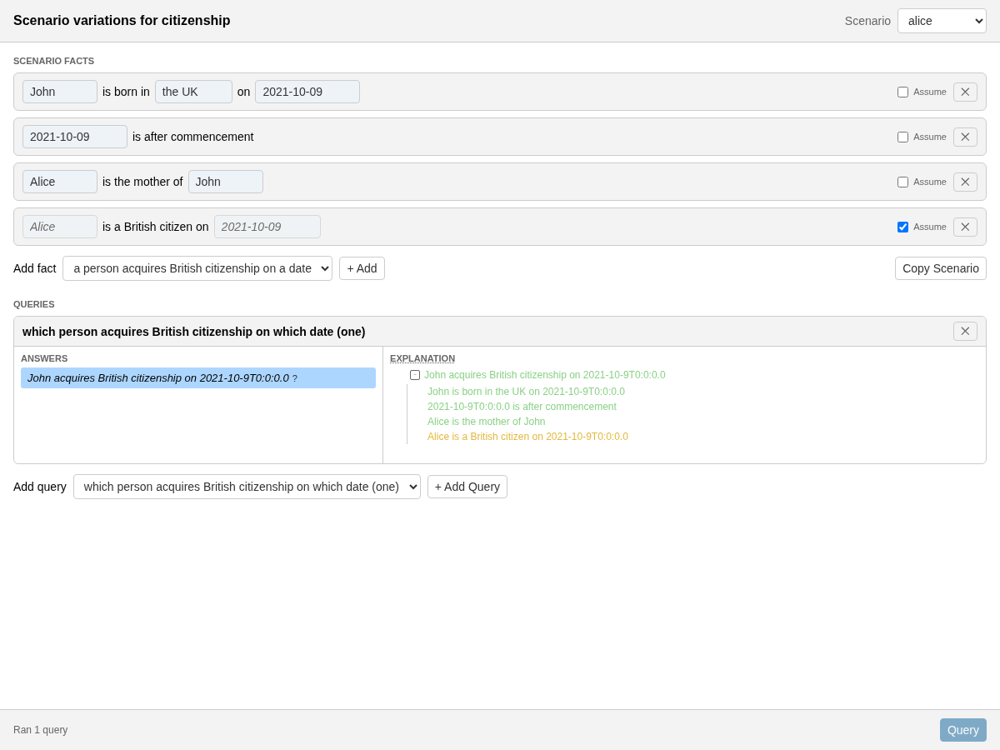

Three things changed:

1. The assumed fact's fields become **non editable** — it's no longer a plain fact but an
   *assumption*. Behind the scenes this rewrites it as
   *"it is unknown whether Alice is a British citizen on 2021‑10‑09."*
2. The answer is still there, but now carries a **`?`** marker — it holds *only under
   an assumption*.
3. In the explanation tree, the *"Alice is a British citizen…"* node is **amber**
   instead of green: it wasn't proven, it was **assumed true because it's unknown**.

This is LE's way of reasoning with incomplete information: *"John would acquire
citizenship — provided Alice is indeed a citizen, which we're currently assuming."*
The amber nodes are precisely the open questions your conclusion still depends on.
Hover an answer's marker (or check the tree's amber nodes) to see the list of
unknowns it rests on.

In addition to scenario facts, templates can also be declared assumable.

---

## 9. Why *not*? Failure explanations

Assumptions make things true; deletions make them false. Delete the *"Alice is a
British citizen…"* fact entirely (its **✕**) and re‑run:

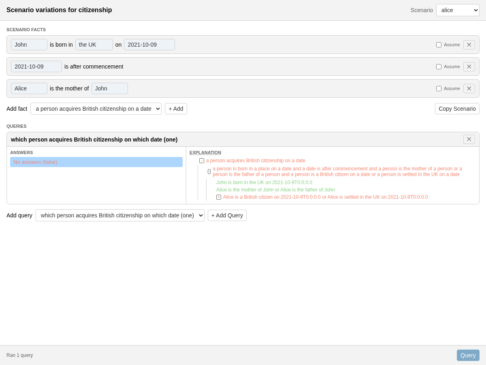

Now the answer is **No answers (false)** — and the explanation turns into a
**why‑not** tree. LE doesn't just shrug; it shows which condition broke. The parent
sub‑goal *"Alice is a British citizen … or Alice is settled in the UK …"* is **red**,
because neither disjunct could be established once we removed the citizenship fact.
The still‑satisfiable parts (born in the UK, after commencement, Alice is the mother)
remain green, so you can see exactly how far the proof got before it stalled.

Failure explanations are often *more* useful than success ones: they tell you the one
fact you'd need to add — or assume — to flip the result.

---

## 10. Explanation preferences and the Explanation Drill

Real rulebooks produce big trees. Two features keep them manageable.

### Preferences

Open **Misc → EXPLANATIONS → Preferences…**:

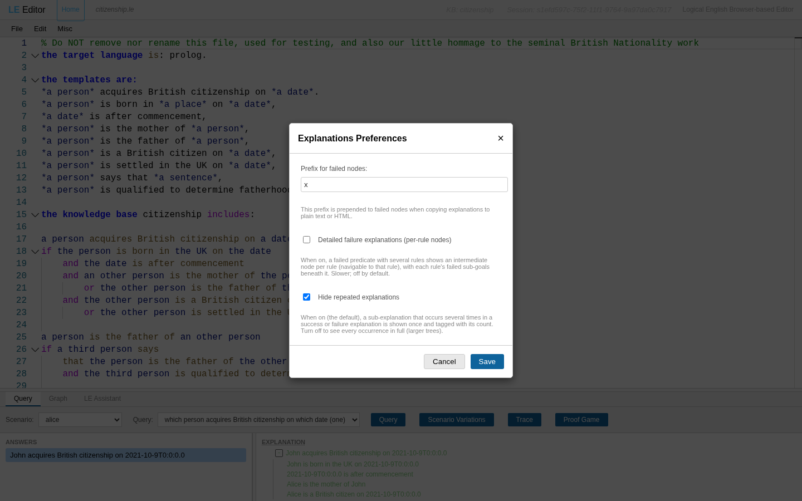

- **Hide repeated explanations** (*on by default, keep it on*): large trees — failure
  trees especially — repeat the same sub‑proof many times. This collapses each repeat
  to a single italic line tagged with its occurrence count, so you see the *shape* of
  the reasoning instead of a wall of duplicates.
- **Detailed failure explanations (per‑rule nodes):** when on, a failed goal trying
   several rules shows one node per rule. Thorough, but slower — off by default.
- **Prefix for failed nodes:** text prepended to failed nodes when you **Copy
  Explanation** (handy when pasting into somewhere that loses the colours).

Also worth a mention from the **Misc** menu: **Hierarchical Numbering** prefixes each
node with its position (`1.2.3`) — invaluable when discussing a specific step with
someone else.

### The Explanation Drill

For "there are forty nodes and I only care about *the* reason," use the
**Explanation Drill**. Right‑click the **EXPLANATION** title and choose **Explanation
Drill…**. A separate window opens and walks you through the proof as a sequence of
yes/no questions:

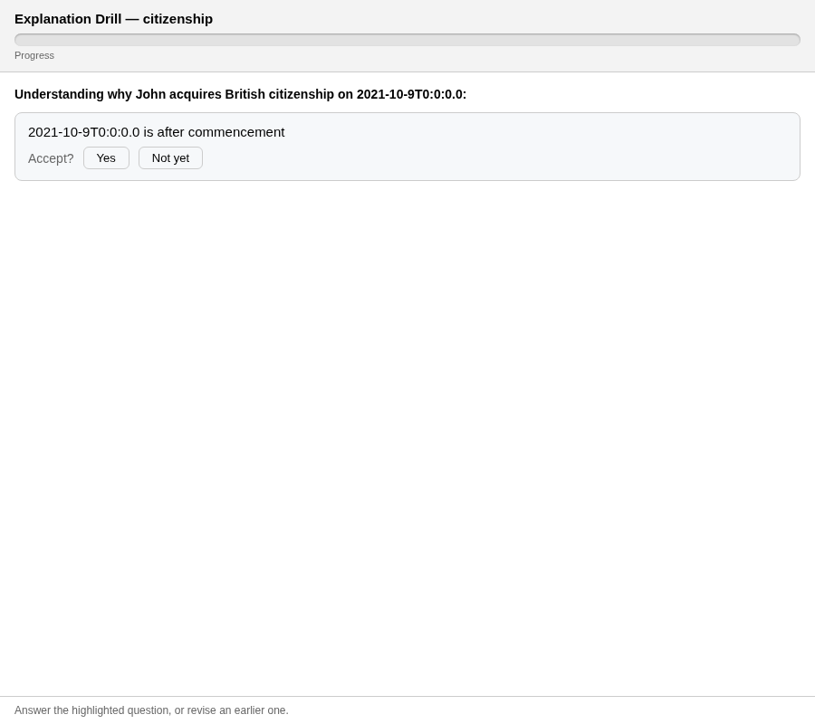

At each step it shows the **most important reason** of what's left and asks
**Accept?**:

- **Yes** — "I get that part"; it's set aside and the drill moves to the next most
  important reason.
- **Not yet** — "dig deeper"; the drill descends into that reason and asks about *its*
  most important part.

A progress bar fills as you accept parts, each question highlights its source in the
editor, and you can revise any earlier answer (or **✕** a question) at any time. When
there's nothing left to break down, it says *"Nothing else to show."* It's a systematic way to narrow a big proof down to the single intermediate fact that explains it better.

---

## 11. Where to go next

You now know enough to be dangerous:

- **Templates** declare your vocabulary; **facts** and **rules** (`Head if Body`) say
  what's true; **`and` / `or` / `it is not the case that` / `for all cases in which`**
  build the logic; **scenarios** supply situations; **queries** ask questions.
- The **Query** tab runs them; **explanations** show why; **Scenario Variations** let
  you explore "what if"; **Assume** reasons under uncertainty (amber = unknown); and
  failure trees tell you what's missing.

From here:

- Skim the [language reference](https://github.com/LogicalContracts/LogicalEnglish2/blob/main/docs/le_summary.md)
  for the parts we skipped: aggregates (`sum`, `count`, …), the taxonomy/`is a`
  hierarchy, arithmetic, synonyms, prepositional templates and included resources.
- Read the [editor manual](https://github.com/LogicalContracts/LogicalEnglish2/blob/main/docs/howToUse.md)
  for the Scenario Editor, the Graph view, the **Trace** debugger and the LE
  Assistant.
- Browse the [examples](https://github.com/LogicalContracts/LogicalEnglish2/tree/main/examples/moreExamples)
  — `citizenship_including`, `royal_family`, `subset`, the `tax/` set — and open any
  of them straight from the running system at
  **<https://le2.logicalcontracts.com>**.

Now go write a rule. The tea party awaits, and someone has to decide who gets
banished.
