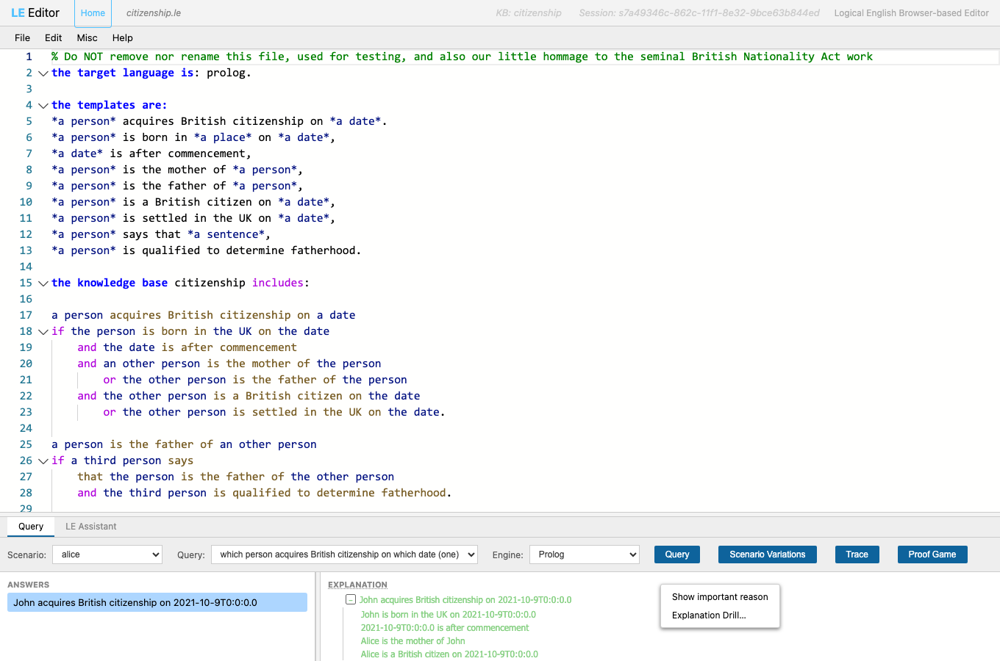
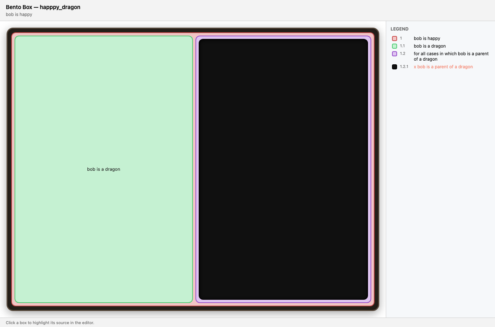
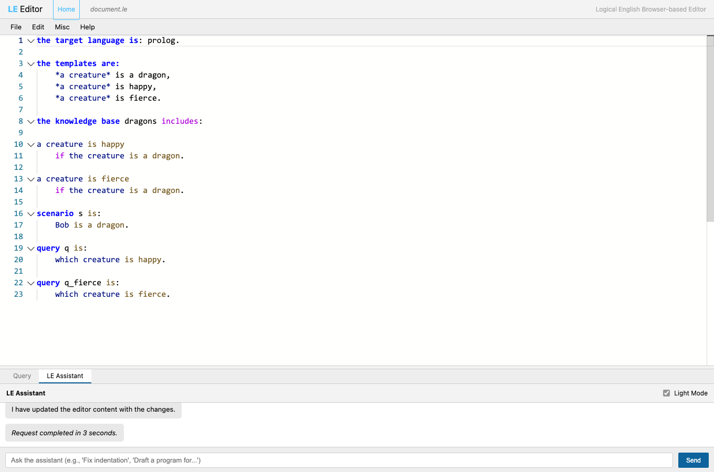
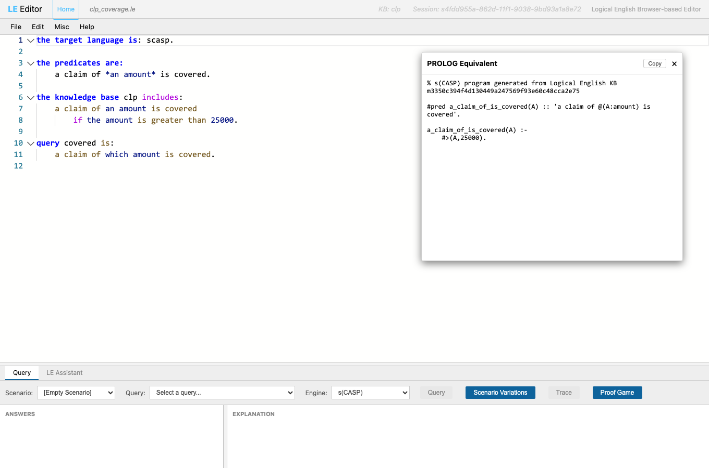
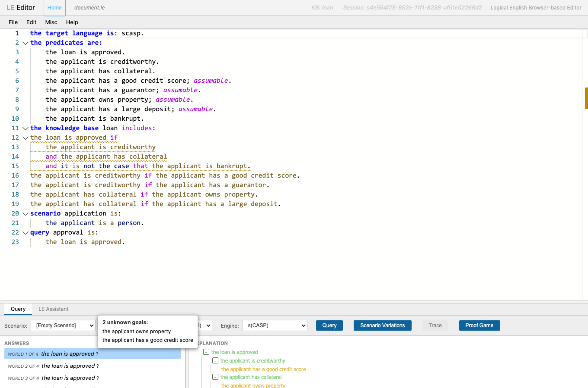
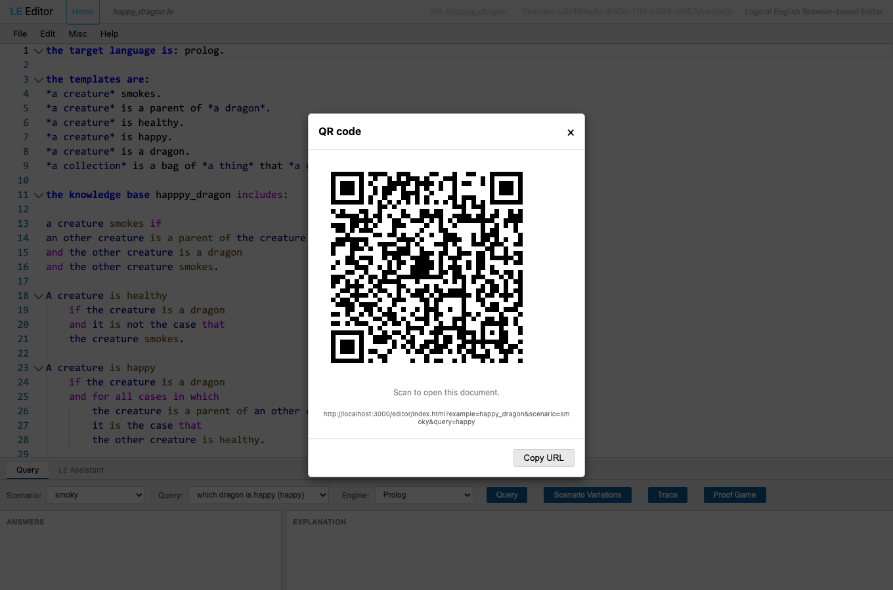

# A Gentle Introduction to Logical English 2

Logical English (LE) lets you write rules, facts and queries in a controlled subset
of English — and then *run* them. No brackets, no `:-`, no semicolons hiding in the
dark. You write something that reads like a contract or a regulation, and the system
turns it into logic it can reason about, complete with human‑readable explanations of
*why* each answer is (or isn't) true.

This tutorial walks through three small programs, from a whimsical tea party to a
(slightly) serious slice of British nationality law, and introduces the web editor's
tools as we go. By the end you will be able to write LE, query it, poke at
"what‑if" scenarios, and interrogate the reasoner until it confesses.

> **Follow along.** Everything here runs in your browser at
> **<https://le2.logicalcontracts.com>** — a public copy of the system. Open the
> editor, then **File → Open copy from server…** and pick the example named in each
> section (`tea_party`, `happy_dragon`, `citizenship`). No install required.

**Reference material** (you won't need it to follow along, but it's there):

- Language reference: [`docs/le_summary.md`](https://github.com/LogicalContracts/LogicalEnglish2/blob/main/docs/le_summary.md)
- Editor manual: [`docs/howToUse.md`](https://github.com/LogicalContracts/LogicalEnglish2/blob/main/docs/howToUse.md)
- All examples: [`examples/moreExamples/`](https://github.com/LogicalContracts/LogicalEnglish2/tree/main/examples/moreExamples)

---

## Contents

- [A Gentle Introduction to Logical English 2](#a-gentle-introduction-to-logical-english-2)
  - [Contents](#contents)
  - [1. The editor at a glance](#1-the-editor-at-a-glance)
  - [2. Example 1 — `tea_party`: language basics](#2-example-1--tea_party-language-basics)
    - [Templates — teaching LE your vocabulary](#templates--teaching-le-your-vocabulary)
    - [Facts](#facts)
    - [Rules](#rules)
    - [Negation, and sentences about sentences](#negation-and-sentences-about-sentences)
    - [Scenarios and queries](#scenarios-and-queries)
  - [3. Running a query](#3-running-a-query)
  - [4. Reading explanations](#4-reading-explanations)
  - [5. Example 2 — `happy_dragon`: "for all cases"](#5-example-2--happy_dragon-for-all-cases)
  - [6. Example 3 — `citizenship`: a real little rulebook](#6-example-3--citizenship-a-real-little-rulebook)
  - [7. Scenario Variations: playing "what if"](#7-scenario-variations-playing-what-if)
  - [8. Unknowns: assuming your way to an answer](#8-unknowns-assuming-your-way-to-an-answer)
  - [9. Why *not*? Failure explanations](#9-why-not-failure-explanations)
  - [10. Explanation preferences and the Explanation Drill](#10-explanation-preferences-and-the-explanation-drill)
    - [Preferences](#preferences)
    - [The Explanation Drill](#the-explanation-drill)
  - [What's new since the summer](#whats-new-since-the-summer)
  - [11. The important reason of an explanation](#11-the-important-reason-of-an-explanation)
  - [12. Bento Box: an explanation as nested boxes](#12-bento-box-an-explanation-as-nested-boxes)
  - [13. The LE Assistant (Light): drafting with an LLM](#13-the-le-assistant-light-drafting-with-an-llm)
  - [14. A second engine: s(CASP)](#14-a-second-engine-scasp)
    - [Seeing the generated s(CASP)](#seeing-the-generated-scasp)
    - [Answers that are *constraints*](#answers-that-are-constraints)
    - [Several possible worlds, and what each assumes](#several-possible-worlds-and-what-each-assumes)
    - [Which engine, when](#which-engine-when)
  - [15. Sharing a program: QR codes](#15-sharing-a-program-qr-codes)
  - [16. Where to go next](#16-where-to-go-next)

---

## 1. The editor at a glance

Open the editor and load `tea_party` (**File → Open copy from server… → tea_party**).


Four regions matter:

- **Header (top):** the filename, the knowledge‑base name (`KB: tea party`) and a
  **Session** id. The session is the live copy of your program on the server; the
  editor loads it for you automatically as you type.
- **Menu bar:** `File`, `Edit`, `Misc`.
- **Code editor (middle):** a Monaco editor with LE syntax highlighting. Keywords
  are bold, `*variables*` and template words are coloured, and errors get red
  squiggles with hover‑to‑fix suggestions.
- **Bottom panel:** tabbed **Query**, **Graph** and **LE Assistant**. This is where
  you run things.

This tutorial's screenshots use the **Light** theme. You'll find it — along with the
other "environmental" knobs we'll meet later — under **Misc**:


Besides the theme and font size, note **Hierarchical Numbering** and the
**EXPLANATIONS → Preferences…** entry; we'll return to both in §10.

---

## 2. Example 1 — `tea_party`: language basics

Every LE program is built from a few kinds of section. Here is `tea_party` in full:

```le
the target language is: prolog.

the templates are:
*a creature* attends *an event*.
it is prohibited that *an eventuality*.
it is approved that *an eventuality*.
*a creature* is punished with *a sanction*.
*a creature* is a lofty creature.
*a creature* is a lowly creature.

the knowledge base tea party includes:

it is prohibited that a creature attends a tea party if
	it is not the case that
	it is approved that the creature attends the tea party.

a creature is punished with banishment if
	the creature attends a party
	and it is prohibited that the creature attends the party
	and the creature is a lowly creature.

a creature is punished with scolding if
	the creature attends a party
	and it is prohibited that the creature attends the party
	and the creature is a lofty creature.

mad hatter is a lofty creature.
doormouse is a lowly creature.

scenario attendees is:
alice attends the tea party.
mad hatter attends the tea party.
doormouse attends the tea party.
it is approved that alice attends the tea party.

query punishment is:
    which creature is punished with which sanction.
```

Let's take it piece by piece.

### Templates — teaching LE your vocabulary

Before you can *say* anything, you declare the sentence patterns you'll use, under
`the templates are:`. Each template is a sentence with its variable slots wrapped in
asterisks:

```le
*a creature* attends *an event*.
*a creature* is punished with *a sanction*.
```

The **head noun** of a starred phrase is its **type** — `creature`, `event`,
`sanction`. The fixed words in between (`attends`, `is punished with`) are what LE
matches against. Think of a template as the schema for a whole family of sentences:
once `*a creature* attends *an event*` exists, `alice attends the tea party` is a
legal fact and `which creature attends which event` is a legal question.

> Filler words like *a*, *an*, *the*, *is*, *are* are ignored during matching, so you
> can write naturally: `the creature attends a party` and `creature attends party`
> match the same template.

### Facts

A **fact** is a template instance ending in a period:

```le
mad hatter is a lofty creature.
doormouse is a lowly creature.
```

`mad hatter` and `doormouse` are constants (lowercase names are fine as constants too).

### Rules

A **rule** is `Head if Body.` The body is a list of conditions joined by `and`
(a new line at the same indentation also means "and") and other connectives. Indentation carries meaning
in LE, so line things up:

```le
a creature is punished with banishment if
	the creature attends a party
	and it is prohibited that the creature attends the party
	and the creature is a lowly creature.
```

Note that `the creature` reuses the variable
introduced by `a creature`: same words ⇒ same individual, throughout a rule.

### Negation, and sentences about sentences

LE does negation‑as‑failure with **`it is not the case that`**. The negated goal
goes on its own indented line beneath it:

```le
it is prohibited that a creature attends a tea party if
	it is not the case that
	it is approved that the creature attends the tea party.
```

In English: attending the tea party is prohibited *unless* it was approved. (There's
also an `unless` keyword that does the same job inline — see the language reference.)

Now look closely at the two templates this rule leans on:

```le
it is prohibited that *an eventuality*.
it is approved that *an eventuality*.
```

The starred slot `*an eventuality*` is not a creature or a date — its value is *another
whole sentence*. The little word **`that`** is what lets one sentence be *about*
another: `it is approved that (the creature attends the tea party)` embeds the sentence
`the creature attends the tea party` as the argument of `it is approved that …`.
Templates that take a sentence where you would otherwise expect a thing are called
**meta‑templates**, and `that` is the join. They are how LE expresses *propositional
attitudes* — prohibition, approval, belief, saying: all the "someone holds that
⟨sentence⟩" constructions of ordinary legal and everyday language. We'll meet another
one (`… says that …`) in the citizenship example.

### Scenarios and queries

A **scenario** is a named bundle of facts to reason over — your test case or your
"situation." A **query** is the question:

```le
scenario attendees is:
alice attends the tea party.
mad hatter attends the tea party.
doormouse attends the tea party.
it is approved that alice attends the tea party.

query punishment is:
    which creature is punished with which sanction.
```

`which creature` / `which sanction` are the things we want filled in. Alice is safe
(her attendance was approved). The Mad Hatter is lofty, the Doormouse lowly — so we
expect a scolding and a banishment respectively. Let's confirm it.

---

## 3. Running a query

In the **Query** tab at the bottom:

1. Pick a **Scenario** — `attendees`.
2. Pick a **Query** — `which creature is punished with which sanction (punishment)`.
3. Click **Query**.


Two answers appear on the left:

- *doormouse is punished with banishment*
- *mad hatter is punished with scolding*

Alice is absent from the list — exactly right, since her attendance was approved and
so nothing about her is prohibited. (Justice at the tea party is swift but fair.)

> The **Query** button is disabled while your program has errors. If it's greyed out,
> check the editor for red squiggles first.

---

## 4. Reading explanations

Click an answer — say *doormouse is punished with banishment* — and the **EXPLANATION**
panel on the right draws the reasoning as a tree:


Each tree node is one condition, colour‑coded by status:

- **green** — proven true;
- **red** — could not be proven;
- **amber** — *unknown*: neither proved nor refuted, but assumed true (more on this
  in §8).

Here every node is green: the doormouse attends the tea party, it is prohibited (the
inner "it is not the case that it is approved…" holds), and the doormouse is a lowly
creature. Notice that the negation node reads as a positive success — the prohibition
holds precisely *because* approval could not be found.

Two handy moves:

- **Click any node** and the editor scrolls to — and highlights — the exact rule or
  fact that produced it. Great for "where did *that* come from?"
- **Expand/collapse** with the `−`/`+` toggles. The top two levels open by default.

---

## 5. Example 2 — `happy_dragon`: "for all cases"

Load `happy_dragon`. It's short, and its job is to introduce one genuinely new
idea — **`forall` conditions** (universal quantification) — while giving the negation
we met at the tea party a second airing in a fresh setting.


```le
A creature is healthy
    if the creature is a dragon
    and it is not the case that
	the creature smokes.

A creature is happy
    if the creature is a dragon
    and for all cases in which
	    the creature is a parent of an other creature
		it is the case that
		the other creature is healthy.
```

- **Healthy** reuses the negation from §2 (`it is not the case that`): a dragon is
  healthy if it does *not* smoke — nothing new here, just the same construct feeding a
  different conclusion.
- **Happy** is where the new idea lives: **`for all cases in which … it is the case
  that …`**. A dragon is happy when *every* one of its children is healthy. A dragon
  with no children is happy vacuously — the universal is satisfied when there's nothing
  to check.

Also note `an other creature`: the qualifier **other** makes it a *distinct*
`creature` variable from `the creature`, so a dragon isn't accidentally required to
be its own parent. (Small word, big consequence.)

Run scenario `smoky` with query `which dragon is happy (happy)`, then click
*alice is happy*:


Both `bob` and `alice` are happy. Alice's explanation contains a **for all cases in
which alice is a parent of a dragon** tree node, expanding to the one case that matters
(alice is a parent of bob) and confirming bob is healthy. The universal became a
concrete, checkable list — which is exactly what makes LE explanations pleasant to
read.

---

## 6. Example 3 — `citizenship`: a real little rulebook

Time for something with the flavour of actual law. `citizenship` is a miniature
homage to the classic British Nationality Act formalisation. Load it:


The central rule:

```le
a person acquires British citizenship on a date
if the person is born in the UK on the date
	and the date is after commencement
	and an other person is the mother of the person
    	or the other person is the father of the person
	and the other person is a British citizen on the date
    	or the other person is settled in the UK on the date.
```

In words: you acquire citizenship if you were born in the UK after commencement and a
parent (mother *or* father) was, at the time, a British citizen *or* settled in the
UK. This one rule mixes `and`/`or` and shares the variable `an other person` across
the parent conditions — the same parent must satisfy both the "is a parent" and the
"citizen/settled" parts.

The program uses another **meta‑template** — the same "sentence about a sentence"
idea we met with `it is approved that …` back at the tea party (§2). This time the
propositional attitude is *saying*:

```le
a person is the father of an other person
if a third person says
    that the person is the father of the other person
    and the third person is qualified to determine fatherhood.
```

`… says that …` again uses `that` to let one fact be *about* another sentence: a third
person's *saying* that someone is the father — together with their being qualified to
determine fatherhood — is what makes the fatherhood hold. And dates (`2021-10-09`) are
first‑class values you can compare with `after`/`before`.

Run scenario `alice` with query `one` and click the answer:


*John acquires British citizenship on 2021‑10‑9…* — proven green all the way down:
John was born in the UK after commencement, Alice is his mother, and Alice is a
British citizen. So far, so lawful. Now let's start meddling.

---

## 7. Scenario Variations: playing "what if"

Scenarios in the file are fixed. But real questions are usually *"…and what if they
weren't?"* The **Scenario Variations** window lets you take a scenario, change the
facts, and re‑run queries against the altered version — **without touching your
program**.

With scenario `alice` and query `one` selected in the Query tab, click **Scenario
Variations** (the button between **Query** and **Trace**). A new window opens,
pre‑seeded with that scenario:


The facts are shown as **fill‑in‑the‑blank forms**, not raw text — so you never have
to remember a template's exact wording. The fixed words are labels; only the
placeholder fields are editable:

> `[John]` is born in `[the UK]` on `[2021-10-09]`

You can edit fields, **✕**‑delete a fact, **Add fact** from a template menu, or tick
**Assume** (next section). The selected query appears as a card below. Hit **Query**
at the bottom to run every listed query against the current facts:


Same green success as before — but now on facts *you* control. The **Query** button
disables itself after a run and re‑enables the moment you change anything, so you
always know whether the results below are current. And because the whole variation is
encoded in the window's URL, you can copy that URL to **share exactly what you're
exploring** with a colleague. (`Copy Scenario` also drops the edited `scenario … is:`
block on your clipboard, ready to paste back into the program.)

---

## 8. Unknowns: assuming your way to an answer

Here's the interesting bit. What if we're *not sure* Alice is a British citizen — we
just want to explore the consequence of assuming she is?

Tick the **Assume** checkbox on the *"Alice is a British citizen on 2021‑10‑09"* row
and re‑run:


Three things changed:

1. The assumed fact's fields become **non editable** — it's no longer a plain fact but an
   *assumption*. Behind the scenes this rewrites it as
   *"it is unknown whether Alice is a British citizen on 2021‑10‑09."*
2. The answer is still there, but now carries a **`?`** marker — it holds *only under
   an assumption*.
3. In the explanation tree, the *"Alice is a British citizen…"* node is **amber**
   instead of green: it wasn't proven, it was **assumed true because it's unknown**.

This is LE's way of reasoning with incomplete information: *"John would acquire
citizenship — provided Alice is indeed a citizen, which we're currently assuming."*
The amber nodes are precisely the open questions your conclusion still depends on.
Hover an answer's marker (or check the tree's amber nodes) to see the list of
unknowns it rests on.

**Assuming a whole predicate, not just a fact.** Ticking **Assume** turns one
*particular* fact into an unknown. Sometimes, though, an entire *kind* of fact is
inherently uncertain, and you want every goal of that shape to be assumable whenever it
can't be proven. For that you mark the **template** itself, adding `; assumable`
(equivalently `; unknown` or `; assumed`) after its declaration:

```le
the templates are:
*a person* is a British citizen on *a date*; assumable.
```

Now *any* "… is a British citizen on …" goal the reasoner cannot prove is
automatically treated as unknown and assumed true — no per‑fact ticking needed — and
every answer that relied on it comes back with the same `?` marker and amber node we
saw above. It's the difference between "assume *this* fact" (the checkbox) and "treat
*this whole predicate* as open" (the template addition). You can still pin a single
instance, in the knowledge base or a scenario, with `it is unknown whether …`:

```le
it is unknown whether Alice is a British citizen on 2021-10-09.
```

(See `; unknown` in the [language reference](https://github.com/LogicalContracts/LogicalEnglish2/blob/main/docs/le_summary.md) for the full story.)

---

## 9. Why *not*? Failure explanations

Assumptions make things true; deletions make them false. Delete the *"Alice is a
British citizen…"* fact entirely (its **✕**) and re‑run:


Now the answer is **No answers (false)** — and the explanation turns into a
**why‑not** tree. LE doesn't just shrug; it shows which condition broke. The parent
sub‑goal *"Alice is a British citizen … or Alice is settled in the UK …"* is **red**,
because neither disjunct could be established once we removed the citizenship fact.
The still‑satisfiable parts (born in the UK, after commencement, Alice is the mother)
remain green, so you can see exactly how far the proof got before it stalled.

Failure explanations are often *more* useful than success ones: they tell you the one
fact you'd need to add — or assume — to flip the result.

---

## 10. Explanation preferences and the Explanation Drill

Real rulebooks produce big trees. Two features keep them manageable.

### Preferences

Open **Misc → EXPLANATIONS → Preferences…**:


- **Hide repeated explanations** (*on by default, keep it on*): large trees — failure
  trees especially — repeat the same sub‑proof many times. This collapses each repeat
  to a single italic line tagged with its occurrence count, so you see the *shape* of
  the reasoning instead of a wall of duplicates.
- **Detailed failure explanations (per‑rule nodes):** when on, a failed goal trying
   several rules shows one node per rule. Thorough, but slower — off by default.
- **Prefix for failed nodes:** text prepended to failed nodes when you **Copy
  Explanation** (handy when pasting into somewhere that loses the colours).

Also worth a mention from the **Misc** menu: **Hierarchical Numbering** prefixes each
node with its position (`1.2.3`) — invaluable when discussing a specific step with
someone else.

### The Explanation Drill

For "there are forty nodes and I only care about *the* reason," use the
**Explanation Drill**. Right‑click the **EXPLANATION** title and choose **Explanation
Drill…**. A separate window opens and walks you through the proof as a sequence of
yes/no questions:


At each step it shows the **most important reason** of what's left and asks
**Accept?**:

- **Yes** — "I get that part"; it's set aside and the drill moves to the next most
  important reason.
- **Not yet** — "dig deeper"; the drill descends into that reason and asks about *its*
  most important part.

A progress bar fills as you accept parts, each question highlights its source in the
editor, and you can revise any earlier answer (or **✕** a question) at any time. When
there's nothing left to break down, it says *"Nothing else to show."* It's a systematic way to narrow a big proof down to the single intermediate fact that explains it better.

---

## What's new since the summer

The five sections that follow cover capabilities added after this tutorial's
first draft. They build on everything above — same programs, same editor — so you
can try each on an example you already know.

- **§11 The important reason** — the one node that best explains an answer.
- **§12 Bento Box** — the explanation tree drawn as nested boxes.
- **§13 The LE Assistant (Light)** — write and fix LE by asking an LLM, in‑panel.
- **§14 s(CASP)** — a second reasoning engine, with constraint answers and
  multiple "possible worlds".
- **§15 QR codes** — put a whole program (or a link to one) on a phone.

---

## 11. The important reason of an explanation

A big proof has many true nodes, but usually *one* of them is the crux — the
intermediate fact that most explains why the answer holds (or, for a failure, the
condition whose absence sank it). LE computes this **important reason** for every
answer and offers two ways to see it.

Run `citizenship` with scenario `alice`, query `one`, and click the answer. The
**EXPLANATION** title now carries the reason as a tooltip (its dotted underline is
the hint) — and **right‑click the title** for the action:



Choose **Show important reason** and the tree expands straight to that node, opens
it one level, and flashes it — no hunting through forty green lines. This is the
same notion the **Explanation Drill** (§10) walks you through step by step; here it
is a single jump to the headline.

Two preferences (Misc → **EXPLANATIONS → Preferences…**) shape it:

- **Larger important reasons** (*on by default*): for a *failed* query, instead of a
  single deepest culprit it lists all the equally‑deep dead ends as
  *"it is not the case that X, nor that Y, nor that Z"* (truncated after the third).
  One glance at everything you'd need to fix.
- The reason is deliberately **invariant** to the "Detailed failure explanations"
  setting — turning per‑rule nodes on or off never changes *which* fact is called
  the important one.

---

## 12. Bento Box: an explanation as nested boxes

The tree is not the only way to read a proof. **Bento Box** draws the same
explanation as a set of *nested compartments*: the outer box is the rule that
proved the answer, the boxes inside it are that rule's conditions, and the
innermost leaves are the facts. It turns "how does this proof decompose?" into a
picture you take in at a glance.

Load `happy_dragon` (scenario `smoky`, query `happy`), run it, then **right‑click
an answer → Bento Box…**. A new window opens:



- Each compartment has its own colour, keyed to the **Legend** on the right (with
  the same hierarchical numbers as §10's numbering).
- **Hover** a box for its sentence; **click** it to highlight the source rule/fact
  back in the editor — exactly like clicking a tree node.
- A **failed** or vacuous branch is an empty dark compartment. Here the *"for all
  cases in which bob is a parent of a dragon"* box is dark because bob has no
  dragon children — the universal held vacuously, so there was nothing to draw
  inside it.

Bento Box is especially good for showing *shape* — how much of an answer rests on
one fat rule versus many small ones.

---

## 13. The LE Assistant (Light): drafting with an LLM

You don't have to write every template and rule by hand. The **LE Assistant** tab
(next to **Query**) is a chat panel where you ask, in plain English, for the change
you want — *"add a rule…", "fix this warning", "why does scenario 2 fail?"* — and an
LLM edits the program for you, **running the LE verifier and queries in the loop**
so what it hands back actually parses and runs.

There are two modes, chosen by the **Light / Deep** checkbox: **Deep** spawns the
full external agent (file system, web, the works); **Light** — the default — is a
small in‑process loop that only edits your program and calls `verify` / `query`.
Light is fast and needs nothing installed.

Pick a model in **Misc → API Keys…** (the same dialog holds your provider keys; the
public server may already supply one, so you often need no key at all). Then type a
request and **Send**. Here, starting from a two‑rule dragon program, the request was
*"add a rule that a creature is fierce if it is a dragon, with the template it needs,
and a query for it"*:



Behind the scenes the assistant took a few turns — edit the program, run the
verifier, notice the new predicate wasn't tested, add a query, verify again, finish
— and then applied the result to the editor (*"I have updated the editor content
with the changes."*). Notice it did exactly what was asked: a `*a creature* is
fierce` template, the rule, **and** a `q_fierce` query, all wired up and verified in
about three seconds. You stay in control: it's your editor buffer, so **Edit → Undo**
reverts any change you don't like.

> The Assistant is an accelerator, not an oracle — always read what it wrote. But for
> boilerplate (templates, scaffolding a scenario, echoing a rule in a new shape) it
> removes most of the typing.

---

## 14. A second engine: s(CASP)

Everything so far ran on LE's **Prolog** engine. LE can also execute the *same
program* under **s(CASP)** — a goal‑directed Answer Set Programming engine — which
brings three things Prolog can't: answers that are **constraints**, **several
stable models** ("possible worlds") for one query, and **abduction** ("what would
have to be true?"). A program says which engine it prefers in its first line
(`the target language is: scasp.`), and an **Engine** dropdown in the Query tab lets
you switch by hand. (For Prolog‑only programs the picker can be hidden entirely —
Misc → *Show engine choice only for non‑Prolog*.)

### Seeing the generated s(CASP)

LE compiles a *separate* s(CASP) program from your rules. **Right‑click the editor →
See s(CASP)** shows it:



Two things to notice in the output: each LE template becomes a **`#pred`** directive
carrying its English sentence (so s(CASP)'s own explanations read in your domain
language), and the comparison `the amount is greater than 25000` is lowered to the
**constraint** `#>(A, 25000)` — not a test on a fixed number. That last point is the
key to the next feature.

### Answers that are *constraints*

Because comparisons become constraints, s(CASP) can answer a query **with no concrete
scenario at all**. Load `clp_coverage` (it declares `scasp`, so the engine
pre‑selects), pick the `covered` query — no scenario — and hit **Query**:


The answer is not a value but a *phrase*: **"a claim of any amount greater than
25000 is covered."** You asked "which amounts are covered?" and got the condition
itself, rendered through the template. This is how you ask *"under what circumstances
would this hold?"* directly.

### Several possible worlds, and what each assumes

When a program has *assumable* facts (§8's `; assumable`), one query can be true in
**several different ways**. s(CASP) enumerates them as distinct **models**. Here a
loan‑approval program (several assumable applicant attributes) is queried under
s(CASP):



- The answers pane groups results as **"world 1 of 4", "world 2 of 4", …** — one card
  per genuinely distinct world.
- Each carries the familiar **`?`** marker: it holds *under assumptions*. Hover it (or
  read the amber nodes in the tree) to see the **assumption set** — e.g. *"2 unknown
  goals: the applicant owns property, the applicant has a good credit score."* That is
  abduction: the engine tells you what it *had to assume* to make the loan approve, and
  a different world assumes something different.

Negation is richer too: where Prolog shows a failed `not` as a red absence, s(CASP)
*proves* the negation and shows why the inner goal fails, rule by rule.

### Which engine, when

Keep **Prolog** as the default — it is faster and handles aggregates, `prolog` goals
and large fact sets. Reach for **s(CASP)** when you want constraint answers, "what
must be assumed" questions, multiple possible worlds, or a program that loops through
negation (where Prolog may misbehave and the editor will warn you). If s(CASP) can't
express something (aggregates, dates, …) it says so and points you back to Prolog.
The full story is in
[`docs/sCASP_on_LE.md`](https://github.com/LogicalContracts/LogicalEnglish2/blob/main/docs/sCASP_on_LE.md).

---

## 15. Sharing a program: QR codes

We've already met two ways to share: an **example URL** (`?example=…&scenario=…`)
and a Scenario Variations link (§7). For handing a program to someone on a phone —
in a talk, a classroom, across a desk — there's **File → QR code…**:



Scanning it opens the exact program, scenario and query in the recipient's browser.
A server example travels as its short parameterized URL; an **edited, unsaved**
document is compressed straight into the link (a `#lzp=` fragment the editor
inflates on load), so even a program that lives nowhere but your editor is
shareable. If a document is too big to fit a scannable code, the dialog says so
rather than producing an unreadable one — reach for **File → Save** and share the
server link instead.

---

## 16. Where to go next

You now know enough to be dangerous:

- **Templates** declare your vocabulary; **facts** and **rules** (`Head if Body`) say
  what's true; **`and` / `or` / `it is not the case that` / `for all cases in which`**
  build the logic; **scenarios** supply situations; **queries** ask questions.
- The **Query** tab runs them; **explanations** show why (as a tree, as the
  **important reason**, or as a **Bento Box**); **Scenario Variations** let you
  explore "what if"; **Assume** reasons under uncertainty (amber = unknown); and
  failure trees tell you what's missing.
- The **LE Assistant (Light)** drafts and fixes LE for you; the **s(CASP)** engine
  adds constraint answers and multiple possible worlds; **QR codes** hand a program
  to a phone.

From here:

- Skim the [language reference](https://github.com/LogicalContracts/LogicalEnglish2/blob/main/docs/le_summary.md)
  for the parts we skipped: aggregates (`sum`, `count`, …), the taxonomy/`is a`
  hierarchy, arithmetic, synonyms, prepositional templates and included resources.
- Read the [editor manual](https://github.com/LogicalContracts/LogicalEnglish2/blob/main/docs/howToUse.md)
  for the Scenario Editor, the Graph view and the **Trace** debugger, and
  [`docs/sCASP_on_LE.md`](https://github.com/LogicalContracts/LogicalEnglish2/blob/main/docs/sCASP_on_LE.md)
  for the full dual‑engine story.
- Browse the [examples](https://github.com/LogicalContracts/LogicalEnglish2/tree/main/examples/moreExamples)
  — `citizenship_including`, `royal_family`, `subset`, the `tax/` set — and open any
  of them straight from the running system at
  **<https://le2.logicalcontracts.com>**.

Now go write a rule. The tea party awaits, and someone has to decide who gets
banished.
