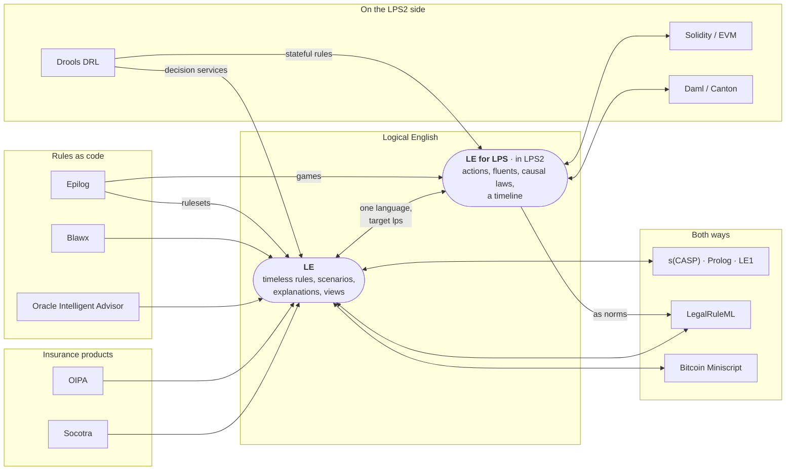

# Other systems: importing and exporting

*Kind: integration guide · Audience: users · Status: current (2026-09-16)*

The editor opens the files of other rule and contract systems as Logical
English (LE). The editor also writes some Logical English programs in another
system's format. Both translations follow fixed rules, so the same file always
gives the same result, and no language model is involved. Each translation
also reports what it could not carry over. This page is the map: which
systems the editor reads and writes, in which direction, and how importing and
exporting work in general. Each system has a document of its own, linked below.

Which systems a server translates depends on which translators are installed
on it. The translators are part of the InsurLE extensions, which the hosted
service has. A server that runs the Logical English software alone has no
translator at all. On such a server **File ▸ Import from Another System…** is
hidden, **File ▸ Open…** offers only `.le` files, and **File ▸ Export to
Another System…** says that no exporter can write the program.

## Contents

- [The map](#the-map)
- [The systems](#the-systems)
- [Opening another system's file](#opening-another-systems-file)
  - [What you get](#what-you-get)
  - [What could not be translated](#what-could-not-be-translated)
- [Show the Original](#show-the-original)
- [Exporting to another system](#exporting-to-another-system)
  - [When an export is refused](#when-an-export-is-refused)
- [The migration twins among the examples](#the-migration-twins-among-the-examples)
- [See also](#see-also)

## The map

Every system below has a translator. An arrow that points into Logical English
is an importer, which reads that system's files. A double arrow means that the
way back exists too, so the editor can also write a program in that system's
format. **LE for LPS** is Logical English with `the target language is: lps.`:
programs that run in time, in the LPS2 IDE (the editor of the sister system,
LPS, or Logic Production System). The systems drawn beside LE for LPS are
documented in LPS2. Click a system in the drawing to open its document.



The LPS2 editor has a map of its own, covering the systems that only LPS2
reads (PDDL, Inform 7):
[other systems in LPS2](https://lps2.logicalcontracts.com/docs/user/integrations/index).

## The systems

| System | Ways | Document |
|---|---|---|
| Bitcoin Miniscript policy or descriptor | import, export | [Bitcoin Miniscript](miniscript.md) |
| LegalRuleML (OASIS) | import, export | [LegalRuleML](legalruleml.md) |
| s(CASP), Prolog, LE1's s(CASP) translations | import; See s(CASP), the s(CASP) engine, the Prolog equivalent | [s(CASP), Prolog and LE1](scasp.md) |
| Blawx project | import | [Blawx](blawx.md) |
| Oracle Intelligent Advisor project or rulebase | import | [Oracle Intelligent Advisor](oia.md) |
| Socotra product configuration | import | [Socotra](socotra.md) |
| Oracle Insurance Policy Administration transaction | import | [OIPA](oipa.md) |
| Epilog program | import (rulesets as LE, games as LE for LPS) | [Epilog](epilog.md) |
| Drools rule base (DRL) | import (LE for LPS, and a decision service in LE) | [Drools, in the LPS2 documentation](https://lps2.logicalcontracts.com/docs/user/integrations/drools) |
| Solidity contract | import (LE for LPS); Deploy as Solidity in LPS2 | [Solidity, in the LPS2 documentation](https://lps2.logicalcontracts.com/docs/user/integrations/solidity) |
| Daml (Canton) | import, export (LE for LPS) | [Daml, in the LPS2 documentation](https://lps2.logicalcontracts.com/docs/user/integrations/daml) |

## Opening another system's file

**File ▸ Open…** takes a Logical English file (`.le`), or a file of any system
the server has a translator for. **File ▸ Import from Another System…** does
the same, but offers only the other systems' files. Rest the pointer on that
menu item, and a small label (a tooltip) lists the systems this server
translates from.

The editor sends the file to the server. The server translates the file and
opens the result in a new tab. A note under the menu bar says which translator
did the work, how many fragments of the file could not be translated, and
whatever else the translator has to report. For a migration, the note gives
the counts of the translator's ledger, a record of the source explained below.
Close the note with its `×`.

Several translators may read files whose names end the same way (`zip`, `xml`,
`json`, `txt`). Each of those translators looks at the file, and the one that
recognises the file translates it. A zipped project is unpacked on the server.
An archive holding a single folder is read as that folder.

Programs in **Logical English for LPS** (`the target language is: lps.`) run in
time rather than answering queries. For such a program the editor shows
**Run in LPS** and **Legal View**, and running the program needs the LPS2
server; see
[the editor guide](../guide/editor.md#advanced-features).

### What you get

The translation is an ordinary Logical English program. You can query the
program, edit it, and save it with **File ▸ Save As…**. When the source file
has tests of its own, the translator writes them as scenarios, each with an
`expects answers` line. **Misc ▸ Run the Program's Tests…** then shows which
of those tests the program reproduces. A migration also writes a *ledger*
beside the program (`<name>.ledger.md`): a table with one row for each element
of the source. Each row says whether the element was *encoded*, *approximated*
(with a note on how its meaning changed) or left as *residue*. The ledger also
says how many of the source's tests the program passes.

The server keeps the file you uploaded, and its translation, for a day in a
folder of their own. The files the program includes, and the documents it
cites, are kept in that folder too, so citations and **Show the Original**
keep working while you work on the program. Save the program if you want to
keep it for longer.

### What could not be translated

A translator never gives up on the whole file because of one fragment it
cannot read. The translator writes such a fragment into the program as a
comment, whose first line starts with `% TODO` and is followed by the fragment
word for word. A migration marks the fragment as a *residue block*:

```le
% RESIDUE r3 BEGIN: the collision rating plugin
%   source: plugins/rating.js lines 40-61
%   ...
% RESIDUE r3 END
```

You can translate a residue block by hand. The Contract Assistant's
*Migration residue* mode can also do the work: the assistant translates the
residue blocks and nothing else, then runs the program's tests on the result ([assistants](../guide/assistants.md#the-contract-assistant)).

A file that no translator recognises still opens. The editor then shows a
program that holds the file's text inside a TODO comment, together with the
reason no translator took the file. An archive that no translator recognises
is refused.

## Show the Original

**File ▸ Show the Original…** shows the files a program was translated from,
in the source viewer. The files are kept, by convention, in a `sources/`
folder beside the program. File ▸ Open puts an uploaded file there, and the
migration twins among the examples keep their originals there too. When there
is a single file, the file opens straight away. When there are several, the
editor lists them first and you pick one. A program with no `sources/` folder
tells you that no original is kept. Files that are not text (PDF, images,
archives) are not listed, because the viewer shows text only.

A program can also cite one of those files as the text of a document
(`the text of the policy file is at "sources/…"`). In an explanation of an
answer, the § badge beside a cited step opens the passage in that text.

**View Original Text** (in the File menu, and in the menu you get by
right-clicking any line) goes to the passage of the original that the sentence
under the cursor was made from. On a citation the command opens the cited
passage. Elsewhere the command looks in the originals for the rule, fact,
table, template, scenario or query under the cursor. The search follows the
links that the translators write into the program:

- the sentence's label: `rule ps2_tblock1:` finds the element of the source
  whose key is `ps2-tblock1` (names are compared ignoring capital letters,
  `_` and `-`);
- the entries the migration ledger holds about that sentence (their
  `in_program` is the sentence's label or its template): each entry names a
  source element, such as `anc/2`, which is found where the source defines
  `anc`;
- whatever the sentence cites: the document, the anchor in the document's
  published address, and the identifiers that locate the passage
  (`at MathVariable PremiumTaxMV`).

Where the source both defines something and mentions it elsewhere, the
definition wins (`key="…"`, `id="…"`, `"name": "…"`, a clause head at the
start of a line, `def …`). The passage highlighted is the element around the
definition, or the block that starts on the definition's line; for a clause
head, the clauses of the same head that follow are highlighted as well. When
no passage is found, the originals open with a note saying so. A program that
has neither originals nor cited text tells you that it keeps no original text.

## Exporting to another system

**File ▸ Export to Another System…** writes the program of the tab in front in
another system's format. The menu offers only the exporters that apply to that
program. When one exporter applies, the export runs straight away; when
several apply, the editor asks which one to use. The result opens in a window
holding:

- the export's notes, which say what was left behind even though none of the
  program's meaning was lost (comments, queries and expected answers, layout);
- **Copy** and **Save…**;
- a button for each public playground where the result can be opened, when the
  exporter has one;
- the exported text.

The exporters are Bitcoin Miniscript (for spending-policy programs), LegalRuleML
(for ordinary rule programs) and Daml (for LE for LPS programs). For example,
`migration/miniscript/core_2of3_multisig` is offered both Miniscript and
LegalRuleML. The LPS2 editor has the same exporters under **Misc ▸ Export to
another system…**, and one more of its own, **Misc ▸ Deploy as Solidity…**.

### When an export is refused

An exporter first checks whether it can write the program *faithfully*. When
the program uses something the other system cannot express, the exporter
**refuses** and writes nothing: a translation that quietly meant something
else would be worse than no translation at all. A window titled *Not
translated to …* says how many problems were found, and lists each one. When a
problem has a place in the program, the list gives the line as a link that
takes you there, the program's own words at that line, and what the other
system lacks.

Two refusals you can reproduce with the examples:

- `regulatory/eu261_integration` to LegalRuleML: the program has a decision
  table, which LegalRuleML cannot state, and one rule cites a source
  (`according to`) inside `it is not the case that`. The window gives the
  table's line. For the second problem the window points at the `according to`
  itself, and reports the use of `according to`: `it is not the case that` on
  its own exports without difficulty, so the problem lies in what stands
  inside it.
- `migration/miniscript/core_2of3_multisig` to LegalRuleML: the program's
  spending rule counts signatures (`a number N is the count of each K such
  that …`), and LegalRuleML has no aggregates. The Miniscript exporter writes
  that same program.

An integrity constraint (`it must not be true that …`) is a problem for any
system that has no constraints of its own.

The editor refuses in the same way wherever it translates a program into
another language. **See s(CASP)** (in the menu you get by right-clicking in
the editor) and the s(CASP) engine show the same list when the program uses
something s(CASP) cannot state (see [s(CASP)](../reference/scasp.md)).

## The migration twins among the examples

The translators have been run on published programs of their source systems.
The results are called *twins*, and the twins are among the examples: open
them with **File ▸ Open example from server…**, or from the landing page. Each
twin comes with its ledger, its source's tests written as scenarios, and its
`sources/` folder.

- `migration/blawx/…`: Blawx encodings;
- `migration/legalruleml/…`: the examples of the LegalRuleML specification;
- `migration/miniscript/…`: Bitcoin spending policies, each with a custody
  view, flip queries for lost keys, and scenarios confirmed by a recorded
  run on the public Tape network;
- `migration/scasp/…`: s(CASP) programs, including LE1's.

The twins written in Logical English for LPS (Daml, Drools, Solidity) are
among the examples of LPS2. The twins of Oracle Intelligent Advisor, Oracle
Insurance Policy Administration (OIPA), Socotra and Epilog are only on
installations that have the lpsPlus examples (under `lpsPlus/migration/`), and
only for users with access to them.

## See also

- [The editor guide](../guide/editor.md), [the language reference](../reference/language.md).
- [Logical English for LPS](../reference/lps-target.md), and in LPS2:
  [the LE for LPS reference](https://lps2.logicalcontracts.com/docs/user/reference/le-for-lps)
  and [other systems in LPS2](https://lps2.logicalcontracts.com/docs/user/integrations/index).
- How the translators work, the ledger and the residue, for developers:
  [migration](../../dev/migration.md).
