# A Gentle Introduction to Logical English 2

*Kind: tutorial · Audience: users · Status: current (2026-09-16; screenshots of September 2026, those of s(CASP) of July)*

Logical English (LE) lets you write rules, facts and queries in a restricted form of
English — ordinary English, but with a small and carefully chosen set of sentence
shapes — and then *run* them. There are no brackets, no `:-`, no semicolons hiding in
the dark. You write something that reads like a contract or a regulation. The system
turns your sentences into logic it can reason with, and it explains in plain English
*why* each answer is true, or why it is not.

This tutorial walks through three small programs, from a whimsical tea party to a
(slightly) serious slice of British nationality law, and introduces the tools of the
editor — the web page where you write and run a program — as we go. A fourth program,
the Mad Hatter's tea shop, then tours the newer parts of the language: numbers,
cascades, tables, dates, constraints and citations. The tea shop also tours the tools
around the language — tests, the debugger, and screens for the people who use a
program. By the end you will be able to write LE, ask it questions, try out "what if"
situations, and question the reasoner until it confesses.

> **Follow along.** Everything here runs in your browser at
> **<https://le2.logicalcontracts.com>** — a public copy of the system. Open the
> editor, then **File → Open example from server…** and pick the example named in each
> section (`tea_party`, `happy_dragon`, `citizenship`). The tea shop is not kept on
> that public copy: you paste the tea shop in yourself (§16). Nothing to install.

**Reference material** (you won't need the reference material to follow along, but it
is there):

- Language reference: [Logical English syntax summary](../../reference/language.md)
- Editor manual: [How to use the LE2 web application](../../guide/editor.md)
- All examples: [`examples/moreExamples/`](https://github.com/LogicalContracts/LogicalEnglish2/tree/main/examples/moreExamples)

---

## Contents

- [A Gentle Introduction to Logical English 2](#a-gentle-introduction-to-logical-english-2)
  - [Contents](#contents)
  - [1. The editor at a glance](#1-the-editor-at-a-glance)
  - [2. Example 1 — `tea_party`: language basics](#2-example-1--tea_party-language-basics)
    - [Templates — teaching LE your vocabulary](#templates--teaching-le-your-vocabulary)
    - [Facts](#facts)
    - [Rules](#rules)
    - [Negation, and sentences about sentences](#negation-and-sentences-about-sentences)
    - [Scenarios and queries](#scenarios-and-queries)
  - [3. Running a query](#3-running-a-query)
  - [4. Reading explanations](#4-reading-explanations)
  - [5. Example 2 — `happy_dragon`: "for all cases"](#5-example-2--happy_dragon-for-all-cases)
  - [6. Example 3 — `citizenship`: a real little rulebook](#6-example-3--citizenship-a-real-little-rulebook)
  - [7. Scenario Variations: playing "what if"](#7-scenario-variations-playing-what-if)
  - [8. Unknowns: assuming your way to an answer](#8-unknowns-assuming-your-way-to-an-answer)
  - [9. Why *not*? Failure explanations](#9-why-not-failure-explanations)
  - [10. Explanation preferences and the Explanation Drill](#10-explanation-preferences-and-the-explanation-drill)
    - [Preferences](#preferences)
    - [The Explanation Drill](#the-explanation-drill)
  - [11. The important reason of an explanation](#11-the-important-reason-of-an-explanation)
  - [12. Bento Box: an explanation as nested boxes](#12-bento-box-an-explanation-as-nested-boxes)
  - [13. Flip: what would change the answer?](#13-flip-what-would-change-the-answer)
  - [14. Tests: saying what you expect](#14-tests-saying-what-you-expect)
  - [15. When the editor complains: warnings and "?"](#15-when-the-editor-complains-warnings-and-)
  - [16. Example 4 — the tea shop: numbers, cascades, tables, dates](#16-example-4--the-tea-shop-numbers-cascades-tables-dates)
    - [Named constants and arithmetic](#named-constants-and-arithmetic)
    - [`otherwise`: the first alternative that applies](#otherwise-the-first-alternative-that-applies)
    - [A decision table](#a-decision-table)
    - [Calendar months](#calendar-months)
    - [A rule that must never be broken](#a-rule-that-must-never-be-broken)
  - [17. Citing your sources](#17-citing-your-sources)
  - [18. The debugger: breakpoints and steps](#18-the-debugger-breakpoints-and-steps)
  - [19. A screen for the program's users: views](#19-a-screen-for-the-programs-users-views)
  - [20. The LE Assistant: drafting with a language model](#20-the-le-assistant-drafting-with-a-language-model)
  - [21. A second engine: s(CASP)](#21-a-second-engine-scasp)
    - [Seeing the generated s(CASP)](#seeing-the-generated-scasp)
    - [Answers that are *constraints*](#answers-that-are-constraints)
    - [Several possible worlds, and what each assumes](#several-possible-worlds-and-what-each-assumes)
    - [Which engine, when](#which-engine-when)
  - [22. Sharing a program: links and QR codes](#22-sharing-a-program-links-and-qr-codes)
  - [23. Where to go next](#23-where-to-go-next)

---

## 1. The editor at a glance

Open the editor and load `tea_party` (**File → Open example from server… → tea_party**).

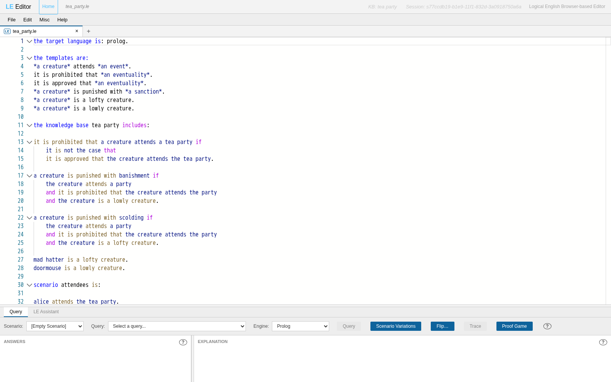

Five regions matter:

- **Header (top):** the file name, the name of the knowledge base — the collection of
  rules and facts the program defines (`KB: tea party`) — and a **Session** number. A
  session is the working copy of your program held by the server, the computer that
  does the reasoning; the editor sets a session up for you when you first need one, as
  soon as you reach for the query pickers, for instance. **Home** goes back to the list
  of examples.
- **Menu bar:** `File`, `Edit`, `Misc` and `Help`. Every menu item shows a short note
  of what the item does when you rest the mouse on it; **Help** lists the
  documentation, this tutorial included.
- **File tabs:** one tab per open document, as in a browser. `+` opens a new, empty
  document; a dot on a tab means the document has changes you have not saved. Each tab
  keeps its own queries, answers and assistant conversation.
- **Code editor (middle):** where you write the program, using the same text editor
  (Monaco) that many programmers use. The editor colours the words of the language,
  and it underlines anything that looks wrong with a wavy line; rest
  the mouse on the wavy line and the editor offers a fix (§15).
- **Bottom panel:** two tabs, **Query** and **LE Assistant**. The bottom panel is
  where you run the program. The small **?** buttons open the part of the
  documentation about the panel they sit in.

This tutorial's screenshots use the **Light** theme, the light‑coloured look of the
editor. You will find the theme setting — along with other settings we will meet
later — under **Misc**:

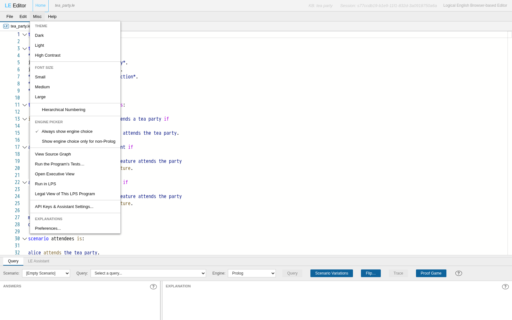

Besides the theme and the font size, note **Hierarchical Numbering**, **Run the
Program's Tests…** (§14), **Open Executive View** (§19) and the **EXPLANATIONS →
Preferences…** entry (§10). (**View Source Graph** draws the program as a diagram of
boxes and arrows showing how its templates, rules and facts connect, in a tab of its
own.)

---

## 2. Example 1 — `tea_party`: language basics

Every LE program is built from a few kinds of section. Here is the whole of
`tea_party`:

```le
the target language is: prolog.

the templates are:
*a creature* attends *an event*.
it is prohibited that *an eventuality*.
it is approved that *an eventuality*.
*a creature* is punished with *a sanction*.
*a creature* is a lofty creature.
*a creature* is a lowly creature.

the knowledge base tea party includes:

it is prohibited that a creature attends a tea party if
	it is not the case that
	it is approved that the creature attends the tea party.

a creature is punished with banishment if
	the creature attends a party
	and it is prohibited that the creature attends the party
	and the creature is a lowly creature.

a creature is punished with scolding if
	the creature attends a party
	and it is prohibited that the creature attends the party
	and the creature is a lofty creature.

mad hatter is a lofty creature.
doormouse is a lowly creature.

scenario attendees is:
alice attends the tea party.
mad hatter attends the tea party.
doormouse attends the tea party.
it is approved that alice attends the tea party.
punishment expects answers ["doormouse is punished with banishment","mad hatter is punished with scolding"].

query punishment is:
    which creature is punished with which sanction.
```

Let's take the program piece by piece. (The `expects answers` line is a test; we come
back to tests in §14.)

### Templates — teaching LE your vocabulary

Before you can *say* anything, you declare the sentence patterns you are going to use,
under `the templates are:`. Each of those patterns is a **template**: a sentence whose
changeable parts — its slots — are wrapped in asterisks:

```le
*a creature* attends *an event*.
*a creature* is punished with *a sanction*.
```

The **head noun** of a starred phrase — its main noun — is its **type**, the kind of
thing that may go in that slot: `creature`, `event`, `sanction`. The fixed words in
between (`attends`, `is punished with`) are the words LE looks for when it matches a
sentence against the template. A template is the shape of a whole family of sentences: once
`*a creature* attends *an event*` exists, `alice attends the tea party` is a sentence
LE accepts as a fact, and `which creature attends which event` is a question it
accepts too.

> LE ignores filler words such as *a*, *an*, *is* and *are* when it matches a sentence
> against a template, so you can write naturally. But *a* and *the* still change the
> *meaning*: `a creature` introduces a variable — a slot waiting to be filled by some
> creature or other — and `the creature` points back to that same creature. A phrase
> beginning with `the` that nothing introduced, such as `the tea party` in a scenario,
> names one particular individual (see [definite descriptions](../../reference/language.md#60-definite-descriptions-back-reference-or-global-constant)).

### Facts

A **fact** is one sentence made from a template, ending in a full stop:

```le
mad hatter is a lofty creature.
doormouse is a lowly creature.
```

`mad hatter` and `doormouse` are constants — names of particular individuals, rather
than slots to be filled. A name in lower case works as a constant just as well as one
that starts with a capital.

### Rules

A **rule** says that something is true if something else is: `Head if Body.` The head
is the conclusion, and the body lists the conditions under which the conclusion holds.
The conditions are joined by `and`, by `or`, and by the other joining words of the
language; starting a new line at the same indentation also means "and". How far a line
is indented changes what a rule means in LE, so line the conditions up:

```le
a creature is punished with banishment if
	the creature attends a party
	and it is prohibited that the creature attends the party
	and the creature is a lowly creature.
```

Note that `the creature` reuses the variable
introduced by `a creature`: the same words mean the same individual, right through a
rule.

### Negation, and sentences about sentences

To say that something is *not* so, LE uses **`it is not the case that`**. LE treats
such a condition as satisfied when it cannot prove the sentence that follows — so
"not" here means "not provable from what the program knows". The denied sentence goes
on its own indented line underneath:

```le
it is prohibited that a creature attends a tea party if
	it is not the case that
	it is approved that the creature attends the tea party.
```

In English: attending the tea party is prohibited *unless* the attendance was
approved.

Now look closely at the two templates the rule leans on:

```le
it is prohibited that *an eventuality*.
it is approved that *an eventuality*.
```

The starred slot `*an eventuality*` does not hold a creature or a date. What fills the
slot is *another whole sentence*. The little word **`that`** is what lets one sentence
be *about* another: in `it is approved that (the creature attends the tea party)`, the
sentence `the creature attends the tea party` sits inside `it is approved that …` as
the thing approved. Templates that take a sentence where you would otherwise expect a
thing are called **meta‑templates**, and `that` is the join. Meta‑templates are how LE
says that someone prohibits, approves, believes or says something — all the "someone
holds that ⟨sentence⟩" phrases of ordinary legal and everyday language. We will meet
another meta‑template, `… says that …`, in the citizenship example.

### Scenarios and queries

A **scenario** is a named bundle of facts for the program to reason over — one case,
one situation. A **query** is the question you ask about that situation:

```le
scenario attendees is:
alice attends the tea party.
mad hatter attends the tea party.
doormouse attends the tea party.
it is approved that alice attends the tea party.

query punishment is:
    which creature is punished with which sanction.
```

`which creature` and `which sanction` are the blanks we want filled in. Alice is safe,
because her attendance was approved. The Mad Hatter is lofty and the Doormouse lowly,
so we expect a scolding for the Hatter and a banishment for the Doormouse. Let's
confirm that.

---

## 3. Running a query

In the **Query** tab at the bottom:

1. Pick a **Scenario** — `attendees`.
2. Pick a **Query** — `which creature is punished with which sanction (punishment)`.
3. Click **Query**.

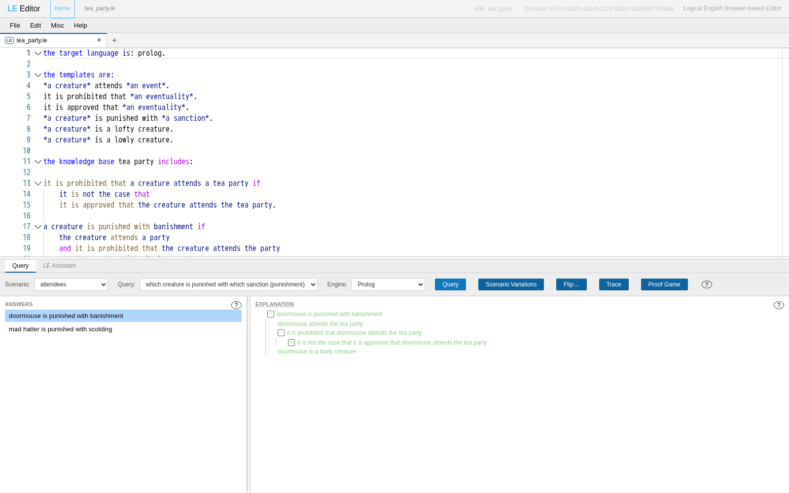

Two answers appear on the left:

- *doormouse is punished with banishment*
- *mad hatter is punished with scolding*

Alice is absent from the list — exactly right, since her attendance was approved and
so nothing about her is prohibited. (Justice at the tea party is swift but fair.)

The web address at the top of the browser now names the example, the scenario and the
query. Copy that address and whoever you send it to gets the same run. The other
buttons in the row — **Scenario Variations**, **Flip…**, **Trace** and **Proof
Game** — each get their turn below. (The **Engine** picker chooses which reasoning
program answers your queries; the picker belongs to §21, so leave it on Prolog for
now.)

> The **Query** button stops working while your program has errors. If the button is
> greyed out, look in the editor for red wavy underlines first. A query still running
> after a couple of seconds shows an **Interrupt** button, which stops it.

---

## 4. Reading explanations

Click an answer — say *doormouse is punished with banishment* — and the **EXPLANATION**
panel on the right draws the reasoning as a tree:

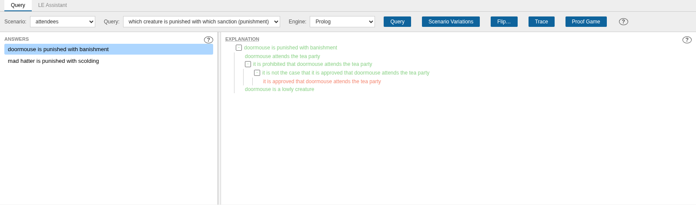

Each line of the tree — each node — is one condition, and its colour says how the
condition fared:

- **green** — proven true;
- **red** — could not be proven;
- **amber** — *unknown*: the reasoner could neither prove the condition nor disprove
  it, and assumed it true (more about unknowns in §8).

Here the doormouse attends the tea party, the attendance is prohibited, and the
doormouse is a lowly creature. Open the prohibition all the way down and you find the
one red line: *it is approved that doormouse attends the tea party*. Red inside a
denial is what the rule wanted — the prohibition holds precisely *because* no approval
could be found, so the *it is not the case that …* above the red line is green.

Two handy moves:

- **Click any line** of the tree and the editor scrolls to the exact rule or fact that
  produced that line, and highlights it. Useful for "where did *that* come from?"
- **Open and close** parts of the tree with the `−` and `+` buttons. The top two
  levels start open.

Right‑click in the tree for **Copy Explanation**, which copies the proof both as plain
text and as formatted text for a word processor, and for **Copy as Mermaid diagram**,
which copies the proof in a form that many writing tools draw as a diagram. Either way
you can paste the proof into a document.

---

## 5. Example 2 — `happy_dragon`: "for all cases"

Load `happy_dragon`. The program is short, and its job is to introduce one genuinely
new idea — **`forall` conditions**, conditions that must hold in *every* case, not
just in one — while giving the denial we met at the tea party a second airing in a
fresh setting.

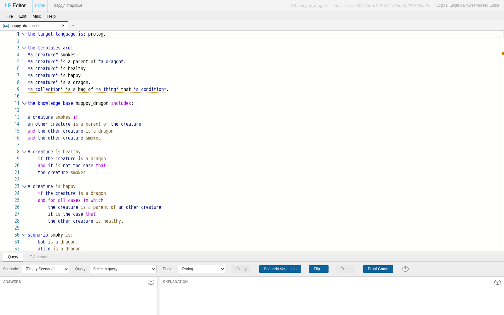

```le
A creature is healthy
    if the creature is a dragon
    and it is not the case that
	the creature smokes.

A creature is happy
    if the creature is a dragon
    and for all cases in which
	    the creature is a parent of an other creature
		it is the case that
		the other creature is healthy.
```

- **Healthy** reuses the denial from §2 (`it is not the case that`): a dragon is
  healthy if the dragon does *not* smoke. Nothing new here — the same construct, used
  to reach a different conclusion.
- **Happy** is where the new idea lives: **`for all cases in which … it is the case
  that …`**. A dragon is happy when *every* one of its children is healthy. A dragon
  with no children is happy as well, because a condition about every child is
  satisfied when there is no child to check.

Also note `an other creature`. The word **other** makes that a *different* `creature`
from `the creature`, so a dragon is not accidentally required to be its own parent.
(Small word, big consequence.)

Run scenario `smoky` with query `which dragon is happy (happy)`, then click
*alice is happy*:

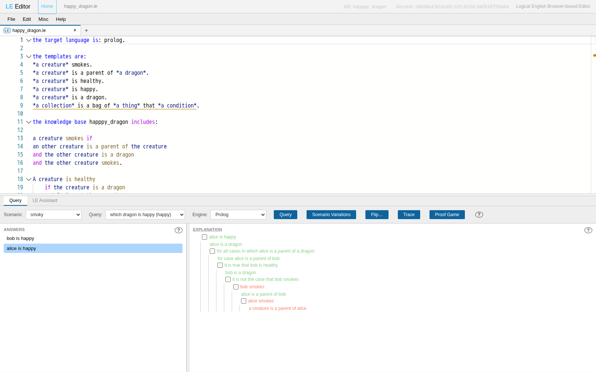

Both `bob` and `alice` are happy. Alice's explanation has a line reading **for all
cases in which alice is a parent of a dragon**. Open that line and you see the one
case that matters, *for case alice is a parent of bob*, and underneath it the proof
that bob is healthy — bob is healthy because *bob smokes* could not be proven, and bob
would smoke only if a parent of his smoked, and nobody is a parent of alice. The "for
all cases" condition has turned into a short list of actual cases you can check one by
one, which is exactly what makes LE explanations pleasant to read.

---

## 6. Example 3 — `citizenship`: a real little rulebook

Time for something with the flavour of actual law. `citizenship` is a miniature
tribute to the classic rendering of the British Nationality Act in logic. Load
`citizenship`:

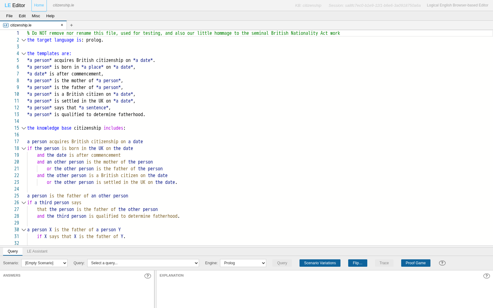

The central rule:

```le
a person acquires British citizenship on a date
if the person is born in the UK on the date
	and the date is after commencement
	and an other person is the mother of the person
    	or the other person is the father of the person
	and the other person is a British citizen on the date
    	or the other person is settled in the UK on the date.
```

In words: you acquire citizenship if you were born in the UK after commencement, and a
parent — mother *or* father — was, at the time, a British citizen *or* settled in the
UK. That one rule mixes `and` with `or`, and it uses the variable `an other person` in
several conditions at once. Because the same words name the same person throughout,
one and the same parent must satisfy both the "is a parent" part and the
"citizen or settled" part.

The program uses another **meta‑template**, the same "sentence about a sentence" idea
we met with `it is approved that …` back at the tea party (§2). This time the sentence
is about someone *saying* something:

```le
a person is the father of an other person
if a third person says
    that the person is the father of the other person
    and the third person is qualified to determine fatherhood.
```

`… says that …` again uses `that` to let one fact be *about* another sentence. A third
person's *saying* that someone is the father, together with that third person being
qualified to determine fatherhood, is what makes the fatherhood hold. Dates such as
`2021-10-09` are ordinary values of the language, and you can compare two of them with
`after` and `before`.

Run scenario `alice` with query `one` and click the answer:

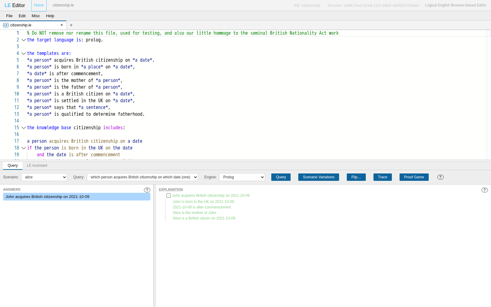

*John acquires British citizenship on 2021‑10‑09*, and every line of the explanation
is green, all the way down: John was born in the UK after commencement, Alice is his
mother, and Alice is a British citizen. So far, so lawful. Now let's start meddling.

---

## 7. Scenario Variations: playing "what if"

The scenarios written in the file are fixed. But the real questions are usually
*"…and what if the facts were otherwise?"* The **Scenario Variations** window lets you
take a scenario, change its facts, and run the queries again against the changed
facts — **without touching your program**.

With scenario `alice` and query `one` selected in the Query tab, click **Scenario
Variations**, the button beside **Query**. A new window opens, already filled in with
the facts of that scenario:

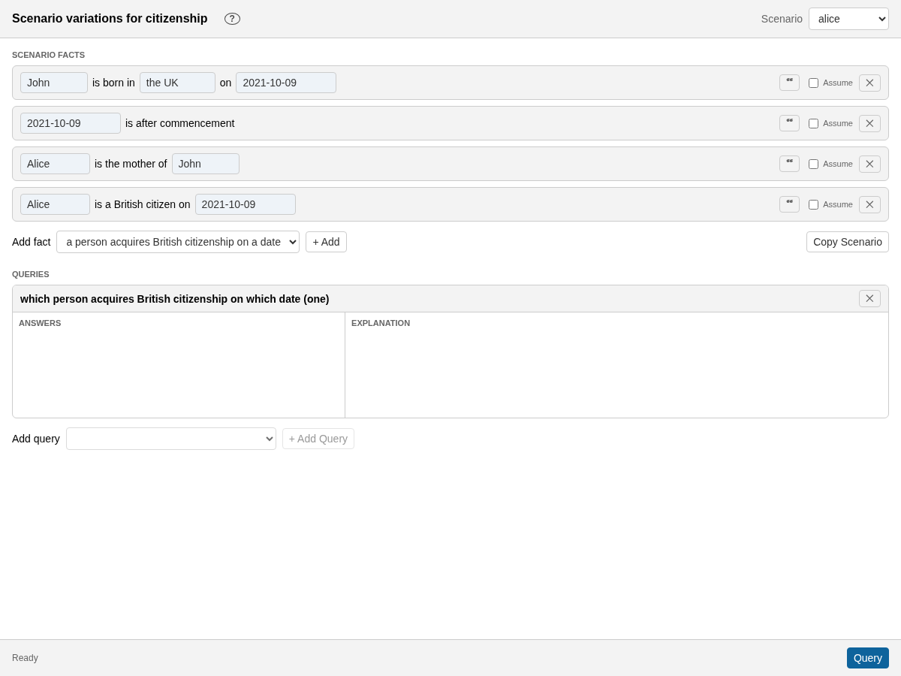

The window shows the facts as **fill‑in‑the‑blank forms** rather than as text you
type, so you never have to remember a template's exact wording. The fixed words of the
template are simply printed; only the blanks can be changed:

> `[John]` is born in `[the UK]` on `[2021-10-09]`

You can change what is in a blank, delete a whole fact with its **✕**, add one with
**Add fact** and a choice of template, tick **Assume** (the next section explains what
assuming does), or use **❝** to note the passage of a document that states the fact
(§17). The query you selected appears as a card below the facts. Press **Query** at
the bottom to run every query listed there against the facts as they now stand:

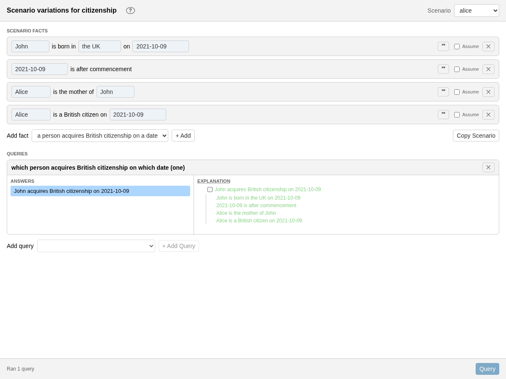

Same green success as before — but now on facts *you* control. The **Query** button
greys itself out after a run, and comes back to life the moment you change anything,
so you always know whether the results below still match the facts above. The whole
variation is written into the window's web address — its URL, short for Uniform
Resource Locator — so copying that address lets you **share exactly what you are
exploring** with a colleague. (**Copy Scenario**
copies the changed `scenario … is:` block instead, ready to paste back into the
program.)

> The same forms edit the program's *own* scenarios: **Edit → Edit Scenarios…** opens
> the Scenario Editor, and **Edit → Edit Queries…** builds queries out of your
> templates in the same way. Both write what you have built back into the program in
> the editor. See the
> [Scenario Editor](../../guide/editor.md#the-scenario-editor) and the
> [Query Editor](../../guide/editor.md#the-query-editor).

---

## 8. Unknowns: assuming your way to an answer

Here's the interesting bit. What if we are *not sure* that Alice is a British citizen,
and we only want to see what follows if we assume she is?

Tick the **Assume** checkbox on the *"Alice is a British citizen on 2021‑10‑09"* row
and re‑run:

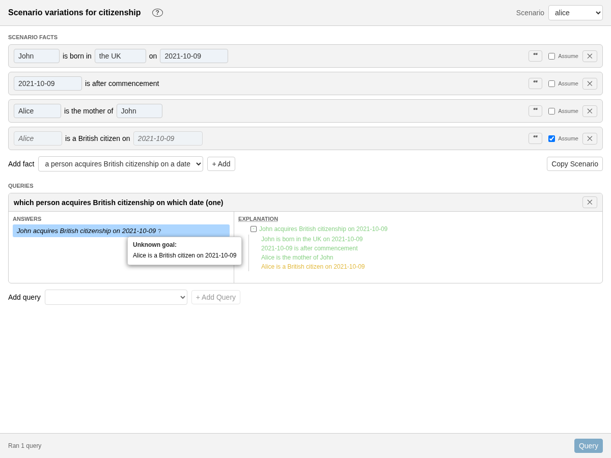

Three things changed:

1. The blanks of the assumed fact can no longer be changed, because the sentence is no
   longer a plain fact but an *assumption*. Ticking the box rewrites the sentence as
   *"it is unknown whether Alice is a British citizen on 2021‑10‑09."*
2. The answer is still there, but now carries a **`?`** marker, which means the answer
   holds *only if the assumption holds*. Rest the mouse on the answer to see the list
   of unknowns the answer rests on.
3. In the explanation tree, the *"Alice is a British citizen…"* line is **amber**
   instead of green. The reasoner did not prove the line; it **assumed the line true,
   because the line is unknown**.

Amber lines are how LE reasons when it does not know everything: *"John would acquire
citizenship — provided Alice is indeed a citizen, which we are currently assuming."*
The amber lines are exactly the open questions your conclusion still depends on.

**Assuming a whole kind of fact, not just one fact.** Ticking **Assume** turns one
*particular* fact into an unknown. Sometimes, though, a whole *kind* of fact is
uncertain by its nature, and you want every sentence of that shape to be assumable
whenever the reasoner cannot prove it. For that you mark the **template** itself,
adding `; assumable` (or `; unknown`, or `; assumed` — the three mean the same) after
the template:

```le
the templates are:
*a person* is a British citizen on *a date*; assumable.
```

Now *any* "… is a British citizen on …" sentence the reasoner cannot prove is treated
as unknown and assumed true, with no ticking of boxes one fact at a time. Every answer
that leant on such a sentence comes back with the same `?` marker and the same amber
line we saw above. The checkbox says "assume *this* fact"; the addition to the
template says "treat *every* sentence of this shape as an open question". You can also
mark a single sentence as open, in the knowledge base or in a scenario, by writing
`it is unknown whether …`:

```le
it is unknown whether Alice is a British citizen on 2021-10-09.
```

(See the [template additions](../../reference/language.md#template-additions-after-)
in the language reference for the full story.)

---

## 9. Why *not*? Failure explanations

Assuming a fact can make an answer appear; deleting a fact can make one disappear.
Delete the *"Alice is a British citizen…"* fact entirely, with its **✕**, and run the
query again:

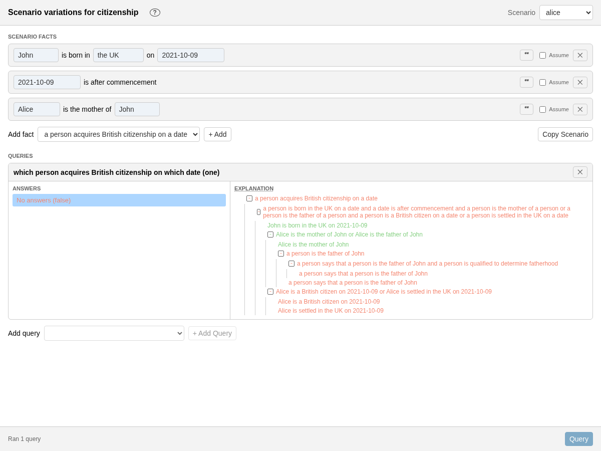

Now the reply is **No answers (false)**, and the explanation becomes a **why‑not**
tree. LE does not merely shrug; the tree shows which condition broke. The condition
*"Alice is a British citizen … or Alice is settled in the UK …"* is **red**, because
neither half of that "or" could be established once we removed the citizenship fact.
The parts that still hold — John is born in the UK, Alice is the mother of John — stay
green, so you can see exactly how far the proof got before it stalled. (The branch
about the father is red too: nobody says who John's father is.)

A why‑not explanation is often *more* useful than a successful one, because it tells
you the one fact you would have to add, or assume, to turn the answer around. In the
Scenario Variations window a right‑click on a red line even offers **Patch scenario —
add this fact** and **Assume fact**. And §13 shows how to ask for that turnaround
directly.

---

## 10. Explanation preferences and the Explanation Drill

Real rulebooks produce big explanation trees. Two features keep a big tree
manageable.

### Preferences

Open **Misc → EXPLANATIONS → Preferences…**:

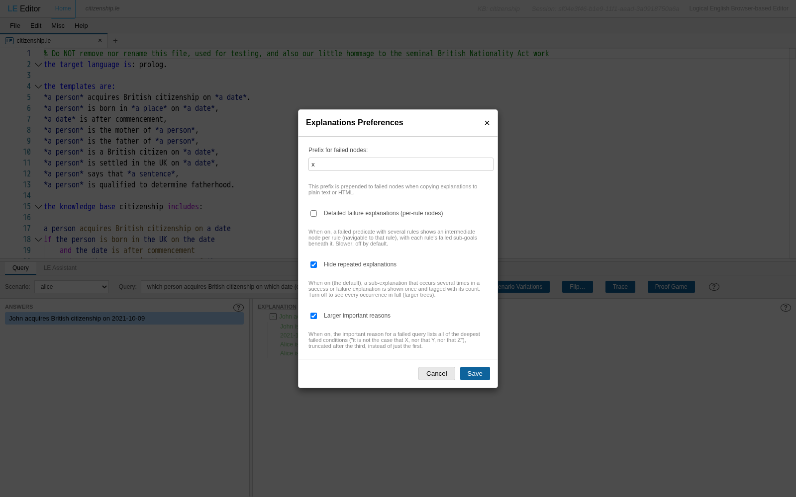

- **Prefix for failed nodes:** words put in front of each failed line when you **Copy
  Explanation**, handy when you paste the explanation somewhere that loses the
  colours.
- **Detailed failure explanations (per‑rule nodes):** when this setting is on, a
   condition that failed after trying several rules shows one line per rule tried.
   Thorough, but slower, so the setting starts off.
- **Hide repeated explanations** (*on to begin with, and best left on*): a large
  tree — a why‑not tree above all — proves the same thing over and over. The setting
  shrinks each repeat to a single line in italics, marked with the number of times it
  occurred, so you see the *shape* of the reasoning instead of a wall of copies.
- **Larger important reasons** — see §11.

One more entry from the **Misc** menu deserves a mention: **Hierarchical Numbering**
puts a number in front of each line saying where the line sits in the tree (`1.2.3`),
which is invaluable when you are discussing one particular step with someone else.

### The Explanation Drill

When the tree has forty lines and you only care about *the* reason, use the
**Explanation Drill**. Right‑click the **EXPLANATION** title and choose **Explanation
Drill…**. A separate window opens and walks you through the proof as a series of
yes‑or‑no questions. Here is the drill running on `happy_dragon`'s *alice is happy*,
after one answer:

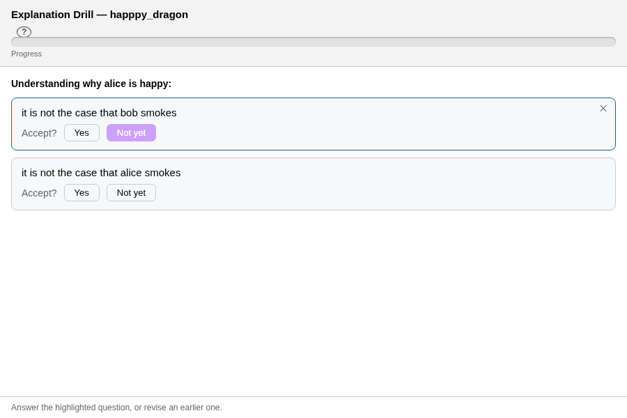

At each step the drill shows the **most important reason** among the parts of the
proof you have not yet dealt with, and asks **Accept?**:

- **Yes** — "I understand that part". The drill sets the part aside and moves on to
  the next most important reason.
- **Not yet** — "dig deeper". The drill goes inside that reason and asks about *its*
  most important part. (Why is bob not a smoker? Because alice, his parent, is not one
  either.)

A progress bar fills as you accept parts, each question highlights in the editor the
rule or fact it came from, and you can change any earlier answer, or drop a question
with its **✕**, at any time. Once you have accepted every part of a reason you had
answered *Not yet*, that reason counts as accepted too, and the drill returns to what
is left around it. When you have accepted everything, the bar is full and the drill
says *"Nothing else to show."* The drill is a systematic way to narrow a big proof
down to the single intermediate fact that explains the answer.

---

## 11. The important reason of an explanation

A big proof has many true lines, but usually *one* line is the crux: the intermediate
fact that most explains why the answer holds or, when the query failed, the condition
whose absence sank the proof. LE works out that **important reason** for every answer,
and offers two ways to see it.

Run `citizenship` with scenario `alice`, query `one`, and click the answer. The
**EXPLANATION** title now shows the reason when you rest the mouse on it — the dotted
underline of the title is the hint. **Right‑click the title** for the action itself:

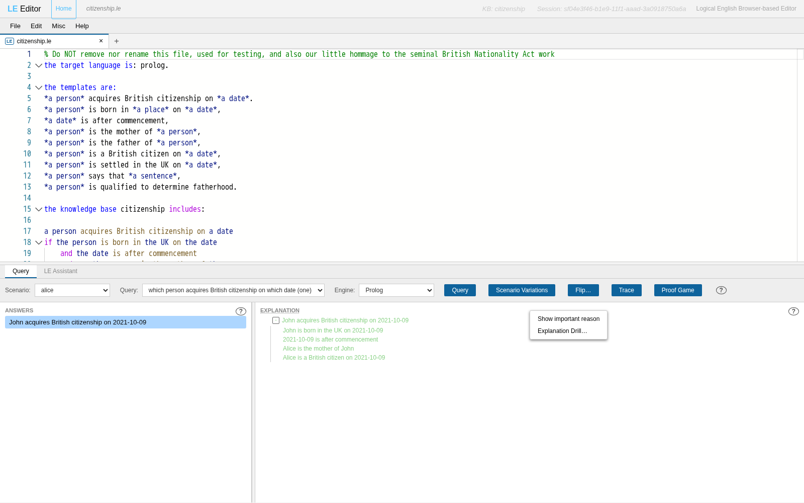

Choose **Show important reason**. The tree opens straight down to the important line,
opens that line one level further, and flashes it — no hunting through forty green
lines. The **Explanation Drill** (§10) walks you to the same place step by step;
**Show important reason** jumps there in one move.

Two things shape the important reason:

- **Larger important reasons** (a setting, *on to begin with*): when a query failed,
  the editor does not name a single deepest culprit but lists every dead end that lies
  equally deep, as *"it is not the case that X, nor that Y, nor that Z"*, stopping
  after the third. One glance shows everything you would have to fix.
- The important reason is deliberately **unaffected** by the "Detailed failure
  explanations" setting. Turning the per‑rule lines on or off never changes *which*
  fact the editor calls the important one.

---

## 12. Bento Box: an explanation as nested boxes

The tree is not the only way to read a proof. **Bento Box** draws the same explanation
as a set of boxes inside boxes: the outer box is the rule that proved the answer, the
boxes inside that box are the rule's conditions, and the smallest boxes of all are the
facts. Bento Box turns "what are the parts of this proof?" into a picture you take in
at a glance.

Load `happy_dragon` (scenario `smoky`, query `happy`), run it, then **right‑click
the answer *alice is happy* → Bento Box…**. A new window opens:

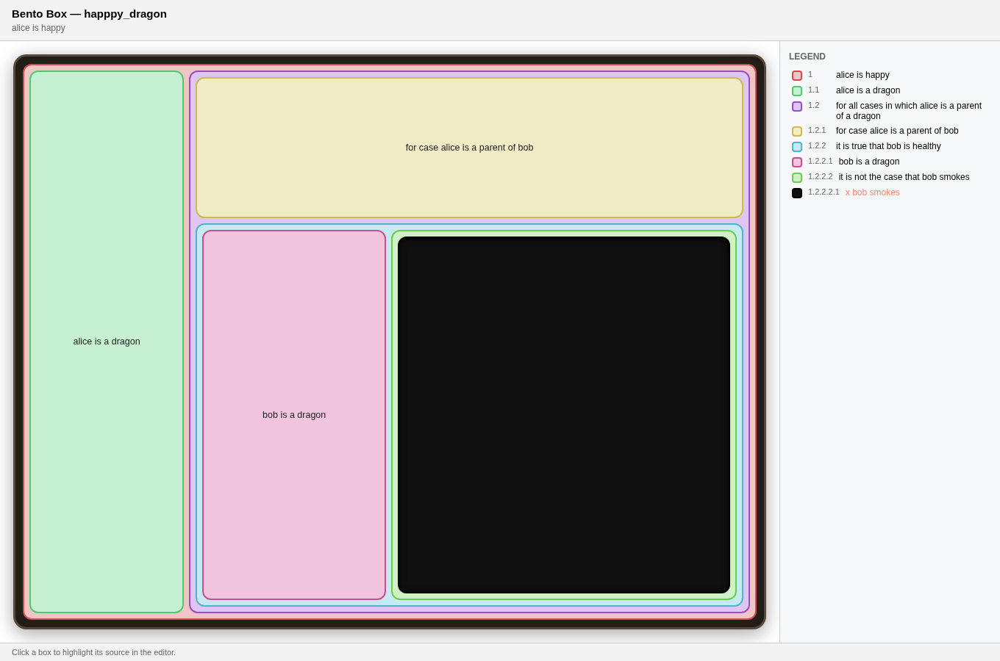

- Each box has its own colour, listed in the **Legend** on the right, with the same
  numbers as the hierarchical numbering of §10.
- Rest the mouse on a box to read its sentence; **click** the box to highlight the
  rule or fact it came from back in the editor, exactly as clicking a line of the tree
  does.
- A branch that failed is an empty dark box. Here the dark box is *bob smokes*, which
  could not be proven — and that failure is exactly what makes *it is not the case
  that bob smokes* hold.

Bento Box is especially good at showing the *shape* of an answer: whether the answer
rests on one big rule or on many small ones.

---

## 13. Flip: what would change the answer?

Scenario Variations lets *you* try one change at a time. A **flip** turns the question
round and asks the program itself: *which smallest changes to the scenario would
change this answer?*

Back in the editor, with `citizenship`, scenario `alice` and query `one`, run the
query, select the answer and click **Flip…**:

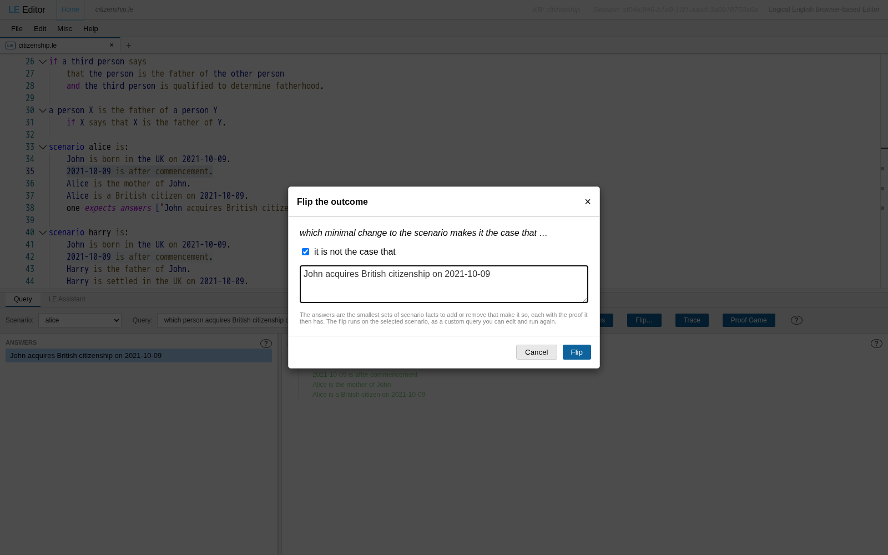

The window offers you the question *which minimal change to the scenario makes it the
case that it is not the case that John acquires British citizenship on 2021‑10‑09*.
Untick **it is not the case that** if you would rather ask what would make the
sentence *true*, and edit the sentence if you want to ask about a different one.
Click **Flip**:

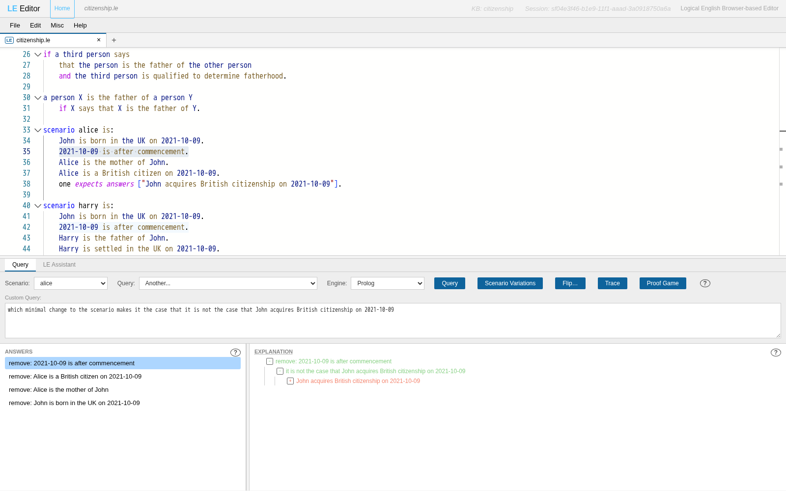

Each answer is one smallest change — here, removing any one of the four facts of the
scenario — and selecting an answer shows the proof that the changed scenario gives.
The flip ran as a question of your own making rather than one written in the program:
the **Query** picker now says **Another…**, and you can edit that question and run it
again. A program can also keep a flip as a query of its own:

```le
query flip is:
    which minimal change to the scenario makes it the case that
        it is not the case that John acquires British citizenship on 2021-10-09.
```

A flip only adds or removes *case* facts: facts whose template is marked
`; undefined` (§16) or, in a program that marks no template that way, facts whose
template no rule ever concludes. More in
[flip queries](../../reference/language.md#177-flip-queries-which-minimal-change-flips-the-outcome)
and in the tutorial [Querying a program](../querying-a-program.md#5-flip-what-would-change-the-answer).

---

## 14. Tests: saying what you expect

Remember the extra line in the tea party's scenario?

```le
punishment expects answers ["doormouse is punished with banishment","mad hatter is punished with scolding"].
```

That line is a **test**. The line names a query — `punishment`, written without the
word `query` — and gives the answers the query should produce on this scenario. You
can also say which unknowns an answer is allowed to rest on: `… expects answers [...]
and unknowns ["Alice is a British citizen on 2021-10-09"]`. For a flip query you write
`expects changes [[...]]` instead.

The editor runs the tests each time it checks the program, as far as a few seconds
allow, and a test that fails appears as a warning. To run every test and see the
outcome, open `citizenship` — each of its four scenarios carries a test — and choose
**Misc → Run the Program's Tests…**:

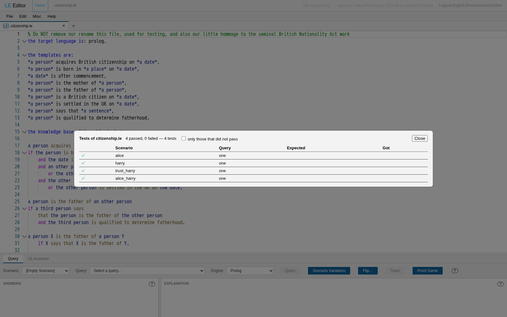

A test that fails lists what the test expected and what the query gave instead, and
clicking a row selects that row's scenario and query, ready to run. Write a test as
soon as an answer is right: the test will tell you, on the day some change to the
rules spoils that answer. See
[testing and expectations](../../reference/language.md#12-testing-and-expectations).

---

## 15. When the editor complains: warnings and "?"

The editor checks your program as you work. An error, underlined in red, stops the
program from running. A **warning**, underlined in yellow, says that something looks
suspicious but the program will still run. Back in `happy_dragon`, line 9 is
underlined; rest the mouse on line 9:

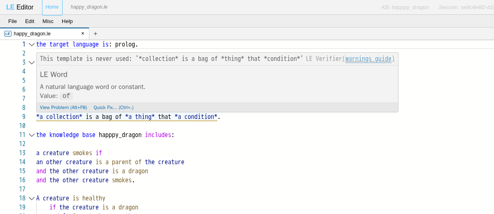

*This template is never used* — the template `*a collection* is a bag of *a thing*
that *a condition*` is declared, but no sentence of the program uses it. The note that
appears ends with a link, here **warnings guide**, to the part of the documentation
that explains the warning and how to put it right. **Quick Fix…** offers the repairs
the editor knows how to make, such as adding a template that is missing. Other
warnings you will meet early are a *missing template*, for a sentence that matches no
template at all; a kind of sentence *not tested by any query*; and a *test failed*
(§14). Every warning is listed in [the warnings of the verifier](../../guide/warnings.md),
the part of the system that checks a program.

There are more ways to get help without leaving the editor. The **?** beside each
panel opens the part of the manual about that panel. A right‑click on a word of the
program offers **Documentation for this**. And **Help → Search the documentation…**
searches the whole of the documentation.

---

## 16. Example 4 — the tea shop: numbers, cascades, tables, dates

The Mad Hatter has opened a tea shop, and the shop's prices need rules. The program
below is not kept on the server, so you type it in yourself. Click **+** on the strip
of tabs for a new, empty document, paste the program in, and open the **Scenario**
picker: the program loads, and its scenarios and queries appear in the pickers.

```le
the target language is: prolog.

the templates are:
    *a guest* orders *a number* cups of tea; undefined.
    *a guest* is a member; undefined.
    *a guest* has an unbirthday today; undefined.
    *a guest* is banished; undefined.
    *a party* has *a number* guests; undefined.
    the membership of *a guest* started on *a date*; undefined.
    the discount of *a guest* is *a percentage*.
    the bill of *a guest* is *an amount*.
    *a guest* is one cup away from a free cup.
    the cake for *a number* guests is *a cake* under table cakes.
    the cake of *a party* is *a cake*.
    the membership of *a guest* expires on *a date*.

the constants are:
    the price of a cup is 3.

the table cakes is, with first match:
    size   | guests        | cake
    small  | <= 2          | cupcake
    medium | > 2 and <= 6  | sponge cake
    large  | > 6           | three tier cake

the knowledge base tea shop includes:

the bill of a guest is an amount A
    if the guest orders a number N cups of tea
    and the value of the price of a cup is a price P
    and the discount of the guest is a percentage D
    and A = (N - N // 3) * P * (100 - D) / 100.

a guest is one cup away from a free cup
    if the guest orders a number N cups of tea
    and R = N mod 3
    and R = 2.

the discount of a guest is a percentage
    if the guest is a member
        and the percentage is 20
    otherwise the guest has an unbirthday today
        and the percentage is 10
    otherwise the percentage is 0.

the cake of a party is a cake
    if the party has a number guests
    and the cake for the number guests is the cake under table cakes.

the membership of a guest expires on a date
    if the membership of the guest started on a start date
    and the date is 6 months after the start date.

it must not be true that
    a guest is a member
    and the guest is banished.

scenario saturday is:
    alice orders 5 cups of tea.
    alice is a member.
    the hatter orders 7 cups of tea.
    the hatter has an unbirthday today.
    the dormouse orders 2 cups of tea.
    the membership of alice started on 2026-08-31.
    the garden party has 5 guests.
    bills expects answers ["the bill of alice is 9.6", "the bill of the hatter is 13.5", "the bill of the dormouse is 6"].
    nearly expects answers ["alice is one cup away from a free cup", "the dormouse is one cup away from a free cup"].
    cake expects answers ["the cake of the garden party is sponge cake"].
    expiry expects answers ["the membership of alice expires on 2027-02-28"].

scenario trouble is:
    the knave orders 2 cups of tea.
    the knave is a member.
    the knave is banished.
    bills expects answers [].

query bills is:
    the bill of which guest is which amount.

query nearly is:
    which guest is one cup away from a free cup.

query cake is:
    the cake of which party is which cake.

query expiry is:
    the membership of which guest expires on which date.
```

Two things before we go on. The templates marked **`; undefined`** are the *case
facts*: facts that scenarios state and that no rule ever concludes. Both the flip of
§13 and the views of §19 rely on that marking. And every query here carries a test, so
**Misc → Run the Program's Tests…** should report five passes before you change
anything.

### Named constants and arithmetic

`the constants are:` gives a value a name, one name per line. A rule reads the value
back with `the value of the price of a cup is a price P`, and an explanation shows
that value as one of its reasons: *the price of a cup is 3*. Change the price in that
one place and every bill follows.

The bill is worked out by arithmetic: `+`, `-`, `*`, `/`, brackets, and the two
whole‑number operations `//` (divide and round down) and `mod` (the remainder after
dividing).
Every third cup is free, so a guest pays for `N - N // 3` cups. The names in a formula
are short capital letters — `N`, `P`, `D` — and a condition must introduce each one
first, as `a number N` does. Run `bills` on `saturday` and select the hatter's bill:

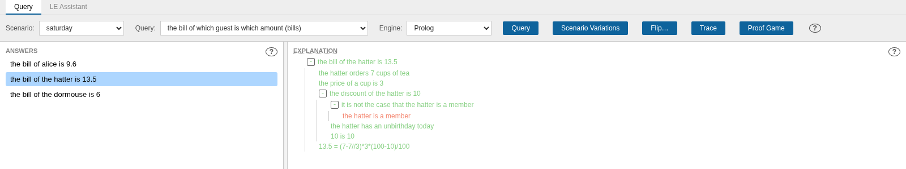

The query `nearly` finds the guests who are one cup away from a free one. First
`R = N mod 3` works out the remainder, then `R = 2` checks it. Writing `N mod 3 = 2`
as a single condition does the same thing, because LE works out a formula on either
side of `=`. See [arithmetic and comparisons](../../reference/language.md#7-arithmetic-and-comparisons).

### `otherwise`: the first alternative that applies

The discount is a **cascade**: a list of alternatives tried in order. A line that
starts with `otherwise` begins a new alternative, and that alternative applies only
when every earlier one has failed. Here the discount is 20 for members, otherwise 10
for a guest whose unbirthday it is, otherwise nothing. Alice is a member, so she gets
20. The hatter is not a member, but it is his unbirthday, so he gets 10. The dormouse
gets 0. The hatter's explanation shows the cascade as *it is not the case that the
hatter is a member* — the alternative that did not apply — followed by the alternative
that did. The conditions of an alternative may also sit on the same line as the
`otherwise` (`otherwise the guest has an unbirthday today and the percentage is 10`);
on separate lines, as above, they are easier to read. See [`otherwise` cascades](../../reference/language.md#172-otherwise-cascades).

### A decision table

`the table cakes is, with first match:` is a small **decision table**, a set of rules
laid out as rows. The table belongs to the one template that names it, the template
ending `… under table cakes`. The table's columns are the slots of that template, in
order, with one extra column at the front holding the name of each row; the last
column holds the result. A cell may hold a value, a comparison such as `> 2 and <= 6`,
or the word `any`, which fits anything. *First match* means that the first row that
fits gives the answer. Run `cake`: the garden party has 5 guests, so the party gets
*sponge cake*, and the explanation names *row medium of table cakes* as the reason.
See [decision tables](../../reference/language.md#173-decision-tables).

### Calendar months

`the date is 6 months after the start date` counts **calendar months**. The day of the
month stays the same where the later month has such a day, and where it has not, LE
takes the last day of that month. Run `expiry`: Alice's membership started on 31
August 2026 and expires on **2027‑02‑28**, because there is no 31 February. Days work
in the same way: `… is 30 days after …`.

### A rule that must never be broken

```le
it must not be true that
    a guest is a member
    and the guest is banished.
```

An **integrity constraint** says that certain conditions must never hold at the same
time. A scenario whose facts break a constraint contradicts itself, and nothing
follows from such a scenario. Run `bills` on the scenario `trouble`, in which the
knave is both a member and banished:

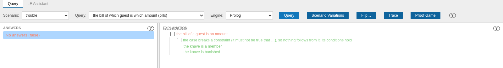

No bill comes back, and the explanation says why: *the case breaks a constraint … its
conditions hold*, with the two offending facts beneath. Constraints matter most
alongside unknowns (§8), because LE will not give you an answer that would have to
*assume* something a constraint forbids. See
[integrity constraints](../../reference/language.md#33-integrity-constraints-it-must-not-be-true-that-).

---

## 17. Citing your sources

Rules come from somewhere — a statute, a policy, a notice on the tea shop's wall —
and facts come from someone. LE can record where a rule or a fact came from, without
changing anything the rules prove. Make three changes to the tea shop. First, label
the bill rule with the document the rule puts into logic:

```le
rule every_third_cup with provenance the tea shop notice,
        confer "Every third cup is on the house":
the bill of a guest is an amount A
    if the guest orders a number N cups of tea
    ...
```

Second, say in the scenario's opening line which document the scenario's facts come
from, and quote a passage of it after `confer`:

```le
scenario saturday is, as stated in the order book at page 12:
    alice orders 5 cups of tea, confer "Alice, five cups".
```

And third, say who claims a fact, and on what grounds:

```le
    the hatter has an unbirthday today,
        according to the March Hare, because "he says so every day".
```

These four additions — `according to`, `as stated in … at …`, `because` and
`confer` — are called **trailers**, and each comes after a comma. Run `bills` again
and select the hatter:

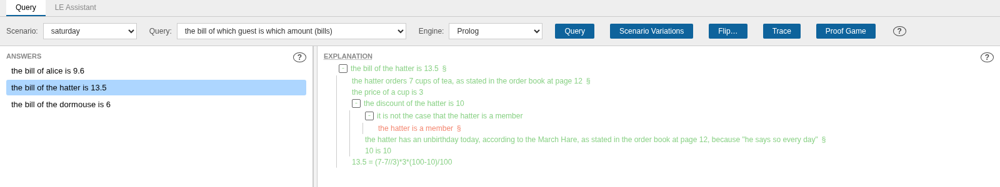

Every step that has a source now names that source, and carries a **§** badge. Click
the § of *the bill of the hatter is 13.5*:

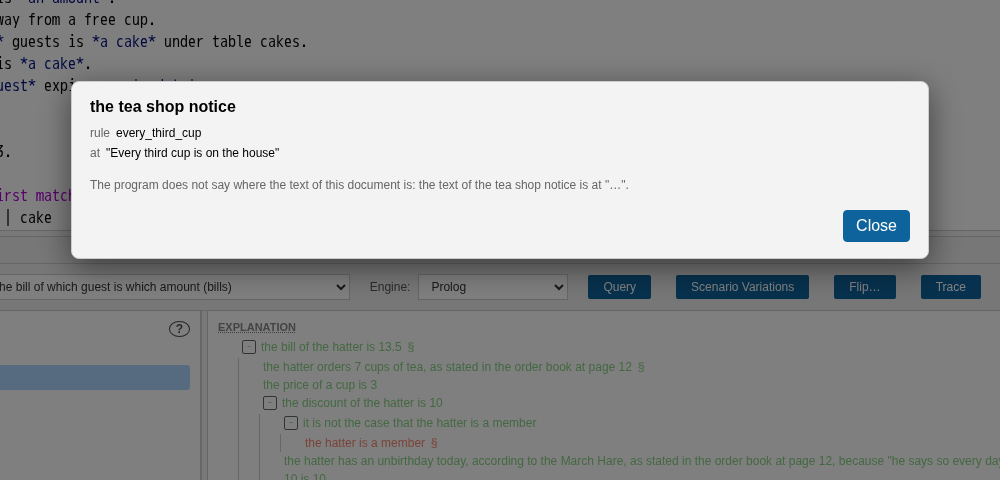

The **source viewer** names the document, the rule and the passage. The viewer would
show the document itself, with the passage highlighted, if the program said where the
text of that document can be found — which is what the message on screen suggests:

```le
the tea shop notice is published at "https://example.org/notice.html".
the text of the tea shop notice is at "notice.txt".
```

(A text file of this kind sits beside the saved program.) Once the program says where
the text is, a right‑click on any line of the program that cites a source, followed by
**View Original Text**, opens the passage itself. The verifier also checks that every
quoted passage really does appear in the text. See
[provenance trailers](../../reference/language.md#171-provenance-trailers-and-judged-templates)
and [rule labels and provenance](../../reference/language.md#155-rule-labels-and-provenance).

---

## 18. The debugger: breakpoints and steps

When an answer is missing and the explanation does not make it obvious why, you can
watch the program run, step by step. Load `tea_party`, pick scenario `attendees` and
query `punishment`, and click in the margin to the left of the number of line 20 (`and
the creature is a lowly creature`). That click sets a **breakpoint**, a place where
the run will pause. Then click **Trace**, and in the **LE Debugger** panel click
**Continue**:

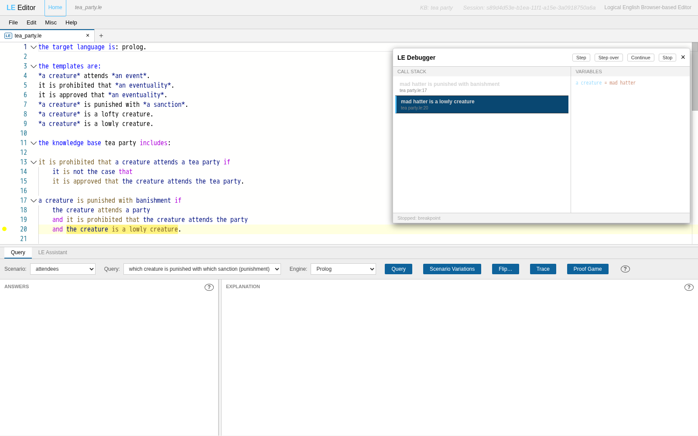

The run stops at line 20, which is highlighted. The **call stack** lists the questions
the reasoner is in the middle of answering, the most recent last, so you can see how
the run arrived here: the reasoner is trying to show that *mad hatter is punished with
banishment*, and to do that it is now asking whether *mad hatter is a lowly creature*
(he is not, so this rule will fail for him). **VARIABLES** shows what each variable
stands for at this moment: *a creature = mad hatter*. From here:

- **Step** (F11) moves on to the next question, going inside any rule the reasoner
  uses to answer it;
- **Step over** (F10) moves on to the next question at this level, without stopping
  inside the rules it uses;
- **Continue** (F5) runs on to the next breakpoint, or to the next answer;
- **Stop** ends the query.

A right‑click in the editor, then **See PROLOG**, shows the Prolog — the logic
programming language LE is translated into — that your program became. More in the
[editor manual](../../guide/editor.md#advanced-features).

---

## 19. A screen for the program's users: views

The editor is for the person who *writes* a program. The people the program decides
for — a shop assistant, a caseworker, a citizen — need a simpler screen. **Misc → Open
Executive View** opens such a screen: the program without its text, a scenario picker,
a query picker, and the answers as cards that open onto their explanations. The
executive view works on the program as it stands in the editor, changes you have not
saved included.

A **view** says how that screen should look for one kind of decision. You write a view
in LE itself, at the end of the program. You do not have to start from nothing: with
the tea shop open, choose the **LE Assistant** tab and press **Generate LE view**,
which needs no language model:

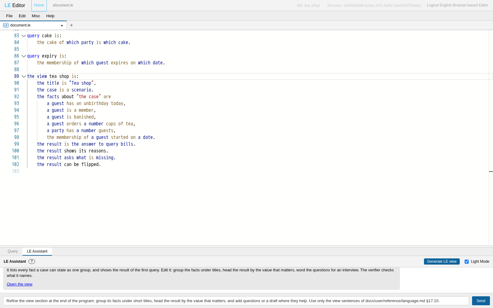

The draft view lists the case facts, takes the first query as the result to show, and
adds whatever else the program can show. Edit the draft into the view below, which
adds a title, groups the orders together, and puts the amount at the top of each
answer:

```le
the view till is:
    the title is "The Mad Tea Shop".
    the case is a scenario.
    the facts about "the orders" are
        a guest orders a number cups of tea,
        a guest is a member,
        a guest has an unbirthday today.
    the result is the answer to query bills, headed by the amount.
    the result shows its reasons.
```

Then **Misc → Open Executive View** and choose the view **The Mad Tea Shop** at the
top:

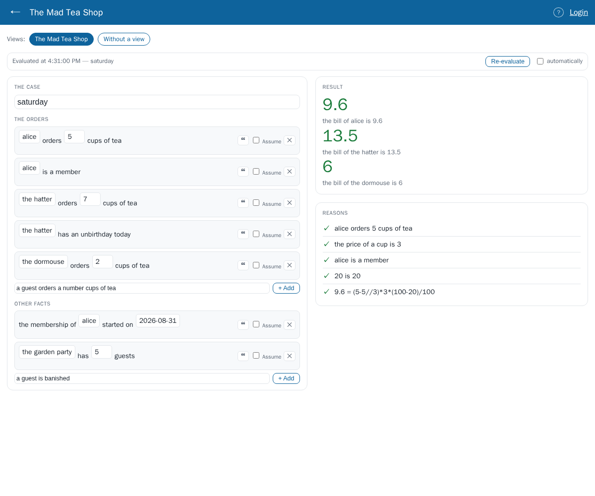

The orders appear as rows you can edit, with the other case facts below them, each
bill is printed in large type, and the reasons are listed underneath. Change Alice's 5
cups to 7 and press **Re‑evaluate**: her bill becomes 12. A view changes nothing in
the way the program reasons, and the verifier checks every sentence of the view
against the program's templates and queries. A view can also run an interview, asking
one question at a time, or show what would turn the result around. The tutorial
[Introducing LE Views](../views.md) builds views step by step, and
[the executive view](../../guide/executive-view.md) describes the screen itself.

---

## 20. The LE Assistant: drafting with a language model

You do not have to write every template and rule by hand. The **LE Assistant** tab,
next to **Query**, is a place to hold a conversation in writing. You ask, in plain
English, for the change you want — *"add a rule…", "fix this warning", "why does
scenario saturday fail?"* — and a language model edits the program for you. As it
works, the assistant keeps **running the verifier and the queries**, so that what it
hands back is a program that LE can read and run.

The **Light Mode** checkbox chooses how the assistant works. **Light**, the setting it
starts with, is a quick loop on the server that only edits your program and calls the
verifier and the queries. Untick the box and **Deep** mode runs a full coding agent,
which does more but takes longer. Choose a model and enter the key your model provider
gave you in **Misc → API Keys & Assistant Settings…**; a server may supply keys of its
own, in which case you need none. Then type a request — say, *"add a rule that a guest
is thirsty if the guest orders more than 6 cups of tea, with its template and a
query"* — and press **Send**. The assistant edits the program, checks it, runs it, and
puts the result into the editor. **Edit → Undo** takes back anything you do not like.

The same models are behind **Write it in English** in the Scenario Editor and in
Scenario Variations: describe a case in a sentence, and the sentence becomes facts
written with *your* templates.

> The Assistant saves you time; it is not an authority — always read what the
> assistant wrote. But for the dull and repetitive parts — templates, the outline of a
> scenario, a rule echoed in a new shape — the assistant removes most of the typing.
> See [the assistants](../../guide/assistants.md).

---

## 21. A second engine: s(CASP)

Everything so far ran on LE's **Prolog** engine — the piece of software that does the
reasoning. LE can run the *same program* on a second engine, **s(CASP)**, which also
works backwards from the question you asked, and which brings three things Prolog
cannot: answers that are **constraints**, conditions rather than fixed values;
**several possible worlds** (its makers call them stable models) for a single query;
and **abduction**, which means working out what would have to be true for an answer to
hold. A program says which engine it prefers in its first line
(`the target language is: scasp.`), and the **Engine** picker in the Query tab lets
you switch engines by hand. (For a program meant only for Prolog the picker can be
hidden: **Misc → ENGINE PICKER → Show engine choice only for non‑Prolog**.) The
s(CASP) engine has to be installed on the server that runs the program; where it is
not installed, a query and **See s(CASP)** both say so.

### Seeing the generated s(CASP)

LE writes a *separate* s(CASP) program out of your rules. **Right‑click the editor →
See s(CASP)** shows that program:


Two things are worth noticing in what comes out. Each LE template becomes a **`#pred`**
line carrying the English sentence of that template, so that s(CASP)'s own explanations
are written in the words of your subject rather than in symbols. And the comparison
`the amount is greater than 25000` becomes the **constraint** `#>(A, 25000)`, which is
a condition on an amount still to be settled, not a test on a fixed number. That
second point is the key to the next feature.

### Answers that are *constraints*

Because comparisons become constraints, s(CASP) can answer a query **with no
particular scenario at all**. Load `language/scasp/clp_coverage`; the program names
`scasp` in its first line, so the engine picker chooses s(CASP) for you. Pick the
`covered` query, leave the scenario unset, and press **Query**:

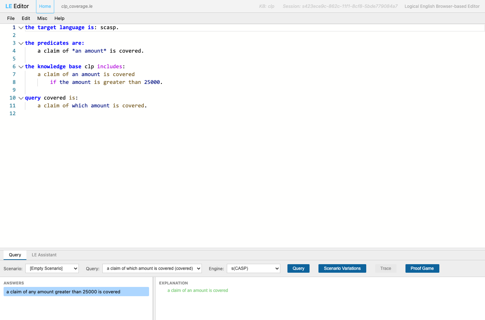

The answer is not a value but a *phrase*: **"a claim of any amount greater than
25000 is covered."** You asked "which amounts are covered?" and got back the condition
itself, written out in the words of your template. Asking a question this way is how
you ask *"under what circumstances would this hold?"* directly.

### Several possible worlds, and what each assumes

When a program has *assumable* facts (§8's `; assumable`), one query can come out true
in **several different ways**. s(CASP) lists each of those ways as a separate
**model**, a complete picture of how things might be. Here the program
`language/abduction/loan_approval`, which leaves several facts about the applicant
open, is run under s(CASP):


- The answers panel groups the results as **"world 1 of 4", "world 2 of 4", …** — one
  card for each genuinely different world.
- Each card carries the familiar **`?`** marker, meaning that the answer holds *under
  assumptions*. Rest the mouse on the card, or read the amber lines of the tree, to
  see which assumptions those are: *"2 unknown goals: the applicant owns property, the
  applicant has a good credit score."* That is abduction at work — the engine tells
  you what it *had to assume* for the loan to be approved, and each world assumes
  something different.

Denial is richer under s(CASP) too. Where Prolog shows a failed `not` simply as
something it could not find, s(CASP) *proves* the denial, and shows rule by rule why
the inner sentence fails.

### Which engine, when

Keep **Prolog** as your usual choice. Prolog is faster, and Prolog is the engine that
handles totals and counts, dates, embedded `prolog` goals and large collections of
facts. Reach for **s(CASP)** when you want answers that are constraints, or questions
of the form "what must be assumed", or several possible worlds, or when your program
goes round in a circle through a denial — a shape that can make Prolog misbehave, and
about which the editor warns you. When s(CASP) cannot express a program faithfully it
refuses the program, listing the problems and the lines they are on, and pointing you
back to Prolog, rather than running the program wrongly. The full story is in [s(CASP) on Logical English](../../reference/scasp.md).

---

## 22. Sharing a program: links and QR codes

We have already met two ways to share a program: the web address of the editor
(`?example=…&scenario=…&query=…`, §3) and the link to a Scenario Variations window
(§7). For handing a program to someone holding a phone — in a talk, in a classroom,
across a desk — there is **File → QR code…**. A QR code (short for Quick Response
code) is the square black‑and‑white pattern a phone camera can read, and the menu
entry draws one for your program:

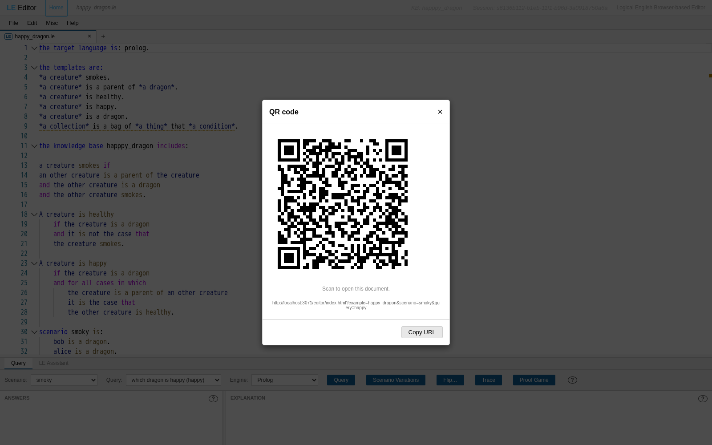

Scanning the pattern opens the very same program, scenario and query in the other
person's browser. **Copy URL** copies the same link instead, ready to paste into a
message. An example that lives on the server travels as a short web address. A
document you have edited and not saved travels whole: the editor squeezes the text of
the program into the link itself, after a `#lzp=` marker, and unpacks it again when
the link is opened. So even a program that exists nowhere but in your editor can be
shared. If a document is too big to fit in a pattern a camera could read, the window
says so rather than drawing one nobody can scan. To keep a program, **File → Save
As…** saves it onto your own computer, and **File → Open…** brings it back.

---

## 23. Where to go next

You now know enough to be dangerous:

- **Templates** declare your vocabulary. **Facts** and **rules** (`Head if Body`) say
  what is true. **`and`**, **`or`**, **`it is not the case that`** and **`for all
  cases in which`** build up the logic. **Scenarios** supply the situations,
  **queries** ask the questions, and **tests** (`expects answers`) keep the answers
  right.
- **Constants**, **arithmetic** (with `//` and `mod`), **`otherwise`** cascades,
  **decision tables**, **calendar months** and **integrity constraints** cover most of
  what a rulebook needs, and **provenance trailers** say where each rule and fact
  comes from.
- The **Query** tab runs a program. **Explanations** show why an answer holds — as a
  tree, as the **important reason**, as a **Bento Box**, or through the **Drill**.
  **Scenario Variations** and **Flip…** explore "what if". **Assume** lets the program
  reason when something is unknown, and amber marks what was assumed. A why‑not tree
  tells you what is missing, and the **debugger** shows the run itself.
- **Views** and the **executive view** give the people who use a program a screen of
  their own. The **LE Assistant** drafts and mends LE for you. The **s(CASP)** engine
  adds constraint answers and possible worlds. And a **QR code** hands a program to a
  phone.

From here:

- Work through [Querying a program](../querying-a-program.md), which puts a real
  regulatory program — the compensation due to air passengers in the EU — through
  queries, why‑not explanations, flips and the Drill. Then work through
  [Introducing LE Views](../views.md).
- Skim the [language reference](../../reference/language.md) for the parts we skipped:
  the ways of summing and counting over many facts (`sum`, `count`, …), the `is a`
  hierarchy that says which kinds of thing are kinds of other things, synonyms,
  templates built around prepositions, the resources and ready‑made libraries a
  program can include, and the rest of the
  [regulatory‑decision constructs](../../reference/language.md#17-regulatory-decision-constructs):
  judged templates, the applicability / question / remedy skeleton, and `according to`
  inside a rule.
- Read the [editor manual](../../guide/editor.md) for the Scenario and Query Editors,
  the file tabs, the Source Graph and the rest. Then play the
  [Proof Game](../../guide/proof-game.md), which has you build a proof yourself.
- Coming from another rules system? [Other systems: importing and exporting](../../integrations/index.md)
  says whose files the editor can open as LE, and write back out again.
- Browse the [examples](https://github.com/LogicalContracts/LogicalEnglish2/tree/main/examples/moreExamples)
  — `language/includes/citizenship_including`, `royal_family`, `language/templates/subset`,
  the `domains/tax/` set, and the programs of
  [`examples/regulatory/`](https://github.com/LogicalContracts/LogicalEnglish2/tree/main/examples/regulatory)
  — and open any of them straight from the running system at
  **<https://le2.logicalcontracts.com>**.

Now go write a rule. The tea party awaits, and someone has to decide who gets
banished.
