# Querying a program: answers, explanations and what-ifs

*Kind: tutorial · Audience: users · Status: current (2026-09-16)*

This tutorial is about *running* a Logical English program, not writing one.
We take a program that is already written and question it: we run its
queries, read its explanations, try "what if" variations, ask what would
change an answer, and walk through an explanation one reason at a time.

The program is `examples/regulatory/eu261_integration.le`. It decides
compensation for a cancelled flight under EU Regulation 261/2004. Its rules
say when a passenger is owed compensation, and how much, by the distance of
the flight. The interesting part is *extraordinary circumstances*: a carrier
owes nothing if it establishes that the cancellation was due to such
circumstances. The program decides that with two judgments of the Court of
Justice:

- *Wallentin-Hermann* (C-549/07): technical problems found during maintenance
  are inherent in a carrier's activity, so they are not extraordinary;
- *Peskova* (C-315/15): a bird strike is not inherent.

Sections 1 to 6 happen in the LE editor, sections 7 and 8 in the executive
view. Open the program with **File ▸ Open example from server…**, choosing
`eu261_integration` under the `regulatory` heading, or directly at
`/editor/index.html?example=regulatory/eu261_integration`. The program is in
the code area, with the **Query** panel along the bottom.

## Contents

1. [Running a query](#1-running-a-query)
2. [Reading the explanation](#2-reading-the-explanation)
3. [When there is no answer](#3-when-there-is-no-answer)
4. [Scenario Variations: what if?](#4-scenario-variations-what-if)
5. [Flip: what would change the answer?](#5-flip-what-would-change-the-answer)
6. [The Explanation Drill](#6-the-explanation-drill)
7. [The same program for its users](#7-the-same-program-for-its-users)
8. [Views: a screen made for one decision](#8-views-a-screen-made-for-one-decision)
9. [Quick reference](#9-quick-reference)

## 1. Running a query

A run needs two things from the program: a **scenario** (the facts of one
case) and a **query** (the question). Pick both in the Query panel.

The program has four scenarios:

| Scenario | The case |
|---|---|
| `new_claim` | anna's flight AZ123 from Vienna (800 km) is cancelled; Alitalia says the cause was a technical problem found during maintenance |
| `notified` | the same flight, but anna was told of the cancellation 20 days before |
| `bird_strike` | the same flight, cancelled after a bird strike that Alitalia says was beyond its control |
| `outside_the_eu` | a flight from Istanbul |

Every fact of a scenario says where it comes from, for example:

```le
the cancellation of flight AZ123 is caused by the inspection defect,
    according to Alitalia, as stated in the carrier letter at paragraph 3.
```

The main query is `claim`:

```le
query claim is:
    which passenger is entitled to compensation of which amount for which flight.
```

To run it:

1. In **Scenario**, choose `new_claim`.
2. In **Query**, choose `claim`. The picker shows the query's text followed
   by its name.
3. Click **Query**.

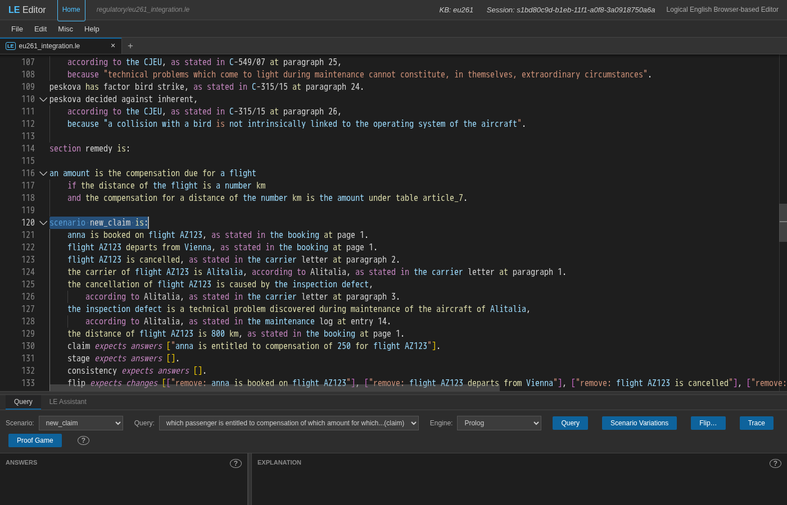

The answer appears on the left, under **ANSWERS**, already selected:

> anna is entitled to compensation of 250 for flight AZ123

The flight is 800 km, and the program's decision table `article_7` gives
250 for distances up to 1500 km.

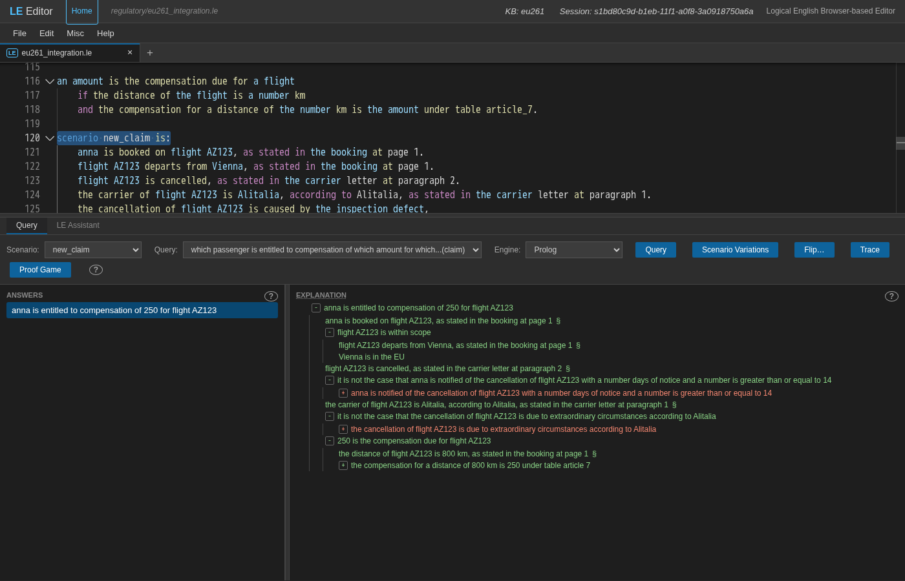

(The query panel is short when the editor opens. Drag the bar above its
**Query** tab upwards to give the answers and the explanation more room.)

The address bar now names the program, the scenario, the query and the
selected answer. Copy it to give someone the same run.

## 2. Reading the explanation

The **explanation** on the right shows how the program reached the answer.
It is a tree of the program's own sentences: each condition of the rule that
concluded the answer, and under each, what proved it. The first levels are
open. The `+` / `-` toggles open and close the rest. A **§** after a fact
shows the document that states it.

For `new_claim`, the conditions under the answer are:

- anna is booked on flight AZ123, *as stated in the booking at page 1*;
- flight AZ123 is within scope (it departs from Vienna, and Vienna is in the
  EU);
- flight AZ123 is cancelled;
- it is not the case that anna is notified of the cancellation with a number
  days of notice and the number is at least 14;
- the carrier of flight AZ123 is Alitalia;
- it is not the case that the cancellation of flight AZ123 is due to
  extraordinary circumstances according to Alitalia;
- 250 is the compensation due for flight AZ123: the distance is 800 km, and
  *the compensation for a distance of 800 km is 250 under table article 7*,
  by *row a of table article 7*.

Things to notice:

- **Green** is a condition that was proved. **Red** is one that could not be.
- **Red inside a negation is what the rule wanted.** Open *it is not the case
  that the cancellation of flight AZ123 is due to extraordinary
  circumstances…*. Under it, *the cancellation … is due to extraordinary
  circumstances* is red: it could not be proved, so the negation holds.
  Opening further shows why. The inspection defect *counts as inherent in the
  normal exercise of the activity of Alitalia*, because it is *forced for
  inherent by wallentin hermann*: that case decided for *inherent* (C-549/07,
  paragraph 25) on a factor, *maintenance problem*, which this defect also
  has.

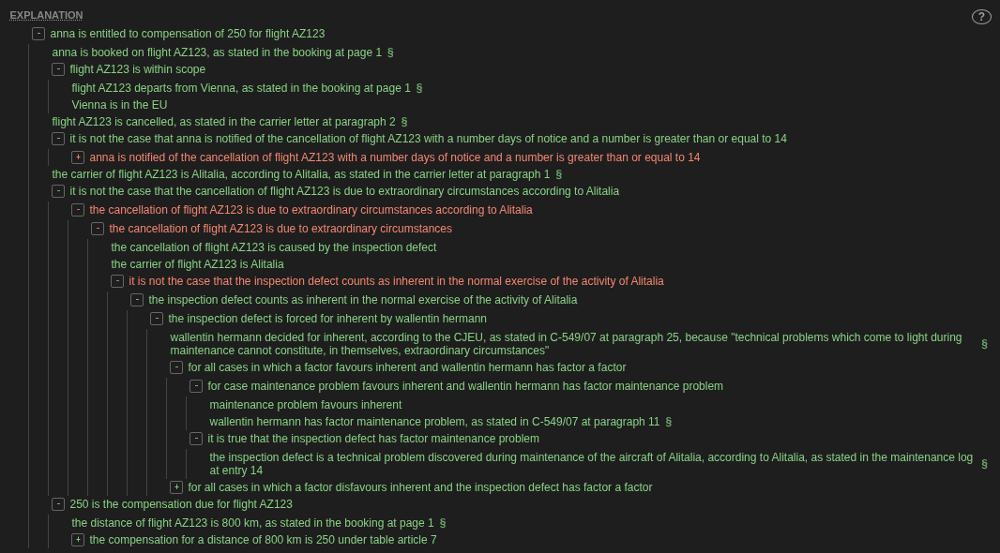

- **Click a node to see its source.** The editor scrolls to the rule or fact
  that proved it and selects it. Clicking *250 is the compensation due for
  flight AZ123* selects the rule of the `remedy` section. A step proved in an
  included file, such as the precedent library, names that file and line in
  its tooltip.

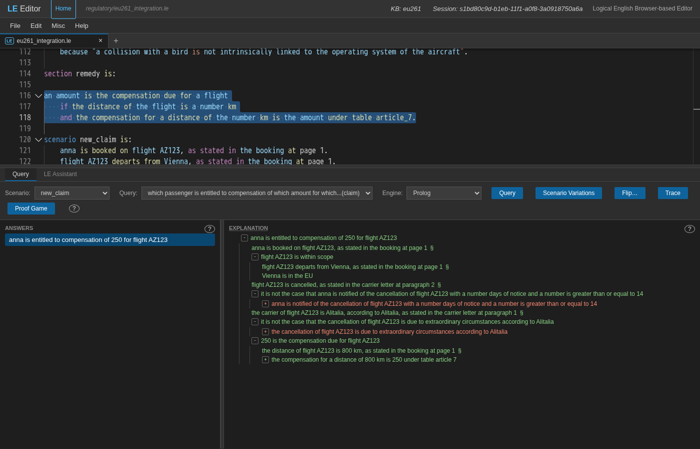

### The important reason

The **EXPLANATION** title is underlined when an answer is selected. Hover over
it to see the one reason the answer rests on most. For `new_claim` that is:

> the inspection defect counts as inherent in the normal exercise of the
> activity of Alitalia

Right-click the title for **Show important reason**, which opens the tree at
that node and flashes it, and **Explanation Drill…** (section 6).

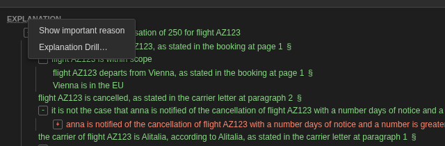

Right-clicking in the tree offers **Copy Explanation** (as text and HTML) and
**Copy as Mermaid diagram**. **Misc ▸ EXPLANATIONS ▸ Preferences…** controls how
trees are shown. Keep **Hide repeated explanations** on for large programs: a
sub-explanation that occurs several times is then shown in full once. The
[editor guide](../guide/editor.md#explanations-and-navigation) describes each
preference.

## 3. When there is no answer

Choose the scenario `notified` and run `claim` again. The answers list says
**No answers (false)**, and the explanation now says why the query failed.

The program's rules are in three sections: *applicability*, *question* and
*remedy* (see [the language reference](../reference/language.md) §17.4). The
first node of a failure explanation is a checklist:

> section checklist: applicability passed, question failed, remedy not reached

Under the rule's node, the red condition is the one that stopped it:

> it is not the case that anna is notified of the cancellation of flight
> AZ123 with a number days of notice and a number is greater than or equal to 14

It failed because both parts under it hold: anna *is* notified with 20 days
of notice (according to Alitalia, as stated in the notice email), and 20 is
at least 14.

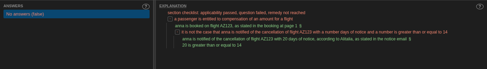

Above the red condition, *anna is booked on flight AZ123, as stated in the
booking at page 1* is green: a failure explanation shows the conditions that
held before the one that failed, with their citations. Now try the other two scenarios:

- `outside_the_eu`: *applicability failed*. The flight is not within scope,
  because *Istanbul is in the EU* cannot be proved.
- `bird_strike`: *question failed*. Here *the cancellation … is due to
  extraordinary circumstances according to Alitalia* holds. The bird
  collision has the factor *bird strike*, so *peskova* forces it against
  *inherent*, and Alitalia states that it was beyond its control (the incident
  report, page 2). So the negation fails.

The program also has a query for the stage alone:

```le
query stage is:
    the query fails at which section.
```

Its answer is *the query fails at question* for `notified`, *the query fails
at applicability* for `outside_the_eu`, and no answer for `new_claim`, whose
claim does not fail.

## 4. Scenario Variations: what if?

The **Scenario Variations** window takes a scenario, lets you change it, and
runs queries on the changed case. Your program is not modified.

Choose `new_claim` and `claim`, then click **Scenario Variations**. A window
titled *Scenario variations for eu261* opens with the scenario's facts as
rows: each template's words are fixed, and its values are fields you can
edit. Beside each row are its citation (*as stated in the booking at page
1*), an **Assume** box and a **✕**. The `claim` query is listed below the
facts, under **QUERIES**; **Add query** adds others. **Query** at the bottom
right runs every listed query on the facts as they now are. After a run it
turns grey until you change something.

### Change a value

In the row *the distance of flight AZ123 is 800 km*, change `800` to `2000`
and click **Query**. The answer becomes:

> anna is entitled to compensation of 400 for flight AZ123

and the explanation now cites *row b of table article 7*.

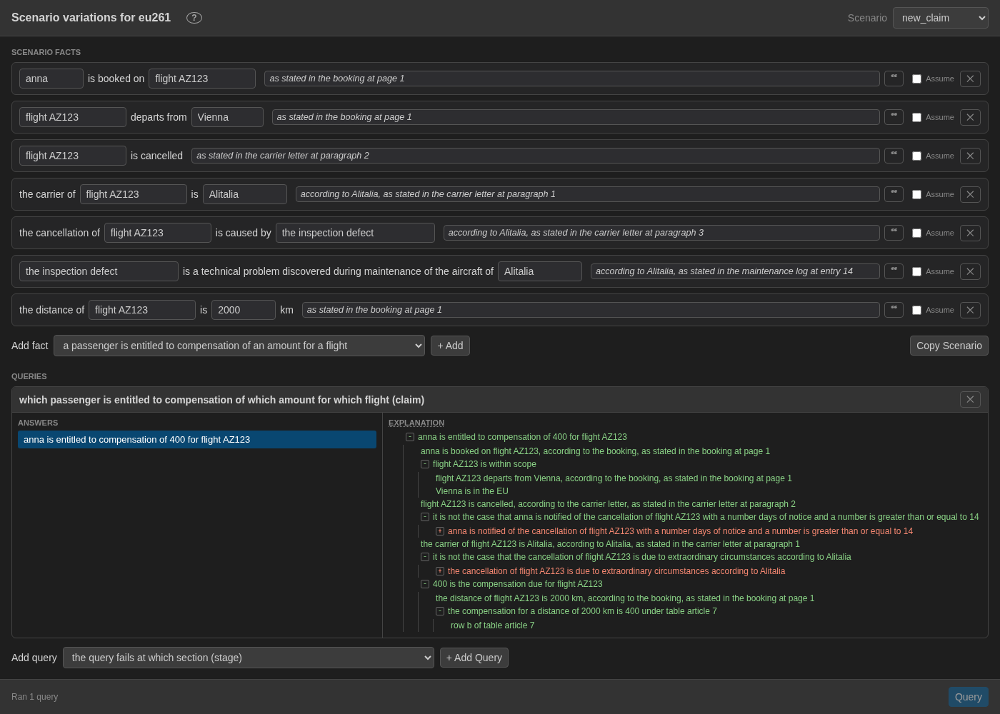

### Remove a fact

Put the distance back to 800, then delete that row with its **✕** and click
**Query**. The result is **No answers (false)**. In the explanation, *an amount
is the compensation due for flight AZ123* is red, and under it *the distance of
flight AZ123 is a number km*, the fact that is now missing. Remove a fact and
run the query again: that is how you find which facts an answer depends on.

A right-click on a node of this explanation can change the case for you. A
green node that is a fact of the scenario offers **Patch scenario — delete
this fact**. A red node that matches a template offers **Patch scenario — add
this fact** and **Assume fact**. Each runs the queries again.

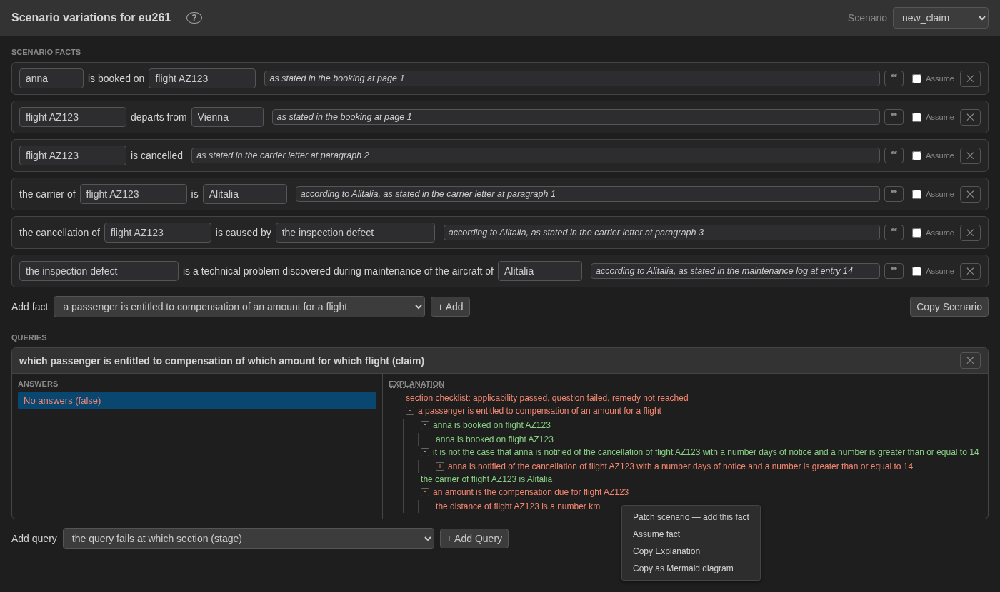

### Assume a fact

Sometimes a fact is not established yet, and you want the answer *if* it
holds. Add the distance row back: in **Add fact**, choose *the distance of a
flight is a number km* and click **+ Add**. Fill in `flight AZ123` and `800`,
and tick the row's **Assume** box. Its fields turn grey: the fact is now
*it is unknown whether the distance of flight AZ123 is 800 km*. Run
again:

> anna is entitled to compensation of 250 for flight AZ123

The answer carries a **?** marker. Hovering over the answer shows:

> Unknown goal: the distance of flight AZ123 is 800 km

and in the explanation the assumed condition is **amber**. This is the answer
*provided that* the assumption holds. The unknowns of an answer list what is
still to be checked.

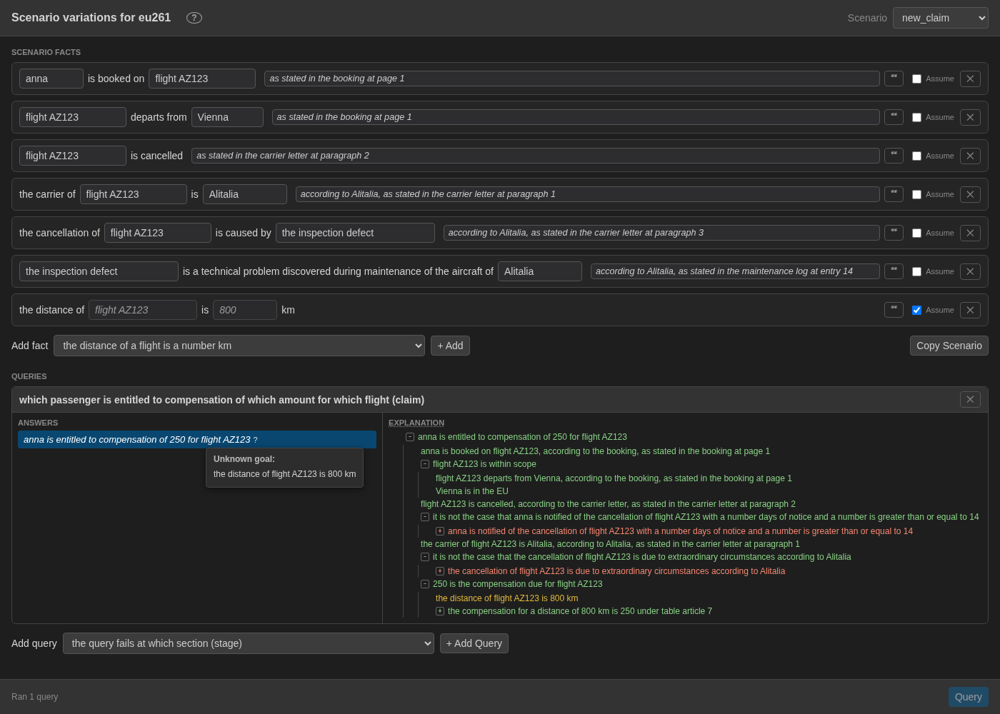

The window keeps the changed facts and the query list in its address. Copy
the address to share this what-if, or use **Copy Scenario** to get the changed
facts as a `scenario … is:` block.

## 5. Flip: what would change the answer?

Scenario Variations tries one change at a time. A *flip* asks the program
for the smallest changes to the case that would change the answer.

Back in the editor, with `new_claim` and `claim`, run the query and select
the answer. Click **Flip…**. The dialog *Flip the outcome* proposes:

> which minimal change to the scenario makes it the case that … it is not the
> case that anna is entitled to compensation of 250 for flight AZ123

*it is not the case that* is a ticked box, and the answer is in a text box you
can edit: untick the box to ask what would make a sentence true instead.

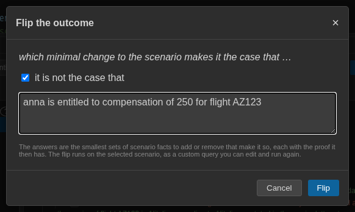

Click **Flip**. The flip runs as a custom query: the **Query** picker says
*Another...*, and the flip's text is in the **Custom Query** box, to edit and
run again. Each answer is one change:

- remove: flight AZ123 is cancelled
- remove: flight AZ123 departs from Vienna
- remove: anna is booked on flight AZ123
- remove: the carrier of flight AZ123 is Alitalia
- remove: the distance of flight AZ123 is 800 km

Each comes with the proof that the changed case gives. Under *remove: flight
AZ123 is cancelled*, anna's entitlement fails, and it fails at *flight AZ123
is cancelled*.

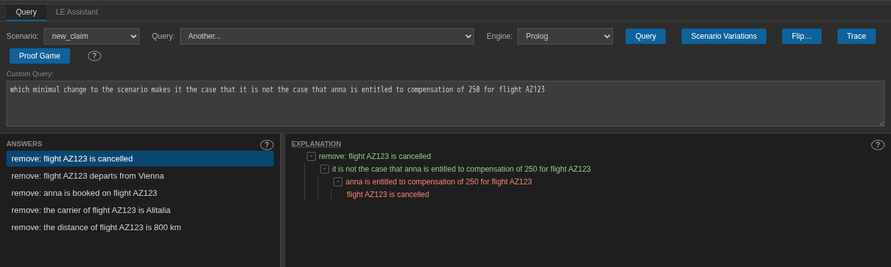

Some facts are missing from this list. Removing the maintenance log's
statement, or the cause of the cancellation, does not change the answer. The
carrier must *establish* extraordinary circumstances, and without those facts
it establishes nothing. The program has the same question as a query of its
own, `flip`. See [the language reference](../reference/language.md) §17.7 for
flip queries.

## 6. The Explanation Drill

The Explanation Drill walks you through an explanation as a series of
questions, starting with the reasons that matter most.

Select the answer of `claim` on `new_claim`, right-click **EXPLANATION**, and
choose **Explanation Drill…**. A window opens, headed *Understanding why anna
is entitled to compensation of 250 for flight AZ123:*, with a progress bar. It
shows the most important reason and asks **Accept?**:

- **Yes**: you accept this part. It is set aside, and the drill asks about
  the next reason.
- **Not yet**: you want to know more. The drill breaks the reason into the
  reasons under it and asks about the most important of those.

Each question highlights its source in the editor. You can change an earlier
answer at any time, or delete a question with its **✕**, and the drill
recomputes its questions from that point. When nothing is left, it says
*Nothing else to show*.

Answer *Not yet* where a step is not obvious to you. On this program the
first question is *the inspection defect counts as inherent in the normal
exercise of the activity of Alitalia*. Answer:

1. **Not yet**: the drill asks whether *for all cases in which a factor
   disfavours inherent and the inspection defect has factor a factor* (no
   factor against *inherent* applies to the defect);
2. **Yes**: it asks about *for all cases in which a factor favours inherent and
   wallentin hermann has factor a factor* (the precedent's factors);
3. **Not yet**: *for case maintenance problem favours inherent and wallentin
   hermann has factor maintenance problem*;
4. **Yes**: *it is true that the inspection defect has factor maintenance
   problem*, the step that the maintenance log entry proves.

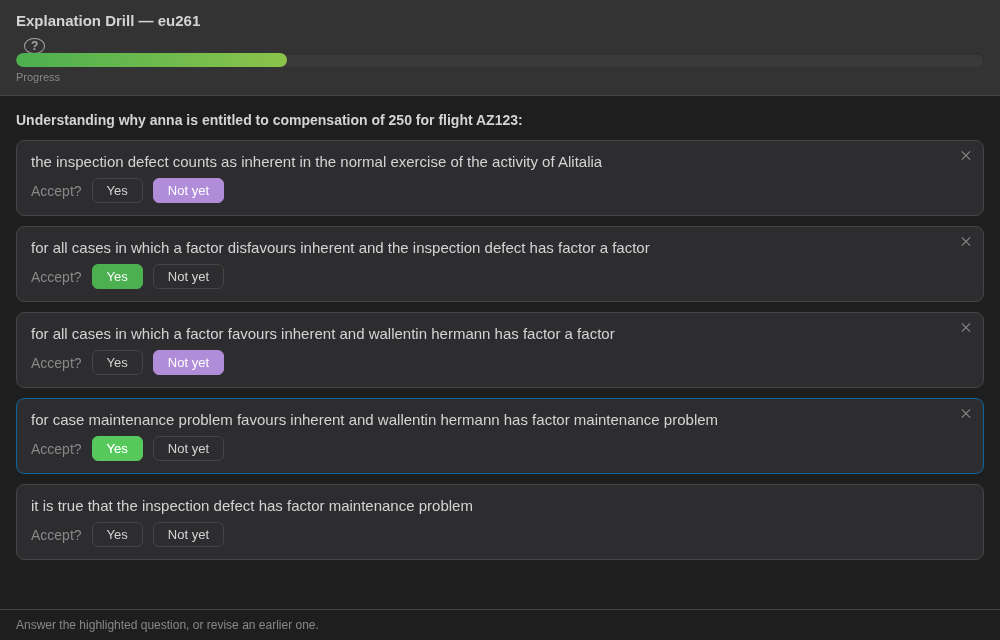

These are the steps of the tree of section 2, one at a time: the precedent's
factor, and the defect that shares it. Once you accept every reason under a
*Not yet*, the drill counts that reason as accepted and goes back up: a
**Yes** to the last question brings *the inspection defect is forced for
inherent by wallentin hermann*, then the answer's other conditions (the
extraordinary circumstances, the compensation due, the scope, ...). When you
have accepted them all, the progress bar is full and the drill says *Nothing
else to show*.

## 7. The same program for its users

A passenger or a claims handler does not need the program's text. **Misc ▸
Open Executive View** opens the same program in the
[executive view](../guide/executive-view.md), in a new tab, on the scenario
and query picked in the editor. The address
`/executive?program=regulatory/eu261_integration&scenario=new_claim&query=claim`
opens it too. It has a **Scenario** and a **Query** picker, a **Scenario
Variations** button, and the answers below. There is no Run button: the query
runs when a picker changes. Click an answer to open it. It opens on its
**Citations**: the steps of the proof that cite a document, such as *the
booking · page 1* or *C-549/07 · paragraph 25*. **Full explanation** below
them is the tree.

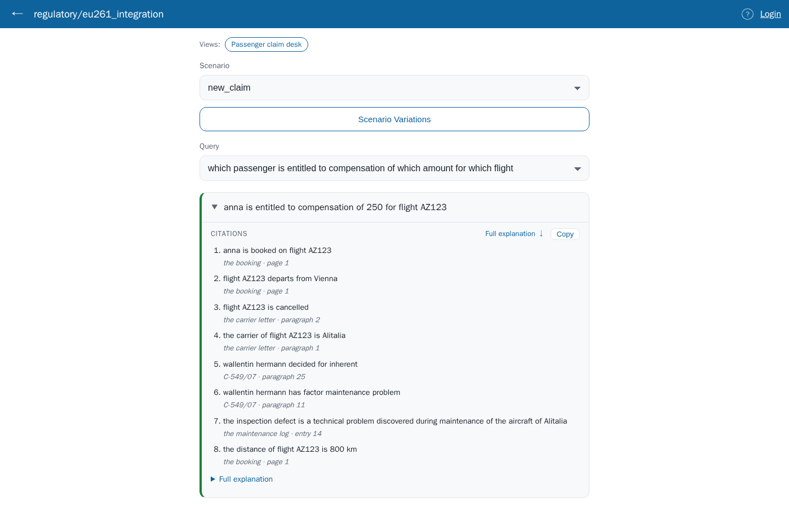

With `notified`, the executive view says *No — no answers for this query.*
and lists **Why not**: *it is not the case that anna is notified of the
cancellation … with a number days of notice and a number is greater than or
equal to 14*, marked **not met**, with the facts it compared after *given:*.
With `outside_the_eu` it lists *Istanbul is in the EU*, also **not met**.

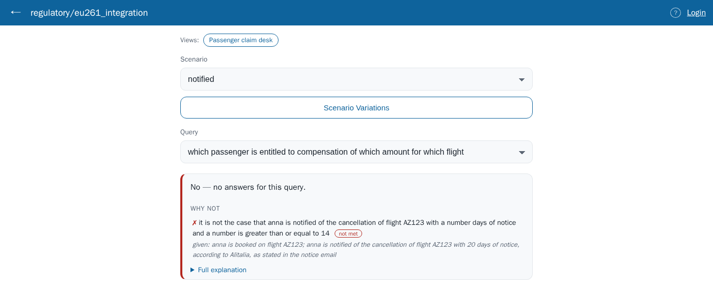

Above the pickers, a **Views:** strip lists *Passenger claim desk*. That is
the subject of the next section.

## 8. Views: a screen made for one decision

The pickers show any program the same way: a scenario, a query, the answers
as sentences. A claims handler deciding a claim wants something else: the
case's facts to check and correct, the amount, the stage the claim reached,
the sources, what would change the result. A **view** is how the program's
author describes that screen. It is a section of fixed sentences at the end
of the program, `the view claim desk is: …`
([the language reference](../reference/language.md) §17.10). Nothing reasons
with a view: the answers and the tests of the program are the same with or
without it. A view only changes what the person running the program sees,
and in what order.

To try it, click **Passenger claim desk** in the **Views:** strip, or open
`/executive?program=regulatory/eu261_integration&view=claim%20desk`. The
pickers give way to a screen in three columns, each card from one sentence of
the view:

- on the left, **the case**: a picker of the scenarios, and the facts of the
  one chosen, in the groups the view names (*the booking*, *the cancellation*,
  *the event*, *judgments*). Each fact is an editable row, with its citation
  and, where the view asks, a badge saying who states it (*Alitalia*). A
  template the case does not state is listed as *not stated*.
- in the middle, the **Result** headed by the amount, *250 euros*; the
  **Stage** it reaches (applicability, question and remedy passed); the
  **Citations**; and **What would change this?**, whose **Find the smallest
  changes** runs a flip.
- on the right, the answers to three other questions as tables (the factors,
  and the precedents decided for and against *inherent*), a **Compare** card
  with the same question on `bird_strike`, and the **Documents** the case
  cites.

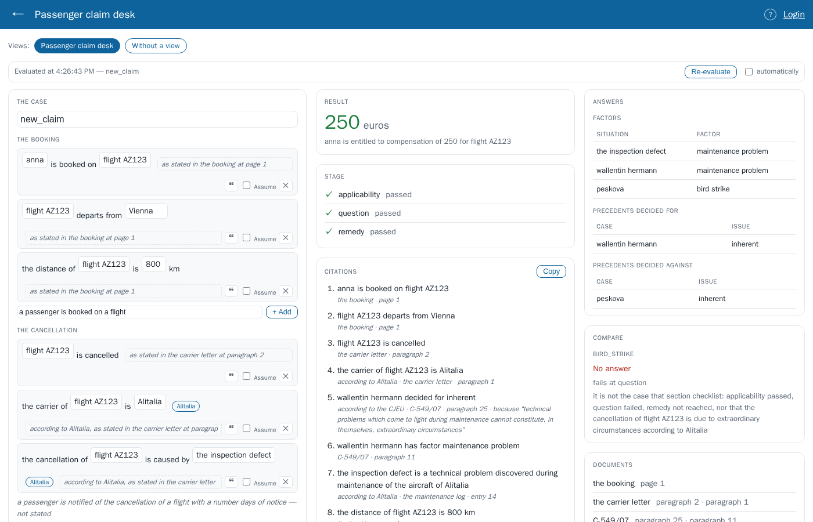

Now pick `notified` in the case picker; the address now ends in
`&scenario=notified`, so the link opens the view on this case. The result is
*No answer*, *fails at question*, and the stage shows question failed and
remedy not reached. The **Citations** and **Documents** still show what the
failure rests on: the booking and the notice email. This
view does not ask for the reasons of a failure (the sentence `the result shows
its reasons` would add *Why not*), so it answers with the stage instead.
**Find the smallest changes** says what would give anna her compensation:
*remove: anna is notified of the cancellation of flight AZ123 with 20 days of
notice*.

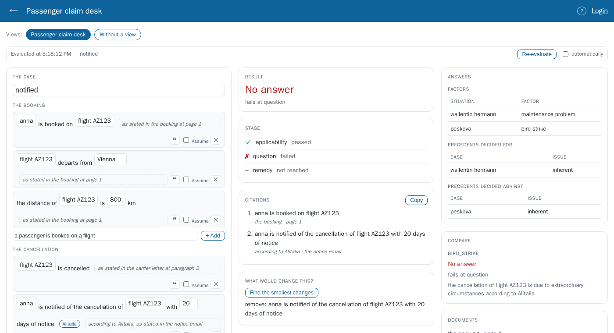

Edits to the facts stay on the screen, as a new case; the program does not
change. **Re-evaluate** runs the result again (tick **automatically** to run
it at every edit). **Without a view** returns to the pickers.

Other programs of `examples/regulatory` have views of other kinds:
`sections_benefit` (*rent help*, which asks what is missing, and *rent
decision*, which says why not), `flip_housing` (*benefit check*, an interview
that asks one question at a time) and `judged_damage` (*claim file*, a result
that waits for a judgment). A program without a view offers an **Automatic
view** drawn from its text. To write a view, start with the
[LE Views](views.md) tutorial.

## 9. Quick reference

| To… | Do this |
|---|---|
| Ask a question | Pick a **Scenario** and a **Query**, click **Query** |
| Read the reasoning | The explanation tree: green proved, red not proved, amber assumed |
| Find the source of a step | Click the node |
| Find the main reason | Hover **EXPLANATION**; right-click it for **Show important reason** |
| See why there is no answer | The failure explanation: the section checklist, then the red condition |
| Try a what-if | **Scenario Variations**: edit, delete, add or **Assume** facts, then **Query** |
| Find the smallest change that flips an answer | Select the answer, **Flip…**, then **Flip** |
| Be walked through an explanation | Right-click **EXPLANATION**, **Explanation Drill…** |
| Show the program to its users | **Misc ▸ Open Executive View** |
| See the program through a view | In the executive view, a name in the **Views:** strip |
| Write a view | The [LE Views](views.md) tutorial |

The [editor guide](../guide/editor.md) describes each of these in full. The
[Proof Game](../guide/proof-game.md) is another way in: building the proof of
an answer yourself.
